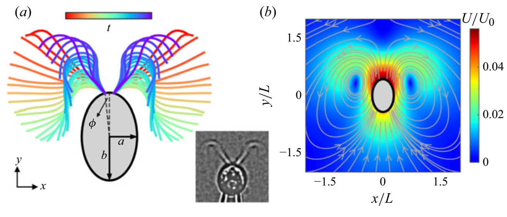
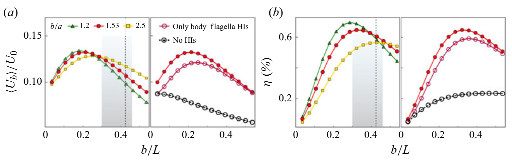
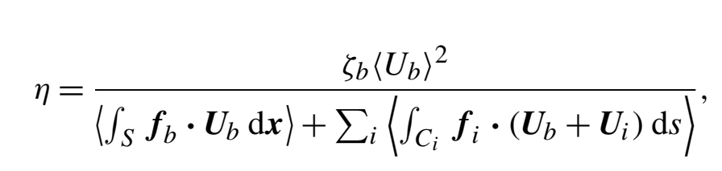
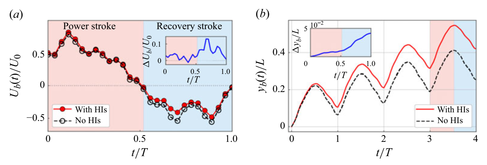
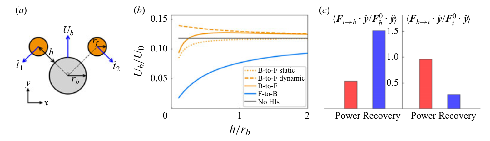
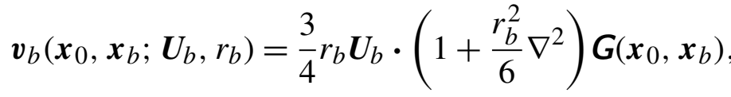
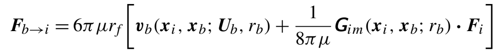
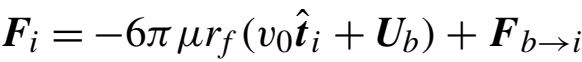
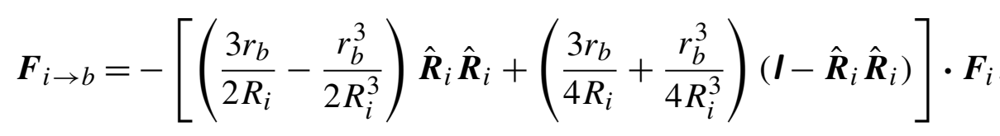

# 文献摘要

分类：植物

## A passive cell body plays an active role in microalgal swimming via non-reciprocal interactions

单细胞绿藻 *Chlamydomonas reinhardtii* 已被广泛用作研究流体动力学和细胞生物学中各种问题的模型生物。野生的*C.reinhardtii*细胞的前侧有两条鞭，在游动过程中，两条鞭毛大致在二维平面上运动，进行蛙泳般的步态，该过程由力量（power）和恢复（recovering）动作组成。现在已经确定，鞭毛的挥动是由分布式分子马达驱动的，这是真核细胞的一个特征。

引：真核鞭毛动力学的分析通常假设鞭毛基在空间中是固定的。Machin（1958）求解了在边界处驱动的弹性梁的弯曲波。尽管这种边界驱动的假设是对现实鞭毛动力学的显著简化，但后来的发展揭示了各种物理因素对鞭毛推进的影响，例如有效的灵活性，游动几何学，鞭毛曲率和**水动力相互作用（HI）**。另一方面，将鞭毛变形的力学模型与分子运动动力学相结合的研究侧重于如何调节搏动波形。

在动态游动条件下，微生物的建模涉及不同的复杂性，特别是在细胞体和鞭毛之间的耦合方面。除了鞭毛基部的机械耦合外，鞭毛还通过长程HI与细胞体耦合。因此，将鞭毛的搏动与移动的细胞体相结合对于理解游动机制至关重要。

鞭毛长度为L，细胞体椭圆形，长轴长度a，短轴长度b。保持静止的细胞的平面波形通过高速摄像进行实验测量（上图a），并作为数值模拟的输入。通过沿其中心线的弧长$s\in[0，L]$来参数化每个鞭毛。根据测量的波形，我们评估了在每个记录的时刻，i=1,2时两个鞭毛相对于细胞体的速度$U_i(s，t)$。在这项工作中，我们关注的是正常的蛙泳动作。尽管顺式鞭毛和反式鞭毛之间存在较小的相位滞后（约0.1π）（Wan，Leptos&Goldstein 2014），但只有足够大的相位差（≳π/2）才能导致细胞体发生不可忽视的旋转（Geyer等人，2013）。因此，假设两个鞭毛对称地拍打，游动模型只进行平移运动。我们进一步忽略了鞭毛拨动的非平面分量，因为由此产生的细胞旋转频率远小于鞭毛拨动频率。数值仿真使用混合边界元与正则化Stokeslet方法。

以下用L标度长度，用搏动周期T标度时间，用$U_0=L/T$表度速度，用$F_0=/mu L^2/T$表度力。当改变半长轴b时，纵横比b/a保持恒定。

### 游动的最佳细胞体大小

首先通过改变长轴b改变研究游动速度$<U_b>$随着细胞体积大小的变化，鞭毛的运动数据不变。如上图所示，$<U_b>$随着$b/L$的变化不是单调的，随着细胞越来越接近细长体（大的$b/a$值），$<U_b>$的最大值右移。从收藏的大约40个细胞来看，它们的$b/L$平均值为$0.38\pm0.08$，如上图中的灰色区域。对于采样细胞$b/a=1.53$，按照仿真结果流速最大值应该在$b/L\approx0.21$处，明显比实际的几何比例0.425（虚线）小，且比平均值显著第一个测量偏差。

定义流动效率：

其中$\xi_b$是平行于长轴平移的球体的摩擦系数。上式表示以速度$<U_b>$稳定移动的球体所需的功与鞭毛和细胞体运动所耗散的功的比值。

去除鞭毛间的HIs，对于游动的影响很小（见(a)(b)右侧图），**这是由于细胞体的流动遮蔽？**进一步去除细胞-鞭毛间的HIs，会造成低得多的$<U_b>$，并且其随细胞大小变化单调。因此，在较小的b值下$<U_b>$的惊人增加归因于随着b的增加，体-鞭毛HIs越来越强。同时，细胞体的固有粘性阻力$\xi_bU_b$也随着b的增加而增加，最终超过鞭毛的推进作用，导致在足够大的b下$<U_b>$减小。

上图比较了细胞体的流动速度$U_b(t)$与瞬时位移$y_b(t)$，分别包括了有体-鞭毛HIs与没有。主要观察结果是，体-鞭毛HIs不仅在施能冲程（power stroke）中增加了前进速度，而且在恢复冲程（recovering stroke）中降低了后退速度。因此，swimmer在施能冲程实现了更大的向前位移，在恢复冲程则实现了更小的向后位移。

swimmer最佳体型的出现是稳定的，对鞭毛波形的变化不敏感。本文附录中做了其他样本细胞记录到的鞭毛波形驱动的游动，即使静止曲率、波长、幅值等大不相同，但是流动效率随着体型的非单调变化是一样存在的，说明体-鞭毛HIs主要取决于它们的大尺度（L尺度）运动。

### 衣藻游动的三球模型

中心球的半径$r_b$，表示细胞体；两边的球半径$r_f$，表示两条鞭毛。且$r_f\ll r_b$、

中间那个大球以速度$U_b$平移时，它会在周围流体中诱导一个扰动流场$v_b$（$G_{im}$是为了让大球表面满足non-slip，而额外补上的那部分流场修正）

细胞体对鞭毛的作用（B-to-F）力

它分为两部分。第一项：动态成分，直接来源于细胞体的扰动流场；第二项：静态成分，代表non-slip的效果。$F_i$为鞭毛受到的总阻力，其表示为：

鞭毛对细胞体（F-to-B）的作用力

结合以上，可以通过无外力条件$\mathbf{F_b}+\sum_i\mathbf{F_i}=0$得到细胞体的运动速度$\mathbf{U_b}$。上图(a)所示鞭毛小球运动方向为施能冲程时（$\alpha=5/4\pi$），恢复冲程只需反转方向，令$\alpha=\pi/4$即可。如(b)中所示，只有F-to-B力时速度显著下降（相比于没有任何HIs），这一点说明在恢复冲程中速度的减小是由鞭毛诱导的流动对细胞体的阻抗造成的。B-to-F作用力的动态成分增大$U_b$，而静态成分作用相反，但随着与细胞体的距离增加而迅速衰减。当$h\gtrsim r_b$（这大概是鞭毛和细胞体之间的平均距离）时，静态部分的影响可以忽略不计。所以施能冲程中$U_b$的略微上升可能主要来自于B-to-F的动态成分。

为了将该理论模型与数值结果更好得比对，令$r_b=(a+b)/2$，分别积分计算相互作用力，并进行无量纲处理。(c)为两个过程分别的平均作用力大小，它们都是非互易的：在施能阶段，B-to-F更强，造成略微的速度增加；在恢复阶段，F-to-B更强，减小了后退速度。这两个截断非互异性的逆转来自于时间上非互易的鞭毛变形：在施能阶段，鞭毛笔直延伸，方向垂直于游动方向；在恢复阶段，鞭毛盘绕，更符合游动方向，并且更靠近细胞体。

最后，除了流体动力学效应外，各种因素也可以塑造细胞形态。特别是，生物限制自然会令体型较小，因为细胞核和叶绿体等基本细胞器需要最小化体积才能发挥作用。

