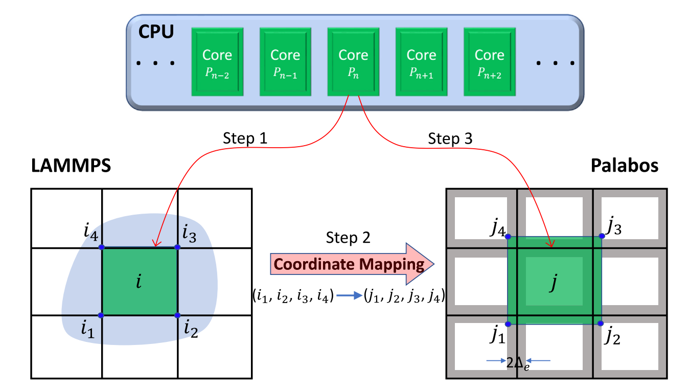
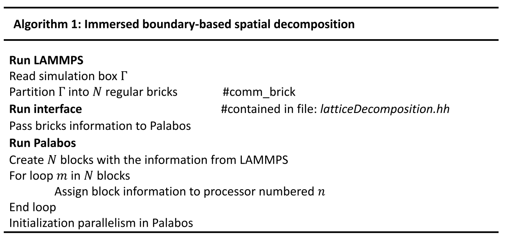
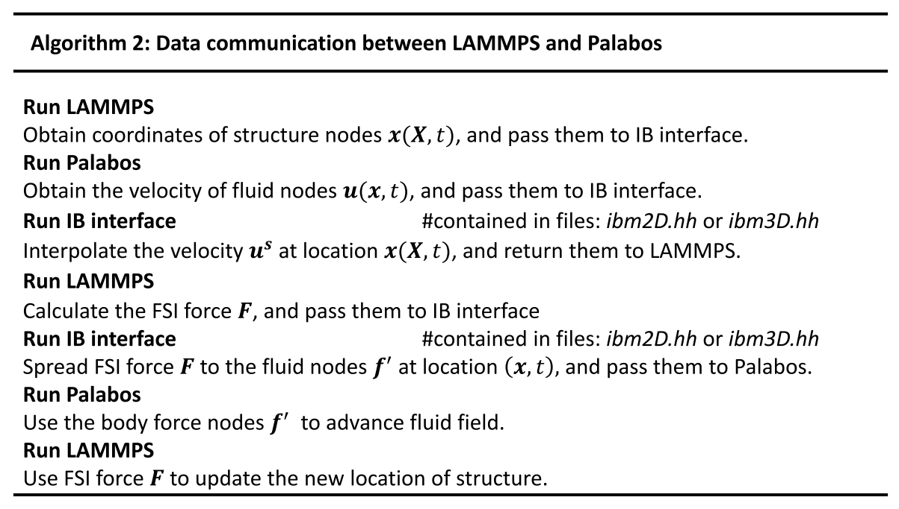
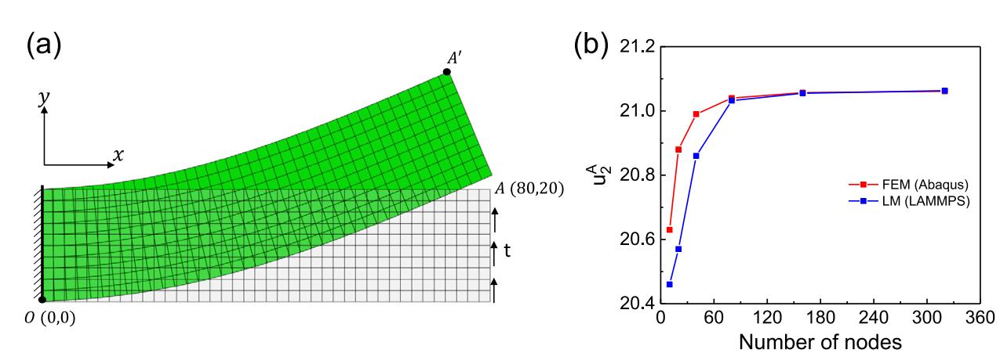
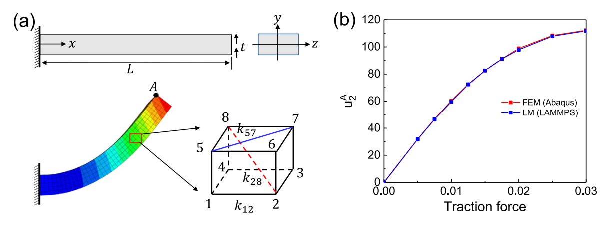
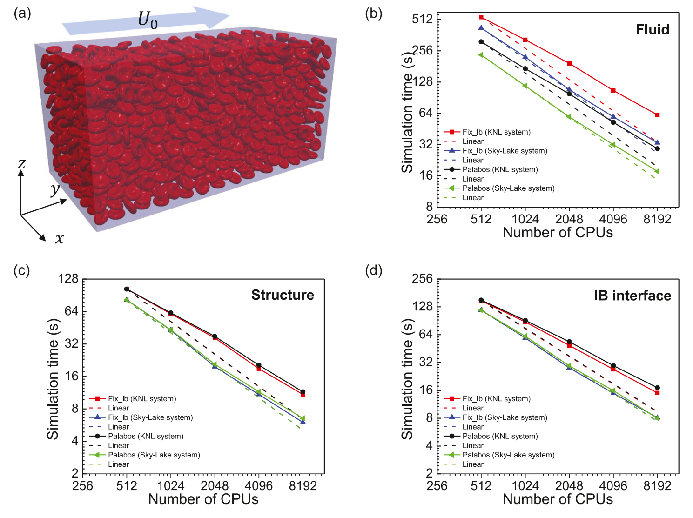

# OpenFsi 程序使用指引

## FSI发展情况

### 第一类传统路线：贴体网络方法

早期或传统 FSI 方法通常基于 conforming mesh / body-fitted mesh，代表是：

- ALE，Arbitrary Lagrangian–Eulerian 方法；
- space–time finite-element method。

这类方法的思想是：结构用一个拉格朗日网格描述，流体也单独划分网格，并且流体网格要贴合结构瞬时边界。它的优势很明确：边界条件可以直接施加在真实固体表面上，边界层也可以通过局部加密很好地分辨。

但问题也很明显：一旦结构发生大位移、大转动或大变形，流体网格会严重扭曲，需要重新网格化或网格更新。这个过程不仅耗时，而且旧网格到新网格的信息转移会引入精度损失。因此，贴体网格方法在复杂大变形 FSI、特别是大量颗粒/细胞的情形下会变得很笨重。

### 第二类路线：非贴体网络方法

与贴体网格相反，非贴体方法把流体和结构看成两个分离的计算场：

流体通常放在固定的欧拉 Cartesian 网格上，结构用拉格朗日网格追踪，并允许结构在背景流体网格上运动。这样就避免了流体网格随结构边界不断变形的问题。

在这种框架下，流固耦合算法又分两类：

- monolithic 方法：把流体、结构、耦合一起写成一个完整的大系统同时求解。优点是数值收敛性和鲁棒性较强；缺点是必须写一个完全一体化的 FSI 求解器，不方便复用已有成熟的流体/固体软件。

- staggered 方法：流体和结构分步求解，通过接口交换信息。优点是效率高、模块化强，可以直接调用已有的流体求解器和结构求解器。文章认为这对于实际 FSI 软件开发更有吸引力

### IBM

immersed boundary method, IBM 是一种很好用 **staggered 非贴体耦合方法**。IBM 最初由 Peskin 在 1970s 提出，用于研究心脏瓣膜附近的血流，后来被广泛扩展到各种 FSI 问题。

IBM 的基本思想是：

流体在欧拉网格上求解，结构在拉格朗日点上运动。结构受力通过某种插值/扩散函数 spread 到附近流体网格；流体速度再 interpolation 回结构点，从而实现力和速度的信息交换。其存在两种常见插值函数：

1、**reproducing kernel function / RKPM 类方法**：插值阶数高，也适合非均匀网格；但每个时间步都需要搜索新的邻居点，计算成本高。

2、**Dirac delta function 类方法**：基于均匀 Cartesian 网格，形式简单，容易嵌入已有流体或固体求解器，效率高；缺点是边界被平滑化，边界条件不是严格施加在真实界面上，而是在界面附近区域近似施加。

本程序选择 Dirac delta 型 IBM，主要是为了效率，尤其是面向复杂、大规模 FSI 问题。

### 流体求解：LBM/Palabos

LBM 的优势是高度并行化，适合 HPC。LBM 是介观方法，通过求解 Boltzmann 方程并恢复 Navier–Stokes 方程。它已经被广泛用于 IBM-FSI 问题，包括流体–颗粒相互作用等。

目前已有的很多 LBM-IBM FSI 工作并不是开源的，故这里选择使用 Palabos，一个开源 LBM 求解器。Palabos 用 C++ 实现，并通过 MPI 并行，适合现代高性能计算。Palabos 已经被广泛用于多相流、多孔介质、湍流、生物流体和大规模血流模拟。

### LAMMPS/LM

在结构求解器方面，传统 FSI 常用 FEA（有限元分析），但是 FEA 不太适合直接放进 LAMMPS，因为 LAMMPS 更偏向粒子模型。

这里采用 **Lattice Model, LM**。LM 可以看作一种粗粒化的弹簧网络模型，用离散粒子和弹簧来描述固体变形。它的优点是：

- 粒子化表达，天然适合 LAMMPS；
- 计算效率高；
- 可以通过参数映射达到和 FEA 类似的精度；
- 适合大规模结构/颗粒系统，比如大量红细胞。

文章采用的 LM 可以处理不规则 lattice，并且对于 neo-Hookean 固体可以达到与 FEA 相当的精度。

## 计算流程


### 流体求解器（LBM）

本程序使用D3Q19模型，BGK碰撞算子（暂时存疑，因为是直接调用的Palabos接口）。使用zou/he边界，可以施加三种流动：剪切流，poisueille流以及均匀流动。剪切流通过对上下边界实施Dirichlet边界施加速度实现，流向边界为周期性边界条件，其他方向均为Neumann边界条件；Poisueille 流中，给全场施加一个恒定的体力以模拟压力驱动的流场剖面，流向施加周期性边界条件，其他方向均使用壁面边界（Palabos中，直接使用bounce-back）；对于均匀流动，入口为均匀速度边界，出口为速度的Neumann边界条件，其他方向均实施速度的Neumann边界以及压强的Dirichlet边界。

除了上述边界条件之外，单位的转换也在palabos内完成（格子单位）。长度基准为格子分辨率$\Delta x$，时间基准为时间步$\Delta t$，还有质量基准选取为流体密度$\Delta\rho$。

### 浸没结构（Lattice Model, LM）


上图为LM与连续模型的关系。LM本质上应该反映连续体模型的相同宏观特性，如平面内剪切、平面外弯曲和杨氏模量等。LM中的典型参数有弹簧常数（直线弹簧与角弹簧）以及一些约束（面积与体积）。

#### 1维格子杆（beam）模型

将1维杆离散为连续连接着直线弹簧的颗粒，此外相邻的直线弹簧之间外加角弹簧。杆上的总能量$U_{1D}$如下

$$
\begin{aligned} 
U_{1D}&=U_{linear}+U_{angle}+U_{torsion}\\
&=\frac{1}{2}\sum_i\kappa_s(dx)^2+\frac{1}{2}\sum_j\kappa_\theta(d\theta)^2+\frac{1}{2}\sum_k\kappa_\tau(d\tau)^2
\end{aligned}
$$

其中$dx$是直线弹簧的拉伸，$d\theta$是角弹簧的角度变化，$d\tau$是扭转角。由此可以得到格子力常数与连续模型宏观性质之间的关系：

$$
\kappa_s=\frac{EA}{r_0}, ~\kappa_\theta=\frac{EI}{r_0}, ~\kappa_\tau=\frac{GJ_0}{r_0}
$$

其中$r_0$是杆的半径，$A$是横截面的面积，$I,J_0$分别是面内、面外惯性矩，$E, G$分别是杨氏与剪切模量。

#### 2,3维固体格子模型

使用所谓的neo-Hookean材料描述LM的固体部分，应变能密度
$$
U_{neo}=\mu^s(I_1-3)/2-\mu^s\ln{J}+\lambda(\ln{J})^2/2
$$

其中$\mu_s$为剪切模量，$\lambda$是Lame常数，$I_1$是右柯西-格林变形张量的第一不变量：对于平面应变满足$I_1=\lambda_1^2+\lambda_2^2+1$，对于三维变形满足$I_1=\lambda_1^2+\lambda_2^2+\lambda_3^2$。$J$是应变梯度张量$\mathbf{F_{de}}$的行列式

首先考虑二维方形LM，其关键在于决定基于方形格子里弹簧拉伸和区域变化的应变能密度。比如与$I_1$和区域变化$J$相关的能量：

$$
U_{I_1}=\frac{1}{2}\mu^s(I_1-3)=\frac{\mu^s}{2A_0}[(r_{12}^2+r_{23}^2+r_{34}^2+r_{14}^2)/6+(r_{13}^2+r_{24}^2)/3-2]\\

U_J=\frac{1}{2}\lambda(\ln{J})^2-\mu^s\ln{J}=\frac{1}{2}\lambda(\ln{(A/A_0)})^2-\mu^s\ln{(A/A_0)}
$$

其中$r_ij$表示弹簧的长度，$i,j$表示格点序号。$A, A_0$分别是方形格子单元的面积和对应的初始值。

接下来基于不规则格子证明LM与FEA之间的等价性。在有限单元分析（FEA）中，不规则单元的应变梯度张量为

$$
F_{ij}=\frac{\partial x_i}{\partial X_j}=x_i^a\frac{\partial N^a}{\partial X_j}
$$

其中$N^a(X_1,X_2)$是形状方程。在二维平面应力问题中，有$I_1=F_{ij}F_{ij}+1$，于是对应于$I_1$的应变能

$$
A_0U_{I_1}=\int\frac{1}{2}\mu^s(x_i^ax_i^b\frac{\partial N^a}{\partial X_j}\frac{\partial N^b}{\partial X_j}-2)dA_0=-\frac{1}{2}k_{ab}x_i^ax_i^b-\mu^sA_0
$$

其中$k_{ab}=-\int\mu^s\frac{\partial N^a}{\partial X_j}\frac{\partial N^b}{\partial X_j}dA_0$。在FEA中，形状函数应该满足$\sum_{a=1}^4N^a=1$，于是有以下的关系：

$$
\sum_{a=1}^4k_{ab}=-\mu^s\int(\sum_{a=1}^4\frac{\partial N^a}{\partial X_j})\frac{\partial N^b}{\partial X_j}dA_0=0
$$

故应变能可以表示为格子中弹簧的能量总和：

$$
U_{I_1}=\frac{1}{2}A_0^{-1}\sum_{b=2, b>a}^4\sum_{a=1}^3k_{ab}r_{ab}^2-\mu^s
$$

其中$k_{ab}$是弹簧常数，对于不规则的格子，它可以通过高斯求和等参映射求得（从有限元的shape function得到）。与面积应变相关的能量是通过与F-bar相同的方法计算的。

对于三维问题，将实体结构划分为六面体单元，然后一个六面体元有28个格弹簧。与$I_1$有关的应变能可以写为

$$
U_{I_1}=\frac{1}{2}V_0^{-1}\sum_{b=2, b>a}^8\sum_{a=1}^3k_{ab}r_{ab}^7-\mu^s
$$

与体积变形$J$相关的能量

$$
U_J=\frac{1}{2}\lambda(\ln{(V/V_0)})^2-\mu^s\ln{(V/V_0)}
$$

接下来介绍如何前计算弹簧常数，为仿真做准备：首先构建一个FEA的模型，然后用四边形或六面体单元对其进行网格划分，从而计算得到弹簧常数。应注意的是，弹簧常数值仅取决于单元内的初始节点位置。因此，在模拟过程中不需要重复执行高斯正交。有了这些弹簧常数，我们可以很容易地计算LAMMPS中的结合力。根据与面积或体积变形相关的能量结果，我们可以求解固体的运动方程。

#### 壳与膜的格子模型

壳和膜通常分别指三维空间中的开放和封闭二维结构。在FSI中，它们被用来描述生物颗粒，如胶囊和囊泡。弹性粒子的力学性能是通过对膜施加各种约束来解释的。用于描述膜的势函数如下：

$$
U({\mathbf{x_{ij}}})=U_{stretching}+U_{bending}+U_{area}+U_{volume}
$$

平面内的拉伸+平面外的弯曲以及面积和体积的守恒。具体的施能项选择应该与考虑的膜模型一致，比如capsule通常对于平面外的弯曲没有抵抗能力，故应移除$U_{bending}$。以下以红细胞膜为例介绍各个施能项。拉伸能包括两个部分：吸引蠕虫链模型（worm like chain model, WLC）和排斥幂函数（repulsive power function, POW），它们分别表示为

$$
U_{WLC}=\frac{k_{B}Tl_m}{4p}\frac{3x^2-2x^3}{1-x},~~ U_{POW}=\frac{k_p}{l}
$$

其中$k_B$是玻尔兹曼常数，$x=l/l_m\in(0,1)$，$l$是弹簧的长度，$l_m$是弹簧最大伸长量。$p$是持续长度，$k_p$是POW力系数。弯曲能

$$
U_{bending}=\sum_{k\in1,...,N_s}k_b[1-\cos{(\theta_k-\theta_0)}]
$$

其中$k_b$是弹性刚度，$\theta_k,\theta_0$分别是相邻三角形单元间的二面角及其初始值。$N_s$表示二面角的总个数。为了保证红细胞的总面积守恒，应用了局部与全局面积常数：

$$
U_{area}=\sum_{k=1,...,N_t}\frac{k_d(A_k-A_{k0})^2}{2A_{k0}}+\frac{k_a(A_t-A_{k0})^2}{2A_{t}}
$$

其中第一项为局部面积约束，$N_t$是三角形单元的总数。$A_k,A_{k0}$分别是第K个单元的面积及其初始值，$k_d$是对应的弹簧常数。第二项是全局面积约束。全局的体积约束：

$$
U_{volume}=\frac{k_v(V-V_0)}{2V_0}
$$

于是施加在膜上的节点力可以表示为

$$
\mathbf{f_i}=-\frac{\partial U({\mathbf{x_i}})}{\mathbf{x_i}}
$$

以上各种势中的系数通常根据对应的宏观性质选择，比如剪切模量，弯曲模量，体积模量等，粗粒化表达如下：

$$
\begin{aligned}
\mu^s&=\frac{\sqrt{3}k_BT}{4pl_mx_0}(\frac{x_0}{2(1-x_0)^3}-\frac{1}{4(1-x_0)^2}+\frac{1}{4})+\frac{3\sqrt{3}k_p}{4l_0^3}\\
K&=2\mu^s+k_a+k_d\\
Y&=\frac{4K\mu^s}{K+\mu^s}
\end{aligned}
$$

其中$\mu^s$是剪切模量，$K$是面积压缩模量，$Y$是杨氏模量。除了以上的势之外，还应该考虑相互作用以避免overlap，这里使用L-J potential$F_{IL}=4\varepsilon[((\frac{\sigma}{r})^{12}-(\frac{\sigma}{r})^6)], ~r<r_{cut}$

### 流体-固体耦合：IBM

流体域为欧拉坐标$\mathbf{x}$，固体域为拉格朗日坐标$\mathbf{s}$。固体结构上的任意位置可以表示为$\mathbf{X}(\mathbf{s},t)$。为了满足固体域流体域之间的无滑移边界条件，离散的颗粒应该与周围的流体以同样的速度运动，即

$$
\frac{\partial \mathbf{X}(\mathbf{s},t)}{\partial t}=\mathbf{u}(\mathbf{X}(\mathbf{s},t))
$$

结构上的力又之前所述的势函数得到，并且以以下方式分配给周围流体：

$$
\mathbf{f'}(\mathbf{x},t)=\int_\Omega^s\mathbf{F}(\mathbf{X^s},t)\delta(\mathbf{x}-\mathbf{x^s}(\mathbf{X^s},t))d\Omega
$$

其中$\delta$是狄拉克δ插值函数的平滑近似。构造狄拉克δ函数的主要假设之一是离散δ函数可以因子化：

$$
\delta(\mathbf{x}-\mathbf{x^s}(\mathbf{X^s},t))=\delta(x-x(\mathbf{X^s},t))\delta(y-y(\mathbf{X^s},t))\delta(z-z(\mathbf{X^s},t))
$$

这种方法的精确度取决于delta函数的构建。本工作中使用的是所谓的4点模板：
$$
\delta(x)
=
\left\{
\begin{aligned}
~~~~&\frac{1}{8}(3-2|x|+\sqrt{1+4|x|-4|x|^2})，~&0\leq|x|\leq1\\
&\frac{1}{8}(5-2|x|+\sqrt{-7+12|x|-4x^2}), ~&1\leq|x|\leq2\\
&0, ~&2\leq|x|
\end{aligned}
\right.
$$

这个模板提供了64个格点。速度也以同样的方式进行插值。但是以上介绍的IBM是建立在固体拥有纤维状的浸没弹性结构的基础上，并且固体要足够软且没有质量。于是引入了一种惩罚方法（pIBM），固体的运动遵循牛顿第二定律：

$$
m_i\frac{d\mathbf{u_i}^s(\mathbf{X}^s,t)}{dt}=\mathbf{F}_i^{int}+\mathbf{F}_i^{ext}
$$

其中$\mathbf{F}_i^{int}$来自于结构内部的弹性，$\mathbf{F}_i^{ext}$代表施加在结构上的外部刺激，这里指固体周围的流体。惩罚方法：

$$
\mathbf{F}_i^{ext}=\beta[\mathbf{u}^f(t)-\mathbf{u}^s(t)]
$$

$\beta$是惩罚系数。需要注意的是pIBM不能满足无滑移边界条件，从上式可以看出，只有$\beta\rightarrow\infty$才能满足。故由于稳定性，这在数值方法里是不实用的。本质上来讲IBM和pIBM是一致的，只是在数值上的实现不太一样。本程序里两种方法的实现都做到了（pIBM用于有限质量、高刚度的结构）。

### 基于IBM的空间离散与数据通信

#### 空间离散

**同一个 MPI 进程应该同时拿到局部固体节点和它附近的局部流体网格**

**1、LAMMPS区域的初始化**

LAMMPS里提供了两种分解的风格：brick和tiled。brick风格中仿真区域被分解为均匀的bricks，单个处理器对应一个brick，各处理器之间通过Cartesian 邻居获取需要的信息；tiled风格中仿真区域被分解为不重叠的不同尺寸的矩形tiles。在当前的工作中，通过在LAMMPS的输入文件中应用命令comm_style-brick，采用**brick式**来避免相邻处理器的复杂模式。

**2、将域分解信息映射到Palabos**

为了简化信息交流，LAMMPS和Palabos中的物理模拟框$\Gamma$在相同的坐标系下是相同的。因此，域分解信息$\sum$的映射可以通过坐标映射来实现：$\{\sum|(i_1,i_2,i_3,i_4)\rightarrow(j_1,j_2,j_3,j_4), i_k\in\Gamma, j_k\in\Gamma\}$

**3、Palabos区域的初始化**

在Palabos，采用了所谓的多块（multi-block）结构。模拟域分为规则块，每个处理器一个。



对于单独的部分，通过ghost technology实现了并行通讯。在LAMMPS中，每个实体点在它的临近brick中都有虚节点。虚节点是实体节点的复制，具有坐标、速度、力等属性。因此，当这些实体节点需要与相邻子域中的对应节点交互时，它们可以直接通过虚节点访问属性，不需要处理器之间的通信。类似的虚节点也被应用于Palabos（如上图每个block周围的灰色区域）。在OpenFSI中，ghost layer的厚度取决于IBM插值模板。比如对于四点插值，ghost layer宽度$\Delta_e$大于2个格点，以便在每个单独的处理器中可以访问足够的流体节点。需要注意的是，如果分布在域中的节点非常不均匀，由于当前的域分解是一种基于规则网格的方法，效率将受到显著影响。例如，如果一个处理器中的节点数量较少，而另一个处理器的节点数量较多，则节点数量较少的处理器总是在等待节点数量较多的处理器。



#### 数据通信

由于结构在LAMMPS求解器中进行了更新，因此坐标、速度和力等数据信息被分析并存储到LAMMPS中。而在Palabos中获得了包括速度和体力在内的流体流动特性。为了交换数据，提供了一个名为IB接口的接口，用于收集LAMMPS和Palabos的所有信息，不会对单个求解器造成干扰。具体流程如下表



## 算例验证

### LM的验证

LM的验证是通过在均匀分布的牵引力下对具有矩形横截面的2D和3D梁进行挠度来实现的。计算得到的结果与abaqus的FEA结果进行对比。所有模拟中，剪切模量$\mu^s=1KPa$，Lame常数$\lambda=100\mu$，对应0.495的泊松比。长度单位mm，力单位mN





```
其他的验证先放一放
直接跳转到红细胞
```

## OpenFSI的计算效率

为了测试该程序的计算效率，选择了一个包含2000个红细胞的大系统。红细胞在矩形的管道内随机分布，计算域大小为$72\times144\times72\mu m$，流体网格$\Delta x=250nm$，也就是说总的流体格点数$288\times576\times288=47, 755, 744$。流体是水，密度$\rho=10^3kg/m^3$，粘度$\mu=1kg/(m\cdot s)$。红细胞的直径为$7.82\mu m$，它在数值上以与capsule相同的方式离散。流动是简单的剪切流。测试了两LBM solver：(1) Palabos; and (2) fix lb package in LAMMPS。算例分别在两台不同计算机上运行：(1) Intel Xeon Knights Landing (KNL) (CPU model:Intel Xeon Phi 7250) and (2) Skylake (CPU model: Intel Xeon Platinum 8160)。其中流体计算占了总计算时间的大部分，同时palabos比fix ib快了将近1.5倍。这里建议使用Skylake系统

