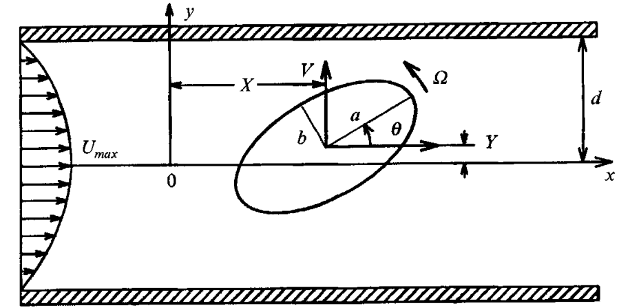
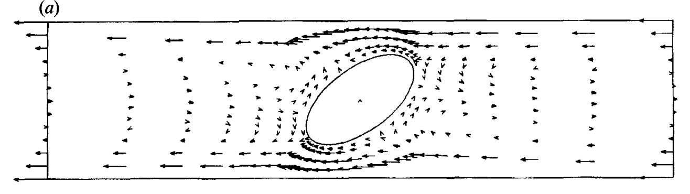
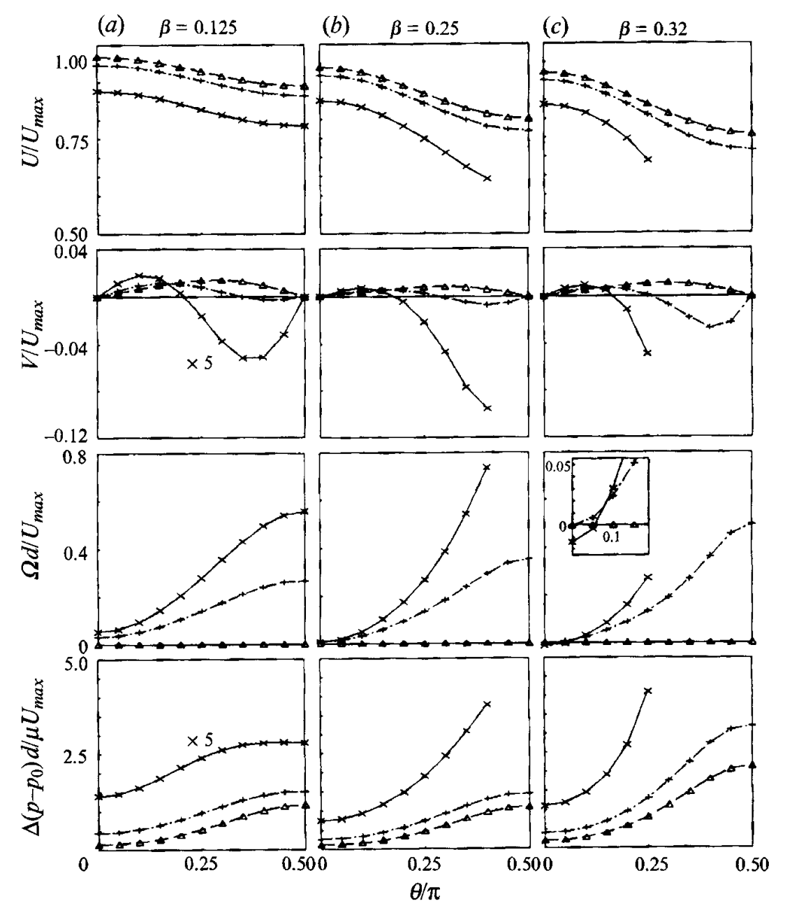
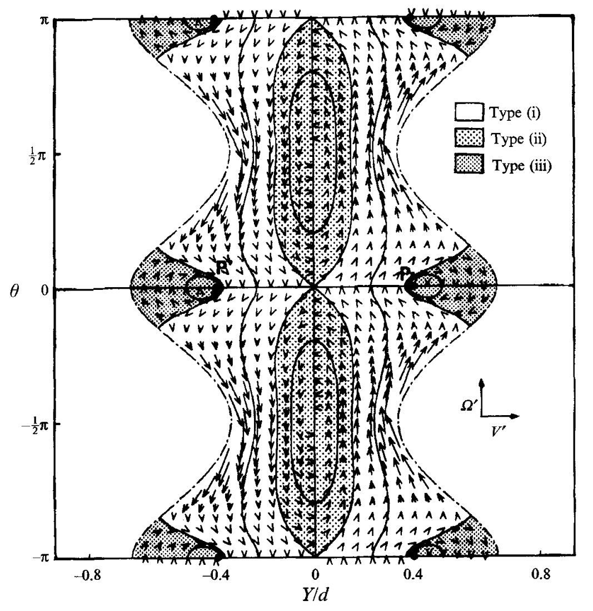
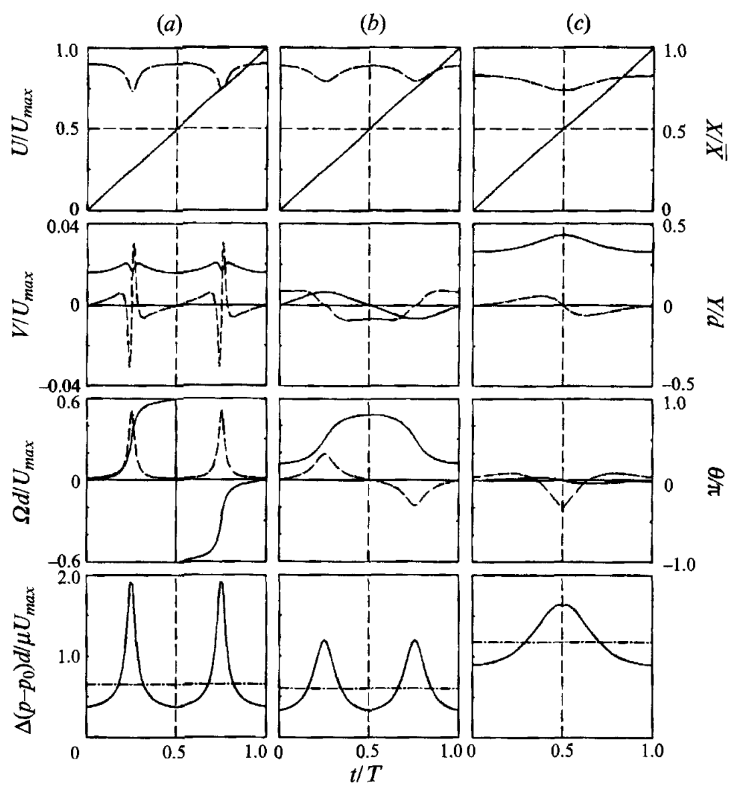
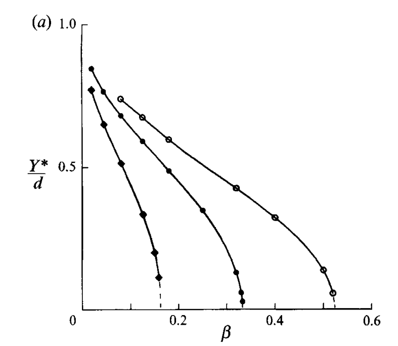
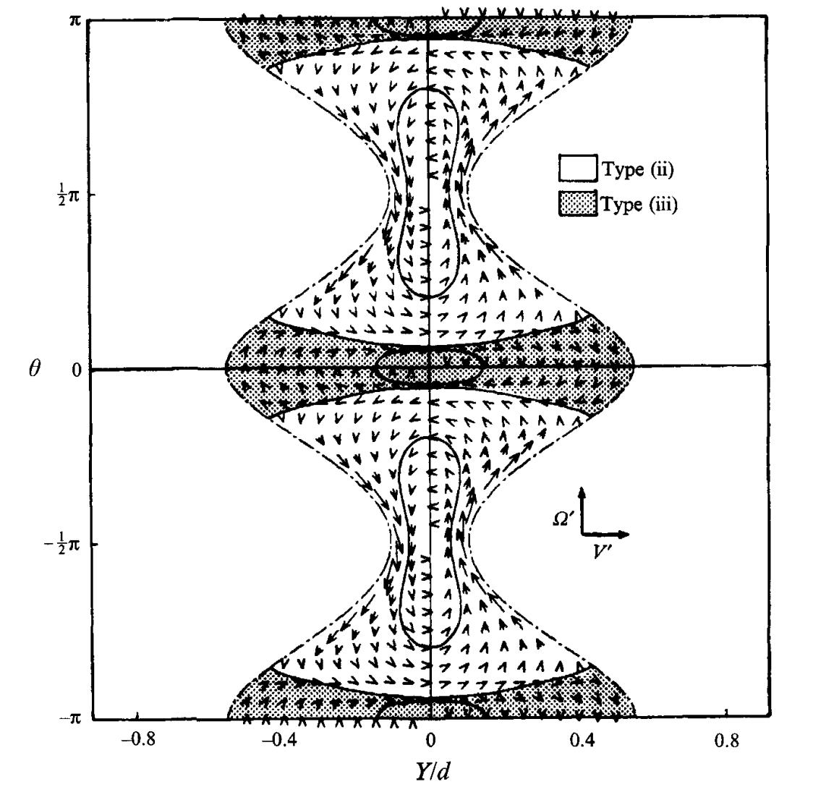
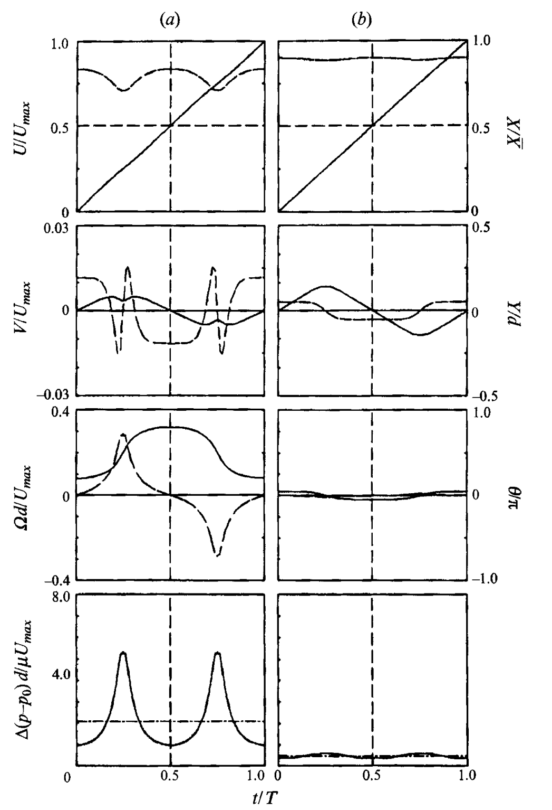
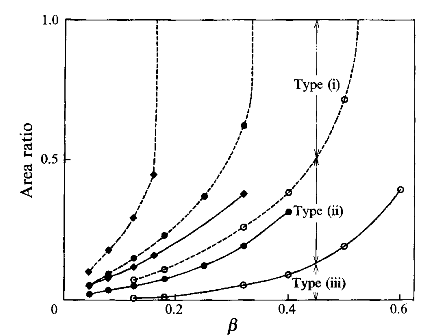

# 文献摘要

## The motion of an elliptical cylinder in channel flow at low Reynolds numbers

引：Jeffery（1922）研究了低雷诺数无界简单剪切流中中性浮力椭球体的运动，并使用解析方法求解了两种情况下的stokes方程。第一种情况是旋转椭球体，即球体：发现粒子运动**由围绕对称轴的自旋和该轴围绕未扰动流的涡量矢量的进动组成**；第二种情况是在特殊情况下，当椭球体围绕与未扰动涡量矢量永久对齐的主轴旋转时，适用于一般（非轴对称）椭球体。粒子被证明以周期性变化的角速度连续旋转。由于该分析结果**仅包括剪切流平面中的轴比**，称为**等效轴比**，因此平行于涡量矢量的另一个轴的长度并不重要。因此，当该轴趋于无穷大时，我们发现，只要椭球体被约束为围绕平行于未扰动涡度的主轴旋转，椭圆柱就具有与具有相同等效轴比的椭球体相同的动力学行为。此外，Jeffery表明，第二种情况下的解与控制球体对称轴投影到剪切流平面上的时间演化的解相同。因此，在对称轴位于剪切流平面内的特殊情况下，轴对称椭球在无界简单剪切流中的运动与具有相同等效轴比的椭圆柱的运动一致。

引：Chwang（1975）研究了二次速度分布对椭球运动的影响，他使用奇异性方法考虑了椭球在**无界抛物面流**中自由浮动的运动。他发现，**椭球体旋转时，就像它浸没在线性剪切流中一样，剪切速率等于粒子中心评估的抛物面流的剪切速率，并且沿着平行于主流方向的直线路径平移，没有任何侧向漂移**。

引：**颗粒接近壁面，旋转周期增加（角速度下降），并且粒子在不断向前翻滚的过程中，会朝向和远离壁面进行周期性运动**。（单壁面）

系统示意：

长短轴比 $\alpha=a/b$，颗粒管道尺寸比 $\beta=ab/d^2$。

$\alpha=2, \beta=0.32$，质心处于管道中心时的相对运动流线图（减去质心的流向速度），**在这个瞬时只有横向的速度，而没有旋转角速度**。

以下为固定$\alpha=2$，不同位置、角度姿态以及$\beta$下的运动变化。$\triangle: Y/d=0，+: Y/d=0.15, \times: Y/d=0.3$

- 首先，当椭圆的长轴与流向对齐时（$\theta=0$），纵向移动速度最大，$\theta=1/2\pi$ 时移动速度最小；
- 质心在管道中心时，横向速度 $V$ 总是大于0的，只有当 $\theta=0,\pi/2$ 时等于 0；
- 对于偏心的位置，$V$ 只有在小倾斜下是大于 0 的，大倾斜下小于0；（这种横向速度关于倾角的变化在剪切流中，壁面附近的椭球中被报道过）
- 当质心处于管道中心线时，角速度消失，无论倾角大小；
- 对于偏心的情况，$\Omega$ 在 $\theta=0$ 时最小，并且随着 $\theta$ 的增加而增大；
- 比较奇怪的一点是，小倾角下的角速度随着 $\beta$ 的增加而减小，甚至在$\beta=0.32$时出现负的；
- 压差随着$\theta$的增加而增大，且这种增大对于大颗粒更显著。（与颗粒和通道壁之间的最小间隙宽度有关）

以下绘制了 $\alpha=2, \beta=0.25, (Y/d, \theta)$ 平面中 $(V/U_{max}, \Omega d/U_{max})$ 的向量箭头，实线表示一些特殊的case。$(Y/d, \theta)=(0, (n/2)\pi), (n=0, \pm1, \pm2)$ 时 $V, \Omega$ 都消失了，此时做稳定的运动。其中 $(Y/d, \theta)=(0, \pm\frac{1}{2}\pi)$ 是中性稳定的，而 $(Y/d, \theta)=(0, \pm\pi)$ 代表鞍点。

有三种类型的运动：（**i） $Y/d$ 永远不会为零，颗粒持续沿同一方向旋转；类型（ii），位于中心线附近的颗粒在每半周期穿过 $Y/d=0$ 时旋转改变方向；（iii）型，远离中心线的颗粒在旋转和横向位置振荡，长轴几乎平行于通道壁**。

以上为三种类型运动一个周期内各种量的变化。上三图中。虚线为各速度的变化，实线为坐标位置的变化。对于(1,2)类型的运动，纵向速度都有一个最小值（时刻 $t/T=0.25/0.75$），其他时刻基本保持一致。

引：椭圆柱的这种纵向浪涌类似于无界抛物面流中椭球体的“猛拉”（jerking）运动，其中椭球体以周期性变化的速度平移。在无界的剪切流中，椭球是以恒定速度平移。

引：关于横向漂移，椭圆圆柱体在所有类型的运动中都有相当大的横向速度。这无疑是由于**壁面效应**，因为在无界剪切流中椭球体或椭圆柱体（Jeffery 1922）或无界抛物面流中的椭球体（Chwang 1975）不会发生横向漂移。特别是，在图（a）中，横向速度在 $t/T=0.25, 0.75$ 附近明显变化，**在（b）中，颗粒在每半个周期从通道的一侧移动到另一侧**。

值得注意的是(b)中最大旋转角度与最小旋转角度的和为 $\pi$。

$V, \Omega$消失，$\theta=0$ 对应的 $Y^*$ 随着 $\beta$ 的增大而下降（运动类型3靠近管道中心），直至某个$\beta^*$将为0，且这个阈值随着$\alpha$的增大而下降。

当 $\beta$ 超过阈值 $\beta^*$ 时（$\alpha=2, \beta=0.4$）：

此时 $Y/d$ 轴附近的区域都被类型3运动覆盖，类型运动消失。此时坐标轴的原点变为稳定的（小 $\beta$ 下是鞍点）

类型3呈现出与之前不同的行为。（见图b）每半个周期改变一次旋转方向，类似于之前的运动类型2。（它们都是包含中性稳定的闭环）随着远离点 $(0,0), (0,\pm\pi)$，振幅变大。需要注意的是，**类型3的振动中，横向位置的变化更为显著，而类型2角度的变化更明显**。

根据以上，随着 $\beta$ 的增大，运动类型 1 的范围减小，而 2，3 增大。下图给出了各运动类型在 $(Y/d,\theta)$ 平面上所占面积随着 $\beta$ 的变化：

$\circ: \alpha=1.5, \bullet: \alpha=2, \blacklozenge: \alpha=3$。上图更直观的感受是：对于长轴小于通道宽度 $50\%$ 的圆柱体，几乎所有的颗粒都表现出（i）型运动，而对于长轴大于通道宽度 $70-90\%$ 的圆柱体，它们进行（ii）或（iii）型运动。

引：后面通过对比证明了类型 1 运动很接近 Jeffery orbit。同时靠近壁面时旋转速度下降。（类似的还有实验中观察到的棒状颗粒）

引：之前有做过刚性连接的两个等体积的圆柱（在无界剪切流里等价于长宽比为1.83的椭圆柱），也发现了振荡运动（在管道中心线附近，角度振幅小于 $\pi/2$，同时横向位移振荡 ）。