# 文献摘要

分类：分叉

## Simulated Two-dimensional Red Blood Cell Motion, Deformation, and Partitioning in Microvessel Bifurcations

考虑分叉中的单个细胞，排除细胞间相互作用的影响。

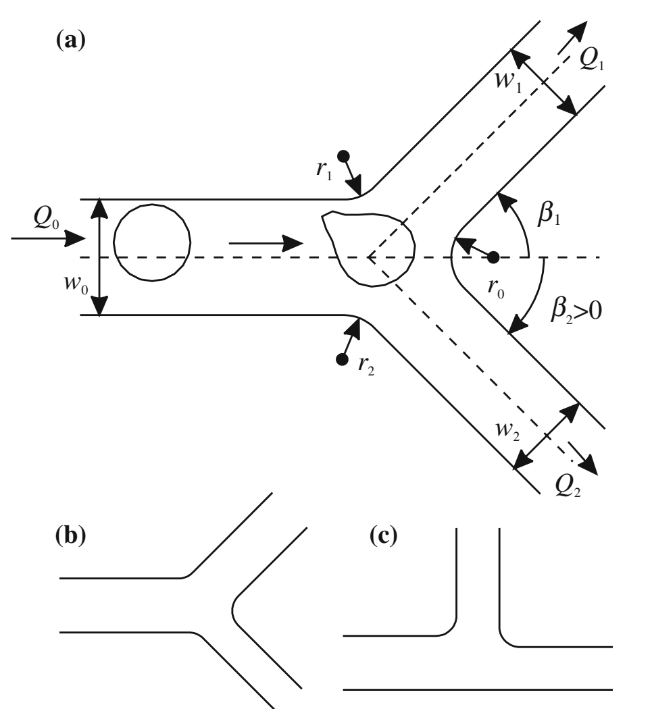

子通道1的流量分数$\Psi_1=Q_1/Q_0$，规定连接处圆弧半径$r_1=r_2=r_0=3\mu m$，每根管道长度都满足$Lv_0=Lv_1=Lv_2=5w_0/2$。分叉角度由$\beta_1, \beta_2$表示，子通道直径比为$r_d=w_1/w_2$。以下研究管道大小$w_0$，流量分数$\Psi$以及管道几何$\beta_1, \beta_2, r_d$对于红细胞分布的影响。

引：动脉管道大致遵循$w_0^3=w_1^3+w_2^3$的关系。对于确定的$w_0$和$r_d$，就能确定子管道的宽度。总流量确定为$Q_0=125W_0^2s^{-1}$。细胞初始位置保证其膜格点与管壁之间的距离至少为$w_{CFL}$。细胞初始形状设置为圆形，以防止非圆形形状带来的横向位移。

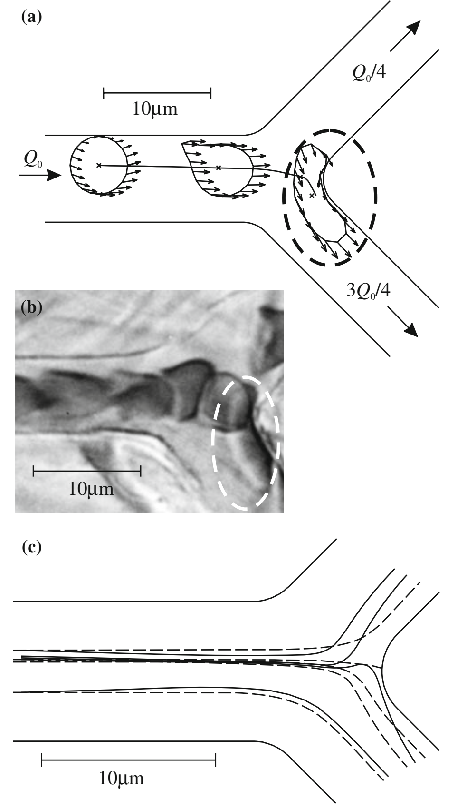

上图(a)为$\Psi=0.25，w_0=8\mu m, r_d=1, y_0=1.24\mu m$参数设置下的仿真结果。细胞首先从初始的圆形形状转变为类似于观察到的形状的不对称形状。在到达分叉处时，细胞变形为沙袋状形状，横跨两个管道。图b显示了在体内观察到的类似形状（引）。

(c)中实线为细胞质心运动轨迹（细胞流线），虚线为流线。比较最外侧的两类流线，可以发现细胞往中心迁移的趋势。比较中心处的两种流线，也有不同之处：比如细胞流线进入分支1，液体流线进入分支2。**迁移效应**：因为中心线位置的流场流线更容易进入高流量的子管道中，再结合由于变形性造成的细胞向中心迁移，所以软颗粒更容易随之进入高流量分支（这一点在刚体颗粒上是不存在的，见下）。**阻塞效应**：对于与细胞尺寸相近的管道，颗粒在分叉处会产生阻塞效果（这一点刚体强于变形体），由于子管道中的流量均由边界条件确定，细胞的阻塞会导致该处的压差增大（低流量分支压强增大明显更强，因为它被挡住的流线百分比更多），于是更容易进入低流量分支。

$y_c$为发生分离的临界初始细胞质心横向位置。(a,d) $w_0=8\mu m$, (b,e) $w_0=10.08\mu m$ (c,f) $w_0=12.80\mu m$。实线为可变性细胞，长虚线为刚体，短虚线表示流线分离临界位置。对于$\Psi<0.5$，刚体颗粒可以进入branch1的范围更大，同时通过曲线偏离对比，可以发现刚体颗粒与流线的偏离程度更大。随着母管径的增大，三者之间的偏差减小。$\Phi$为文中定义的红细胞流百分比，相比于刚体颗粒，软颗粒更容易出现分布不均匀的现象（下面三张图里的短虚线是实验结果）。以上结果左右对称，显然是对应相同大小的子管道。

实线为子管道相同大小的结果，虚线$r_d=1.44$。管径的不对称使曲线向右偏移，导致细胞更容易进入branch2（即更小的管道中）。

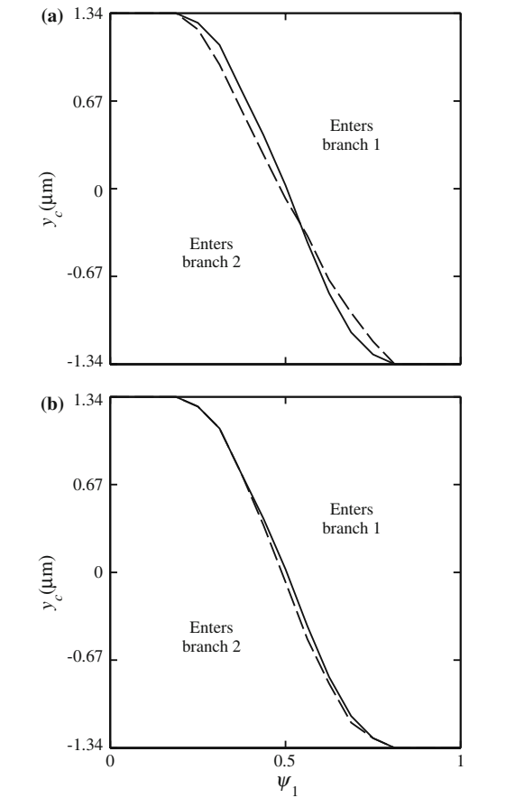

实线为子管道偏转角度大小相同的结果，虚线为上面所示的T形管（偏转角度不同）。细胞并没有表现出更容易进入哪个分支。

## Simulated Red Blood Cell Motion in Microvessel Bifurcations: Effects of Cell–Cell Interactions on Cell Partitioning

引：红细胞压积在分叉处的分布对微血管网络的功能行为具有重要意义。（i）微血管中血液的有效粘度敏感地取决于红细胞压积。2因此，红细胞压比的分配会影响血管流速。（ii）血细胞比容分配的流量依赖性导致网络中流量和血细胞比积之间呈正相关，这反过来又导致平均网络血细胞比积的降低。（iii）血液主要以红细胞内氧合血红蛋白的形式携带氧气。因此，氧运输受到红细胞压积分布的强烈影响。在肿瘤微循环中，观察到相对较高比例的低或零血细胞比容微血管，导致肿瘤缺氧的发展。（iv）血细胞比积分配对流速的依赖性，而流速本身又取决于红细胞比容，导致非线性耦合系统，显示出包括振荡行为在内的复杂动力学。（v）红细胞已被证明通过以取决于氧合血红蛋白饱和度的速率释放ATP在血流的代谢调节中发挥作用。由于该机制产生的信号取决于红细胞压积，因此它受到分叉处红细胞压比分配的影响。

子通道1的流量分数$\Psi_1=Q_1/Q_0$，假设进入子血管的红细胞对于流速的影响可以忽略不计，因为子分支中单个细胞产生的流动阻力与分叉下游血管的总阻力相比很小。仿真基于对称的分叉进行：$w_0=8\mu m, w_1=w_2=6.33\mu m, \beta_1=\beta_2=45\degree,Q_0=8\mu m^2/ms$，以下结果由$\Psi=Q_1/Q_0=1/8, 3/4, 3/8,1/2$得到。

细胞初始化为$R=2.66\mu m$的圆形（距离分叉处$-15\mu m$，初始质心位置范围为$[y_b,y_t], y_b=-1.33\mu m, y_t=1.33\mu m$，前侧细胞质心位置记为$y_{0f}$，后侧$y_{0b}$。两细胞放置时间间隔为$\Delta t_0

对于单个细胞，“分支函数”可以定义为：

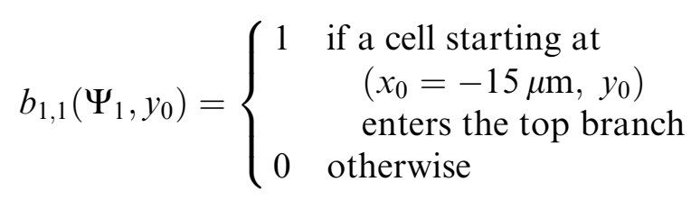

其中第一个下标代表进入分支1（及上分支），第二个下标代表1个细胞。

对于两细胞的系统，由一个三元数组决定$(y_{0b},y_{0f},\Delta t_0)$，分支函数：

对于每一个分流系数$\Psi$和延迟时间$\Delta t_0$，在$y_{0b},y_{0f}$平面上可以绘制两条曲线$\Gamma_b,\Gamma_f$，划分了$b_{12}=1, b_{12}=0$两片区域。

流量分数定义如下：

$p(y_0)$表示初始时刻细胞质心为$y_0$的概率，这里是均匀分布的。$d\Omega=dy_{0b}dy_{0f}\Delta t_0$

[如Secomb等人些的综述的笔记中最后那张图](#Blood-Flow-in-the-Microcirculation)，展示了$\Psi=3/8$的一些现象，即 trade-off, herding and following，图中展示的都是因为细胞间相互作用导致其中一个细胞进入本来不会进入的通道。根据仿真结果，可以初步得出一些结论：后侧细胞更容易受到前侧细胞的影响，而且trade-off是主要类型。

上图为$\Psi=3/8$时的结果，$\Delta t_0=6, 10, 20$，$y_{ci}$表示单个细胞的分离线，从中也可以看出细胞间的相互作用对于后侧细胞的影响比较大。

上图为$\Psi=3/8$时，前后侧细胞、两个细胞、一个细胞进入上侧分支的概率。在两个细胞很接近的时候（$\Delta t_0$较小），herding和following占了主要部分；在$\Delta t_0>6ms$时，trade-off 占主导。

与单个细胞相比，两个细胞总体来说分布更加均匀，这是由于trade-off造成的。

trade-off可以用流动连续性解释，比如说前侧细胞进入了下分支，它会带离一部分流体离开控制体，从而需要增加流入达到平衡，于是会通过原来的分离线5进入该控制体。对于herding和following，则是由于细胞之间很接近，由润滑力结合在了一起

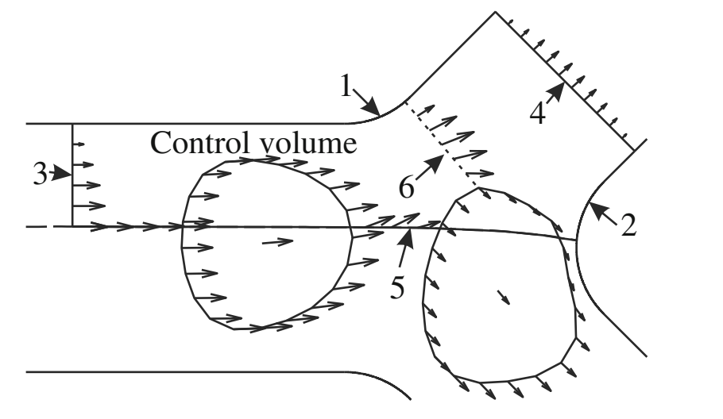

引：根据实验结果，随着血细胞比容的增加，分叉处血细胞比积的分配通常会变得更加均匀。

## Partitioning of red blood cell aggregates in bifurcating microscale flows

引：虽然人们普遍认为，在健康的循环中，剪切力相对较高，可以最大限度地减少红细胞聚集，并确保低流动阻力，但最近的证据表明，聚集物在整个微血管中持续存在，这意味着微血管网络中的红细胞分布和血液灌注可能会受到这种现象强度的影响。事实上，在最近的一项研究中，研究了红细胞聚集对通过人工微血管网络的血流的影响，发现毛细血管红细胞压积明显增加。

引：在许多病理条件下观察到强烈的红细胞聚集和高粘度综合征，改变了血液的运输特性。这些疾病包括败血症、镰状细胞贫血、阿尔茨海默病、糖尿病和风湿病。然而，红细胞聚集和高粘度综合征在血管阻力中的作用尚不清楚。例如，尽管高粘度会增加流动阻力，被认为会造成局部损伤（例如在青光眼的某些情况下阻碍视神经的血流），但由于一氧化氮的产生，它也可能导致血管管腔直径的增加，降低阻力。此外，关于红细胞聚集在全器官灌注中的影响的体内实验表明，聚集现象对血管阻力有非单调的影响。

CDL: cell depleted layer.就是cfl，由于细胞向管道中心横向移动造成的无细胞层。

引：最近，Sherwood等人详细研究了红细胞聚集对T形连接微通道中流动的CDL的影响。发现红细胞聚集a）独立地增加了CDL的宽度和粗糙度，与分叉中的流动分配相结合，进一步扩大了CDL。

管道宽度$W=10\mu m$，深度$D=40\mu m$。子通道中的流量通过调节出口蓄水袋的高度差来调节。$x^*=x/W, y^*=y/W$。右图中的流线图对应的是$Q*=Q_P/Q_D\sim0.13$的情况。

**聚集体大小分布和红细胞压积**

红细胞聚集的例子中，平均结构大小大致是单个红细胞的2倍（$Q^*\sim 0.5, \hat{A^*}=1.90; Q^*\sim 0.1, \hat{A^*}=1.88$）。(a)(b)中虚线表示检测到的单个红细胞最大面积；(c)(d)各种结构的空间分布，虚线实线分别为别的文献中给出的基于强度的红细胞压积曲线（用明场图象的灰度来反推局部红细胞体积分数）

**流量比的影响**

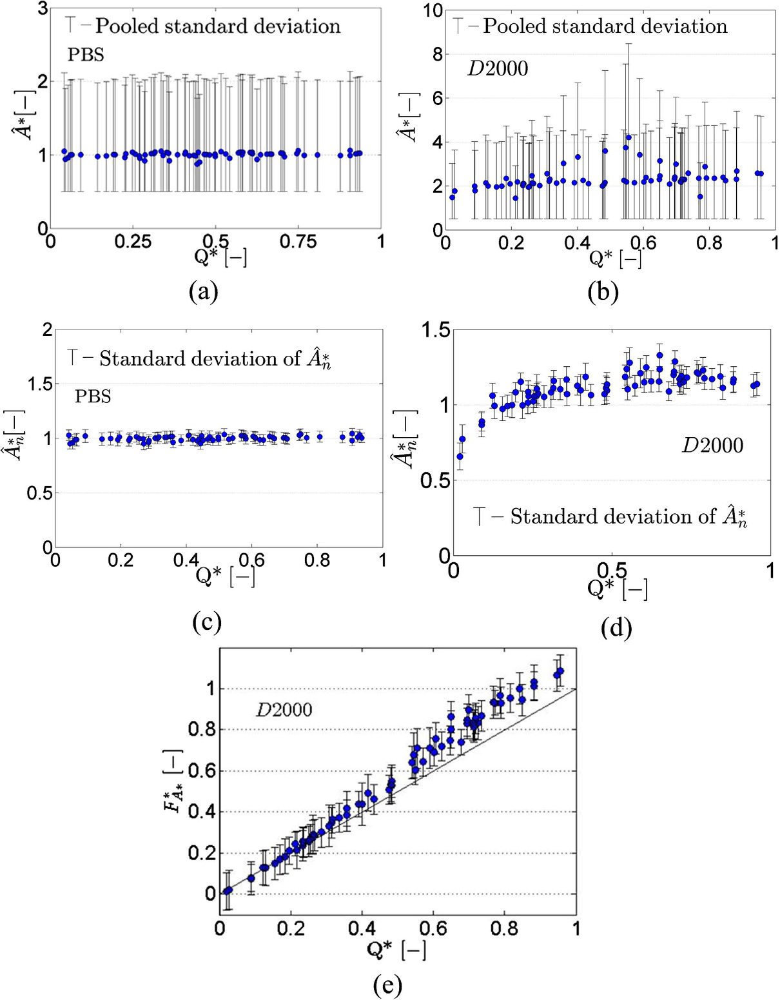

T连接处聚集体的大小随流量比变化。(a)非聚集情况下，$\hat{A^*}$并不会随着$Q^*$有明显变化；(b)而对于会聚集的D2000处理下的case，存在变化（需要注意的是，这里$Q^*<0.5$对应的是右侧子通道$Q_R^*$，$Q^*>0.5$对应左侧子通道$Q_L^*$，），$Q^*$越小，$\hat{A}$越小，在$Q^*=0.5$时取到最大值。进一步将连接处的聚集体大小使用母管道中聚集体的平均尺寸归一化，得到(c)(d)。对于聚集情况：1、当$Q^*\gtrsim 0.2$时，子支路的聚集体平均尺寸比母管道高约$10\%-20\%$（$A_n^*>1$），这是由更小的剪切应力造成的；2、低流量比情况下（$Q^*\lesssim 0.2$），反而出现$A_n^*<1$的情况，也就是聚集体经历连接处变少了，这是比较反直觉的，因为低流量的子管道中剪切力更小。以下是对此的解释：低$Q^*$的支路从母管道分到的那部分流体主要靠近壁面（aggregate-depleted region），而大聚集体往往被壁面升力推向中心线（见下一部分）。

引入了一个size-flow parameter$F_A^*=Q^*A^*$（见e），当$Q^*>0.3$时，曲线偏离没有偏好的$F_A^*=Q^*$曲线，这也同样说明高流量的子通路里富集这更大尺寸的聚集体。

**管道中聚集体的区域划分**

**流量比对于聚集体区域化分的影响**

$x_A^*$为某一尺寸聚集体的极限位置（最靠近壁面的5\%），$x_{fs}^*$表示流体的分流分界线。见b，对于某个特定的$Q^*$，如果$x_A^*<x_{fs}^*$（更靠近中心），那么该尺寸的聚集体就不可能进入该子分支。

以上所示的聚集物尺寸分配行为可能有助于解释为什么红细胞聚集的影响在体内血管阻力方面没有预期的那么有害；进入低流速（因此平均剪切速率低）分支的较小聚集体，再加上这些区域较低的红细胞压积，意味着分支中的整体粘度也将保持较低。此外，由于氧气灌注主要发生在毛细血管水平，如本研究所发现的，大CDL和低流速的大规模分支中聚集细胞的低浓度将有助于促进血流。这里应该注意的是，低流量分支中细胞和聚集体的浓度强烈偏向壁，即在流速较低但剪切力较高的区域。这可能有助于减小分支中聚集物的大小。

## Spheres in the vicinity of a bifurcation: elucidating the Zweifach–Fung effect

引：红细胞在分叉处更容易进入高流量的分支，这种现象有时被称为Zweifach–Fung effect。在标准生理条件下，通常接受四分之一血液流入的分支将看到其红细胞压积（红细胞体积分数）降至零，这将产生明显的生理后果。在文献中，“对高流速分支的吸引力”有时被用作这种现象的同义词。

对于给定的分叉几何形状和两个出口分支之间的流量比，颗粒的最终分布可以从两组数据中直接得出：第一，它们在入口的空间分布，第二，它们在分叉附近的轨迹，从所有可能的初始位置开始。如果粒子遵循其潜在的未受扰动的流线（就像球体在直通道中的斯托克斯流中所做的那样），它们的最终分布可以很容易地计算出来，尽管分叉顶点附近的粒子需要一些特殊的处理，因为它们不能像其潜在的流线那样接近它。

在极端情况下，所有颗粒都集中在中心线处，并沿着流线流动，它们会进入高流速的分支；更一般地说，壁附近无颗粒层的存在有利于高流速分支，低流速分支所接受无颗粒层的液体比例更大。这种无颗粒层被成为plasma skimming

这里关注分叉附近的流线迁移问题，我们将考虑刚性球体，预计上游不会发生横向迁移。这些球体处于消失浓度极限（vanishing concentration），流过对称分叉（Y形和T形），其中两个子分支具有相同的横截面，并且相对于入口通道均匀分布。

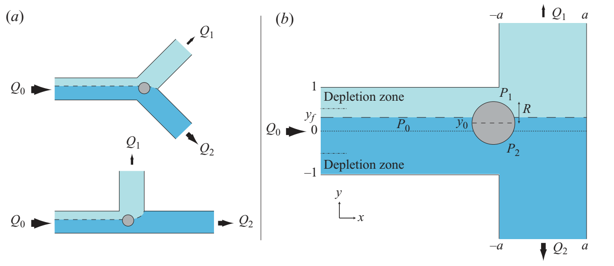

Zweifach-Fung效应可以写如下：如果$Q_1/Q_0<1/2$（分支1接收的流量小于分支2），则$N_1/N_0<Q_1/Q_0$（分支1收到的颗粒比流体比例还少）或等效地$\Phi_1<\Phi_0$（低流量分支中的颗粒浓度降低）

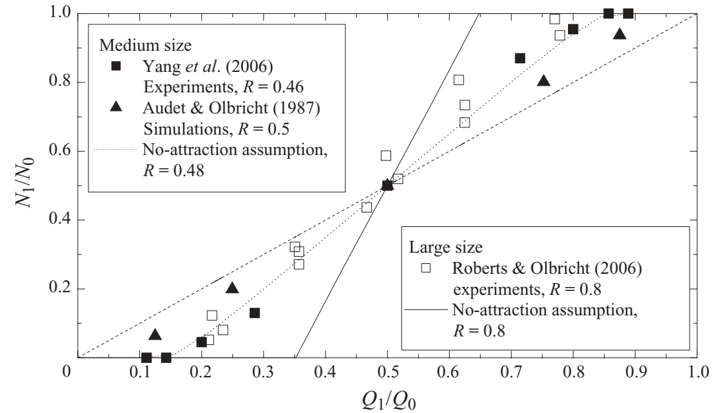

所有曲线都符合Zweifach-Fung效应，即使是在no-attraction assumption下（认为颗粒分离线与流体分离线一致，但是无颗粒层的效果还是存在）。上图的中等大小颗粒（仿真工作，实验是方管，Y型分叉）以及大颗粒（方管，Y型分叉，理论上来说对于$Q_1/Q_0<0.35$，没有颗粒会进入低流量分支），都说明了有向低流量分支的吸引力。但是在圆形横截面的微管中，类似结果是矛盾的。

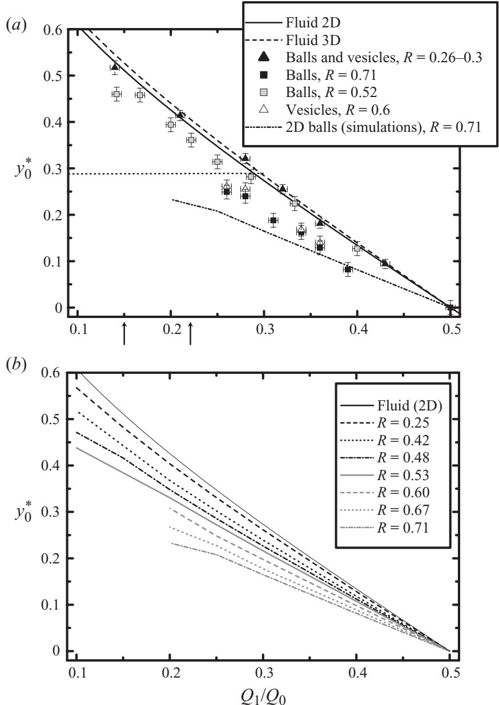

对于所有考虑的颗粒，在模拟或实验中（T型管），发现颗粒分离线位于流体分离线下方，上分支是低流速分支。这些结果清楚地表明了向低流速分支的吸引力：虽然位于流体分离流线下方的流体微元将进入高流速分支，但固体颗粒可以穿过该流线并进入低流速分支，只要它最初不太远。同样明显的是，吸引力随着球体半径R的增加而增加。(a)实验，(b)二维仿真。

引：[barber2008](#Simulated-Two-dimensional-Red-Blood-Cell-Motion,-Deformation,-and-Partitioning-in-Microvessel-Bifurcations)最先报道了这种相比于流体微元更倾向低速分支的现象，也就是颗粒本身会造成压降，它对低速区域的流体阻碍占比更大，于是产生更大的压降，称为obstruction。然而，[Barber2008](#Simulated-Two-dimensional-Red-Blood-Cell-Motion,-Deformation,-and-Partitioning-in-Microvessel-Bifurcations)并没有说清楚颗粒处于分叉的哪个位置。以下会证明处于分叉不同位置时受到的影响可能会大不相同。

分叉处颗粒运动其实往往有两个阶段、两种相互竞争的效应：

- 刚进入分叉时，颗粒会先表现出向低流量支路偏移；

- 但之后靠对侧壁时，效应会改变，甚至可能出现向高流量支路的第二次吸引，至少会削弱前面的低流量偏移。这个现象在 daughter branches 更宽的时候更明显。

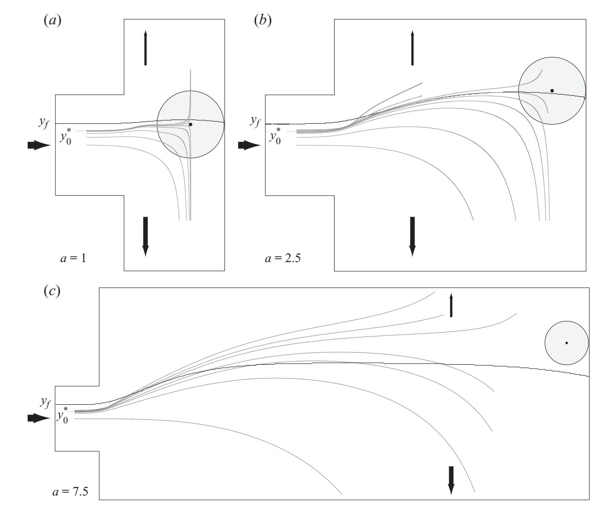

可以使用简单的分析方法证明这两个现象的存在：

poisueille流场分布：$u(y)\sim 1-y^2 $，对应流量与压差关系：$\Delta P\propto\frac{Q}{h^3}$，$h$为管道宽度。记管壁到流体分离线的距离为$\tilde{h}$，见下图

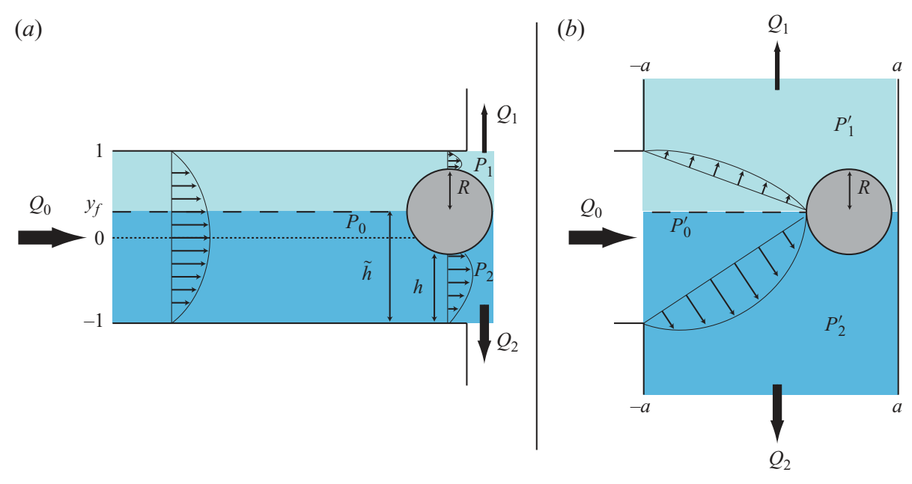

对于上图(a)位置，每侧经过的流量$Q$可以由未受扰动的流场积分得到：

$$Q\sim\tilde{h^2}-\frac{\tilde{h^3}}{3}$$

于是得到压差：

$$\Delta P\sim\frac{\tilde{h^2}-\tilde{h^3}/3}{h^3}$$

将球看作一个“平的颗粒”：$h=\tilde{h}$，则有：

$$\Delta P\sim\frac{1}{\tilde{h}}-1/3$$

它是关于$\tilde{h}$单调递减的，于是颗粒被推向低流量分支。即使是一个半径为$R$的真实球体，$h=\tilde{h}-R$，也有这样的规律：

$$\Delta P\sim\frac{\tilde{h^2}-\tilde{h^3}/3}{(\tilde{h}-R)^3}$$

它随$\tilde{h}$的下降更快。

对于第二种相反的效应，此时求已经接近了对侧壁、处在近似伸长流中，两侧流体通过缝隙厚度近似相同：

$$\Delta P'=\propto\frac{Q_i}{h^3}$$

只剩下流量$Q_i$的区别，于是拉向高流量分支。

尽管颗粒在分叉附近会被吸向低流量支路，但这个吸引并不足以改变最终的大趋势；最终颗粒浓度通常还是在高流量支路更高。因为depletion effect的存在。从设计的角度来说，如果想要提升depletion effect，可以减小入口通道宽度，但是这会提升toward-low-flow attraction，所以还要适量加宽daughter branch来削弱这种吸引，以提升分离效果。

