# 文献摘要

分类：受限几何中的集体运动

## Phonons in a one-dimensional microfluidic crystal

- 本文研究了多体效应对于一维hydrodynamic crystal的影响（其实就是水滴在油中流动），发现了纵波与横波，并与所谓的固态声子（solid phonons）很像
  
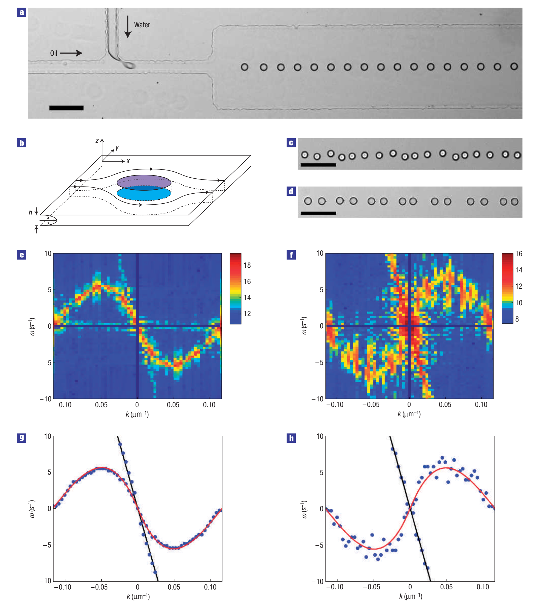

## Global stability of flowing red blood cell trains

引：细胞运动学和细胞列的稳定性对细胞壁相互作用很重要，包括无细胞层的形成[28-31]、白细胞和其他颗粒的边缘化[32-36]、靶向药物递送和运输[37]，以及在血管生成[38]、发育[3,37,39]和肿瘤生长[40]中被认为重要的血流动力。也许最重要的是，细胞系的稳定性特性可能会为用于处理血细胞的微流体装置的设计提供信息，在这种装置中，规则的细胞列似乎可以简化任何细胞特异性的处理。

红细胞表面用球谐展开系数$\mathbf{s}=\{a_{nm}^{(j)},b_{nm}^{(j)}\}$，定义扰动$\mathbf{\varepsilon}(t)=\mathbf{s}(t)-\mathbf{s_b}(t)$，其中同时包含了整体平移/倾斜（低阶模态）和形状起皱（高阶模态）。下标b表示匀速整体平移、形状保持周期稳定的构型。整体的扰动幅度：

膜面离散点满足：

$$\frac{d\mathbf{\hat x}}{dt}=\mathbf{\hat u}(\mathbf{\hat x})$$

也就是说$\mathbf{\hat u}$是把位置对应到速度的一个非线性算子。同时膜格点位置存在球谐变换：

$$\mathbf{\hat x}=B\mathbf{\hat s}, \mathbf{\hat s}=\hat B\mathbf{\hat x}$$

于是对于球谐展开系数的扰动$\mathbf{\hat\delta}$，可以有展开：

$$\mathbf{\hat u}(\mathbf{\hat x}+B\mathbf{\hat\delta})=\mathbf{\hat u}(\mathbf{\hat x})+CB\mathbf{\hat\delta}+O(\|(B\mathbf{\delta})\|^2)$$

$C$就是$\partial \mathbf{\hat x}/\partial x$。上式两端同时左乘$\hat B$：

$$A\mathbf{\hat\delta}=\hat B\mathbf{\hat u}(\mathbf{\hat x}+B\mathbf{\hat\delta})-\hat B\mathbf{\hat u}(\mathbf{\hat x})$$

其中$A=\hat BCB$，表示基态与扰动的所有一阶耦合。由上：$\frac{d\mathbf{\varepsilon}}{dt}=\dot{\mathbf{\hat s}}-\dot{\mathbf{\hat s_b}}=B\dot{\mathbf{\hat x}}-B\dot{\mathbf{\hat x_b}}=\hat B\mathbf{\hat u}(\mathbf{\hat x_b}+B\mathbf{\varepsilon})-\hat B\mathbf{\hat u}(\mathbf{\hat x_b})=A\mathbf{\varepsilon}$。对于初态$\mathbf{\varepsilon}(0)=\mathbf{\varepsilon}_0$，有准确解$\mathbf{\varepsilon}=\exp{(At)}\mathbf{\varepsilon}_0$

**用A特征值的最大实部来定义长时间增长率$\alpha$，谱横坐标（spectral abscissa）**：

$$\alpha=\max\{Re[\lambda(A)]\}$$

- $\alpha>0$：线性不稳定
- $\alpha<0$：长时间稳定
- $\alpha\approx 0$：中性稳定

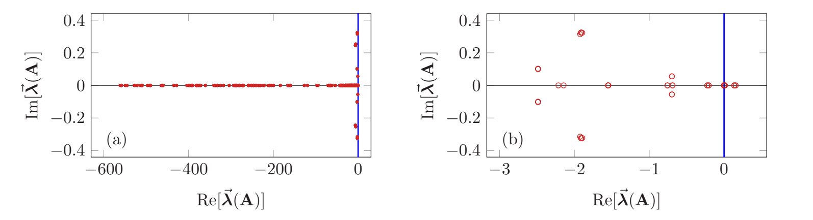

上图是某个两体系统的A的特征值，多数实部为负，符合对于粘性系统的认识。

文中强调A是非正规（nonnormal）的，因为A非正规时，特征向量一般不正交，模式之间会“相互投影/干涉”。这带来一个很反直觉的现象：即使所有特征值实部都 ≤ 0（渐近稳定），也可能在短时间内出现很强的“瞬态放大”。所以“最大实部特征值”并不一定代表“任何时刻的最大增长率”。**瞬态的增长上界由对称部分$(A+A^T)/2$的最大特征值确定：**

$$\frac{d}{dt}\|\varepsilon\|^2=\frac{d}{dt}(\varepsilon^T\varepsilon)=2\varepsilon^T\dot\varepsilon=2\varepsilon^TA\varepsilon$$

将A分为对称部分和反对称部分：

$$A=\frac{A+A^T}{2}+\frac{A-A^T}{2}=S+K$$

反对称部分满足$\varepsilon^TK\varepsilon$，它并不会改变范数幅值，因此：

$$\frac{d}{dt}\|\varepsilon\|^2=2\varepsilon^T\dot\varepsilon=2\varepsilon^TS\varepsilon$$

上式两边同除以$\|\varepsilon\|^2$：

$$\frac{d}{dt}\ln\|\varepsilon\|=\frac{1}{\|\varepsilon\|^2}\varepsilon^TS\varepsilon$$

右边是对称矩阵$S$的Rayleigh商，对于任意非零$\varepsilon$，都有：

$$\frac{\varepsilon^TS\varepsilon}{\varepsilon^T\varepsilon}\le\lambda_{max}(S)$$

于是对于任意初始扰动，$t=0$时刻的瞬时增长率都满足：

$$\frac{d}{dt}\ln\|\varepsilon\| \Big|_{t=0}\leq\lambda_{max}(S)=\eta$$

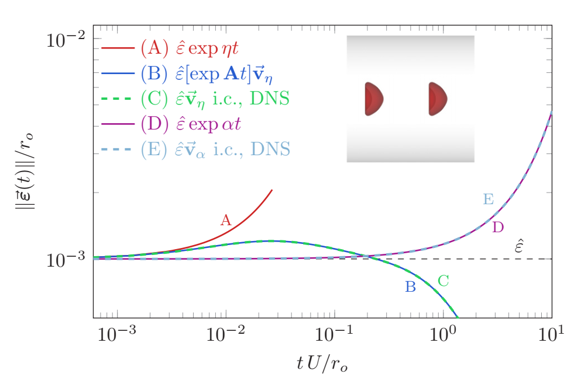

上图为一个两体的基准算例，初始扰动选取为最瞬态放大方向$v_{\eta}$时（模型预测与DNS，B, C），产生非单调行为：放大持续很短时间，随后衰减；长期的不稳定模态由$v_{\alpha}$决定（D,E）。

### Results

定义$\phi=r_0N/L$

**$\lambda=1$，渐进行为**

对于$\phi=0.2$，系统总是不稳定的。在更大的D下，$\alpha$有相对更小的值，这说明壁面与细胞之间的作用力造成弱失稳。同样，对于拥挤的算例$\phi=0.7$系统也总是不稳定的；而对于中等的$\phi$，扰动增长得到抑制，如对于$D\lesssim 10, 0.4\gtrsim\phi\gtrsim 0.55$，有$\alpha<10^{-3}U/r_0$，相对稳定，事实上此时由于数值近似无法分辨出其与$\alpha=0$的区别。

**非线性饱和**

延长系统发展时间，当扰动到一定量级时，扰动增长开始偏离指数关系，非线性效应产生效果。此处$D=10r_0$，$\phi=0.7$比$\phi=0.2$的情况更早进入非线性阶段。较稀疏情况阈值更大是因为要触发较强的cell-cell相互作用需要更大的流向位移。$v_{ad hoc}$对应的扰动是随意移动每个细胞产生的，而非变形，它的放大更慢。

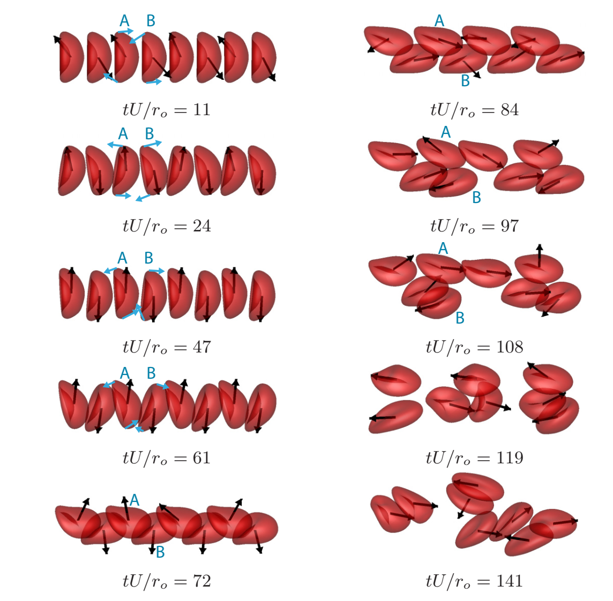

- 初始扰动让细胞发生倾斜 + 横向位移，而且呈现“两细胞一个波长”的结构，把细胞推得更靠近管壁（$tU/r_0\leq 61$）；

- 因为近壁区域流速更低，细胞会被减速并发生旋转，甚至出现相邻细胞（图里标 A、B）反向旋转；整体形成类似实验里见到的 staggered（交错）列；

- 旋转进一步增大后，细胞变成 slipper-like，而且出现“隔一个细胞方向相反”的交替取向（$tU/r_0\sim 72$）；最后这种结构解体，演化到明显无序的状态，作者推测是二次失稳导致。

**粘度比$\lambda$的影响**

从$\lambda=1$到$\lambda=5$，瞬时放大倍率$\eta$减少了大约一半；而对于$\alpha$，$\lambda=5$普遍大于$\lambda=1$，特别是在大$\phi$下。

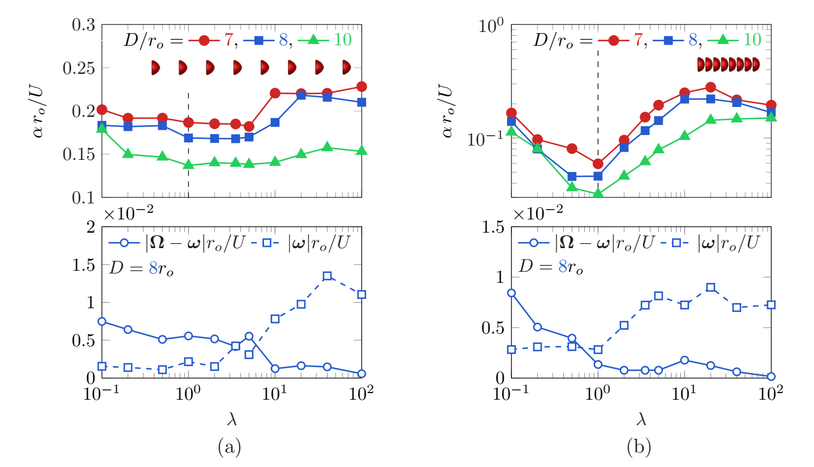

当$\lambda\gtrsim 20$时，细胞在稳定性层面表现得像刚体。当细胞密度更大时（左0.2，右0.7），其稳定性表现出对于$\lambda$更强的敏感度。分别使用$|\Omega-\omega|$和$|\omega|$表示tank treading 和tumbling的强度（具体测量方法文中有写）。$\lambda\leq 20$时$\alpha$随着$\lambda$的增长与tumbling的增强有关

**流动强度（Ca）的影响**

定义$Ca=\mu U/E_s$（之前设置的都是0.66）

(a)$\phi=0.2$, (b)$\phi=0.7$。对于高密度的情况，较大的Ca导致更大的变形和流向延伸的细胞，这反过来又导致更小的细胞间距，增强了不稳定性；而对于低密度的情况，$\alpha$随着$Ca$的减小，这主要归结于细胞-管壁之间的相互作用。

**细胞体积的影响**

引：患病或感染的红细胞也经常具有改变的形状。镰状或贫血细胞的体积减少，而椭圆细胞和球形细胞的体积增加，因此它们在细胞列中的稳定性在用于识别、分析或处理它们的微流体设备中可能尤为重要。众所周知，这种患病或转化的细胞可以改变受限的流动。更一般地说，人造细胞状胶囊可以制造出各种体积。

之前设置的reduced volume$\nu=V/V_0=0.64$，对应于健康的红细胞。

上图统一$\lambda=1$

**细胞-细胞与细胞-管壁的相互作用**

为了量化细胞间相互作用以及由此产生的细胞壁流体动力学相互作用对细胞列稳定性的影响，我们改变了A，从而去除了上游和下游最近的$\widetilde{N}$个细胞之间相互作用（直接变为0）。比如$N=8,\widetilde{N}=4$，此时只包含自己对自己的作用以及管壁的作用。

(1)$\phi=0.2,(2)$\phio=0.7$。(a)$\nu=0.64$, (b)$Ca=0.66$。只去除最相邻的细胞（$\widetilde{N}=1$）时，对于$\phi=0.7$时（特别是高$Ca, \nu$，它们都对应于更小的细胞膜距离），系统稳定性增强很明显。这说明最近邻相互作用是不稳定的原因。对于$\phi=0.2$来说，这种效果就比较弱了，说明壁面效应更加重要。

这篇文章还从应变能扰动角度进行了分析。

## Order–disorder transitions within deformable particle suspensions in planar Poiseuille flow

引：微流体装置在广泛的应用中依赖于受限的流动动力学，包括疾病诊断（Gharib等人，2022）、单细胞封装和分析（Ling等人，2020）、基于液滴的微反应器（Liu，Xiang&Ni，2020）以及定制颗粒物的制造（Li等人，2018）。**微流控课的文献阅读可以参考**

本文使用的数值方式IB-LBM，以下多数情况胶囊半径都被设为$a=6\Delta x$，容积统一为$\phi=0.1$

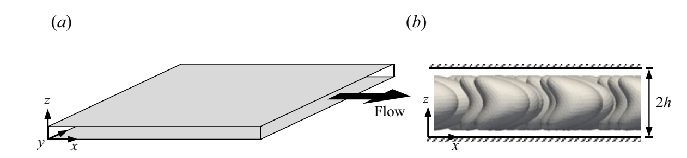

初始颗粒的排布都是无序的（应该与我文章里一样），所有算例运行时间都一致。使用$r_{cut}=3.5a, \theta=\pm15\degree$的前后扇形区域分辨是否相邻（质心位置），当一个胶囊前后各有一个相邻胶囊时，被认为组成一个train。定义了一个表征有序程度的序参量$\Phi=\frac{N_{train}}{N}$

### 均匀悬液（胶囊大小和变形能力一致）

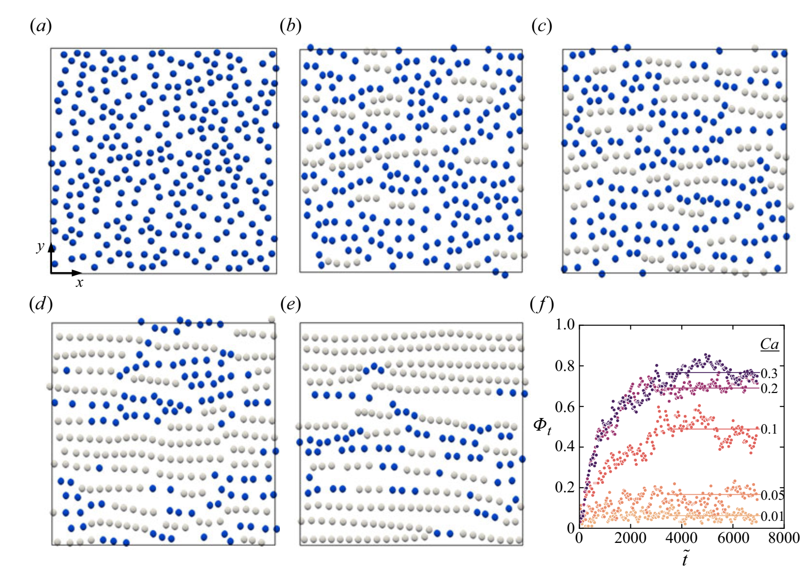

$Ca=0.3, a/h=0.75$（最窄、最软的算例）俯视图。整体逐渐变得有序，系统中包含着局部缺陷，包括两条train相交处的Y型分布。(f)：$\Phi_t$迅速达到一个平衡状态，之后结论中仿真的前半部分都被视作平衡阶段，后半部分用于计算$\Phi_t$的平均值（如右图中水平线所示）及其标准偏差；对于更硬的胶囊来说，有序度更低。

分别计算$Ca=0.05, Ca=0.3$下不同confinement下的分布（文中展示了三种约束度，0.75，0.6，0.43），指出存在一个对应于最大有序度的最优confinement。相较于硬颗粒，软颗粒有序度更高。$Ca=0.3$的软颗粒展示出parachute的形态（侧面）

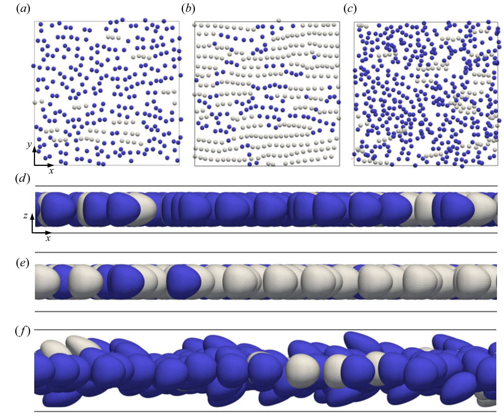

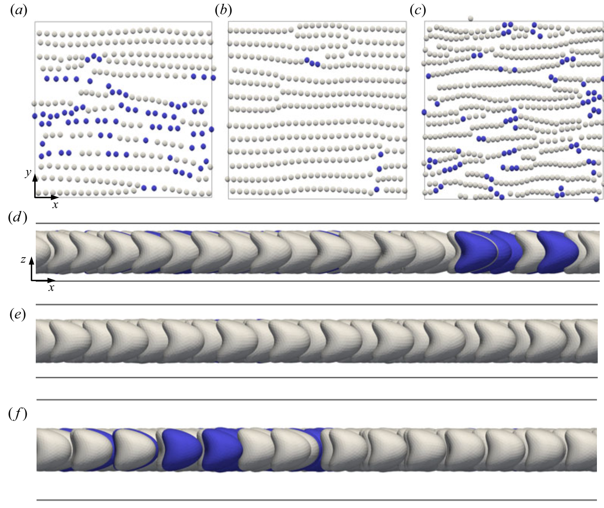

(b)中有序度已经很高了，但是任然存在错位现象。**这是可以预料的，因为自组装系统通常需要特殊的策略（即定向自组装策略）来消除长度尺度上比单个单元大一个数量级的缺陷**

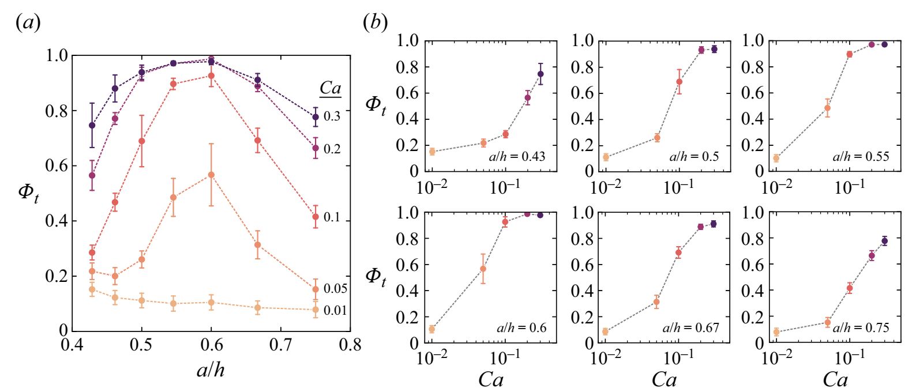

在中等的有序度下（$\Phi_t=0.4-0.7$），标准差最大，此时观察到trains有瞬间形成与解离的现象。

为了解释$a/h=0.6$出现的峰值，首先从两体系统开始：

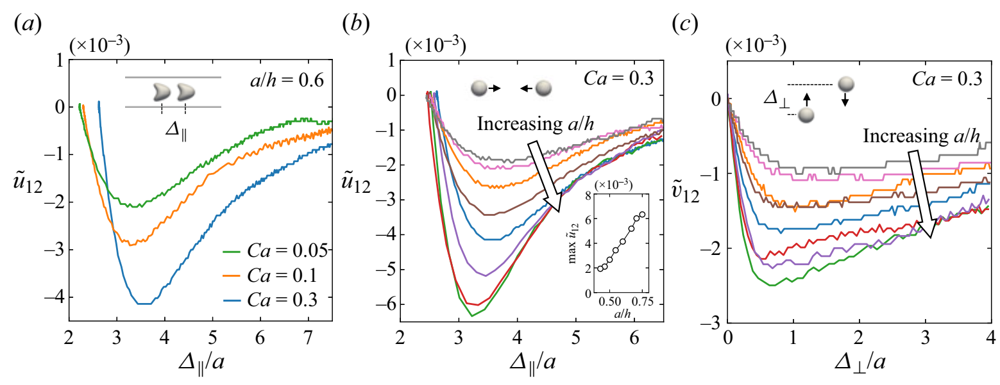

$\Delta_{\parallel}$为间距，$\tilde{u_{12}}$为速度差（$\Delta_{\perp}, \tilde{v_{12}}$）。流动作用力造成的吸引力随着变形能力、约束度的增加而增加，这似乎与上面的结论有点差别，但是考虑到形成单层的结构后，由于总体容积的固定，约束度越高，颗粒之间的平均距离也就越大，从而有减少有序度的趋势。

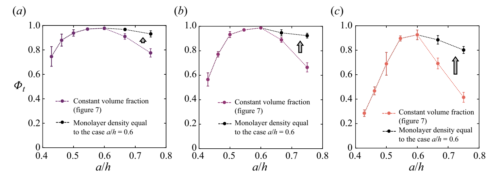

从上图可以看出，$a/h>0.6$后$\Phi_t$的减少很大程度来自于单层密度的减小。

### 颗粒尺寸分散性造成的影响

固定$Ca=0.3,a/h=0.6$（平均），考虑两种半径分布：1、高斯分布，2、双峰分布

**高斯分布**

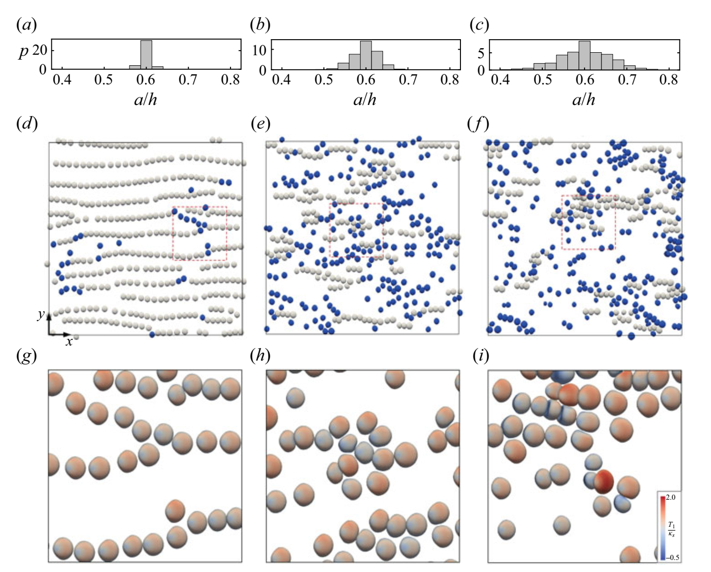

从左到右标准差$\sigma_{\tilde{a}}=0.01, 0.03, 0.06$，随着尺寸离散性的增大，尽管处于最软的属性，有序性下降。(g-i)为(d-f)红框内的特写区域，根据主应力上色。当尺寸离散度小的时候，膜上的应力分布比较均匀；而离散度较大时，不同颗粒膜上的应力差异较大，特别是大颗粒上有更大的应力值，因为它们对应着更大的局部约束度，会产生更大的变形。

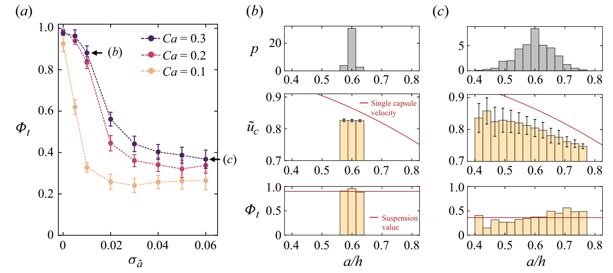

(b)$\sigma_{\tilde{a}}=0.01,Ca=0.3$,(c)$\sigma_{\tilde{a}}=0.06,Ca=0.3$。$p$：概率密度，$\tilde{u_c}$：颗粒速度。总体而言，在尺寸离散性较高的悬浮液中，与较小的胶囊相比，较大的胶囊以较低的速度行驶，更有可能成为train的一部分。很明显，胶囊速度的广泛分布会阻碍排序过程并限制train结构的发展。

**双峰分布**

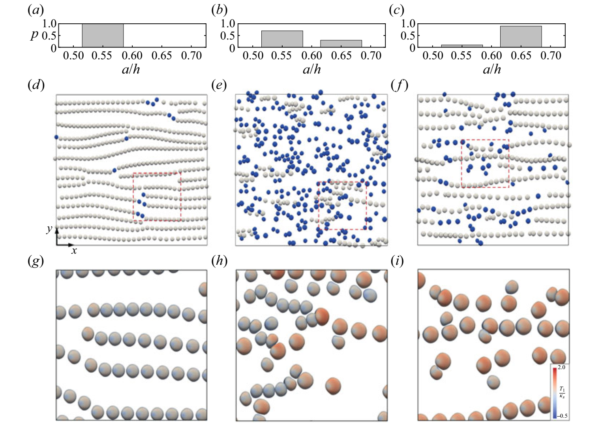

$a_1<a_2$，半径为$a_1$的颗粒比例越高，由于总容积固定，系统里的颗粒越多。（这里$a_1/h=0.55,a_2/h=0.65$）\

上图$Ca=0.3$，(a)(b)(c):$X_2=0.0,0.3,0.9$（$a_2$百分比）。$X_2=0.9$的组别也有明显的有序性，但是小部分的小颗粒影响了有序结构的组成。对于尺寸双峰分布悬浮液，通常会看到一个较大的胶囊引导一列train，然后是一个或多个较小的胶囊。经常看到尾随的较小胶囊在较大胶囊周围移动，因此这些train结构的寿命并不长。

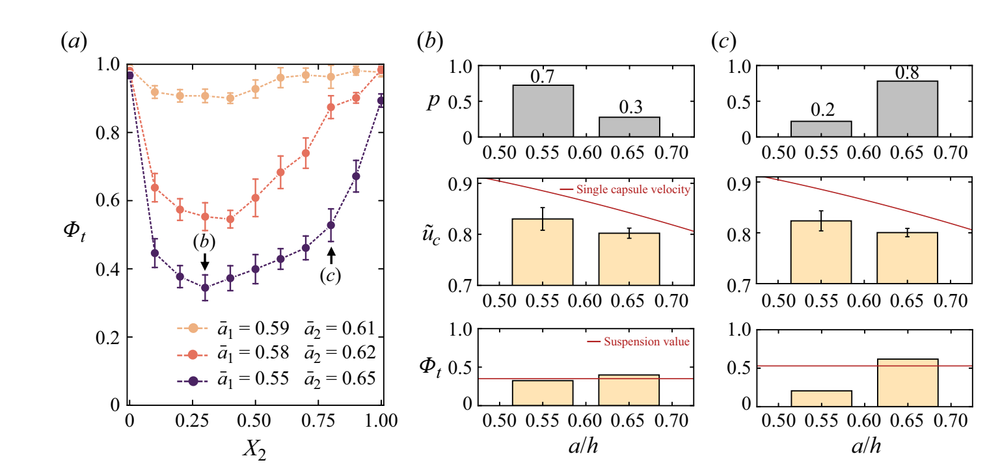

$a_1,a_2$差异越大，有序度越小。(a)曲线并不对称，因此在二元混合物中，少量较大的胶囊比少量较小的胶囊更能扰乱有序度。(b)(c):$a1/h=0.55,a2/h=0.65$，大颗粒速度更慢，且更容易属于train结构。

### train结构里的capsule动力学

在$Ca=0.3,a/h=0.6$的设置下，分析train速度随着$\Delta_{\parallel},\Delta_{\perp}$的变化，发现都随它们的减小而减小，认为与Janssen对于液滴对距离减小$\rightarrow$速度减小，因为周围流体对于双体结构的阻力减小（向前的水动牵引力）相似。同时表面应力也随着距离的减小而减小。**自组装似乎朝着使整体变形减小，以达到最小化系统能量的目的？**

### 颗粒变形能力的分散性

还是使用高斯分布与双峰分布两种。固定$a/h=0.6$

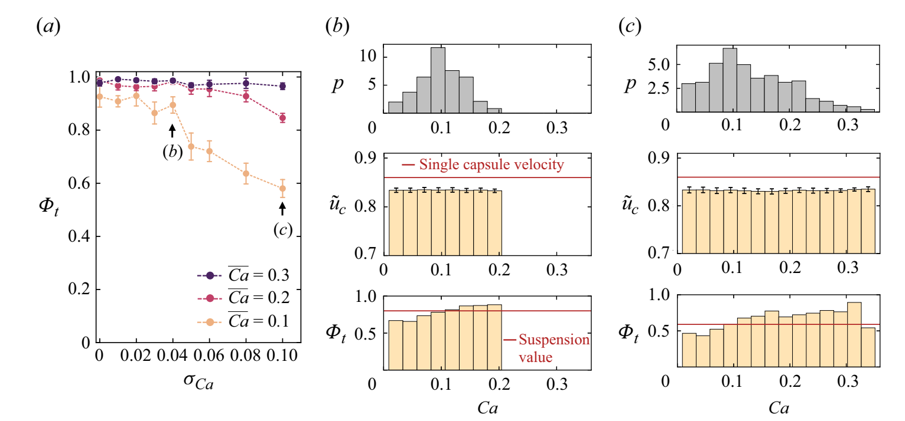

(b)$\overline{Ca}=0.1,\sigma_{Ca}=0.04$，(c)$\overline{Ca}=0.1,\sigma_{Ca}=0.1$

尽管可变形性存在差异，但胶囊速度在整个悬浮液中非常均匀。（对于单体流动速度，也与变形能力没什么关系）对于更软的颗粒，更容易属于一条train中。

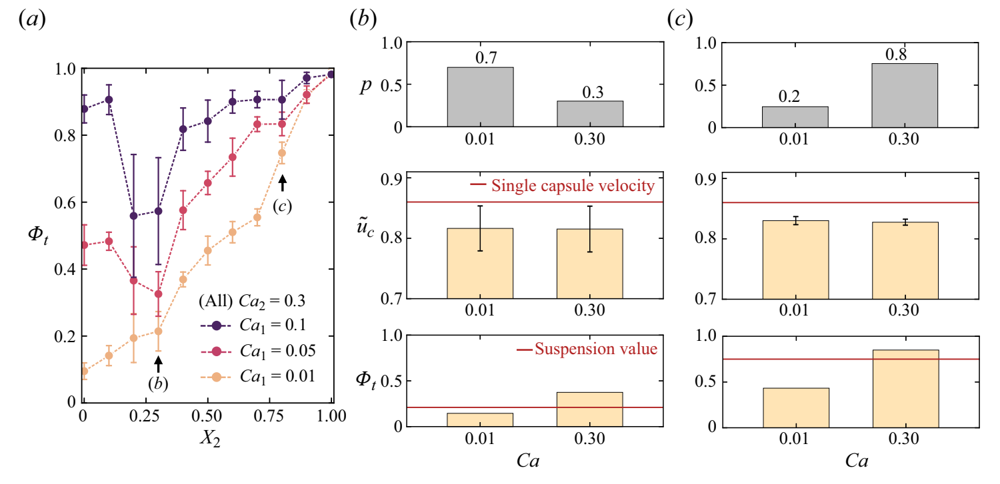

只有在$Ca_1=0.01$时$\Phi_t$随着$X_2$的变化单调。在$Ca_1=0.05,0.1$的情况下加入$20\%\sim30\%$的软颗粒反而会使有序度下降

总体而言，结果表明，相对于可变形性的分散性，有序性对胶囊尺寸的分散性更敏感。

