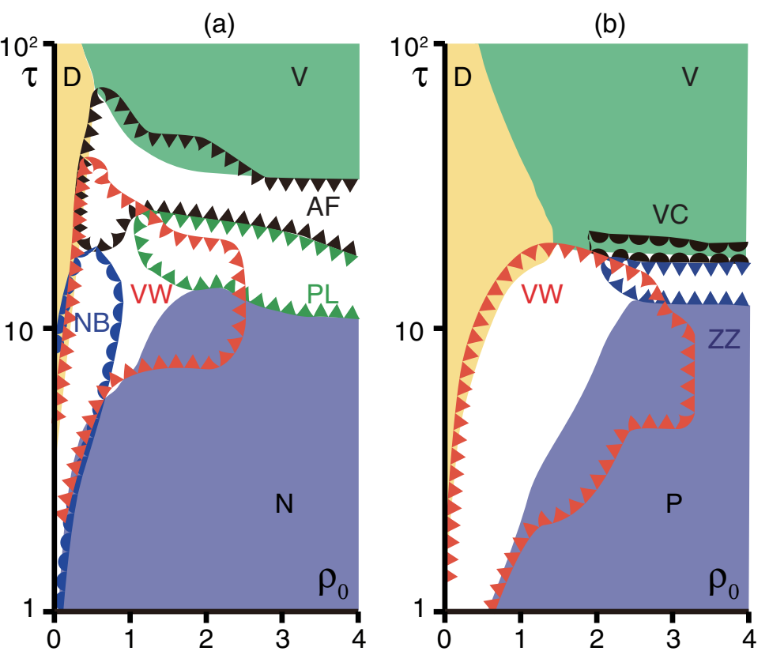

# 文献摘要

## Collective Motion of Self-Propelled Particles with Memory

引：所谓的干颗粒（dry particle）忽略了周围的流体，分布广泛，包括摇动颗粒、活性胶体、运动蛋白驱动的纤维运动以及生物体的运动轨迹（从细菌到鱼这种宏观生物，甚至是人群）。

先来考虑带有记忆的vicsek类型模型。位置$\mathbf{x_i}$的点颗粒以单位速度移动，方向$\theta_i$，朝向发展根据：

$$\frac{d\theta_i}{dt}=\frac{\alpha}{\mathcal{N_i}}\sum_{|\mathbf{x_j}-\mathbf{x_j}|<1}\sin[m(\theta_j-\theta_i)]+\omega_i(t)$$

就单位距离内$\mathcal{N}_i$个邻居求和，$m=1~(2)$对应于铁磁，ferromagnetic, polar（相列, nematic）对齐，$\omega$是平均值为0的噪声。对于不相关的白噪声，噪声强度和粒子的全局密度是两个主要参数，这些过阻尼模型预计将呈现类似于离散时间模型的相图。

通过所谓噪声的Ornstein-Uhlenbeck(OU)过程引入记忆，并保持其他成分过阻尼。

$$
\frac{d\omega_i}{dt}=-\frac{1}{\tau}\omega_i+\xi_i(t)
$$

其中$\xi$是方差为$\sigma^2$的高斯白噪声。上述的欠尼模型依赖于一个外部参数，记忆时间$\tau$。当$\tau\rightarrow 0$时，退化为过阻尼模型。固定$<\omega^2>$，可以绘制如下相图：

(a)相列模型 (b)铁磁模型

- D: homogeneous