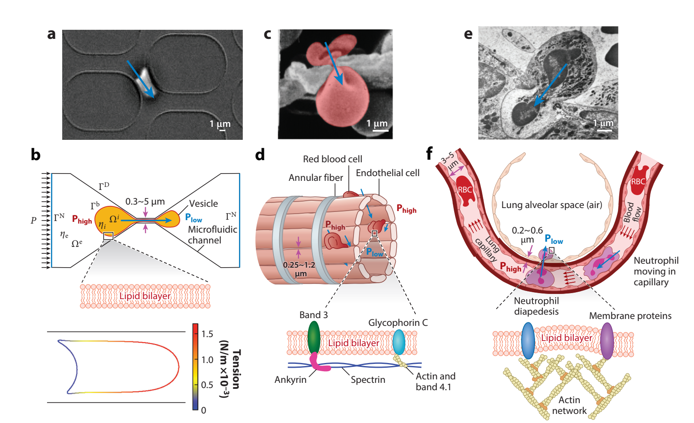
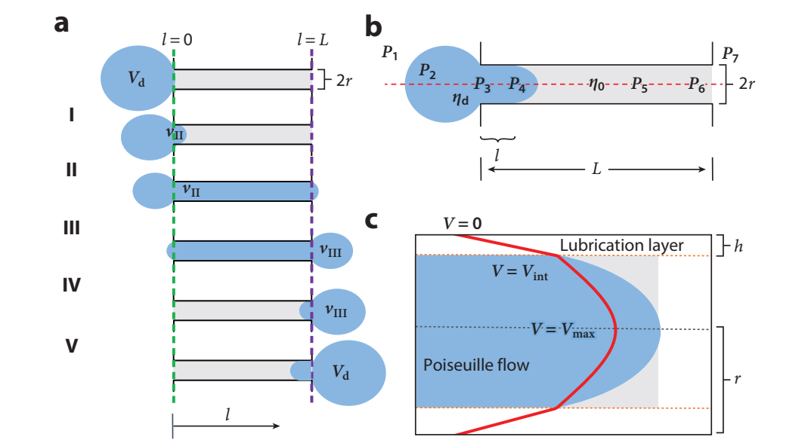

# 文献摘要

分类：微流控

## Fluid Mechanics of Blood Cells and Vesicles Squeezing Through Narrow Constrictions

-这篇文章讨论的是红细胞与囊泡通过极窄的缝隙（小于$1\mu m$）的动力学过程。如骨髓、脾脏、肺毛细血管、流式细胞仪和微流体装置中。细胞或囊泡的挤压流体力学主要由可变形表面（弹性膜）和壁之间的**软润滑流**主导，在零或低雷诺数下，细胞变形以在通道压降下通过锥形收缩。在全身毛细血管中，将细胞推入狭窄处的流动是由几千帕斯卡的压降产生的，足以使红细胞和白细胞变形并使其易于通过。

(a)穿过微流体收缩网络的囊泡。(b)通过细孔的囊泡示意图。P是施加在入口的压强，出口压强为0。外部流体$\Omega^e$粘度$\eta_e$可能与内部流体$\Omega^i$粘度$\eta_i$不同。下侧图片通过膜张力编码颜色的长直管道中流动的囊泡轮廓。(c) 红细胞通过脾缝的扫描电镜图像。(d)红细胞穿过脾脏窦内皮间缝隙的示意图，突出显示红细胞膜结构。(e) 渗出过程中性粒细胞穿过内皮层的透射电镜观察。(f)中性粒细胞在肺泡狭窄毛细血管床中受到挤压并渗出至肺泡腔的示意图。中性粒细胞的膜和肌动蛋白皮层突出显示。此图中的所有蓝色箭头显示了囊泡和细胞的移动方向，紫色箭头表示尺寸，红色箭头表示流向。Phigh表示高流体动压区域，Plow表示低流体动压区。

-引：细胞变形在三种生理情况下更为严重：第一种情况是红细胞通过脾脏红髓（red pulp of the spleen）中亚微米宽的内皮间缝隙（IESs）（c，d），在那里它们必须通过适应性测试才能留在微循环中。新生红细胞（网织红细胞）也会穿过骨髓中的狭窄缝隙，进入血液。这些狭缝，是由两个相邻的内皮细胞之间的间隙形成，具有较高的长宽比，通常长$5\mu m$，深度接近内皮厚度（$\sim2-3\mu m$），宽度变化较大，在$0.2-1.4\mu m$之间。第二种情况涉及循环白细胞，特别是多形核白细胞，期中中性粒细胞最丰富（10-15µm）。它们穿过高度分支的肺泡毛细血管网络，直径为2µm，这是一个重大的挑战。第三种情况是白血球渗出（diapedesis），即白细胞（主要是中性粒细胞）在形成毛细血管或小静脉壁的两个相邻内皮细胞之间的**主动迁移**。当通过邻近内皮连接的局部解离形成间隙时，便开始出现渗出（图e）。在接合处重新密封之前，这一间隙扩大到2.5-3µm。与压力驱动的挤压不同，渗出是一个由炎症信号和复杂的细胞相互作用引导的主动过程。内皮细胞和白细胞中的膜和细胞骨架的主动形态重塑是渗出的必要条件，渗出会在几分钟内展开。

-引：在合成装置中，具有均匀圆柱形孔（直径为2和6µm）的聚碳酸酯筛已被用于过滤RBC并研究其机械性能。许多新开发的具有不同收缩几何形状（通道宽度至少为2µm）和连续几个收缩的微流体装置被设计用于评估红细胞变形能力，或者专门用于细胞分析、分选和分离。然而，**细胞变形的程度受到2µm的最小通道宽度和传统软光学微光刻技术的限制。**已经开发了适应收缩纵横比的各种方法：一种方法将光学光刻与不对称化学蚀刻相结合，以创建与内皮间结构相当的狭缝。另一种方法涉及堆叠微球以形成封闭的通路，提供高通量过滤，但没有实时可视化。

-引：机械敏感的PIEZO1阳离子通道可能会对膜上的机械应力做出反应，使细胞能够主动调整其体积，尽管其在红细胞中的作用仍存在争议。各种离子通道与水通道的激活时间各不相同，从PIEZO1的毫秒到离子泵的秒或更长。

-引：体积为$V_d$的液滴通过半径为$r$，长度为$L$的圆柱形空隙。$V_{Ⅱ},V_{Ⅲ}$分别表示入口、出口处（绿色、紫色虚线表示）右侧的液体体积。第一阶段是在孔入口处形成半径为r的半球的短过程。第二阶段从$V_{II}>0$开始，到体积$V_{II}=Lπr^2+2/3πr^3$结束。当$v_{II}=V_d−2/3πr^3$时，第三阶段结束，其中$V_d$是液滴体积。当$v_{III}= V_d−2/3πr^3$时，第四阶段结束。第五阶段是出口处液滴膨胀为球形液滴的简短过程。

总压降：

在$\Delta P_{mem}\ll \min(\Delta P_{Poise,\eta_d}, \Delta P_{Poise,\eta_0})$的极限下，归一化的无量纲通过时间$\overline t_{  T}=\frac{t_T\Delta P}{\eta_d}$可以通过以下计算：

其中$\lambda=\eta_0/\eta_d, \overline{L}=L/r, \overline{R_d}=R_d/r, R_d=(3V_d/4\pi)^{1/3}$。当然后面也有对$\Delta P_{mem}\sim \min(\Delta P_{Poise,\eta_d}, \Delta P_{Poise,\eta_0})$的讨论，就不在这里继续记录

-引：类似于无限长圆柱形通道中紧密贴合的囊泡的情况，$\Delta P_c$是通道几何形状（孔隙半径）和液滴（体积）的函数。然而，当其对应于$\Delta P_c$的通过张力高于裂解张力时，囊泡膜（表面积恒定）破裂。因此，只有表面积较大（因此通过的最小张力较低）的囊泡才能挤进去。对于锥形狭窄收缩，收缩颈的大小和约束梯度决定了数值模拟中囊泡通过的条件，但文献中没有针对这种收缩几何形状中囊泡膜的匹配渐近计算。

**总之，对于这种液滴、囊泡通过狭窄通道，有一些渐进匹配计算的理论工作，但还不是很完善。**

-浸没边界（IB）方法在模拟流体-结构相互作用中很受欢迎，但很少用于模拟细胞通过极窄收缩的动力学。IB方法在捕捉膜动力学方面的精度较低，需要非常精细的网格来解决膜和壁之间的软润滑流动问题。

