# 文献摘要

## Phonons in a one-dimensional microfluidic crystal

- 本文研究了多体效应对于一维hydrodynamic crystal的影响（其实就是水滴在油中流动），发现了纵波与横波，并与所谓的固态声子（solid phonons）很像
  

## Blood Flow in the Microcirculation

在比较粗的微管道中，在正常的红细胞容积下，红细胞倾向于向管道中心移动，从而造成cell-free layer的形成，通过这种方式可以减少流动阻力；

在分叉处，血细胞比容分布不均。通常红细胞更容易进入流量更大的分支，但这种分布不一定是呈正比的。这种非均匀分配会导致微循环网络内红细胞容积的异质化，甚至造成血浆通道（没有红细胞）的产生；

在很细的微管道中，红细胞会排列成一列；

图中未示出的另一个相关现象是糖萼或内皮表面层（ESL）的存在，该层由排列在微血管壁上的大分子基质组成，显著限制了血管中的流动。

-引：
血管直径变化可以在短时间内（几秒到几分钟）通过微血管周围的血管平滑肌的主动收缩和扩张发生，特别是动脉的最小分支小动脉（Secomb 2008）。在较长的时间尺度（从数小时到数天）内，血管直径受到血管壁结构重塑的调节，这在生长过程中发生，以应对不断变化的代谢需求，并在多种疾病状态下发生（Pries&Secomb 2014）

具有粘度$\nu$的牛顿流体在直径为$D$，长度为$L$的直管道中流动，其流量

$$Q=\frac{\pi}{128}\frac{\Delta pD^4}{L\mu}$$

流动阻力

$$R=\frac{\Delta p}{Q}=\frac{128L\mu}{\pi D^4}$$

定义表观粘度

$$\mu_{app}=\frac{\pi}{128}\frac{\Delta pD^4}{LQ}$$

用于表征考虑红细胞的造成的非连续性效应对于粘度的影响。相对粘度$\mu_{rel}=\mu_{app}/\mu_{p}$，$\mu_{p}$为血浆或者其他悬浮介质的粘度。

-引：Fahraeus和Lindqvist通过不同直径的窄玻璃管输送人体血液，并表明表观粘度随着管径减小到约300µm以下而显著降低，这种现象被称为Fahraeus-Lindqvist效应（Martini等人，1930年；Fahraeus&Lindqviste，1931年；Pries等人，1992年；Secomb&Pries，2013年）。红细胞从血管壁迁移的趋势是造成这种影响的主要原因。这种表观粘度的下降一直持续到血管直径下降为$6\mu m$，此时在正常的红细胞容积下相对粘度约为1.2，相比于总体值的3.0，约为一半。随着直径的继续下降，相对粘度会开始上升，此时细胞周围的流体层变得十分狭窄。当然，实际生物体内的血液表观粘度是要更大一些的，因为血管壁上糖萼与内表皮层的存在，这种约为$1\mu m$的表层上的大分子层减少了管腔的有效宽度

-引：红细胞向管道中心迁移造成的还有一种效应叫Fahraeus effect(Fahraeus 1928)，也就是管内平均的红细胞比容会比流出该管的红细胞比容低。红细胞主要挤在速度更快的中心区域，所以红细胞的平均速度往往大于血液总体的截面平均速度。

$$\frac{H_T}{H_D}=\frac{V_{bulk}}{V_{RBC}}$$

在很细的管道中，这个比值约为1，在管道直径大约为$13\mu m$时，它会达到最小值0.72，随后又随着直径的增加而增至1。

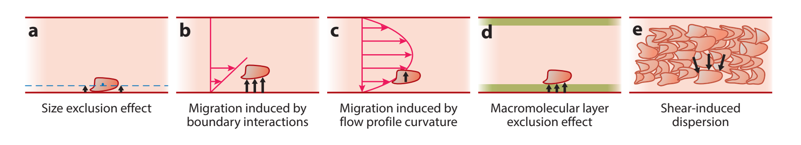

d图很好的阐述了内皮细胞上的大分子层排斥效应。这个厚度为$1\mu m$的大分子层可以视为一种多孔介质。它可以被红细胞挤压，但是还是会由润滑作用之类的机制排斥之后的红细胞，类似于在粉末一般的雪上滑行。内皮细胞对壁剪切应力敏感，ESL的存在意味着作用在内皮细胞膜上的剪切应力主要通过ESL传递，而不是通过膜附近的流体传递（Secomb等人，2001a，b）。关于微血管中的血流，ESL的主要作用是减小可用于流动的有效直径，从而大大增加流动阻力，如上所述。尽管悬浮颗粒与可变形多孔壁层之间的相互作用机制是一个有趣且与生物学相关的话题，但最近很少受到关注（Beaucourt等人，2004年；Hariprasad和Secomb，2012年）。图e：在高浓度的悬液中，由于颗粒之间的频繁相互作用力，会产生一种相反的效果——细胞朝向管壁移动，产生类似于扩散的运动。目前，还没有全面的理论来预测可变形颗粒高浓度悬浮液中的剪切诱导扩散。有一个标度率，意味着由浓度梯度驱动的净红细胞通量受梯度扩散率的控制：

$$D_g=\dot\gamma\varphi a^2f_s$$

-引：$\dot\gamma$是剪切率，$\varphi$是体积比容，$a$是颗粒尺寸，$f_s$是取决于颗粒形状与变形能力的无量纲参数。（这应该与自扩散性分开来，自扩散性描述了单个红细胞均方位移随时间的增长。）

-离开管壁的迁移是红细胞的变形型造成的。对于一个球形的颗粒，由于流体的运动描述是线性的，所以流动方向的反转会造成反向的迁移效果，从而产生矛盾。对于非球形粒子，如果粒子和流动在运动过程中的某个时刻相对于垂直于流向的平面具有对称性，则同样的论点也适用（Secomb 2003）。例如，刚性椭圆形或盘形颗粒在置于剪切流中时通常会翻滚。

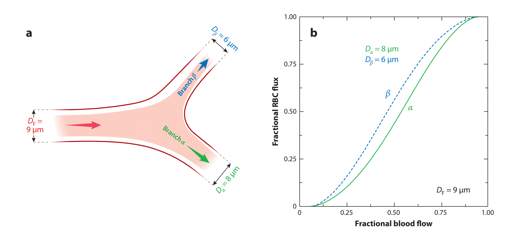

经验方程预测的分支中红细胞通量分数随着整体流量分数的变化，对于给定的流量分数，直径较小的分支获得更大比例的红细胞比容，这是因为它更容易从母管道的高比容核心区获得流量。

当confinement较大时，这种细胞沿着流线运动的假设是有问题的，包括之前说的红细胞更容易进入高流量的通道，这也是有局限性的。由于前侧红细胞的强变形性可能在分叉处改变局部流场，造成之后的红细胞进入低流量的通道（下图为Barber et al.Ann. Biomed. Eng, 2008） 

这种在分叉处产生的相互作用中最经典的就是"trade-off"：一个细胞进入一个分支会导致其后方的那个细胞进入另一个分支。这回造成两个分支中的红细胞比容相近。对于一些初始位置，还有其他类型的相互作用，比如“herding”，领头细胞跟随后侧细胞进入同一分支；“following”，后侧细胞跟随前侧细胞选择分支。下图为Barber et al. BMES,2011

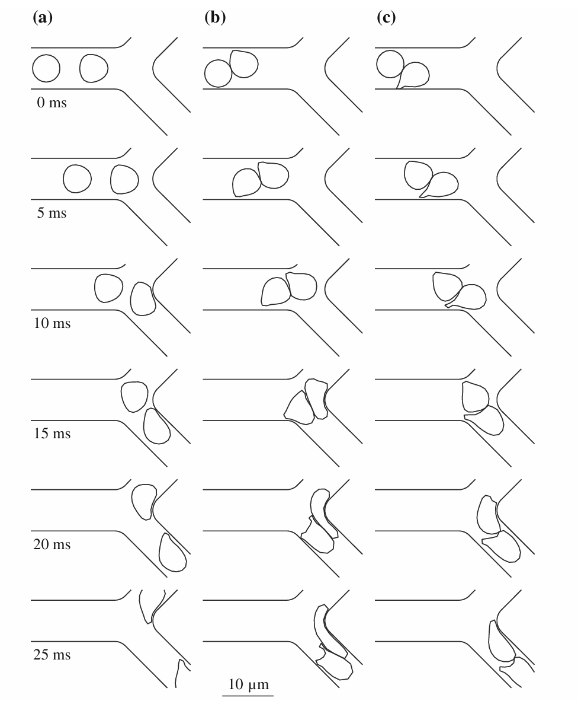

除了红细胞外，血液里还有白细胞、血小板、脂质体（可以用于药物投递）这样的颗粒。对于它们来说，能够接触到微血管壁很重要。如果粒径远小于1µm，布朗运动可确保颗粒在整个容器横截面上均匀分布。对于较大的颗粒，微血管内的横向运动取决于与其他颗粒（主要是红细胞）的流体动力学相互作用。对窄管中流动的实验观察表明，白细胞和血小板都优先分布在血管壁附近。白细胞和血小板的这种边缘化归因于与红细胞的流体动力学相互作用。(因为红细胞变形能力更强，更容易向管道中心移动)。

## Fluid Mechanics of Blood Cells and Vesicles Squeezing Through Narrow Constrictions

-这篇文章讨论的是红细胞与囊泡通过极窄的缝隙（小于$1\mu m$）的动力学过程。如骨髓、脾脏、肺毛细血管、流式细胞仪和微流体装置中。细胞或囊泡的挤压流体力学主要由可变形表面（弹性膜）和壁之间的**软润滑流**主导，在零或低雷诺数下，细胞变形以在通道压降下通过锥形收缩。在全身毛细血管中，将细胞推入狭窄处的流动是由几千帕斯卡的压降产生的，足以使红细胞和白细胞变形并使其易于通过。

(a)穿过微流体收缩网络的囊泡。(b)通过细孔的囊泡示意图。P是施加在入口的压强，出口压强为0。外部流体$\Omega^e$粘度$\eta_e$可能与内部流体$\Omega^i$粘度$\eta_i$不同。下侧图片通过膜张力编码颜色的长直管道中流动的囊泡轮廓。(c) 红细胞通过脾缝的扫描电镜图像。(d)红细胞穿过脾脏窦内皮间缝隙的示意图，突出显示红细胞膜结构。(e) 渗出过程中性粒细胞穿过内皮层的透射电镜观察。(f)中性粒细胞在肺泡狭窄毛细血管床中受到挤压并渗出至肺泡腔的示意图。中性粒细胞的膜和肌动蛋白皮层突出显示。此图中的所有蓝色箭头显示了囊泡和细胞的移动方向，紫色箭头表示尺寸，红色箭头表示流向。Phigh表示高流体动压区域，Plow表示低流体动压区。

-引：细胞变形在三种生理情况下更为严重：第一种情况是红细胞通过脾脏红髓（red pulp of the spleen）中亚微米宽的内皮间缝隙（IESs）（c，d），在那里它们必须通过适应性测试才能留在微循环中。新生红细胞（网织红细胞）也会穿过骨髓中的狭窄缝隙，进入血液。这些狭缝，是由两个相邻的内皮细胞之间的间隙形成，具有较高的长宽比，通常长$5\mu m$，深度接近内皮厚度（$\sim2-3\mu m$），宽度变化较大，在$0.2-1.4\mu m$之间。第二种情况涉及循环白细胞，特别是多形核白细胞，期中中性粒细胞最丰富（10-15µm）。它们穿过高度分支的肺泡毛细血管网络，直径为2µm，这是一个重大的挑战。第三种情况是白血球渗出（diapedesis），即白细胞（主要是中性粒细胞）在形成毛细血管或小静脉壁的两个相邻内皮细胞之间的**主动迁移**。当通过邻近内皮连接的局部解离形成间隙时，便开始出现渗出（图e）。在接合处重新密封之前，这一间隙扩大到2.5-3µm。与压力驱动的挤压不同，渗出是一个由炎症信号和复杂的细胞相互作用引导的主动过程。内皮细胞和白细胞中的膜和细胞骨架的主动形态重塑是渗出的必要条件，渗出会在几分钟内展开。

-引：在合成装置中，具有均匀圆柱形孔（直径为2和6µm）的聚碳酸酯筛已被用于过滤RBC并研究其机械性能。许多新开发的具有不同收缩几何形状（通道宽度至少为2µm）和连续几个收缩的微流体装置被设计用于评估红细胞变形能力，或者专门用于细胞分析、分选和分离。然而，**细胞变形的程度受到2µm的最小通道宽度和传统软光学微光刻技术的限制。**已经开发了适应收缩纵横比的各种方法：一种方法将光学光刻与不对称化学蚀刻相结合，以创建与内皮间结构相当的狭缝。另一种方法涉及堆叠微球以形成封闭的通路，提供高通量过滤，但没有实时可视化。

-引：机械敏感的PIEZO1阳离子通道可能会对膜上的机械应力做出反应，使细胞能够主动调整其体积，尽管其在红细胞中的作用仍存在争议。各种离子通道与水通道的激活时间各不相同，从PIEZO1的毫秒到离子泵的秒或更长。

-引：体积为$V_d$的液滴通过半径为$r$，长度为$L$的圆柱形空隙。$V_{Ⅱ},V_{Ⅲ}$分别表示入口、出口处（绿色、紫色虚线表示）右侧的液体体积。第一阶段是在孔入口处形成半径为r的半球的短过程。第二阶段从$V_{II}>0$开始，到体积$V_{II}=Lπr^2+2/3πr^3$结束。当$v_{II}=V_d−2/3πr^3$时，第三阶段结束，其中$V_d$是液滴体积。当$v_{III}= V_d−2/3πr^3$时，第四阶段结束。第五阶段是出口处液滴膨胀为球形液滴的简短过程。

总压降：

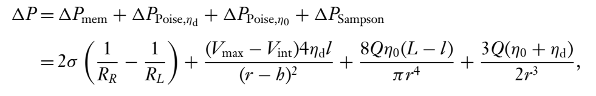

在$\Delta P_{mem}\ll \min(\Delta P_{Poise,\eta_d}, \Delta P_{Poise,\eta_0})$的极限下，归一化的无量纲通过时间$\overline t_{  T}=\frac{t_T\Delta P}{\eta_d}$可以通过以下计算：

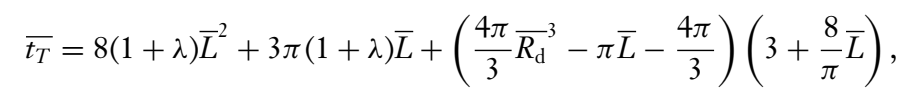

其中$\lambda=\eta_0/\eta_d, \overline{L}=L/r, \overline{R_d}=R_d/r, R_d=(3V_d/4\pi)^{1/3}$。当然后面也有对$\Delta P_{mem}\sim \min(\Delta P_{Poise,\eta_d}, \Delta P_{Poise,\eta_0})$的讨论，就不在这里继续记录

-引：类似于无限长圆柱形通道中紧密贴合的囊泡的情况，$\Delta P_c$是通道几何形状（孔隙半径）和液滴（体积）的函数。然而，当其对应于$\Delta P_c$的通过张力高于裂解张力时，囊泡膜（表面积恒定）破裂。因此，只有表面积较大（因此通过的最小张力较低）的囊泡才能挤进去。对于锥形狭窄收缩，收缩颈的大小和约束梯度决定了数值模拟中囊泡通过的条件，但文献中没有针对这种收缩几何形状中囊泡膜的匹配渐近计算。

**总之，对于这种液滴、囊泡通过狭窄通道，有一些渐进匹配计算的理论工作，但还不是很完善。**

-浸没边界（IB）方法在模拟流体-结构相互作用中很受欢迎，但很少用于模拟细胞通过极窄收缩的动力学。IB方法在捕捉膜动力学方面的精度较低，需要非常精细的网格来解决膜和壁之间的软润滑流动问题。

## Global stability of flowing red blood cell trains

引：细胞运动学和细胞列的稳定性对细胞壁相互作用很重要，包括无细胞层的形成[28-31]、白细胞和其他颗粒的边缘化[32-36]、靶向药物递送和运输[37]，以及在血管生成[38]、发育[3,37,39]和肿瘤生长[40]中被认为重要的血流动力。也许最重要的是，细胞系的稳定性特性可能会为用于处理血细胞的微流体装置的设计提供信息，在这种装置中，规则的细胞列似乎可以简化任何细胞特异性的处理。

红细胞表面用球谐展开系数$\mathbf{s}=\{a_{nm}^{(j)},b_{nm}^{(j)}\}$，定义扰动$\mathbf{\varepsilon}(t)=\mathbf{s}(t)-\mathbf{s_b}(t)$，其中同时包含了整体平移/倾斜（低阶模态）和形状起皱（高阶模态）。下标b表示匀速整体平移、形状保持周期稳定的构型。整体的扰动幅度：

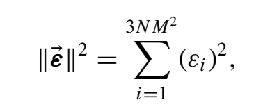

膜面离散点满足：

$$\frac{d\mathbf{\hat x}}{dt}=\mathbf{\hat u}(\mathbf{\hat x})$$

也就是说$\mathbf{\hat u}$是把位置对应到速度的一个非线性算子。同时膜格点位置存在球谐变换：

$$\mathbf{\hat x}=B\mathbf{\hat s}, \mathbf{\hat s}=\hat B\mathbf{\hat x}$$

于是对于球谐展开系数的扰动$\mathbf{\hat\delta}$，可以有展开：

$$\mathbf{\hat u}(\mathbf{\hat x}+B\mathbf{\hat\delta})=\mathbf{\hat u}(\mathbf{\hat x})+CB\mathbf{\hat\delta}+O(\|(B\mathbf{\delta})\|^2)$$

$C$就是$\partial \mathbf{\hat x}/\partial x$。上式两端同时左乘$\hat B$：

$$A\mathbf{\hat\delta}=\hat B\mathbf{\hat u}(\mathbf{\hat x}+B\mathbf{\hat\delta})-\hat B\mathbf{\hat u}(\mathbf{\hat x})$$

其中$A=\hat BCB$，表示基态与扰动的所有一阶耦合。由上：$\frac{d\mathbf{\varepsilon}}{dt}=\dot{\mathbf{\hat s}}-\dot{\mathbf{\hat s_b}}=B\dot{\mathbf{\hat x}}-B\dot{\mathbf{\hat x_b}}=\hat B\mathbf{\hat u}(\mathbf{\hat x_b}+B\mathbf{\varepsilon})-\hat B\mathbf{\hat u}(\mathbf{\hat x_b})=A\mathbf{\varepsilon}$。对于初态$\mathbf{\varepsilon}(0)=\mathbf{\varepsilon}_0$，有准确解$\mathbf{\varepsilon}=\exp{(At)}\mathbf{\varepsilon}_0$

**用A特征值的最大实部来定义长时间增长率$\alpha$，谱横坐标（spectral abscissa）**：

$$\alpha=\max\{Re[\lambda(A)]\}$$

- $\alpha>0$：线性不稳定
- $\alpha<0$：长时间稳定
- $\alpha\approx 0$：中性稳定

上图是某个两体系统的A的特征值，多数实部为负，符合对于粘性系统的认识。

文中强调A是非正规（nonnormal）的，因为A非正规时，特征向量一般不正交，模式之间会“相互投影/干涉”。这带来一个很反直觉的现象：即使所有特征值实部都 ≤ 0（渐近稳定），也可能在短时间内出现很强的“瞬态放大”。所以“最大实部特征值”并不一定代表“任何时刻的最大增长率”。**瞬态的增长上界由对称部分$(A+A^T)/2$的最大特征值确定：**

$$\frac{d}{dt}\|\varepsilon\|^2=\frac{d}{dt}(\varepsilon^T\varepsilon)=2\varepsilon^T\dot\varepsilon=2\varepsilon^TA\varepsilon$$

将A分为对称部分和反对称部分：

$$A=\frac{A+A^T}{2}+\frac{A-A^T}{2}=S+K$$

反对称部分满足$\varepsilon^TK\varepsilon$，它并不会改变范数幅值，因此：

$$\frac{d}{dt}\|\varepsilon\|^2=2\varepsilon^T\dot\varepsilon=2\varepsilon^TS\varepsilon$$

上式两边同除以$\|\varepsilon\|^2$：

$$\frac{d}{dt}\ln\|\varepsilon\|=\frac{1}{\|\varepsilon\|^2}\varepsilon^TS\varepsilon$$

右边是对称矩阵$S$的Rayleigh商，对于任意非零$\varepsilon$，都有：

$$\frac{\varepsilon^TS\varepsilon}{\varepsilon^T\varepsilon}\le\lambda_{max}(S)$$

于是对于任意初始扰动，$t=0$时刻的瞬时增长率都满足：

$$\frac{d}{dt}\ln\|\varepsilon\| \Big|_{t=0}\leq\lambda_{max}(S)=\eta$$

上图为一个两体的基准算例，初始扰动选取为最瞬态放大方向$v_{\eta}$时（模型预测与DNS，B, C），产生非单调行为：放大持续很短时间，随后衰减；长期的不稳定模态由$v_{\alpha}$决定（D,E）。

### Results

定义$\phi=r_0N/L$

**$\lambda=1$，渐进行为**

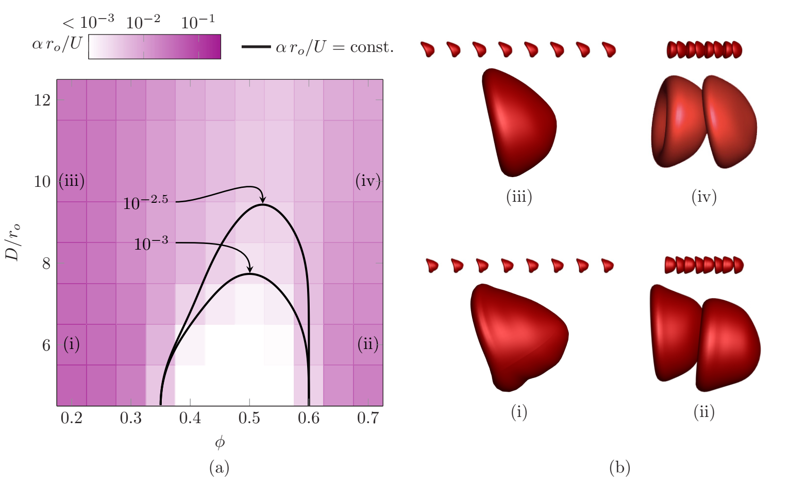

对于$\phi=0.2$，系统总是不稳定的。在更大的D下，$\alpha$有相对更小的值，这说明壁面与细胞之间的作用力造成弱失稳。同样，对于拥挤的算例$\phi=0.7$系统也总是不稳定的；而对于中等的$\phi$，扰动增长得到抑制，如对于$D\lesssim 10, 0.4\gtrsim\phi\gtrsim 0.55$，有$\alpha<10^{-3}U/r_0$，相对稳定，事实上此时由于数值近似无法分辨出其与$\alpha=0$的区别。

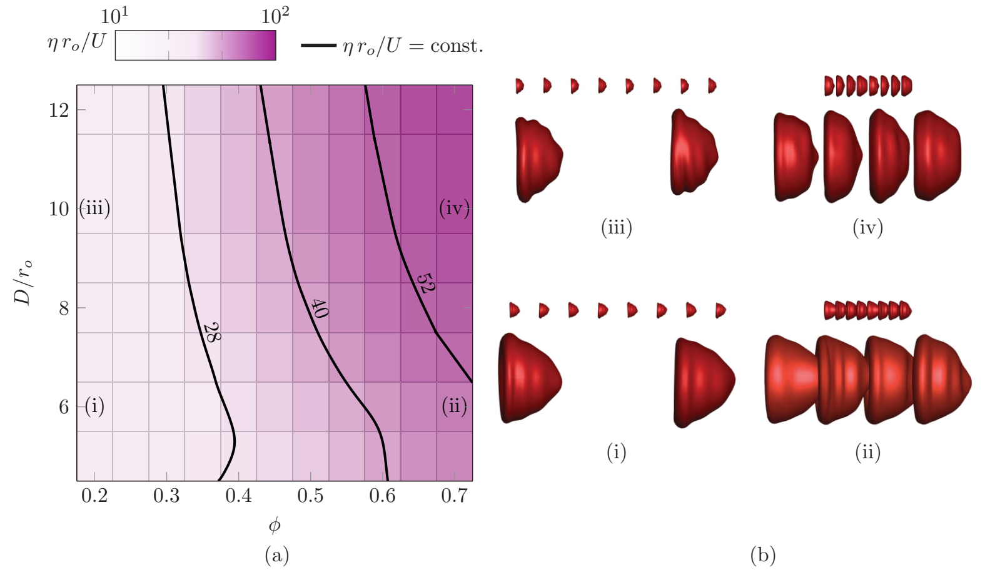

**非线性饱和**

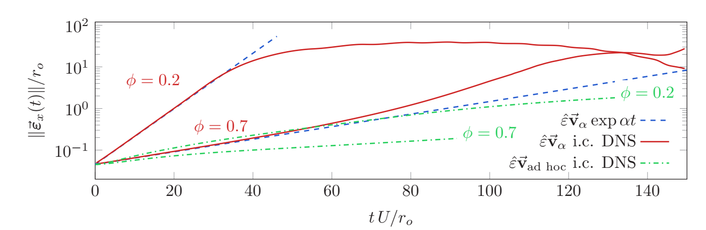

延长系统发展时间，当扰动到一定量级时，扰动增长开始偏离指数关系，非线性效应产生效果。此处$D=10r_0$，$\phi=0.7$比$\phi=0.2$的情况更早进入非线性阶段。较稀疏情况阈值更大是因为要触发较强的cell-cell相互作用需要更大的流向位移。$v_{ad hoc}$对应的扰动是随意移动每个细胞产生的，而非变形，它的放大更慢。

- 初始扰动让细胞发生倾斜 + 横向位移，而且呈现“两细胞一个波长”的结构，把细胞推得更靠近管壁（$tU/r_0\leq 61$）；

- 因为近壁区域流速更低，细胞会被减速并发生旋转，甚至出现相邻细胞（图里标 A、B）反向旋转；整体形成类似实验里见到的 staggered（交错）列；

- 旋转进一步增大后，细胞变成 slipper-like，而且出现“隔一个细胞方向相反”的交替取向（$tU/r_0\sim 72$）；最后这种结构解体，演化到明显无序的状态，作者推测是二次失稳导致。

**粘度比$\lambda$的影响**

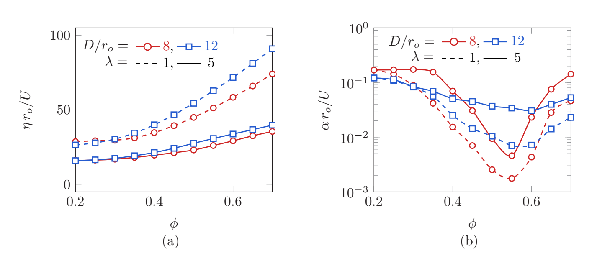

从$\lambda=1$到$\lambda=5$，瞬时放大倍率$\eta$减少了大约一半；而对于$\alpha$，$\lambda=5$普遍大于$\lambda=1$，特别是在大$\phi$下。

当$\lambda\gtrsim 20$时，细胞在稳定性层面表现得像刚体。当细胞密度更大时（左0.2，右0.7），其稳定性表现出对于$\lambda$更强的敏感度。分别使用$|\Omega-\omega|$和$|\omega|$表示tank treading 和tumbling的强度（具体测量方法文中有写）。$\lambda\leq 20$时$\alpha$随着$\lambda$的增长与tumbling的增强有关

**流动强度（Ca）的影响**

定义$Ca=\mu U/E_s$（之前设置的都是0.66）

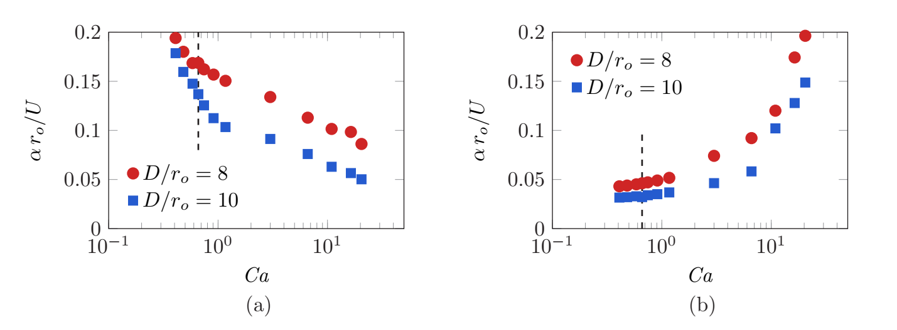

(a)$\phi=0.2$, (b)$\phi=0.7$。对于高密度的情况，较大的Ca导致更大的变形和流向延伸的细胞，这反过来又导致更小的细胞间距，增强了不稳定性；而对于低密度的情况，$\alpha$随着$Ca$的减小，这主要归结于细胞-管壁之间的相互作用。

**细胞体积的影响**

引：患病或感染的红细胞也经常具有改变的形状。镰状或贫血细胞的体积减少，而椭圆细胞和球形细胞的体积增加，因此它们在细胞列中的稳定性在用于识别、分析或处理它们的微流体设备中可能尤为重要。众所周知，这种患病或转化的细胞可以改变受限的流动。更一般地说，人造细胞状胶囊可以制造出各种体积。

之前设置的reduced volume$\nu=V/V_0=0.64$，对应于健康的红细胞。

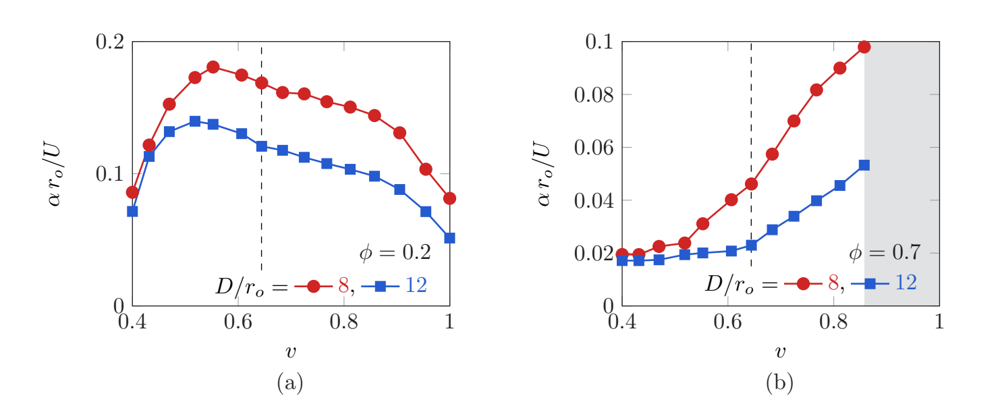

上图统一$\lambda=1$

**细胞-细胞与细胞-管壁的相互作用**

为了量化细胞间相互作用以及由此产生的细胞壁流体动力学相互作用对细胞列稳定性的影响，我们改变了A，从而去除了上游和下游最近的$\widetilde{N}$个细胞之间相互作用（直接变为0）。比如$N=8,\widetilde{N}=4$，此时只包含自己对自己的作用以及管壁的作用。

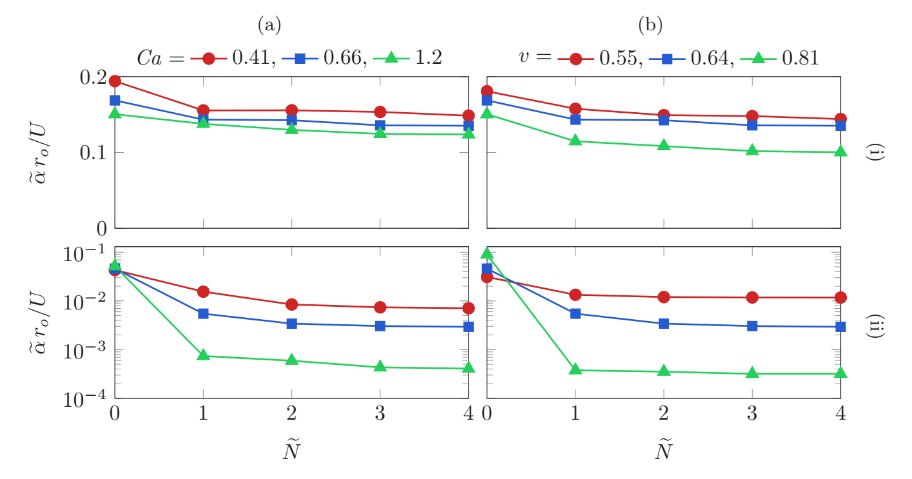

(1)$\phi=0.2,(2)$\phio=0.7$。(a)$\nu=0.64$, (b)$Ca=0.66$。只去除最相邻的细胞（$\widetilde{N}=1$）时，对于$\phi=0.7$时（特别是高$Ca, \nu$，它们都对应于更小的细胞膜距离），系统稳定性增强很明显。这说明最近邻相互作用是不稳定的原因。对于$\phi=0.2$来说，这种效果就比较弱了，说明壁面效应更加重要。

这篇文章还从应变能扰动角度进行了分析。

## Simulated Two-dimensional Red Blood Cell Motion, Deformation, and Partitioning in Microvessel Bifurcations

考虑分叉中的单个细胞，排除细胞间相互作用的影响。

子通道1的流量分数$\Psi_1=Q_1/Q_0$，规定连接处圆弧半径$r_1=r_2=r_0=3\mu m$，每根管道长度都满足$Lv_0=Lv_1=Lv_2=5w_0/2$。分叉角度由$\beta_1, \beta_2$表示，子通道直径比为$r_d=w_1/w_2$。以下研究管道大小$w_0$，流量分数$\Psi$以及管道几何$\beta_1, \beta_2, r_d$对于红细胞分布的影响。

引：动脉管道大致遵循$w_0^3=w_1^3+w_2^3$的关系。对于确定的$w_0$和$r_d$，就能确定子管道的宽度。总流量确定为$Q_0=125W_0^2s^{-1}$。细胞初始位置保证其膜格点与管壁之间的距离至少为$w_{CFL}$。细胞初始形状设置为圆形，以防止非圆形形状带来的横向位移。

上图(a)为$\Psi=0.25，w_0=8\mu m, r_d=1, y_0=1.24\mu m$参数设置下的仿真结果。细胞首先从初始的圆形形状转变为类似于观察到的形状的不对称形状。在到达分叉处时，细胞变形为沙袋状形状，横跨两个管道。图b显示了在体内观察到的类似形状（引）。

(c)中实线为细胞质心运动轨迹（细胞流线），虚线为流线。比较最外侧的两类流线，可以发现细胞往中心迁移的趋势。比较中心处的两种流线，也有不同之处：比如细胞流线进入分支1，液体流线进入分支2。**迁移效应**：因为中心线位置的流场流线更容易进入高流量的子管道中，再结合由于变形性造成的细胞向中心迁移，所以软颗粒更容易随之进入高流量分支（这一点在刚体颗粒上是不存在的，见下）。**阻塞效应**：对于与细胞尺寸相近的管道，颗粒在分叉处会产生阻塞效果（这一点刚体强于变形体），由于子管道中的流量均由边界条件确定，细胞的阻塞会导致该处的压差增大（低流量分支压强增大明显更强，因为它被挡住的流线百分比更多），于是更容易进入低流量分支。

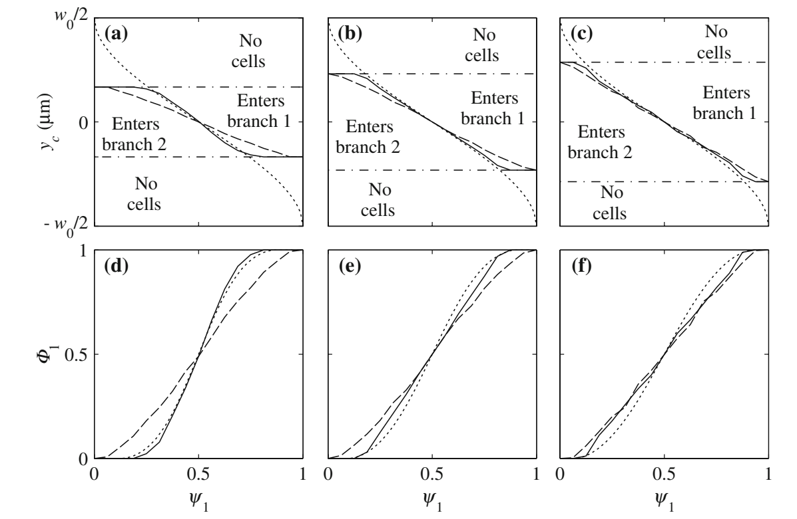

$y_c$为发生分离的临界初始细胞质心横向位置。(a,d) $w_0=8\mu m$, (b,e) $w_0=10.08\mu m$ (c,f) $w_0=12.80\mu m$。实线为可变性细胞，长虚线为刚体，短虚线表示流线分离临界位置。对于$\Psi<0.5$，刚体颗粒可以进入branch1的范围更大，同时通过曲线偏离对比，可以发现刚体颗粒与流线的偏离程度更大。随着母管径的增大，三者之间的偏差减小。$\Phi$为文中定义的红细胞流百分比，相比于刚体颗粒，软颗粒更容易出现分布不均匀的现象（下面三张图里的短虚线是实验结果）。以上结果左右对称，显然是对应相同大小的子管道。

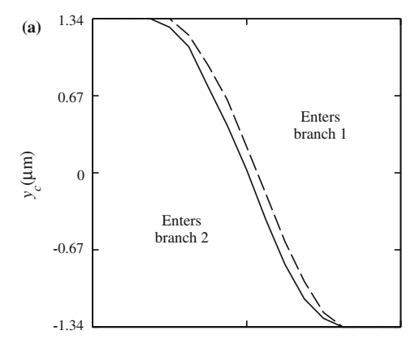

实线为子管道相同大小的结果，虚线$r_d=1.44$。管径的不对称使曲线向右偏移，导致细胞更容易进入branch2（即更小的管道中）。

实线为子管道偏转角度大小相同的结果，虚线为上面所示的T形管（偏转角度不同）。细胞并没有表现出更容易进入哪个分支。

## Glycocalyx cleavage boosts erythrocytes aggregation

糖萼是一层复杂的碳水化合物和蛋白质分子，围绕着许多类型的哺乳动物细胞的细胞膜。它具有多种重要功能，包括细胞粘附和通讯，并维持细胞形状和稳定性，特别是对于红细胞。糖萼成分的改变对心血管健康构成威胁。例如，在糖尿病中，已知红细胞和内皮细胞的糖萼受损，这是微循环中血液闭塞的潜在来源，可能导致失明和患者肾功能衰竭。

引：在血液病、心血管疾病和糖尿病等代谢性疾病等病理条件下，可能会出现持续的红细胞聚集，这可能会导致血管闭塞和严重的健康并发症。在某些疾病中，如镰状细胞贫血，糖萼的破坏与细胞形状的改变和红细胞脆性的增加有关，导致小血管堵塞和组织供氧减少。在糖尿病中，高糖水平会影响红细胞糖萼层的结构和连续性，导致不良反应，包括红细胞刚性增加和与血管壁的粘附增强。在脑疟疾感染中，红细胞在脑微血管内积聚，导致血管闭塞。这种积累归因于活化内皮和/或RBC-RBC聚集对它们的隔离。据报告称，宇航员在与太空任务期间的胰腺淀粉酶水平有所上升。

(a)未经淀粉酶处理的红细胞；(b)经2000U/L淀粉酶处理的红细胞；(c)归一化荧光强度（表示糖萼完整度）随着淀粉酶浓度的变化。

引：正常人类血液中的淀粉酶浓度为70-235U/L，在胰腺炎这种病理情况下甚至能达到上千。

红细胞的聚集由15mg/ml浓度的葡聚糖溶液（产生与生理状况下相近的聚集）诱导产生。聚集形态（asphericity）：

$$ASP=\frac{4\pi A}{P^2}$$

A为聚集体的投影面积，P为周长。

**没有流动时的聚集体形态学**

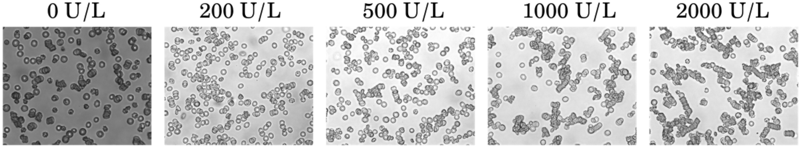

聚集体中红细胞的平均个数在正常生理情况下变化不大，然而到了活跃水平500U/L后，随着淀粉酶浓度增加而明显上升。在低淀粉酶浓度下，聚集体呈现出串钱状（rouleaux）；在高淀粉酶浓度下，更接近圆形。

**在流动中的聚集**

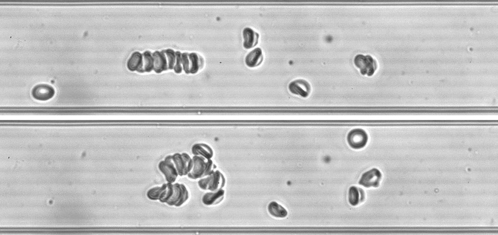

上：淀粉酶浓度为0；下：淀粉酶浓度为2000U/L

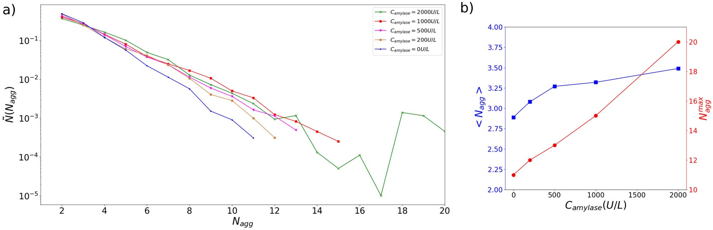

$\widetilde{N}$表示聚集体大小出现的百分比，它与聚集体大小大致呈指数衰减的关系，淀粉酶浓度基本只在大聚集体中出现作用。(b)图显示红细胞聚集体的大小大致保持在3个左右，只是随着淀粉酶浓度的增加而略微增加，这与静止流体中的结果不同；但是最大聚集体的大小则是明显上升。

**不同剪应力下红细胞聚集体的演化**

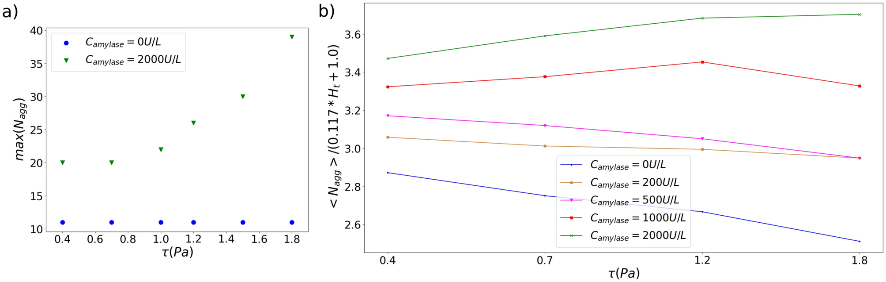

实验中发现最大聚集体的大小随着剪切应力的提升而增大（对于淀粉酶处理的组），这一点是反直觉的——普遍认为更强的剪切作用导致聚集体分裂。但是实验中增大剪切应力伴随着的时红细胞比容的上升，增加了红细胞相互接触吸引的可能性。本文依靠数值模拟来评估红细胞压容如何影响红细胞聚集的大小，期望将密度带来的影响消去，只剩下剪切应力的作用。数值实验中发现，聚集体的平均大小与红细胞容积大致呈线性关系（$H_t\sim5-30\%，流体环境静止$），将数值实验的数据进行拟合，体外实验中测得的最大聚集体大小除以对应红细胞浓度下的平均大小（见b）。首先聚集体的大小随着淀粉酶浓度增加而增加；其次，对于未经淀粉酶处理的红细胞，聚集体大小随着剪切应力增加而减小，这一现象随着淀粉酶浓度的增大而逐渐减小甚至消失。也就是说淀粉酶处理的红细胞聚集体对剪切应力解体的抵抗力增强。

更大的红细胞聚集体ASP指数更小，更表现出串钱状，这一点与淀粉酶无关；对于给定大小的聚集体，未经淀粉酶处理的ASP随着剪切应力的增加而明显下降（更低程度的各向同性聚集），而经2000U/L淀粉酶处理的ASP对于剪切应力的敏感性要小得多。

使用数值仿真模拟了淀粉酶的作用（改变粘附力的大小）：

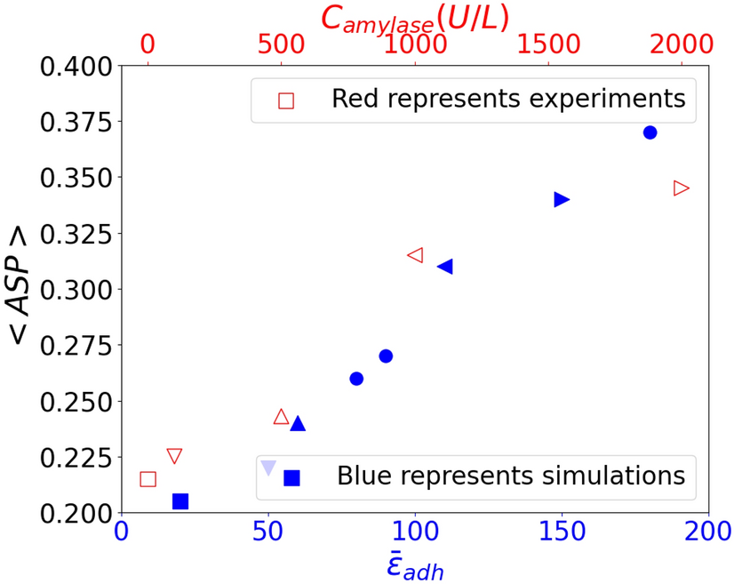

$\overline{\varepsilon_{adh}}=80$以上为病理情况。

## Partitioning of red blood cell aggregates in bifurcating microscale flows

引：虽然人们普遍认为，在健康的循环中，剪切力相对较高，可以最大限度地减少红细胞聚集，并确保低流动阻力，但最近的证据表明，聚集物在整个微血管中持续存在，这意味着微血管网络中的红细胞分布和血液灌注可能会受到这种现象强度的影响。事实上，在最近的一项研究中，研究了红细胞聚集对通过人工微血管网络的血流的影响，发现毛细血管红细胞压积明显增加。

引：在许多病理条件下观察到强烈的红细胞聚集和高粘度综合征，改变了血液的运输特性。这些疾病包括败血症、镰状细胞贫血、阿尔茨海默病、糖尿病和风湿病。然而，红细胞聚集和高粘度综合征在血管阻力中的作用尚不清楚。例如，尽管高粘度会增加流动阻力，被认为会造成局部损伤（例如在青光眼的某些情况下阻碍视神经的血流），但由于一氧化氮的产生，它也可能导致血管管腔直径的增加，降低阻力。此外，关于红细胞聚集在全器官灌注中的影响的体内实验表明，聚集现象对血管阻力有非单调的影响。

CDL: cell depleted layer.就是cfl，由于细胞向管道中心横向移动造成的无细胞层。

引：最近，Sherwood等人详细研究了红细胞聚集对T形连接微通道中流动的CDL的影响。发现红细胞聚集a）独立地增加了CDL的宽度和粗糙度，与分叉中的流动分配相结合，进一步扩大了CDL。

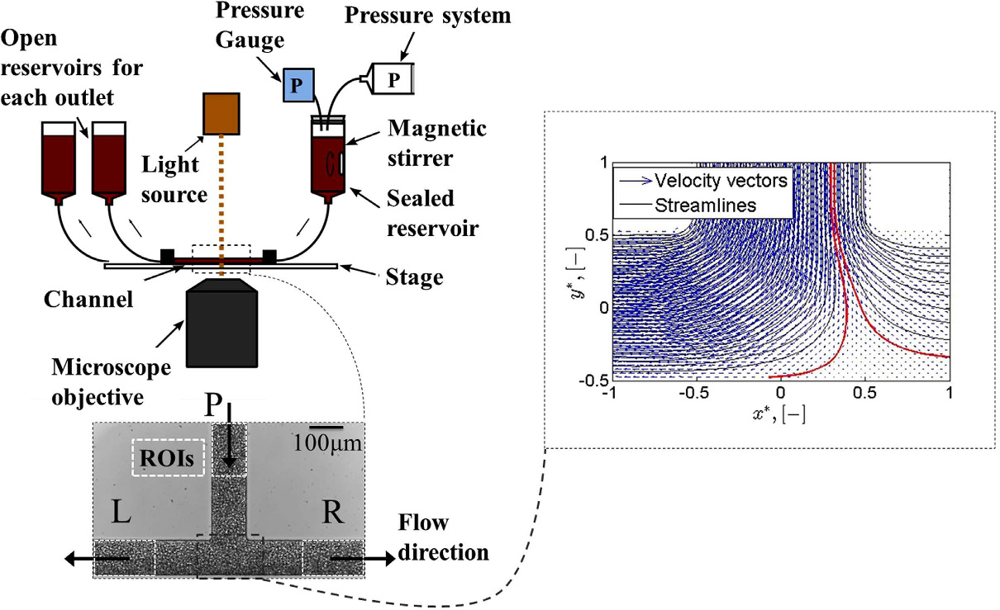

管道宽度$W=10\mu m$，深度$D=40\mu m$。子通道中的流量通过调节出口蓄水袋的高度差来调节。$x^*=x/W, y^*=y/W$。右图中的流线图对应的是$Q*=Q_P/Q_D\sim0.13$的情况。

**聚集体大小分布和红细胞压积**

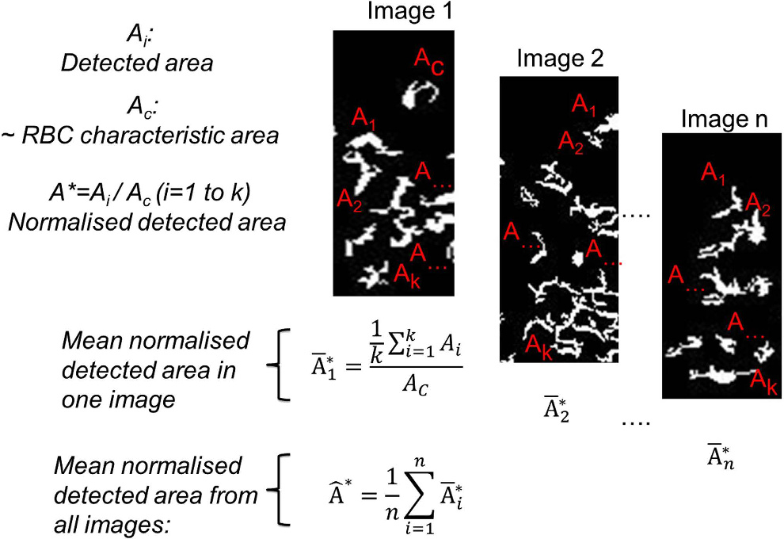

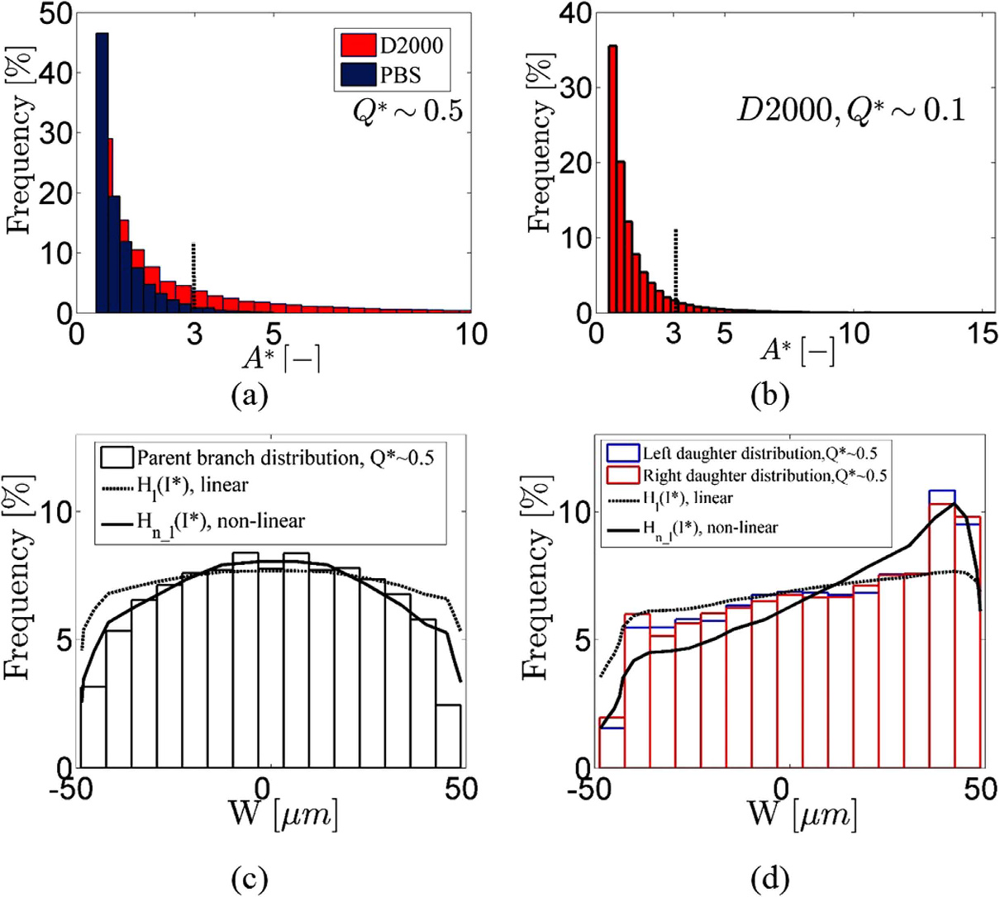

红细胞聚集的例子中，平均结构大小大致是单个红细胞的2倍（$Q^*\sim 0.5, \hat{A^*}=1.90; Q^*\sim 0.1, \hat{A^*}=1.88$）。(a)(b)中虚线表示检测到的单个红细胞最大面积；(c)(d)各种结构的空间分布，虚线实线分别为别的文献中给出的基于强度的红细胞压积曲线（用明场图象的灰度来反推局部红细胞体积分数）

**流量比的影响**

T连接处聚集体的大小随流量比变化。(a)非聚集情况下，$\hat{A^*}$并不会随着$Q^*$有明显变化；(b)而对于会聚集的D2000处理下的case，存在变化（需要注意的是，这里$Q^*<0.5$对应的是右侧子通道$Q_R^*$，$Q^*>0.5$对应左侧子通道$Q_L^*$，），$Q^*$越小，$\hat{A}$越小，在$Q^*=0.5$时取到最大值。进一步将连接处的聚集体大小使用母管道中聚集体的平均尺寸归一化，得到(c)(d)。对于聚集情况：1、当$Q^*\gtrsim 0.2$时，子支路的聚集体平均尺寸比母管道高约$10\%-20\%$（$A_n^*>1$），这是由更小的剪切应力造成的；2、低流量比情况下（$Q^*\lesssim 0.2$），反而出现$A_n^*<1$的情况，也就是聚集体经历连接处变少了，这是比较反直觉的，因为低流量的子管道中剪切力更小。以下是对此的解释：低$Q^*$的支路从母管道分到的那部分流体主要靠近壁面（aggregate-depleted region），而大聚集体往往被壁面升力推向中心线（见下一部分）。

引入了一个size-flow parameter$F_A^*=Q^*A^*$（见e），当$Q^*>0.3$时，曲线偏离没有偏好的$F_A^*=Q^*$曲线，这也同样说明高流量的子通路里富集这更大尺寸的聚集体。

**管道中聚集体的区域划分**

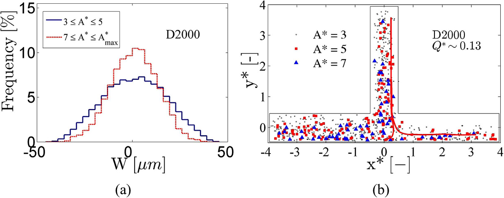

**流量比对于聚集体区域化分的影响**

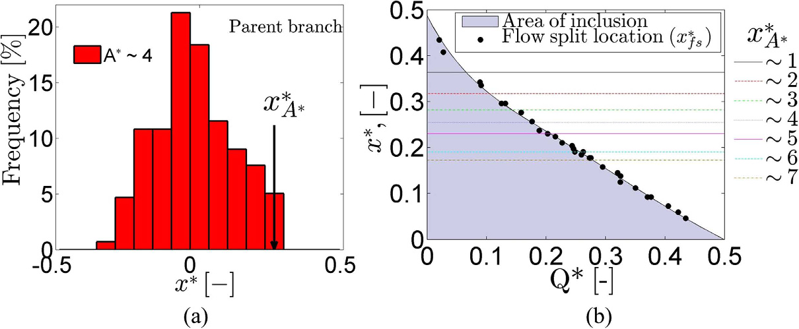

$x_A^*$为某一尺寸聚集体的极限位置（最靠近壁面的5\%），$x_{fs}^*$表示流体的分流分界线。见b，对于某个特定的$Q^*$，如果$x_A^*<x_{fs}^*$（更靠近中心），那么该尺寸的聚集体就不可能进入该子分支。

以上所示的聚集物尺寸分配行为可能有助于解释为什么红细胞聚集的影响在体内血管阻力方面没有预期的那么有害；进入低流速（因此平均剪切速率低）分支的较小聚集体，再加上这些区域较低的红细胞压积，意味着分支中的整体粘度也将保持较低。此外，由于氧气灌注主要发生在毛细血管水平，如本研究所发现的，大CDL和低流速的大规模分支中聚集细胞的低浓度将有助于促进血流。这里应该注意的是，低流量分支中细胞和聚集体的浓度强烈偏向壁，即在流速较低但剪切力较高的区域。这可能有助于减小分支中聚集物的大小。

## Clusters of red blood cells in microcapillary flow: hydrodynamic versus macromolecule induced interaction

-引：静止状态下，红细胞的直径为$7.5-8.7\mu m$，厚度$1.7-2.2\mu m$，其中溶质的粘度在37℃下为$\eta_{in}=5mPa$。其膜由厚度约为$4nm$的自组装流体脂质双层和称为细胞骨架的附着蛋白质网络组成。膜上的局部和全局面积变化很小，因此可以将膜视为二维不可压缩材料。此外，红细胞膜的弹性归因于内部附着的蛋白质网络，因此需要两种独立的变形模式来描述其弹性状态：恒定表面积下的简单剪切和平面外弯曲。决定红细胞变形性的其他重要因素包括红细胞膜的粘度、细胞细胞质与其悬浮介质之间的粘度比，以及红细胞体积与表面积的比值，其中大面积的细胞面积过剩（与相同体积的球体面积相比，面积更大）促进了高变形性。通过这种方式，红细胞可以挤过直径小至$2\mu m$的毛细血管。

-引：健康情况下，纤维蛋白原的典型粘附能浓度约为$5\mu J\cdot m^{-2}$。

-本文使用葡聚糖来模拟纤维蛋白的作用

-引：不同聚合物或蛋白质作用下红细胞的聚集和分离可能具有不同的表现，众所周知，葡聚糖吸附在红细胞表面，在一定程度上改变了其弹性。

-$20mg ml^{-1}$dextran 70，$\epsilon=4.8\mu J m^{-2}$，$20mg ml^{-1}$dextran 150，$\epsilon=12\mu J m^{-2}$。实验管道横。BS：base solution

-引：如果两个细胞的中心距小于或等于单个细胞长度的1.5倍，则将它们视为簇的一部分。然而，这一价值是经过启发式选择的，而不是基于理论考虑。此外，由于我们总是考虑实际细胞的长度随着流动强度的增加而变得越来越长，因此簇长度的定义随着流动强度而变化。然而，我们下面对簇长分布的测量概率密度函数的统计分析为这个简单的定义提供了后验证明

-使用Lennard-Jones potential（讲了一大堆说明depletion model的正确性）
$$\phi=-2(\frac{h}{r_{ij}})^6+(\frac{h}{r_{ij}})^{12}$$
取$r=480nm$

-由于大分子会诱导红细胞在存储器中聚集沉淀，$20mPa$的小压力下只有BS才能正常进行试验

n：type n指的是一簇RBCS中包含n个红细胞。$\Delta P=100mPa$。BS溶液中，红细胞呈中心对称的降落伞型或者鞋型，一簇之中包含的细胞互相明确分开；而对于BS+Dex70，多数细胞紧密吸附，并呈现出降落伞型；在BS+Dex150中，甚至出现了子弹型。

$0, 1, 2, 10$代表细胞进入管道深度，随着进入深度的增加，细胞簇中包含的细胞普遍增加。加入大分子的溶液在0-1之间部分簇有发生分裂。高压强导致添加大分子的溶液中出现了许多独立的细胞

$\Delta P=100mPa$，分别在点1，2，10测量，图中展示中位数

-不同溶液中细胞簇长度差异是显著的，这是两个相反效应的结果：BS溶液中簇中的细胞呈降落伞状，但细胞间距离有限，而含有大分子的溶液中的细胞更细长，但彼此紧密相连。BS+Dex150的细胞膜距离在不同的簇type下大致为0。随着压差的增大，细胞簇长度由于变形加剧而增长。

-引：众所周知，BS+Dex70和BS+Dex150溶液中的红细胞在静止状态下细胞膜距离大致为25nm。在本实验中，黏附造成的细胞簇被定义为明显细胞膜距离接近零的细胞簇，此外就是流动力造成的细胞簇。随着压差的增大，流动力类型的细胞簇增加。

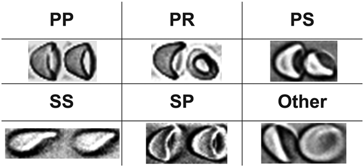

-本文的2维仿真工作使用半径为$3\mu m$的两个红细胞，归一化面积为$\tau=0.65$，上下管道间距$12\mu m$，$kappa=4\times10^{-19}J, \eta_{in}=5mPa$。使用Lennard-Jones potential模仿细胞间的作用力：对于BS+Dex70，$\varepsilon_{Dex70}=4.8\mu Jm^{-2}$；对于BS+Dex150，$\varepsilon_{Dex150}=12\mu Jm^{-2}$（引）

-本文的仿真工作发现如果提升流速，水动力造成的细胞簇会占据主导地位

-本文花费较多篇幅讨论type2不同簇长度的出现概率（发现了双峰现象），讨论了流动力造成的细胞簇以及吸附力造成的细胞簇的出现概率，并统计了不同情况下的细胞对形态。

## Red blood cell clustering in Poiseuille microcapillary flow

引：堆积红细胞结构的形成起着重要的生理作用，是导致血液非牛顿行为的主要因素之一，特别是在低剪切速率下粘度的增加。后者与凝血和血栓形成有关，这可能是由于血管阻塞

引：应该注意的是，红细胞也可以通过化学信号传导促进血小板聚集，例如在低$pO_2$、低pH值和机械变形下释放ATP和ADP。

引：红细胞簇的形成被归因于沿通道行进的较慢细胞，这些细胞会减缓较快细胞的速度，从而产生一系列尾随细胞。在白细胞存在的情况下，这种效应已被清楚地观察到。相比于红细胞，白细胞更大、变形能力差，。白细胞在血管约束下移动速度明显要慢很多，被发现处于红细胞簇的前方。

-引：健康血液测试中测得的Ht值较高（约45%）与大血管有关，而从大血管到微血管时，Ht因入口效应和红细胞的不均匀径向分布而降低，红细胞倾向于沿中心线集中（所谓的Fahraeus-Lindqvist效应）

-我们将RBC簇视为长度为L的细胞串，其中任何一对连续细胞之间的间隙d等于或小于1.5D，其中D是单个细胞的特征长度。D取决于施加的压降，范围在$6至10\mu m$之间

箭头所指细胞是同一个

-细胞簇长度在$\Delta P=50mmHg$达到峰值，可以假设，这种峰值水平对应于这样一个事实，即即使孤立RBC的变形增加，簇中的平均细胞间距离d在临界$\Delta P$值以上保持不变。这个上限值可以表示为$L/(N_{RBC}-1)$，对应$N_{RBC}=2, 4, 6$分别等于$14.7, 13.1, 12.6\mu m$。这一点在后续的实验中也有证明。

-在较小的压差下，d与细胞数$N_{RBC}$无关。对于较大的压差（80mmHg），在较大的细胞簇中（$N_{RBC}\geq5$）,发现d随着细胞数而略微减小。这可能是由于高压差下大细胞簇中的挤压。

-变形参数$DI$，定义为包围细胞体的边界框的纵横比

-研究了进出口以及中间位置细胞簇大小与施加压强的关系，发现入口处细胞簇中细胞的数量与压强无关

-实验结果表明，红细胞速度和簇大小没有显著相关性。此外，红细胞簇和单个红细胞速度之间的差异在1%以内

-仿真设置：$\nu=0.7, Ca=\mu v_{max}r^2/k$，其中$\mu$是水的粘度，r代表管道半径，k是RBC的弯曲模量，取为$10^{-19}N/m$

-引：文献中提到，由于红细胞的大小多分散性，形成了簇。由于最大的细胞具有较低的速度，它们会减缓运动较快的细胞，从而引发细胞聚集。然而本文的实验和仿真结果表明，即使细胞尺寸都一致，也能形成稳定的细胞簇

-本文还研究了不同细胞尺寸对于细胞簇稳定性的影响，将一个较小的细胞置于最前方，下表为保持单一稳定细胞簇要求的最小细胞尺寸。

-引：这些结果很有趣，因为红细胞半径分布的标准偏差约为4%（体积偏差为11%-15%），这确实与文献中的值一致（据报道，细胞体积的标准偏差等于16%）。

## Simulated Red Blood Cell Motion in Microvessel Bifurcations: Effects of Cell–Cell Interactions on Cell Partitioning

引：红细胞压积在分叉处的分布对微血管网络的功能行为具有重要意义。（i）微血管中血液的有效粘度敏感地取决于红细胞压积。2因此，红细胞压比的分配会影响血管流速。（ii）血细胞比容分配的流量依赖性导致网络中流量和血细胞比积之间呈正相关，这反过来又导致平均网络血细胞比积的降低。（iii）血液主要以红细胞内氧合血红蛋白的形式携带氧气。因此，氧运输受到红细胞压积分布的强烈影响。在肿瘤微循环中，观察到相对较高比例的低或零血细胞比容微血管，导致肿瘤缺氧的发展。（iv）血细胞比积分配对流速的依赖性，而流速本身又取决于红细胞比容，导致非线性耦合系统，显示出包括振荡行为在内的复杂动力学。（v）红细胞已被证明通过以取决于氧合血红蛋白饱和度的速率释放ATP在血流的代谢调节中发挥作用。由于该机制产生的信号取决于红细胞压积，因此它受到分叉处红细胞压比分配的影响。

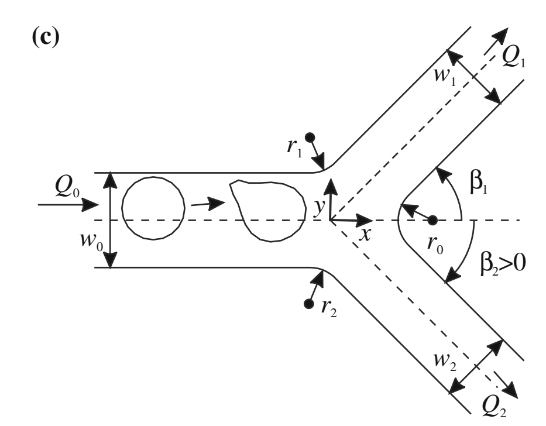

子通道1的流量分数$\Psi_1=Q_1/Q_0$，假设进入子血管的红细胞对于流速的影响可以忽略不计，因为子分支中单个细胞产生的流动阻力与分叉下游血管的总阻力相比很小。仿真基于对称的分叉进行：$w_0=8\mu m, w_1=w_2=6.33\mu m, \beta_1=\beta_2=45\degree,Q_0=8\mu m^2/ms$，以下结果由$\Psi=Q_1/Q_0=1/8, 3/4, 3/8,1/2$得到。

细胞初始化为$R=2.66\mu m$的圆形（距离分叉处$-15\mu m$，初始质心位置范围为$[y_b,y_t], y_b=-1.33\mu m, y_t=1.33\mu m$，前侧细胞质心位置记为$y_{0f}$，后侧$y_{0b}$。两细胞放置时间间隔为$\Delta t_0

对于单个细胞，“分支函数”可以定义为：

其中第一个下标代表进入分支1（及上分支），第二个下标代表1个细胞。

对于两细胞的系统，由一个三元数组决定$(y_{0b},y_{0f},\Delta t_0)$，分支函数：

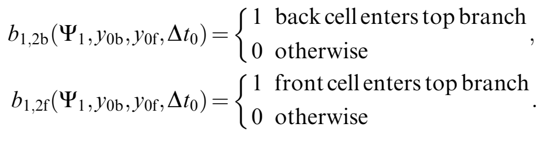

对于每一个分流系数$\Psi$和延迟时间$\Delta t_0$，在$y_{0b},y_{0f}$平面上可以绘制两条曲线$\Gamma_b,\Gamma_f$，划分了$b_{12}=1, b_{12}=0$两片区域。

流量分数定义如下：

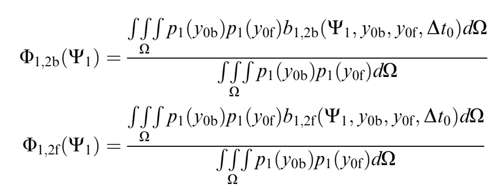

$p(y_0)$表示初始时刻细胞质心为$y_0$的概率，这里是均匀分布的。$d\Omega=dy_{0b}dy_{0f}\Delta t_0$

[如Secomb等人些的综述的笔记中最后那张图](#Blood-Flow-in-the-Microcirculation)，展示了$\Psi=3/8$的一些现象，即 trade-off, herding and following，图中展示的都是因为细胞间相互作用导致其中一个细胞进入本来不会进入的通道。根据仿真结果，可以初步得出一些结论：后侧细胞更容易受到前侧细胞的影响，而且trade-off是主要类型。

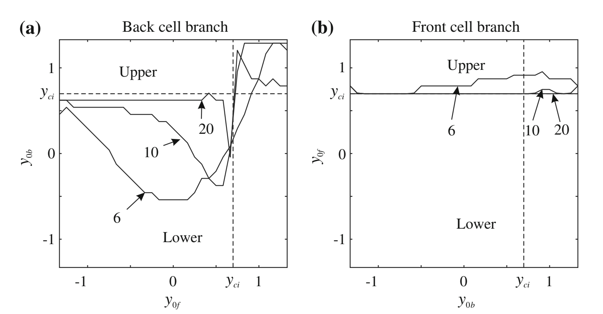

上图为$\Psi=3/8$时的结果，$\Delta t_0=6, 10, 20$，$y_{ci}$表示单个细胞的分离线，从中也可以看出细胞间的相互作用对于后侧细胞的影响比较大。

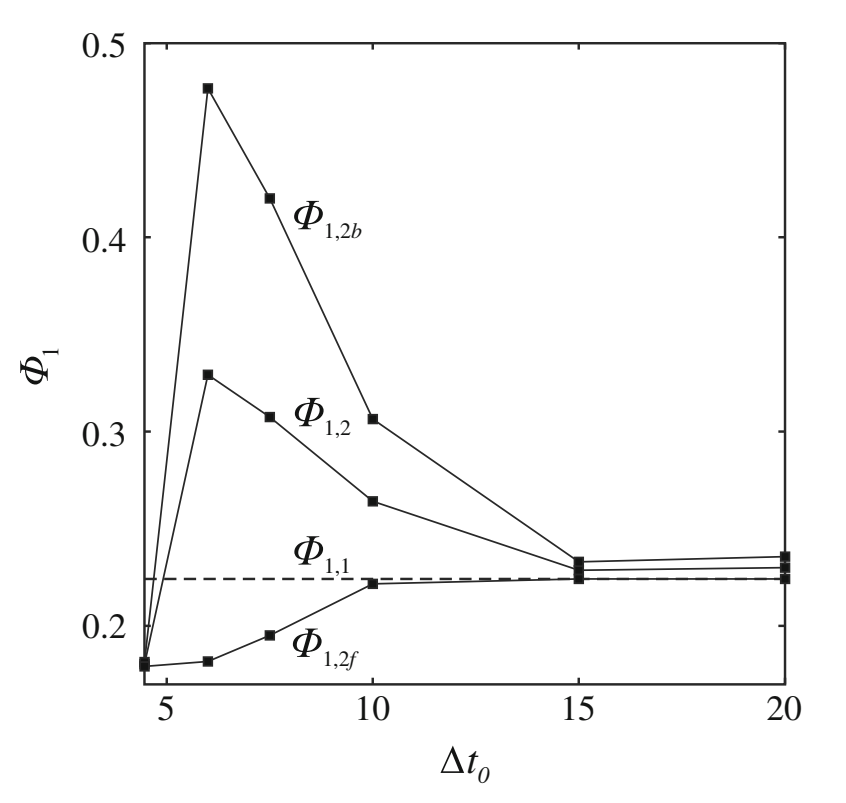

上图为$\Psi=3/8$时，前后侧细胞、两个细胞、一个细胞进入上侧分支的概率。在两个细胞很接近的时候（$\Delta t_0$较小），herding和following占了主要部分；在$\Delta t_0>6ms$时，trade-off 占主导。

与单个细胞相比，两个细胞总体来说分布更加均匀，这是由于trade-off造成的。

trade-off可以用流动连续性解释，比如说前侧细胞进入了下分支，它会带离一部分流体离开控制体，从而需要增加流入达到平衡，于是会通过原来的分离线5进入该控制体。对于herding和following，则是由于细胞之间很接近，由润滑力结合在了一起

引：根据实验结果，随着血细胞比容的增加，分叉处血细胞比积的分配通常会变得更加均匀。

# Erythrocyte-erythrocyte aggregation dynamics under shear flow

-引：在几种血液疾病中，如糖尿病和高胆固醇血症，以及冠心病，有报道称红细胞形成聚集的趋势增强[3-10]

引：Foresto等人[14]使用直接显微镜观察和数值处理比较了糖尿病患者和健康患者红细胞的聚集性。他们发现对于糖尿病患者红细胞聚集被大大增强。糖尿病、新月形红细胞症、怀孕都会导致更高的纤维蛋白

引：已有文献[15,16]表明，在这些患者（糖尿病患者）中，红细胞膜糖蛋白表面的降解（控制红细胞之间的电排斥和空间排斥）有利于聚集。因此，纤维蛋白原水平的增加和红细胞表面特性的改变（例如在糖尿病患者中）都可能导致粘附增强。

引：在太空任务期间的微重力环境下，有报道称，对宇航员血液的分析[18]显示淀粉酶活性增加。众所周知，这种酶可以部分消化细胞表面的糖萼，如红细胞和内皮细胞。这种降解促进了RBC-RBC聚集[19]及其与巨噬细胞的粘附。这突显了长期太空任务对心血管功能的潜在影响

-引：理论上已经有两种模型来描述红细胞之间的粘附机制。第一种是长期流行的桥接模型（bridging model），已被用于解释纤维蛋白原和中性葡聚糖大分子诱导的红细胞聚集[20]。该模型假设蛋白质吸附在红细胞膜上，并与附近红细胞形成交联[21]。第二种模型是耗竭模型（depletion model），指出悬浮分子（如纤维蛋白原）的构型熵在靠近红细胞表面时降低，导致耗竭层，因此当两个红细胞之间的间隙达到耗竭层的数量级时，纤维蛋白原分子在该间隙中的填充量比在其他地方少，这导致红细胞之间存在渗透吸引。

-将膜上的能量分为三类：弯曲能，膜不可拉伸部分以及吸附能。前两项在之前的文献摘要中有详细描述，第三项使用Lennard-Jones potential：
$$E_{i,j}^{adh}=\epsilon\oint_{m_i}ds\mathbf{(X_i)}\oint_{m_j}ds\mathbf{(X_j)}\phi (|\mathbf{X_i-X_j}|)\\
\phi=-2(\frac{h}{r_{ij}})^6+(\frac{h}{r_{ij}})^{12}$$
表示长程的吸引力和短程的排斥力，h是平衡距离，$\epsilon$是该距离下的最小能量

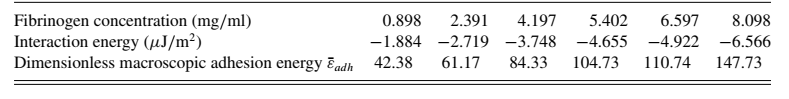

上表引用Brust2014，无量纲宏观黏附能

$$\overline\epsilon_{adh}=\frac{\epsilon_{adh}R_0^2}{\kappa}$$

取常见值$\kappa=4\times10^{19}J$，$R_0=3\mu m$。它满足$\varepsilon_{adh}\simeq1.6862h\varepsilon$

-**使用BIM**

-$\tau=0.65$

-该工作首先在通道中间制备两个囊泡，相隔一小段距离，使它们能够在没有施加流动的情况下相互粘附。一旦它们相互粘附并达到取决于粘附强度的稳态配置，就会施加剪切流。

-固定$Cn=0.4$，在该情况下，$1<\lambda<12$的范围内单个细胞都是tank-treading

- **R: rolling**

- **FR: flexible rolling**

- **RS: rolling and sliding**

- **S: separation**

- **FA: flow alligned**

$\overline{\epsilon}_{adh}=84, C_n=0.4$

方点是3D仿真结果，域剪切弹性相关的毛细管数$C_s=\eta_0\dot\gamma R_0/\mu$，其中$\mu$是细胞骨架剪切模量，$\mu\simeq4\mu N/m$，它与弯曲相关的毛细管数之比$\mu R_0^2/\kappa\simeq100$

-引：我们在[26]中看到，在小粘附力下的平衡（无流动）下，细胞-细胞界面是平的，而在足够大的粘附能下，界面变形。从扁平到变形形态是一个超临界分叉。细胞间界面的形状由细胞间接触区变形幅度$A_s$的值表征（当$A_s=0$时，接触面时平的）。$A_s$的幅值其实就是衡量doublet**手型**的指标，doublet从低吸附力下的平接触面到高吸附力下的S形接触面，即使非手性向手性的转变。同样的，剪切流也是手性的：将一个剪切流表示为$(\dot\gamma y,0)$，它可以分解成一个拉伸流动$(\dot\gamma y/2,\dot\gamma x/2)$和一个有旋流动$(\dot\gamma y/2,-\dot\gamma x/2)$，前者时非手性的，后者是手性的。因为剪切流是手性的，所以无论粘附能如何，受此流影响的doublet都是手性的。事实上，如果剪切流下的doublet形状是非手性的，那么膜和粘附力也会是非手性，而施加在非手性形状上的手性流的粘性力是手性。因此，两者不可能相互平衡。

-相比于小$\lambda$，在大$\lambda$情况下，R区域扩大，RS区域消失转变为FA。事实上，当$\lambda$增大时，囊泡长轴偏离管道中心线角度减小，flow aligned的情况下，doublet具有较小的拉伸张力，这不能有效地使两个囊泡相对于彼此滑动

-引：有人通过实验得出囊泡是通过旋转（类似于tank treading）分离的，本文通过设置较小的限制（$C_n=0.2$，这种情况下$\lambda\simeq7$时才发生tank treading 向tumbling的转变）来减少膜上的tank treading

在单个细胞tumbling的参数条件下，即使是在大$Ca$情况下，doublet都十分稳定。doublet的精确形状是粘附力和弯曲能量之间竞争决定的（分别用$\overline{\epsilon}_{adh}$和$Ca$来表征），粘附力倾向于增加囊泡-囊泡交界面积（如S形），弯曲能量倾向于最小化变形，有利于更平坦的界面。**不过试图通过绘制$Ca/\overline{\epsilon}_{adh}$和$\overline{\epsilon}_{adh}$的相图来解释，暂时不太理解**。

-引：对于一个单一的红细胞，细胞膜的tank-treading可能性取决于毛细管数$C_s=\eta_0\dot\gamma R_0/\mu$，低$C_s$下容易发生tumbling，tank-treading指挥发生在高$C_s$情况下。取$\eta$为水的粘度，$R_0\sim3\mu m$，可以得到$C_s\sim10^{-3}\dot\gamma$，对于健康的红细胞从tumbling到tank-treading的转变大致发生在$C_s\sim0.1$。在人体的血管网络中，通常认为tank-treading只发生在小动脉中（只有这里剪切率可以达到$10^3 s^{-1}$的量级。在某些红细胞疾病中，如地中海贫血[44]、镰状细胞病[45]和疟疾[46]，膜剪切模量和细胞质粘度可能明显高于健康人。对于病理细胞，膜tank-tread所需达到的剪切速率可能会显著增加[41]，因此其在体内发生的可能性不大。我们可以推测，在这种情况下，红细胞doublet和较大的聚集物变得不可逆，从而损害了组织和器官的血液灌注。

-有效粘度可以写为如下形式：
$$\eta=\eta_0(1+[\eta])$$
有效粘度是应力张量的xy分量与施加剪切速率的比值：
$$\eta=\frac{<\sigma_{xy}>}{\dot\gamma}$$
<...>表示面平均

根据Batchelor，无量纲粘度由下给出：
$$[\eta]=\frac{\eta-\eta_0}{\eta_0\phi}=\frac{1}{\eta_0A\dot\gamma}\sum_i[\int_{m_i}yf_xds+\eta_0(\lambda-1)\int_{m_i}(n_xv_y+n_yv_xds)]$$
第一项时动力学的贡献，第二项是运动学的贡献

进入R域（d），doublet接触面不随时间变化，归一化粘度振荡的振幅和周期随着粘附强度的增加而减小。

-引：已知单个囊泡同时表现出tank-treading（低比粘度）和tumbling（高比粘度）。根据粘度比，囊泡悬浮液既表现出剪切变稀，也表现出剪切增稠。对于目前所研究的参数，本文发现doublet的容易总是表现出剪切变稀的现象

（a）-（c）粘度都下降了50%，这都是doublet分离造成的。在低$Ca$的请况下，doublet发生像刚体一样的rolling；增大$Ca$导致FR，这种情况下doublet随着时间变得扁平；类似的，RS下doublet在于流动对齐上花费一些时间，FA下粘度随着剪切率变化保持一个常数，这是因为构型的稳定。

（d）中的高$Ca$区出现反直觉的现象：低的吸附能反而造成高粘度，这是因为此时从囊泡伸出多余的尾部，导致横截面积增加

