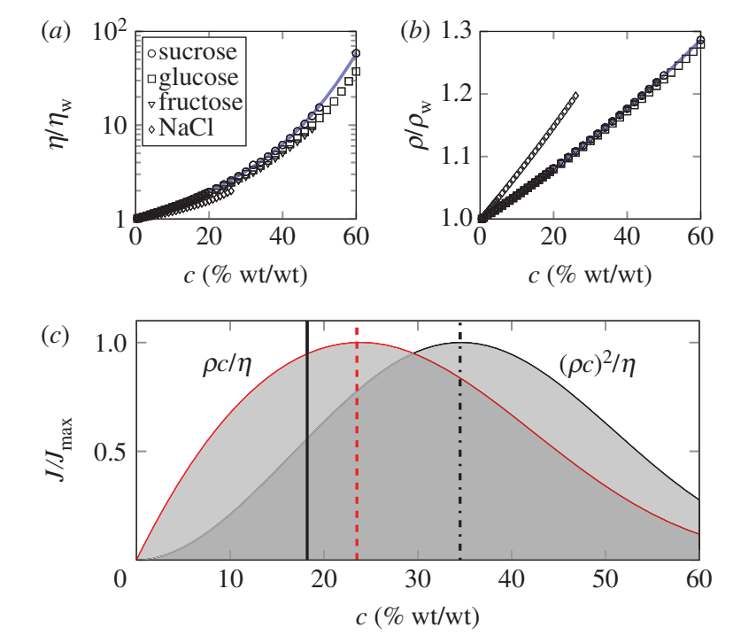
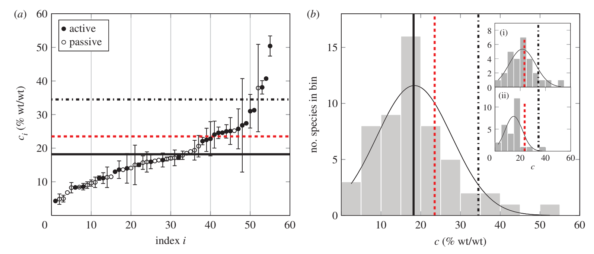
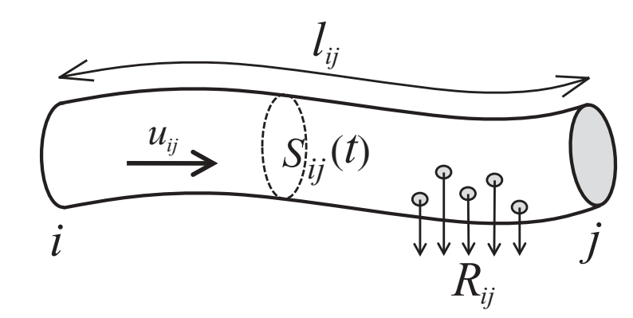

# Optimal concentration for sugar transpor in plants

引：运输在叶子中开始，糖被动或主动地装载到韧皮部。活性负载由膜转运蛋白和糖聚合驱动，并逆着糖浓度梯度发生；然而，在被动负载中，糖通过从叶肉到韧皮部的浓度梯度移动，在不使用代谢能的情况下进入韧皮部。

本文考虑了三个主要问题：

- 预测的最佳浓度，是否与实际测量的韧皮部汁液浓度吻合？
- 驱动压力是否随糖浓度变化？这种变化会怎样改变最佳浓度？
- 植物将糖装载进韧皮部的不同机制，是否会影响运输效率？

## 数学模型

糖分的质量流量$J$可以用韧皮部液体的体积流量$Q$，糖的质量分数$c$以及溶液密度$\rho$表示：

$$
J=Q\rho c
$$

可以对雷诺数的大小进行估计$Re=\rho ua/\eta\simeq10^{-3}$（其中流速$u\simeq1m~h^{-1}$，管半径$a\simeq10\mu m$），认为是层流，于是体积流量$Q$完全由韧皮几何、驱动流体的压差$\Delta p$以及溶液的粘度$\eta$决定：

$$
Q=X\frac{\Delta p}{\eta}
$$

其中$X$是几何参数，对于半径$a$、长为$L$的圆管有$X=\pi a^4/(8L)$。需要注意的是以上密度$\rho$以及粘度$\eta$都是糖浓度$c$的函数（见下图）。驱动压差$\Delta p$的量级在$0.1-1MPa$之间，同时被认为是由渗透压引起的（当然还有其他机制，如电渗和原生质流，但这些机制在解释实验数据方面不太成功）。以下将问题分为两类：1、压差不依赖于浓度，$\Delta p=\Delta p_0$；2、压差依赖于浓度，$\Delta p=\Delta p(c)$。在经典的Munch假说中压差是是源与汇之间的摩尔糖浓度梯度$\Delta(\rho c)/M$相关的渗透压，即$\Delta p(c)=RT\Delta(\rho c)/M$（这是所谓的van't Hoff值，只适用于稀（理想）溶液）。如果糖分在汇处被充分卸载，可以认为$\Delta\rho c=\rho c$。同时为了简单起见，关于渗透压驱动压力，不考虑沿路径的粘度变化。

糖质量流量可以写为：
$$
1.~J=X\Delta p_0\frac{\rho c}{\eta}\\
2.~J=X\frac{RT}{M}\frac{(\rho c)^2}{\eta}
$$

### 最大化通量

见上图(c)，两种模型的最大糖质量流量对应的浓度分别为23.5，34.5。而如果$\Delta p$是两种形式的线性组合，最佳浓度肯定在两者之间。

### 最大化效率

植物远端部分之间糖的运动每单位时间传递的能量$E$取决于糖流$J$和单位质量溶质的能量含量$k$，$E=kJ=kX\Delta p\rho c/\eta$。有几个因素导致了**运输糖的能量成本**：**维持压力梯度**、**建立和保存脉管系统**、**装载和卸载溶质以及粘性流耗散**。虽然并非所有这些都很容易量化，但众所周知，流动的奶奶行耗散$P=X\Delta p^2/h$会强烈影响其他生物系统中的传输。假设该项为损耗的主要来源，糖汇处获得的净能量为：

$$
\bar{E}=E-P=E(1-\frac{\Delta p}{k\rho c})
$$

简单做个估计，维持流速$u\simeq 1n~h{-1}$的压差$\Delta p=0.1-1MPa$，并将$c=0.2, k=10^4Jg^{-1}$带入：$\Delta p/k\rho c\simeq10^{-3}$，于是由于粘性造成的能量损耗可以忽略不记，此时最大化$E$变为了最大化$J$。

类似的，可以定义效率$\phi=\bar{E}/P$，也就是每单位能量植物可以从流动中获取的有效能量，根据以上分析，$\phi\simeq10^3\gg1$，它的最优值也与以上分析一致。

下图为实验采样结果（红色、黑色虚线分别为本研究推导出的两种最优浓度）：

(1)是active loader，(2)是passive loader。它们的区别也可能是采样方法的不同造成的。如果排除采样方法的影响，active loader对应的浓度似乎更佳（也许可以解释active loader一般是生长较快的草本植物中的机制，而passive loader往往存在于生长较慢的树木）。另外测得的平均浓度（实线）更接近恒定压强的模型，这也许是因为植物还调节了离子浓度，中和了糖浓度对渗透压的影响。（这也许可以解释为什么植物内的压强与尺寸关系不大（引））

引：糖浓度最高的植物通常具有快速生长的特点（如本文中的马铃薯$c=50.4\%$与玉米$c=40.7\%$），这些极端浓度可能就是选择性繁殖的产物。

引：尽管一些植物物种在韧皮部中保持相当恒定的糖浓度（如蓖麻），但其他物种的树液化学似乎表现出昼夜和季节变化。秋季，生长停止会导致sink活性降低，这与一些落叶和常绿物种韧皮部分泌物的糖含量增加1.5-5倍相吻合。在这些物种体内，韧皮部可以作为不使用温度敏感酶情况下的碳容器。较高的糖浓度也可能阻止细胞外冷冻过程中的干燥，并促进冬季的过冷。在一个较短的时间尺度下（日夜），韧皮部里的糖浓度可以变化$25-160\%$，并可以相应于诸如落叶之类的干扰而改变。

# Radial–axial transport coordination enhances sugar translocation in the phloem vasculature of plants

在active loader中的糖浓度高于passive loader（前者是草本植物，后者树木），但是根Munch理论，为了弥补更长的管道，需要更大的浓度差以维持更大的压强，这一点似乎有所矛盾。

引：与Munch理论描述（水与糖分的交换只发生在源和汇），糖和水可以在路径的不同位置交换，基本上形成了一个“中继”系统，以促进运输。虽然糖分的沿途交换被证实能让运输更加有效，但没有直接的证据可以证明；但是水分的沿途交换开始有了大量的证据。理论上，**如果不发生水交换，植物在干旱条件下会因粘度增加和压力梯度降低而堵塞韧皮部流动**，因为在装卸区的韧皮部导管中需要更多的糖来进行渗透调节，以对抗木质部和周围组织水势的下降。如果水交换在整个运输路径上很容易发生，那么流动可能不会受到Munch机制原始解释中相同约束的限制。特别的，由于径向水流的稀释作用，粘度积聚的影响可以得到改善，这是本文工作的重点。

# Advection, diffusion, and delivery over a network

## Details

### A. 初步假设

连接节点 $i,j$ 的边具有以下性质：
- 截面积$S_{ij}$
- 长度$l_{ij}$
- 速度$u_{ij}$，当流动从 $i$ 到 $j$ 时认为 $u_{ij}>0$
- 认为边 $ij$ 中溶质的输送率为 $R_{ij}$

有效扩散系数 $D_{ij}$，分子扩散系数 $D_m$，由于对流作用，存在以下关系：

$$
D_{ij}=D_m+u_{ij}^2\frac{r_{ij}^2}{48D_m}
$$

### B. 基本方程

只考虑沿着 $ij$ 边，满足一维对流扩散输运方程：

$$
\frac{\partial q_{ij}}{\partial t}
+ R_{ij} q_{ij}
+ u_{ij}\frac{\partial q_{ij}}{\partial x}
- D_{ij}\frac{\partial^2 q_{ij}}{\partial x^2}
= 0.
$$

$q_{ij}$ 是单位线长的溶质量，$R_{ij}$是溶质被消耗、移出或输送到网络外的速率。如果两个节点之间没有直接连接，直接设置 $S_{ij}=0, q_{ij}=0$。节点处的溶质浓度$c_i(t)=q_{ij}(0,t)/S_{ij}, c_j(t)=q_{ij}(l_{ij})/S_{ij}$。另外节点处可以充分混合，也就是有无穷小的面积，也就是说边 $ij$ 只会通过节点 $ij$ 处的浓度受到网络其他部分的影响。根据 Fick'law，溶质通过边 $ij$ 从节点 $i$ 流出的速率为：

$$
J_{ij}(t)
=
\left[
u_{ij}q_{ij}(x,t)
-
D_{ij}\frac{\partial q_{ij}(x,t)}{\partial x}
\right]_{x=0}.
$$

该节点总的流出速率：

$$
I_{ij}(t)
=
\sum_j\left[
u_{ij}q_{ij}(x,t)
-
D_{ij}\frac{\partial q_{ij}(x,t)}{\partial x}
\right]_{x=0}.
$$

## 拉普拉斯空间中的平流、扩散和输送

使用拉式变换 $\mathcal{L}\bigl(q_{ij}(x,t)\bigr)=\int_0^\infty q_{ij}(x,t)e^{-st}\,dt=Q_{ij}(x,s)$，它有以下的性质：

$$
\mathcal{L}\left(
\frac{\partial q_{ij}(x,t)}{\partial t}
\right)
=
sQ_{ij}(x,s)-q_{ij}(x,0).
$$

$$
\mathcal{L}\left(
\frac{\partial q_{ij}(x,t)}{\partial x}
\right)
=
\frac{\partial}{\partial x}Q_{ij}(x,s).

$$

如果 $u_{ij}$和 $D_{ij}$ 都是时间的常数，于是之前的一维方程可以转换为：

$$
(s+R_{ij})Q_{ij}
+
u_{ij}\frac{\partial Q_{ij}}{\partial x}
-
D_{ij}\frac{\partial^2 Q_{ij}}{\partial x^2}
=
q_{ij}(x,0).
\tag{8}
$$

另外，节点处的溶质变化率：

$$
\Upsilon_i(s)
=
\sum_j
\left[
u_{ij}Q_{ij}(x,s)
-
D_{ij}\frac{\partial}{\partial x}Q_{ij}(x,s)
\right]_{x=0}.
\tag{9}
$$

### A. 初始0态（一条最初没有溶质的管道，如果知道两端的浓度如何随时间变化，怎样求出管道内部的溶质分布？）

一开始边是空的，也就是 $q_{ij}(x,0)=0$，于是考虑 (8) 式的均匀形式：

$$
(s+R_{ij})Q_{ij}
+
u_{ij}\frac{\partial Q_{ij}}{\partial x}
-
D_{ij}\frac{\partial^2 Q_{ij}}{\partial x^2}
=
0.
\tag{10}
$$

这是一个关于 $x$ 的二阶常系数微分方程，令 $Q=e^{\lambda x}$，代入(10)，得到特征方程后求解得：

$$
Q_{ij}(x,s)
=
A e^{\frac{u_{ij}+\alpha_{ij}(s)}{2D_{ij}}x}
+
B e^{\frac{u_{ij}-\alpha_{ij}(s)}{2D_{ij}}x}.
\tag{11}
$$

其中 $A, B$ 是关于 $x$ 的常数（但可以随 $s$ 变化，还需要边界条件确定）。边界条件：

$$
\begin{aligned}
X_{ij}(s)&\equiv Q_{ij}(0,s),\\
X_{ji}(s)&\equiv Q_{ji}(0,s)=Q_{ij}(l_{ij},s).
\end{aligned}
\tag{13}
$$

可以定义两个无量纲量：

$$
g_{ij}=\frac{u_{ij}l_{ij}}{2D_{ij}},
\qquad
h_{ij}(s)=\frac{\alpha_{ij}(s)l_{ij}}{2D_{ij}}.
\tag{14}
$$

令 $x=0, x=l_{ij}$，可以得到：

$$
\begin{aligned}
X_{ij}&=A+B,\\
X_{ji}&=A e^{g_{ij}+h_{ij}}+B e^{g_{ij}-h_{ij}}.
\end{aligned}
\tag{15}
$$

以上各参数均是拉普拉斯变量 $s$ 的函数，可以解得：

$$
A
=
\frac{X_{ji}e^{-g}-X_{ij}e^{-h}}
{2\sinh(h)}.
\tag{16}
$$

$$
B
=
\frac{X_{ij}e^h-X_{ji}e^{-g}}
{2\sinh(h)}.
\tag{17}
$$

于是假设边 $ij$ 初始是空的，得到解：

$$
Q_{ij}(x,s)
=
X_{ij}
\frac{\sinh\left(\frac{l-x}{l}h\right)}
{\sinh(h)}
e^{\frac{x}{l}g}
+
X_{ji}
\frac{\sinh\left(\frac{x}{l}h\right)}
{\sinh(h)}
e^{\frac{x-l}{l}g}.
\tag{18}
$$

### B. 在初始空的、静止网络中的对流、扩散以及运输

以上我们已经得到了单个节点的结果，现在我们转向多节点的网络，对于节点 $i$ 有$C_i(s)=\int_0^\infty c_i(t)e^{-st}\,dt$，且

$$
C_i(s)=\frac{X_{ij}(s)}{S_{ij}},
\qquad
C_j(s)=\frac{X_{ji}(s)}{S_{ij}}.
\tag{19}
$$

总体上来说，我们可能不知道节点浓度的 Laplace 变换 $\bar{C}(s)=\{C_1(s),\ldots,C_m(s)\}$，但是对于给定的 $\bar{I}(s)=\{I_1(s),\ldots,I_m(s)\}$，可以计算得到 $\bar{\Upsilon}(s)=\{\Upsilon_1(s),\ldots,\Upsilon_m(s)\}$，将式(11)代入到式(9)中，有：

$$
\Upsilon_i(s)
=
\sum_j
\left[
\frac{\alpha_{ij}(s)}{2\sinh[h_{ij}(s)]}
\left\{
X_{ij}\cosh[h_{ij}(s)]
-
X_{ji}e^{-g_{ij}}
\right\}
+
\frac{u_{ij}}{2}X_{ij}
\right].
\tag{20}
$$

或者用浓度表示：

$$
\Upsilon_i(s)
=
\sum_j
\left[
C_i(s)S_{ij}
\left\{
\frac{u_{ij}}{2}
+
\frac{\alpha_{ij}(s)}{2\tanh[h_{ij}(s)]}
\right\}
-
C_j(s)S_{ij}
\frac{\alpha_{ij}(s)e^{-g_{ij}}}
{2\sinh[h_{ij}(s)]}
\right].
\tag{21}
$$

也就是说，对于每个节点 $i$，$\bar\Upsilon(s)$都可以用 $\bar C(s)$ 线性表示：

$$
\mathbf{M}(s)\bar{C}(s)=\bar{\Upsilon}(s).
\tag{22}
$$

$$
M_{ij}(s)
=
\begin{cases}
\displaystyle
\sum_k S_{ik}
\left\{
\frac{u_{ik}}{2}
+
\frac{\alpha_{ik}(s)}{2\tanh[h_{ik}(s)]}
\right\},
& i=j,\\[1.2em]
\displaystyle
-\frac{S_{ij}\alpha_{ij}(s)e^{-g_{ij}}}
{2\sinh[h_{ij}(s)]},
& \text{otherwise}.
\end{cases}
\tag{23}
$$

称 $\mathbf M(s)$ 为传播矩阵。首先它的对角元素都是正的，其次当且仅当 $i,j$ 之间没有连接，$M_{ij}(s)=0$；另外由于 $\Upsilon_i(s)$ 表示在L氏变换下节点 $i$ 的净流出，$\mathbf M$的非对角元素都是负的。$\Upsilon_i(s)$ 完全取决于 $i$节点 处的浓度以及流经相邻节点的浓度。