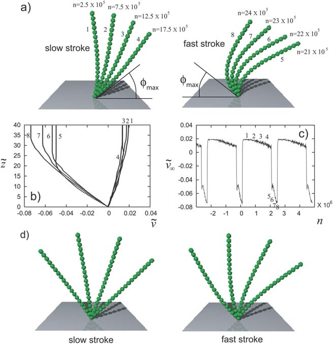
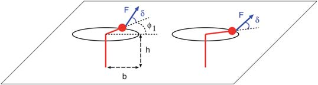
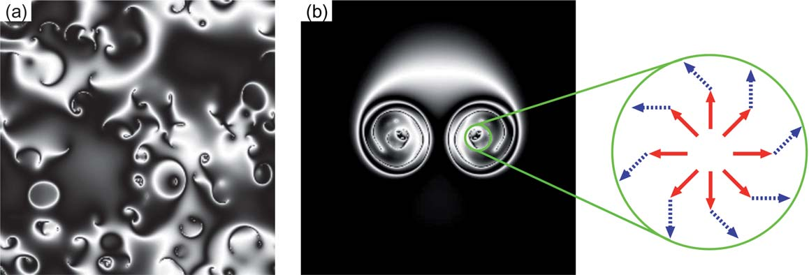

# 文献摘要

## Hydrodynamic synchronization at low Reynolds number

### 同步：从普遍的视角来看

同步的理论模型通常简化为相位描述，即第$i$个振子的相位$\phi_i=\phi_i(t)$被作为动力学变量。发展方程的一般形式：

$\frac{d\phi_i}{dt}=\omega_i-\sum_{j\neq i}G(\mathbf{r_i}-\mathbf{r_j})V'(\phi_i-\phi_j)$

其中$\omega_i$是本征频率，$\mathbf{r_i}$是第$i$个振子的位置，$G(\mathbf{r})$是作用核，函数$V(\phi)$是周期性的“势函数”，在$\phi=0$时取到最小值，驱使系统演化为完全的同步状态。在耦合振荡器阵列中，根据相互作用的范围，可能会也可能不会发生集体振荡。相位相干性由宏观序参量表征$S=\frac{1}{N}|\sum_ie^{i\phi_i}|$，$S=1$表示完全有序（同步）状态，$S=1$表示无序（非同步）状态。对于平均场耦合$G(\mathbf{r})=g_0/N$（$g_0=\text{const}$），当$g_0$超过某个临界值$g_c$时（取决于固有频率的分布），发生具有全局相位相干性的集体振荡。平均场模型在转变点附近展现出临界行为$S=(g_0-g_c)^\beta$，其中$\beta=1/2, \text{or}1$，取决于$V(\phi)$的函数形式。另一方面，**对于短程（比如最近邻）的耦合，全局的同步是不可能的**。对于长程的耦合$G(\mathbf{r})\propto1/r^\alpha$，同时$V(\phi)\propto-\cos\phi$，$\alpha<\frac{3}{2}d$时全局相位相干是可能的；在$\frac{3}{2}d<a<\frac{5}{2}d$内，没有全局相位相干性的频率夹带是可能的。

流体动力学相互作用范围很长，指数a由系统的几何形状控制。在主体中施加力单极子的活性单位通过Oseen张量相互作用对应$\alpha=1$；而主体中的力偶极子或表面附近的力单极子与偶极子相互作用在远距离是对应$\alpha=3$。流体作用天然带有的各向异性令该问题更为复杂，需要耦合振子结构上的各向异性引起同步，这里后面会详细讨论。

### 水动力同步模型：直接方法

现有的研究通过不同复杂程度的模型研究了流体动力学相互作用引起的同步，从直接模拟弹性细丝/薄片到通过耦合相位振子模型进行简化描述。在早期的工作中，**Gueron和Levit-Curevich**通过具有流体动力学相互作用的不可伸展的弹性细丝模拟了纤毛。他们发现，线性排列的纤毛表现出一种看起来像元时波的行波。**Kim和Netz**使用布朗动力学方法模拟了一系列连接到表面的半柔性长丝，如下图所示。在他们的研究中，细丝在底部由垂直于基材的规定扭矩驱动。他们表明，由于流体动力学相互作用，**锁相会自主发生**，**并提高了泵送效率**。**Elfring和Lauga**也研究了**耗散率与同步之间的关系**。本着泰勒的精神，他们考虑了两个弹性片的模型，其中传播的横波具有规定的波形。他们的分析表明，波形的前后不对称会导致同相或反相同步，这将分别使耗散率最小化或最大化。**Guirao和Joanny**将纤毛建模为半柔性细丝，其内力由分子马达的双态模型描述。他们从理论上表明，由于同步拍打产生的宏观流动，纤毛阵列中对称拍打的自发破缺发生。这些直接方法在阐明流体动力学相互作用在现实情况下的作用方面非常有帮助。然而，弹性细丝动力学的复杂性使得此类研究很难深入到研究大量流体动力学活动物体的相行为和集体性质。

(a)中n表示模拟时间(单个拍打的弹性长丝) (b)流动剖面与壁面之间距离的关系 (c)在打拍打循环中，整体流体泵送速度随时间变化的比例 (d)相对较硬的弹性长丝。

### swimmers的水动力同步

**Gray的原始观测结果**和最近关于精子在固体基质上形成涡流的实验表明，**自由低雷诺数swimmer的流体动力学同步**是一个非常丰富和有趣的课题，但相对而言尚未被探索。**Yang等人将游动精子建模为半柔性细丝**，**其尾部以规定的振幅和频率主动弯曲**。在他们的**2D模拟**中，他们发现两个精子通过流体动力学相互作用相互吸引，并且**头部-头部距离随着相位差而减小**。在多精子系统中，他们获得了群体行为，平均簇大小与拍动频率分布宽度呈幂律关系。这些研究表明，自由泳者的同步是一个比固定位置的活动细丝更复杂的问题，因为泳者之间的相互距离会随着他们的相位而变化。

**Putz和Yeomans**扩展了简单的线性三球模型泳者的定义，允许可变的stroke周期，从而使他们能够研究自由泳者的相位同步。他们发现，一般来说，两个泳者同步的相位差为0或p，具体取决于他们的相对位置。对于三名游泳者来说，随着游泳者位置的变化，相对相位会振荡，并伴随着叠加的时间漂移。锁定过程缓慢，通常需要数千个游泳周期，并且随着距离的增加而变慢。

### 水动力同步的最小模型

**Kim和Powers**表明，在恒定的驱动扭矩下，两个具有固定平行轴的旋转刚性螺旋不会同步。通过数值分析和对称性论证，他们证明了流体动力学相互作用既不会增强也不会破坏锁相。**Ryskin和Lenz**的纤毛串珠模型很好地说明了流体动力学相互作用的中性作用。接下来，这里考虑两个半径为$a$的刚性球形珠，每个珠都约束在半径为$b$的圆形轨迹上，并悬挂在基板上方固定高度$h$处。每个珠都被恒定的扭矩$\tau$驱动，或者等价的切向力$F=\tau/b$，这对对应于下图模型中$\delta=\pi/2$。轨迹$\mathbf{r_1}$和$\mathbf{r_2}$的中心位置被距离$d\gg b$分隔开。$\mathbf{n}(\phi_i)=(\cos\phi_i, \sin\phi_i, 0)$和$\mathbf{t}(\phi_i)=(-\sin\phi_i, \cos\phi_i, 0)$分别是轨迹的径向和切向单位向量。通过平衡驱动力$\mathbf{F_i}=F\mathbf{t}(\phi_i)$得到运动方程：

$$
b\frac{d\phi_i}{dt}=\frac{\mathbf{t}(\phi_i)\cdot\mathbf{F_i}}{\zeta}+\sum_{j\neq i}\mathbf{t}(\phi_i)\cdot \mathbf{G}(\mathbf{r_i}-\mathbf{r_j})\cdot\mathbf{F_j}
$$

圆珠受到的阻力系数为$6\pi\eta a$，流体速度通过Oseen-Blake张量$\mathbf{G}(\mathbf{r})$与力有关：$\mathbf{v(R_i)}\simeq\sum_{j\neq i}\mathbf{G}(\mathbf{r_i}-\mathbf{r_j})\cdot\mathbf{F_j}$

考虑到$\mathbf{G}(\mathbf{r})=\mathbf{G}(\mathbf{-r})$，以及$\mathbf{F_i}=F\mathbf{t}(\phi_i)$，相位差$\Delta\phi=\phi_2-\phi_1$是不变（$\dot\phi_1=\dot\phi_2, \dot{\Delta\phi}=0$）的且不会受到水动作用力的影响。

这个固定扭矩的两钢珠模型过于简单，要产生真正的 **phase locking**，必须打破这种交换对称性，或者引入额外自由度。

**Uchida和Golestanian**通过假设力角$\delta$在$0$和$\pi/2$之间具有任意值，对上图中定义的模型进行了推广。他们考虑了排列在网格尺寸为$d\gg h$的方形网格上的转子的集体动力学。运动方程中的驱动力表示为$\mathbf{F_i}=F[\sin\delta\cdot\mathbf{t}(\phi_i)+\cos\delta\cdot\mathbf{n}(\phi_i)]$。为了确保该模型包含产生同步的必要元素，首先考虑2个如此的振子。可以得到相位差的运动方程：

$$
\dot{\Delta\phi}=-\omega\gamma\cos\delta\sin\Delta\phi
$$

其中$\omega=F/6\pi\eta ab$为特征频率，$\gamma=9ah^2/d^3$是无量纲耦合常数。**从中可以发现，只要$\delta\neq \frac{\pi}{2}$，两个如此的转子就能同步。**

现在考虑2D的活性转子阵列。当$\gamma\ll\sin\delta$，可以将相位偏差$\Phi_i=\phi_i-(F\sin\delta/\zeta b)t$视作一个慢变量，它遵循动力学方程：

$$
\frac{1}{\omega}\frac{d\Phi_i}{dt}=\sin\delta-\gamma\sum_{j\neq i}\frac{d^3}{|\mathbf{r_i}-\mathbf{r_j}|^3}\sin(\Phi_i-\Phi_j-\delta)
$$

在这种形式中，流体动力学相互作用的各向异性被平均，模型被映射到标准耦合振子描述上（最基础的那个方程）。对于$\delta=0$，作者数值模拟了**Guirao和Joanny**预测的各向同性向列相变。向列相排序是通过以绕组数（winding number）+1和“1”为特征的拓扑缺陷的对湮灭（pair annihilation）进行的。对于$\delta=\pi/2$，由于几何挫折，获得了完全无序的状态；对于中等大小的$\delta$，这个模型产生了湍流螺旋波作为动态稳态（见下图）。螺旋要么是顺时针，要么是逆时针，取决于核心处缺陷的winding number。这种湍流动力学模式可能在微混合装置中得到应用。随机分布的$\delta$（平均值$\overline\delta$）也得到了研究，当随机性提升时可以得到同步-去同步的转变，与平均场模型中的急剧转变相比，这种转变是平滑的交叉。但是预计$N\rightarrow\infin$热力学极限下的全局同步状态是脆弱的，因为上式对应的是$\alpha=3d/2$，处于稳定的边缘。这可能有助于理解在细菌毯（bacterial carpets）中发现的局部（不是全局）朝向有序。鞭毛尾巴通常是弯曲的，于是造成随机的非径向的驱动力分量。$\delta$随机性的略微提升就能破坏相有序的状态。

二维流体动力学耦合转子阵列中湍流螺旋波的快照，灰度scale表示$\cos[\phi(\mathbf{r})-\overline{\phi}]$。(a)$\delta=\pi/4$ (b)$\delta=\pi/3$。从一对拓扑缺陷开始螺旋的初步发展。最右图展示螺旋核心，转子臂为实线红色箭头，它们对流体施加的力为虚线蓝色箭头；

通过推广基本刚性珠模型来产生同步的另一种方法是，让驱动力成为相位的函数，从而为驱动力提供一些动态模式，类似于纤毛的双模态跳动模式。**Vilfan和Julicher**考虑了两个在基底附近形成倾斜椭圆轨迹的刚性珠子。在他们的模型中，倾斜引入了固有相速度的调制，这与流体动力学相互作用的各向异性相耦合，从而导致同步。他们发现了同相或反相同步，这取决于两个轨迹的相对方向。**Ryskin和Lenz**从具有规定拍打模式的纤毛通用模型中推导出了一组耦合振子方程，并分析了线性转子阵列集体模式的线性稳定性。他们还提出了具有power stroke和recovery stroke的拍动模式的具体模型，该模型不能稳定全局同步状态，但允许行波（元时）解。

基于以上的钢珠模型，伴随着一般力的形式$\mathbf{F_i}=F(\phi_i)\mathbf{t}(\phi_i)$，我们可以看到力的急动是如何产生同步的。两个置于x轴上的转子当且仅当$\ln{F(\phi)}$傅里叶展开中$\sin(2\phi)$的系数是负的才能同步。比如$F(\phi)=F_0(1-\varepsilon\sin2\phi),~0<\varepsilon<1$包含小量$O(\varepsilon)$的两次谐波。纤毛的双模式跳动模式最简单地被$F(\phi)=F_0(1-\varepsilon\sin\phi),~|\varepsilon|<1$所模仿，它也能产生$\ln F(\phi)$的两次谐波，只是量级为$O(\varepsilon^2)$。该研究表明，纤毛和其他活性生物可能正在利用流体动力学相互作用核的二阶张量性质来控制它们的协调运动。

### 水动力同步的实验研究

相关研究很少。**Kim等人**通过研究高粘度硅油中螺旋丝的宏观尺度模型，研究了**细菌鞭毛捆绑**背后的物理学。他们在模型系统中观察到捆绑现象，发现这是由于流体动力学相互作用与长丝几何形状以及弯曲和扭曲弹性之间的相互作用造成的。其他涉及生命系统的例子，还有研究**一组精子**的同步，这些精子在固体基质附近形成涡流，以及**成对拍动鞭毛**的同步和相位滑动。最近，**Kotar等人**使用配备反馈控制的光镊研究了**胶体线性振荡器的同步**。对于两个振荡的胶体珠，他们发现，在没有噪声的情况下，反相动力学状态是稳定的，振荡周期取决于流体动力学耦合的强度。尽管这些实验都能证明水动作用可以造成粘性流体中活性物质之间的同步，还非常需要在实验上阐明与深挖这种动态现象的全部可能。

### 水动力同步的一般特征

如果系统在两个振荡器的交换下是对称的，那么它就不能同步。

全局同步态或元时波是具有循环活动的大量机械元件的涌现**非平衡稳态**。为了更好地理解该现象，需要解决以下一系列的问题：

1. 检查同步态或元时波是否满足模型系统的运动方程
2. 检查解是否是（线性）稳定的，以及相空间中初始条件的哪些区域将被每个解吸引
3. 最后，需要检查面对噪声（热扰动，或其他来源）是否任然存在（全局同步状态可能会被任意弱的内在随机性破坏，这取决于振荡器阵列的维数和几何形状，这决定了相互作用的渐近行为。）

