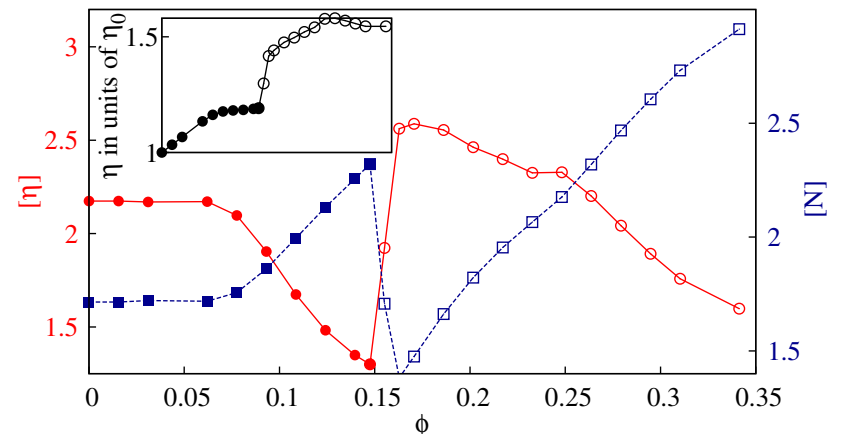
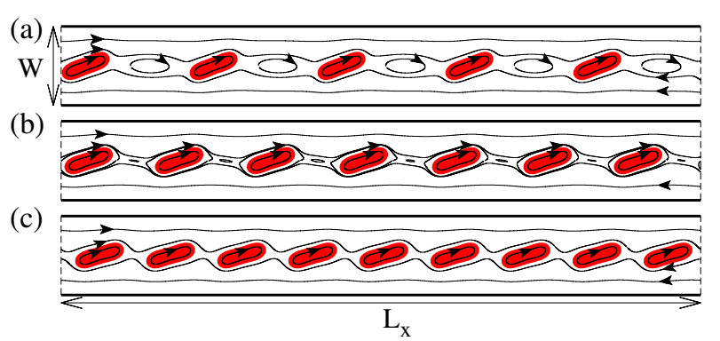
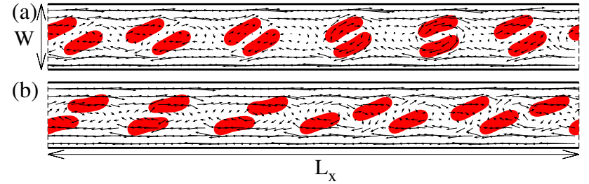
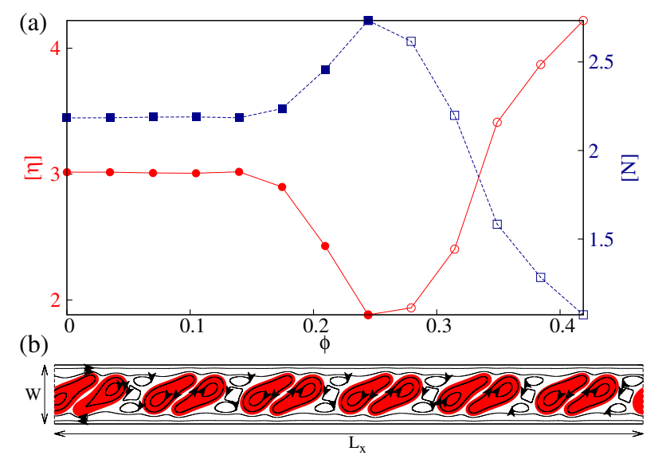
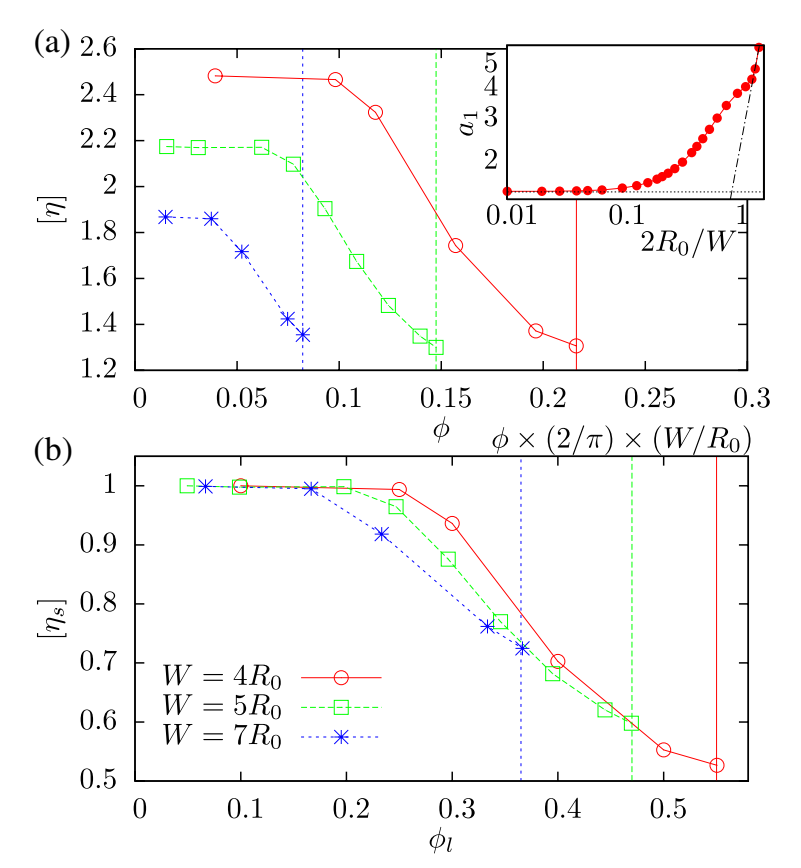
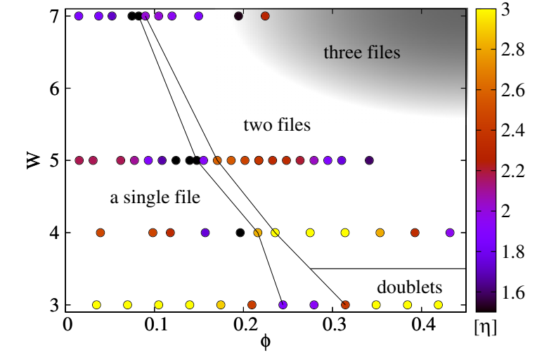
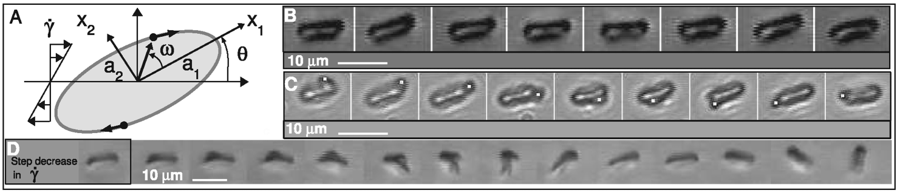
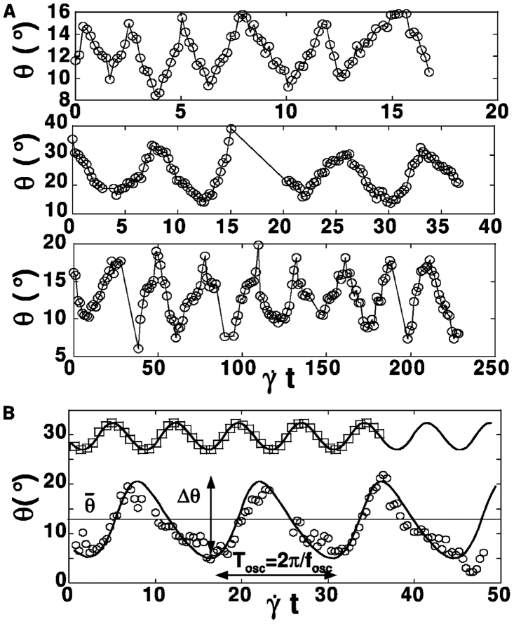
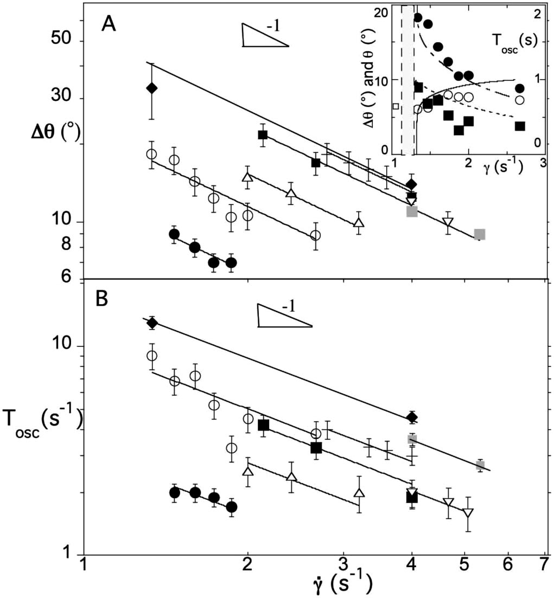

# 文献摘要

## Prediction of Anomalous Blood Viscosity in Confined Shear Flow

引：在稀溶液中，水动相互作用力可以被忽略，有$\eta=\eta_0(1+a_1\phi)$，其中$\eta_0$是液体的粘度，$a_1$是个常数，取决于悬液的性质，比如对于刚体颗粒，$a_1=2.5$（Einstein result）。当容积上升，悬浮颗粒之间的作用力不可以被忽略，由此造成悬液的粘度上升。经典的情况是，当体积分数接近最大堆积$\phi_m$时，会出现“堵塞”，粘度发散为无穷大。一个常用的唯象模型是$\eta=\eta_0(1-\phi/\phi_m)^{-a_1\phi_m}$。同时定义无量纲粘度$[\eta]=(\eta-\eta_0)/(\eta_0\phi)$，在无界的悬液中，$\eta, [\eta]$都随着$\phi$的增大单调上升。

2D模拟中$\tau=0.7$，3D模拟中$\tau=0.9$。细胞内外液体粘度一致。定义$C_a=\eta_0\dot\gamma R_0^3/\kappa, C_s=\eta_0\dot\gamma R_0/\kappa_s$。多数模拟中$C_a=1.0, C_s=0.14$，对应TT运动。

第一法向应力差$N\equiv<\sigma_{xx}>-<\sigma_{yy}>$，在囊泡表面积分得到，用于表征悬液的法向非各向同性。将其无量纲化：$[N]=\frac{N}{(\eta-\eta_0)\dot\gamma}$。

### 粘度随密度变化

上图为$W=5R_0$约束下的结果。在小$\phi$下（$\phi\le6\%\equiv\phi_{tr}$），$[\eta]$保持一个内禀值，此时颗粒间的作用力还弱；在$7\%\lesssim\phi\lesssim15\%$时，$[\eta]$线性下降，单列囊泡间的强涡旋被消弱，于是耗散下降；$15\%\lesssim\phi\lesssim16\%$，粘度发生突跳（pseudosingularity），这是因为空间组织发上了突变：单列已经塞满，产生双列结构（亚临界分岔）；$16\%\lesssim\phi\lesssim35\%$，$[\eta]$又开始下降，此时双列结构中增加囊泡继续削弱涡旋，减少耗散。$[N]$始终为正，说明整个悬浮体系表现出膨胀的法向应力特征，而且在单列-双列转变点附近出现了明显的奇异变化。小图为粘度$\eta$的变化，实心记号表示单列结构，空心表示双列结构。可以将稀疏与半稀疏溶液中的无量纲粘度表示为$[\eta]=a_1+a_2(\phi-\phi_{tr})Y(\phi-\phi_{tr})$，其中Y为阶跃函数。其中$a_1\simeq2.2, a_2\simeq-6$，对于两个刚体小球的无边界悬液，$a_2=5$。这一点也能够说明约束带来的作用。

(a)-(c) $\phi=8\%, 11\%, 14\%$

$\phi=10\%$

### 粘度随约束强度变化

继续深入研究了$W=3R_0, 4R_0, 7R_0$，其中$W=4R_0, 7R_0$与$W=5R_0$下的现象差不多，只是粘度变化幅值有所差异。但是对于$W=3R_0$，情况要复杂的多。

较低浓度下的平台、下降与上面的发现一样，但是随着浓度的增加，没有再次出现粘度的下降。此时并不会出现稳定的两列组织，取而代之的是doublet的形式，这个现象有点像由黏附造成的红细胞团簇。

一个比较合适的定量数据不是$\phi$，而是x方向上的容积：$\phi_l=2N_{ves}R_0/L_x=\frac{2}{\pi}\times\frac{W}{R_0}\times\phi$。当沿流动方向没有足够的空间，无法插入细胞列时，就会发生半稀释和浓稠状态之间的过渡。这个饱和状态大致发生在$L_x/N_{ves}\sim4R_0$，也就是$\phi_l\sim0.5$

除此之外，在低浓度下，$[\eta]$有一个W决定的恒定值$a_1$，于是存在如下的scaling law:

$$[\eta_s](\phi_l)=\frac{[\eta](\frac{\phi W}{R_0})}{a_1(\frac{W}{R_0})}$$

$a_1$关于约束度的变化如上小图所示。

### 空间结构相图

从单列结构向双列结构的转变的临界$\phi$对于更大的$W$更小，这是因为几何上的约束，同时水动作用力的范围随着宽度的增加而增大。这一点意味着小间隙之间的悬液粘度会低于大间隙，这让人想起FL效应。同时可以观察到粘度随着$\phi$的震荡幅度随着管道宽度的增加而减小，至$W_c\sim20$完全消失，对应微观流变学到传统宏观流变学的转变。

如果红细胞的刚度增加（对应一些疾病，如疟疾，镰刀细胞病），细胞可能进行TB运动，无法如TT运动一般形成以上组织结构，而造成粘度随着浓度的震荡，从而导致粘度随着浓度单调变化。

## Swinging of Red Blood Cells under Shear Flow

剪切流中，随着$\eta\dot\gamma$的增加，RBC会发生tumbling (T)至tank treading (TT)的转变，其过渡区呈现出swinging (S)的运动。swinging运动中，在TT的基础上，rbc的倾斜角度也产生震荡，其振动周期大致是TT周期的一半，同时随着$\dot\gamma\eta$的下降，幅值与周期都显著上升。

(b)swingning, $\dot\gamma=1.33, \eta_0=47$（$\eta_0$为悬液粘度，两者单位分别为$s^{-1}, mPa\cdot s$）

(c)$\dot\gamma=6, \eta_0=47$

(d)tumbling, $\dot\gamma=2.66, \eta_0=47$

(a)从上至下： $\dot\gamma=1.8, \eta_0=22$, $\dot\gamma=2.6, \eta_0=31$, $\dot\gamma=6.6, \eta_0=47$

(b) 空心圆：$0\dot\gamma=0.8, \eta_0=47$，实线：模型预测（$\eta_m=1120, \mu_m=0.42$）；空心框：$\dot\gamma=1.18, \eta_0=964$的聚合物胶囊，实线：模型预测（$\eta_me=0.085, \mu_me=0.675, a_1=278.8\mu m, a_2=a_3=170.8\mu m$）

