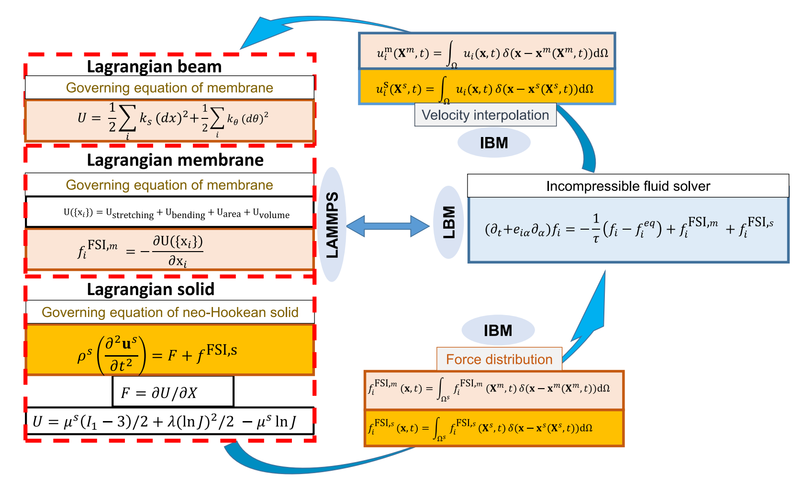
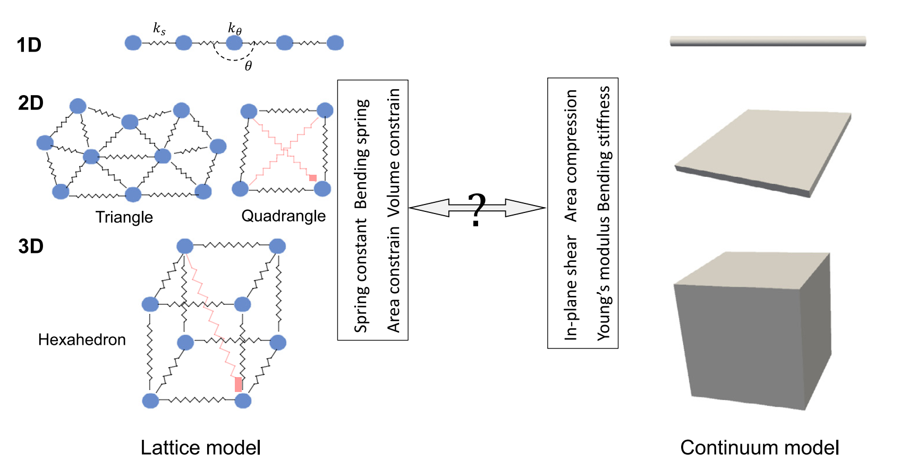

# OpenFsi 程序使用指引

## FSI发展情况

### 第一类传统路线：贴体网络方法

早期或传统 FSI 方法通常基于 conforming mesh / body-fitted mesh，代表是：

- ALE，Arbitrary Lagrangian–Eulerian 方法；
- space–time finite-element method。

这类方法的思想是：结构用一个拉格朗日网格描述，流体也单独划分网格，并且流体网格要贴合结构瞬时边界。它的优势很明确：边界条件可以直接施加在真实固体表面上，边界层也可以通过局部加密很好地分辨。

但问题也很明显：一旦结构发生大位移、大转动或大变形，流体网格会严重扭曲，需要重新网格化或网格更新。这个过程不仅耗时，而且旧网格到新网格的信息转移会引入精度损失。因此，贴体网格方法在复杂大变形 FSI、特别是大量颗粒/细胞的情形下会变得很笨重。

### 第二类路线：非贴体网络方法

与贴体网格相反，非贴体方法把流体和结构看成两个分离的计算场：

流体通常放在固定的欧拉 Cartesian 网格上，结构用拉格朗日网格追踪，并允许结构在背景流体网格上运动。这样就避免了流体网格随结构边界不断变形的问题。

在这种框架下，流固耦合算法又分两类：

- monolithic 方法：把流体、结构、耦合一起写成一个完整的大系统同时求解。优点是数值收敛性和鲁棒性较强；缺点是必须写一个完全一体化的 FSI 求解器，不方便复用已有成熟的流体/固体软件。

- staggered 方法：流体和结构分步求解，通过接口交换信息。优点是效率高、模块化强，可以直接调用已有的流体求解器和结构求解器。文章认为这对于实际 FSI 软件开发更有吸引力

### IBM

immersed boundary method, IBM 是一种很好用 **staggered 非贴体耦合方法**。IBM 最初由 Peskin 在 1970s 提出，用于研究心脏瓣膜附近的血流，后来被广泛扩展到各种 FSI 问题。

IBM 的基本思想是：

流体在欧拉网格上求解，结构在拉格朗日点上运动。结构受力通过某种插值/扩散函数 spread 到附近流体网格；流体速度再 interpolation 回结构点，从而实现力和速度的信息交换。其存在两种常见插值函数：

1、**reproducing kernel function / RKPM 类方法**：插值阶数高，也适合非均匀网格；但每个时间步都需要搜索新的邻居点，计算成本高。

2、**Dirac delta function 类方法**：基于均匀 Cartesian 网格，形式简单，容易嵌入已有流体或固体求解器，效率高；缺点是边界被平滑化，边界条件不是严格施加在真实界面上，而是在界面附近区域近似施加。

本程序选择 Dirac delta 型 IBM，主要是为了效率，尤其是面向复杂、大规模 FSI 问题。

### 流体求解：LBM/Palabos

LBM 的优势是高度并行化，适合 HPC。LBM 是介观方法，通过求解 Boltzmann 方程并恢复 Navier–Stokes 方程。它已经被广泛用于 IBM-FSI 问题，包括流体–颗粒相互作用等。

目前已有的很多 LBM-IBM FSI 工作并不是开源的，故这里选择使用 Palabos，一个开源 LBM 求解器。Palabos 用 C++ 实现，并通过 MPI 并行，适合现代高性能计算。Palabos 已经被广泛用于多相流、多孔介质、湍流、生物流体和大规模血流模拟。

### LAMMPS/LM

在结构求解器方面，传统 FSI 常用 FEA（有限元分析），但是 FEA 不太适合直接放进 LAMMPS，因为 LAMMPS 更偏向粒子模型。

这里采用 **Lattice Model, LM**。LM 可以看作一种粗粒化的弹簧网络模型，用离散粒子和弹簧来描述固体变形。它的优点是：

- 粒子化表达，天然适合 LAMMPS；
- 计算效率高；
- 可以通过参数映射达到和 FEA 类似的精度；
- 适合大规模结构/颗粒系统，比如大量红细胞。

文章采用的 LM 可以处理不规则 lattice，并且对于 neo-Hookean 固体可以达到与 FEA 相当的精度。

## 计算流程

### 流体求解器（LBM）

本程序使用D3Q19模型，BGK碰撞算子（暂时存疑，因为是直接调用的Palabos接口）。使用zou/he边界，可以施加三种流动：剪切流，poisueille流以及均匀流动。剪切流通过对上下边界实施Dirichlet边界施加速度实现，流向边界为周期性边界条件，其他方向均为Neumann边界条件；Poisueille 流中，给全场施加一个恒定的体力以模拟压力驱动的流场剖面，流向施加周期性边界条件，其他方向均使用壁面边界（Palabos中，直接使用bounce-back）；对于均匀流动，入口为均匀速度边界，出口为速度的Neumann边界条件，其他方向均实施速度的Neumann边界以及压强的Dirichlet边界。

除了上述边界条件之外，单位的转换也在palabos内完成（格子单位）。长度基准为格子分辨率$\Delta x$，时间基准为时间步$\Delta t$，还有质量基准选取为流体密度$\Delta\rho$。

### 浸没结构（Lattice Model, LM）

上图为LM与连续模型的关系。LM本质上应该反映连续体模型的相同宏观特性，如平面内剪切、平面外弯曲和杨氏模量等。LM中的典型参数有弹簧常数（直线弹簧与角弹簧）以及一些约束（面积与体积）。

#### 1维格子杆（beam）模型

将1维杆离散为连续连接着直线弹簧的颗粒，此外相邻的直线弹簧之间外加角弹簧。杆上的总能量$U_{1D}$如下

$$
\begin{aligned} 
U_{1D}&=U_{linear}+U_{angle}+U_{torsion}\\
&=\frac{1}{2}\sum_i\kappa_s(dx)^2+\frac{1}{2}\sum_j\kappa_\theta(d\theta)^2+\frac{1}{2}\sum_k\kappa_\tau(d\tau)^2
\end{aligned}
$$

其中$dx$是直线弹簧的拉伸，$d\theta$是角弹簧的角度变化，$d\tau$是扭转角。由此可以得到格子力常数与连续模型宏观性质之间的关系：

$$
\kappa_s=\frac{EA}{r_0}, ~\kappa_\theta=\frac{EI}{r_0}, ~\kappa_\tau=\frac{GJ_0}{r_0}
$$

其中$r_0$是杆的半径，$A$是横截面的面积，$I,J_0$分别是面内、面外惯性矩，$E, G$分别是杨氏与剪切模量。

