# 文献摘要

分类：群体运动

## Clusters of red blood cells in microcapillary flow: hydrodynamic versus macromolecule induced interaction

-引：静止状态下，红细胞的直径为$7.5-8.7\mu m$，厚度$1.7-2.2\mu m$，其中溶质的粘度在37℃下为$\eta_{in}=5mPa$。其膜由厚度约为$4nm$的自组装流体脂质双层和称为细胞骨架的附着蛋白质网络组成。膜上的局部和全局面积变化很小，因此可以将膜视为二维不可压缩材料。此外，红细胞膜的弹性归因于内部附着的蛋白质网络，因此需要两种独立的变形模式来描述其弹性状态：恒定表面积下的简单剪切和平面外弯曲。决定红细胞变形性的其他重要因素包括红细胞膜的粘度、细胞细胞质与其悬浮介质之间的粘度比，以及红细胞体积与表面积的比值，其中大面积的细胞面积过剩（与相同体积的球体面积相比，面积更大）促进了高变形性。通过这种方式，红细胞可以挤过直径小至$2\mu m$的毛细血管。

-引：健康情况下，纤维蛋白原的典型粘附能浓度约为$5\mu J\cdot m^{-2}$。

-本文使用葡聚糖来模拟纤维蛋白的作用

-引：不同聚合物或蛋白质作用下红细胞的聚集和分离可能具有不同的表现，众所周知，葡聚糖吸附在红细胞表面，在一定程度上改变了其弹性。

-$20mg ml^{-1}$dextran 70，$\epsilon=4.8\mu J m^{-2}$，$20mg ml^{-1}$dextran 150，$\epsilon=12\mu J m^{-2}$。实验管道横。BS：base solution

-引：如果两个细胞的中心距小于或等于单个细胞长度的1.5倍，则将它们视为簇的一部分。然而，这一价值是经过启发式选择的，而不是基于理论考虑。此外，由于我们总是考虑实际细胞的长度随着流动强度的增加而变得越来越长，因此簇长度的定义随着流动强度而变化。然而，我们下面对簇长分布的测量概率密度函数的统计分析为这个简单的定义提供了后验证明

-使用Lennard-Jones potential（讲了一大堆说明depletion model的正确性）
$$\phi=-2(\frac{h}{r_{ij}})^6+(\frac{h}{r_{ij}})^{12}$$
取$r=480nm$

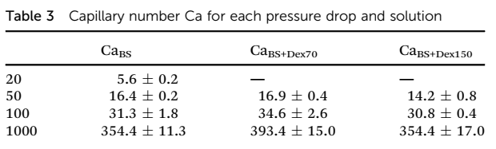

-由于大分子会诱导红细胞在存储器中聚集沉淀，$20mPa$的小压力下只有BS才能正常进行试验

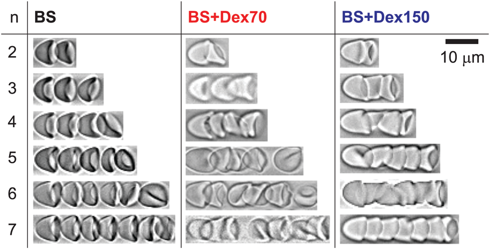

n：type n指的是一簇RBCS中包含n个红细胞。$\Delta P=100mPa$。BS溶液中，红细胞呈中心对称的降落伞型或者鞋型，一簇之中包含的细胞互相明确分开；而对于BS+Dex70，多数细胞紧密吸附，并呈现出降落伞型；在BS+Dex150中，甚至出现了子弹型。

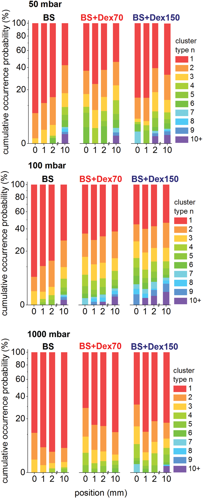

$0, 1, 2, 10$代表细胞进入管道深度，随着进入深度的增加，细胞簇中包含的细胞普遍增加。加入大分子的溶液在0-1之间部分簇有发生分裂。高压强导致添加大分子的溶液中出现了许多独立的细胞

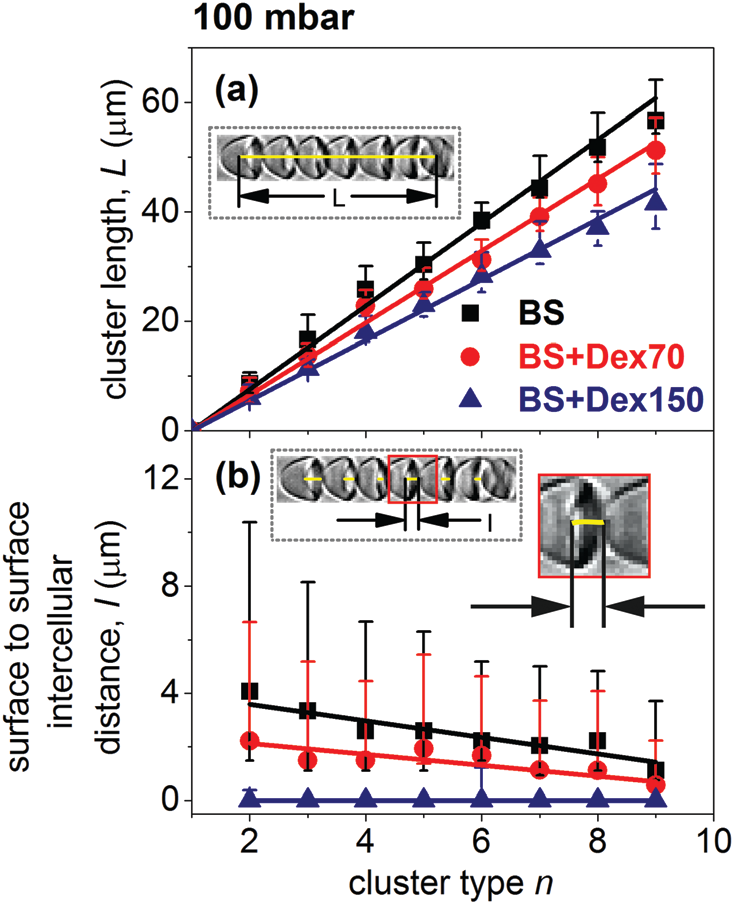

$\Delta P=100mPa$，分别在点1，2，10测量，图中展示中位数

-不同溶液中细胞簇长度差异是显著的，这是两个相反效应的结果：BS溶液中簇中的细胞呈降落伞状，但细胞间距离有限，而含有大分子的溶液中的细胞更细长，但彼此紧密相连。BS+Dex150的细胞膜距离在不同的簇type下大致为0。随着压差的增大，细胞簇长度由于变形加剧而增长。

-引：众所周知，BS+Dex70和BS+Dex150溶液中的红细胞在静止状态下细胞膜距离大致为25nm。在本实验中，黏附造成的细胞簇被定义为明显细胞膜距离接近零的细胞簇，此外就是流动力造成的细胞簇。随着压差的增大，流动力类型的细胞簇增加。

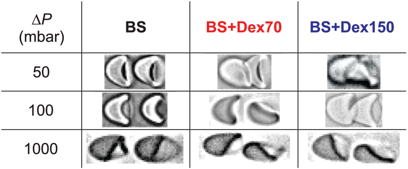

-本文的2维仿真工作使用半径为$3\mu m$的两个红细胞，归一化面积为$\tau=0.65$，上下管道间距$12\mu m$，$kappa=4\times10^{-19}J, \eta_{in}=5mPa$。使用Lennard-Jones potential模仿细胞间的作用力：对于BS+Dex70，$\varepsilon_{Dex70}=4.8\mu Jm^{-2}$；对于BS+Dex150，$\varepsilon_{Dex150}=12\mu Jm^{-2}$（引）

-本文的仿真工作发现如果提升流速，水动力造成的细胞簇会占据主导地位

-本文花费较多篇幅讨论type2不同簇长度的出现概率（发现了双峰现象），讨论了流动力造成的细胞簇以及吸附力造成的细胞簇的出现概率，并统计了不同情况下的细胞对形态。

## Red blood cell clustering in Poiseuille microcapillary flow

引：堆积红细胞结构的形成起着重要的生理作用，是导致血液非牛顿行为的主要因素之一，特别是在低剪切速率下粘度的增加。后者与凝血和血栓形成有关，这可能是由于血管阻塞

引：应该注意的是，红细胞也可以通过化学信号传导促进血小板聚集，例如在低$pO_2$、低pH值和机械变形下释放ATP和ADP。

引：红细胞簇的形成被归因于沿通道行进的较慢细胞，这些细胞会减缓较快细胞的速度，从而产生一系列尾随细胞。在白细胞存在的情况下，这种效应已被清楚地观察到。相比于红细胞，白细胞更大、变形能力差，。白细胞在血管约束下移动速度明显要慢很多，被发现处于红细胞簇的前方。

-引：健康血液测试中测得的Ht值较高（约45%）与大血管有关，而从大血管到微血管时，Ht因入口效应和红细胞的不均匀径向分布而降低，红细胞倾向于沿中心线集中（所谓的Fahraeus-Lindqvist效应）

-我们将RBC簇视为长度为L的细胞串，其中任何一对连续细胞之间的间隙d等于或小于1.5D，其中D是单个细胞的特征长度。D取决于施加的压降，范围在$6至10\mu m$之间

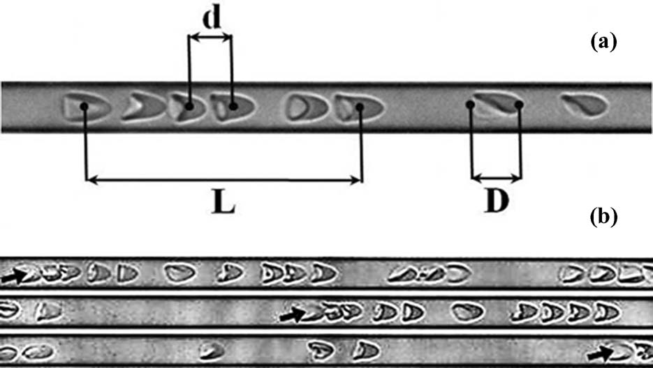

箭头所指细胞是同一个

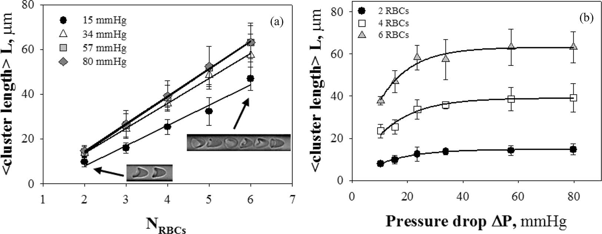

-细胞簇长度在$\Delta P=50mmHg$达到峰值，可以假设，这种峰值水平对应于这样一个事实，即即使孤立RBC的变形增加，簇中的平均细胞间距离d在临界$\Delta P$值以上保持不变。这个上限值可以表示为$L/(N_{RBC}-1)$，对应$N_{RBC}=2, 4, 6$分别等于$14.7, 13.1, 12.6\mu m$。这一点在后续的实验中也有证明。

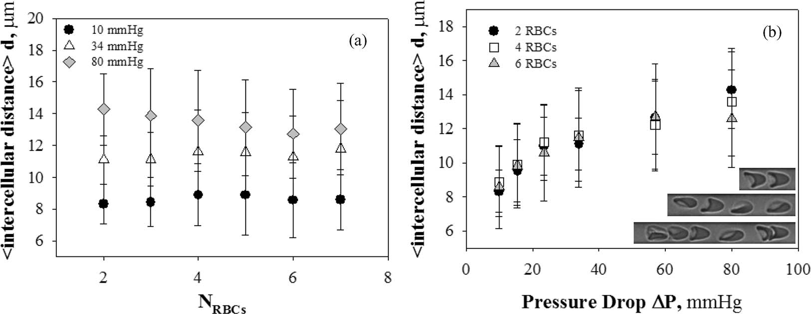

-在较小的压差下，d与细胞数$N_{RBC}$无关。对于较大的压差（80mmHg），在较大的细胞簇中（$N_{RBC}\geq5$）,发现d随着细胞数而略微减小。这可能是由于高压差下大细胞簇中的挤压。

-变形参数$DI$，定义为包围细胞体的边界框的纵横比
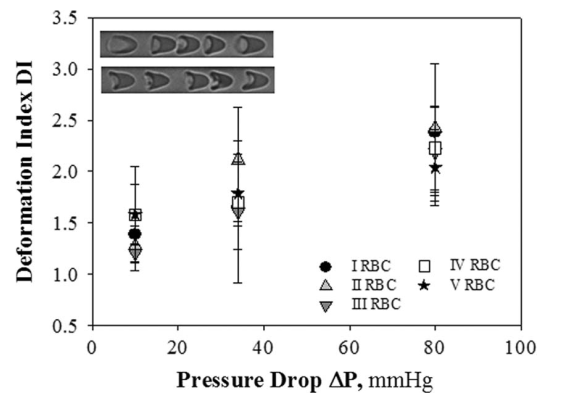

-研究了进出口以及中间位置细胞簇大小与施加压强的关系，发现入口处细胞簇中细胞的数量与压强无关

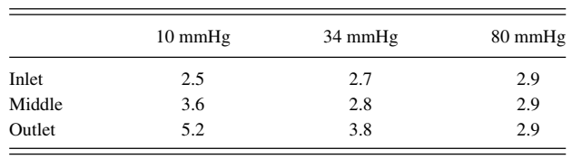

-实验结果表明，红细胞速度和簇大小没有显著相关性。此外，红细胞簇和单个红细胞速度之间的差异在1%以内

-仿真设置：$\nu=0.7, Ca=\mu v_{max}r^2/k$，其中$\mu$是水的粘度，r代表管道半径，k是RBC的弯曲模量，取为$10^{-19}N/m$

-引：文献中提到，由于红细胞的大小多分散性，形成了簇。由于最大的细胞具有较低的速度，它们会减缓运动较快的细胞，从而引发细胞聚集。然而本文的实验和仿真结果表明，即使细胞尺寸都一致，也能形成稳定的细胞簇

-本文还研究了不同细胞尺寸对于细胞簇稳定性的影响，将一个较小的细胞置于最前方，下表为保持单一稳定细胞簇要求的最小细胞尺寸。

-引：这些结果很有趣，因为红细胞半径分布的标准偏差约为4%（体积偏差为11%-15%），这确实与文献中的值一致（据报道，细胞体积的标准偏差等于16%）。

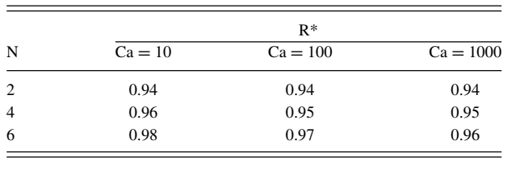

