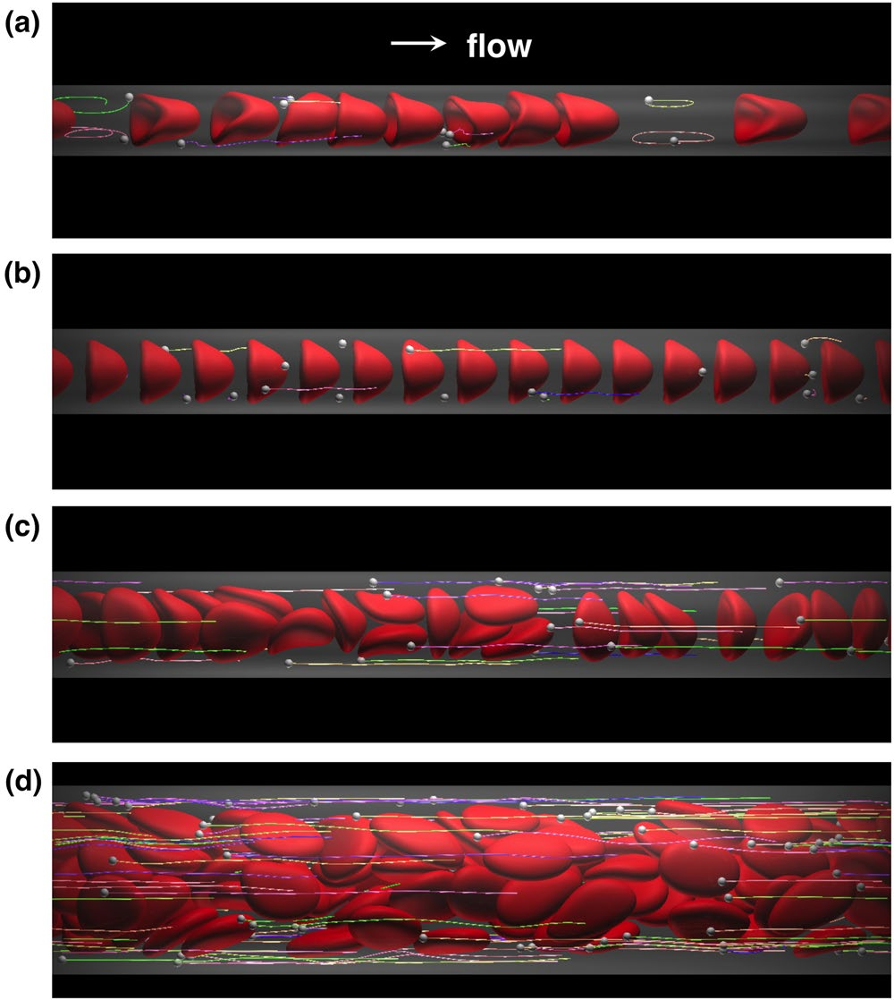
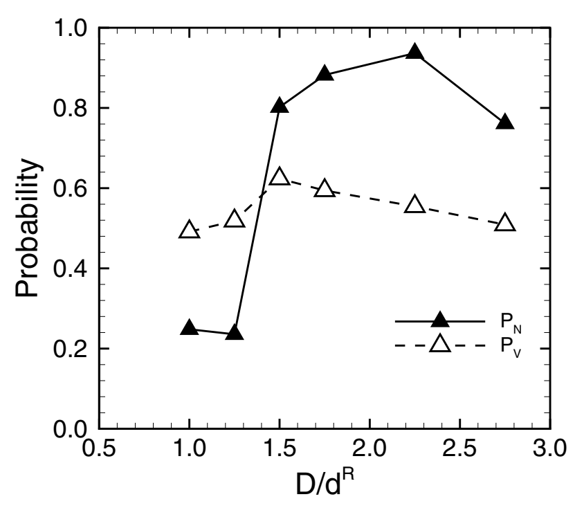
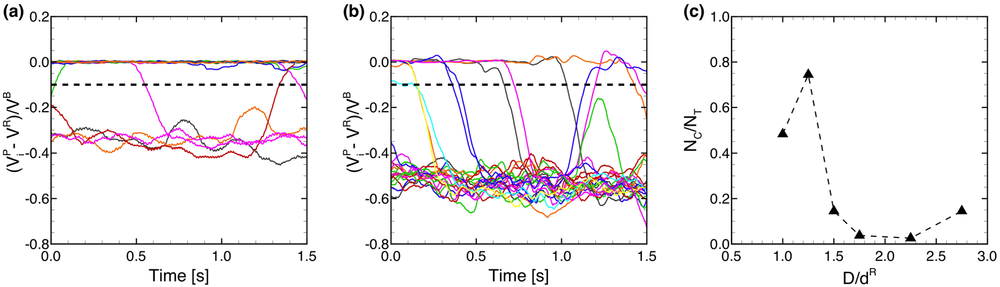
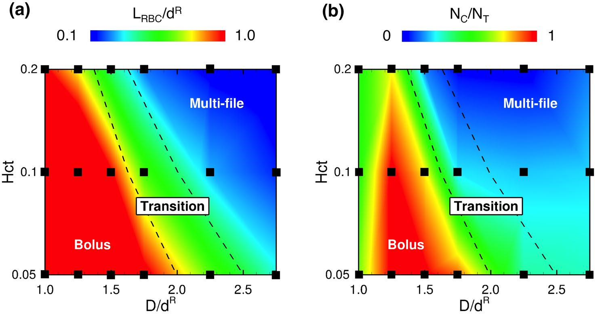
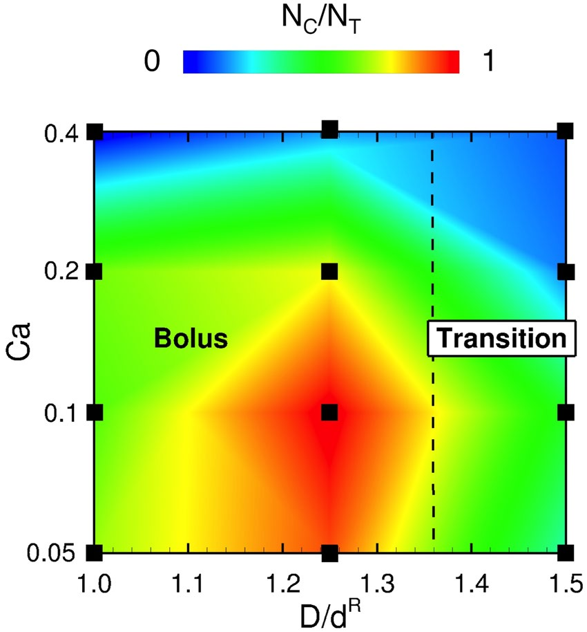
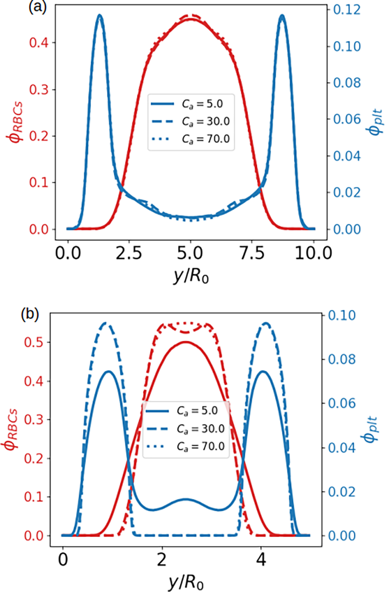
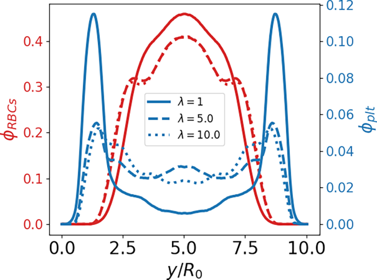
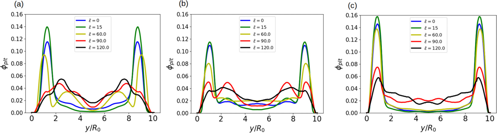

# 文献摘要

## Capture of microparticles by bolus flow of red blood cells in capillaries

引：几十年来，微循环中MPs(microparticles)的行为得到了广泛的研究。血液中的MPs与红细胞（RBC）发生流体动力学相互作用，红细胞表现出轴向迁移，导致MPs主要出现在外周层。这被称为**边缘化**，这是循环**颗粒粘附到内皮的第一步**。在使用兔肠系膜的体内实验中，研究了血小板的行为，观察了血管直径在15至35μm范围内的小动脉和小静脉。也有使用玻璃管和PDMS通道系统地研究了物理条件（如剪切速率）对边缘化的影响。这些研究不仅提供了微循环血流的见解，还提供了治疗药物载体的见解。进行体外实验以确定药物载体的最佳尺寸/形状，以有效粘附到血管壁。例如，Charoenphol等人的研究表明，微球（直径1-10μm）在微通道中比纳米颗粒（直径≤500nm）更有效地粘附在内皮细胞上。

到目前为止，提到的实验和数值研究都集中在相对较大的微血管上。然而，MPs通常需要到达毛细血管，毛细血管的直径可以与红细胞相当或更小。目前尚不清楚MPs在这种毛细血管中的行为是否与在相对较大的微血管中的边缘化一致。这篇文章中，研究了直径为$1\mu m$的微颗粒子不同大小的微血管中的流动，包括毛细血管。本文研究结果表明，MPs没有在毛细血管中边缘化，而是在红细胞之间的血浆空间中被捕获。一旦MPs被捕获，它们很少能从红细胞之间的漩涡状流动中逃脱。还研究了Hct和剪切速率对这一捕获事件的影响。

### 团流（bolus）动中的捕获事件

管道直径$D=8\mu m-22\mu m$，RBC直径$d^R=8\mu m$，颗粒直径$d^P=1\mu m$。首先关注剪切率$\dot\gamma=167 s^{-1}$，红细胞容积$Hct=0.2$的情况。可以将剪切率以毛细数的形式无量纲化：$Ca=\mu \dot\gamma d^R/2G_s^R$，其中$\mu$是血浆粘度，$G_s^P$是红细胞的剪切模量。这里设置的剪切率对应对应$Ca=0.2$

从上至下：$D=8, 10, 12,22\mu m$。在最小的管径下（a），红细胞形成单列，造成带有涡旋状流线的团流。部分颗粒被困在红细胞之间的血浆区域，并随着漩涡循环。这种现象被称为捕获事件（capture event）。$D=8\mu m$的团流并不稳定，红细胞会聚集；在$D=10\mu m$下，红细胞更稳定地形成了单列结构，间距保持一致，团流中捕获到的MPs很少逃出漩涡；当管径增大至$12\mu m$，流动模式进入一个过渡态，单列和多列运动共存，多数MPs进入细胞耗散外层（cell-depleted peripheral layer, CDPL）；在更大的管径$D=22\mu m$中，红细胞完全形成多列结构，在一段时间后多数MPs也被边缘化。

上图比较了Mps出现在CDPL中的概率（$P_N=N_M/N_T$）与CDPL所占比例（$P_V=V_{CDPL}/V_T$）。如果MPs是随机分布的，两个值应该一致。但是MPs的边缘化导致前者大于后者，这种情况发生于$D\gtrsim12\mu m$，所以可以将此时定义为边缘化。当$D\lesssim12\mu m$时，由于单列红细胞对于MPs的捕获，前者会小于后者。

为了量化这种捕获事件，定义了捕获比例。当单个MP被红细胞之间的漩涡捕获，它的净流动速度应该与RBCs的接近，即$V_i^{P}-V_R\approx0$，其中$i$表示第i个MP，$V_i^P$是MP运动的平均速度，$V_R$是RBCs的平均速度。平均速度都是由0.2s时间段内算出来的。

上图a中（bolus flow, $D=10\mu m$）13-14个颗粒被流动捕获，$(V_i^{P}-V_R)/V_B\approx0$；4-5个颗粒被边缘化,$(V_i^{P}-V_R)/V_B\approx-0.3$，其中$V_B$是血流的速度。但是在过渡态（$D=12\mu m$）中，多数MPs被边缘化，对应速度$(V_i^{P}-V_R)/V_B\approx-0.5$。由此定义$(V_i^{P}-V_R)/V_B>-0.1$的MPs被捕获（见a,b虚线），并由此定义捕获率$N_C/N_T$（见图c），其中$N_C$为被捕获的颗粒个数。

### Hct对于捕获率的影响

很容易地可以想到，更稀疏的红细胞溶液中，细胞间距更大，更容易捕获颗粒。下图为不同容积、管径下平均间距与捕获率的变化：

### 剪切率对捕获率的影响

高剪切率下，红细胞伸长更多，导致细胞之间的血浆空间减小，MPs更容易边缘化。

这篇文章的研究结果表明，由于捕获事件，MPs在毛细血管中可能是相当低效的药物载体，而在毛细血管中更随机分布的纳米粒子可能是更有效的载体。这篇文章中的MPs也是胶囊模型，只不过变形性比RBCs低得多。

需要注意的是，这篇文章里剪切率的定义为$\dot\gamma=U_m/D$，$U_m$为poisuille流的平均流速，壁面剪切率为该值的8倍。

## Platelet margination dynamics in blood flow: The role of lift forces and red blood cells aggregation

引：血小板是人体内最小的血细胞。它们的数量约为每升$1.5×10^{11}$个，直径在2至4µm之间（明显小于红细胞直径8µm）。未活化的血小板可被视为盘状颗粒，活化的血小板从盘状变为球形。这种形状变化是由血小板和内皮细胞之间的接触或它们暴露于循环激动剂引起的。

这篇文章使用的作用力为lj，平衡距离$h=400nm$（用的也是LBM-IBM，2个格点）。$Re=0.1, \tau=0.64$。剪切率取壁面剪切。

### 结论

#### 毛细数对于血小板边缘化的作用

$\lambda=1,\phi=0.2, \overline{\varepsilon}=0$。(a)$C_n=0.2$，此时Ca的变化并不影响血小板的边缘化；(b)$C_n=0.4$，随着Ca的增大，边缘化更快，效果更强

#### 壁面升力的影响

上图为$Ca=30, C_n=0.2, \phi=0.2, \overline\varepsilon=0$，$\lambda=1, 5$对应TT（前者倾角更大，壁面升力更大），$\lambda=10$对应TB，壁面升力小。对于$\lambda=1$，血小板边缘化明显，另外两者不明显，且CFL减小，中心位置有更多供血小板存在的空间。

#### 红细胞间粘附力的影响

$\lambda=1, C_n=0.2, Ca=30$，(a)(b)(c)$\phi=0.2,\phi=0.3,\phi=0.4$。中等粘性能下（$\overline\varepsilon=15$，对应生理情况下的较低值），血小板的边缘化提升，特别是在$\phi=0.2$下这种提升最为明显。