# 文献摘要

分类：红细胞黏附

## Glycocalyx cleavage boosts erythrocytes aggregation

糖萼是一层复杂的碳水化合物和蛋白质分子，围绕着许多类型的哺乳动物细胞的细胞膜。它具有多种重要功能，包括细胞粘附和通讯，并维持细胞形状和稳定性，特别是对于红细胞。糖萼成分的改变对心血管健康构成威胁。例如，在糖尿病中，已知红细胞和内皮细胞的糖萼受损，这是微循环中血液闭塞的潜在来源，可能导致失明和患者肾功能衰竭。

引：在血液病、心血管疾病和糖尿病等代谢性疾病等病理条件下，可能会出现持续的红细胞聚集，这可能会导致血管闭塞和严重的健康并发症。在某些疾病中，如镰状细胞贫血，糖萼的破坏与细胞形状的改变和红细胞脆性的增加有关，导致小血管堵塞和组织供氧减少。在糖尿病中，高糖水平会影响红细胞糖萼层的结构和连续性，导致不良反应，包括红细胞刚性增加和与血管壁的粘附增强。在脑疟疾感染中，红细胞在脑微血管内积聚，导致血管闭塞。这种积累归因于活化内皮和/或RBC-RBC聚集对它们的隔离。据报告称，宇航员在与太空任务期间的胰腺淀粉酶水平有所上升。

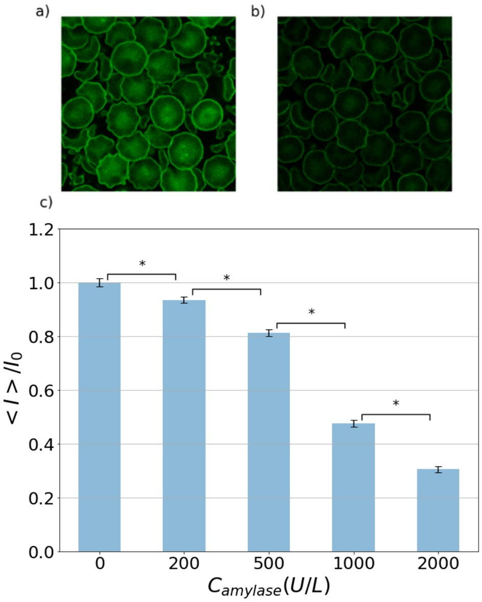

(a)未经淀粉酶处理的红细胞；(b)经2000U/L淀粉酶处理的红细胞；(c)归一化荧光强度（表示糖萼完整度）随着淀粉酶浓度的变化。

引：正常人类血液中的淀粉酶浓度为70-235U/L，在胰腺炎这种病理情况下甚至能达到上千。

红细胞的聚集由15mg/ml浓度的葡聚糖溶液（产生与生理状况下相近的聚集）诱导产生。聚集形态（asphericity）：

$$ASP=\frac{4\pi A}{P^2}$$

A为聚集体的投影面积，P为周长。

**没有流动时的聚集体形态学**

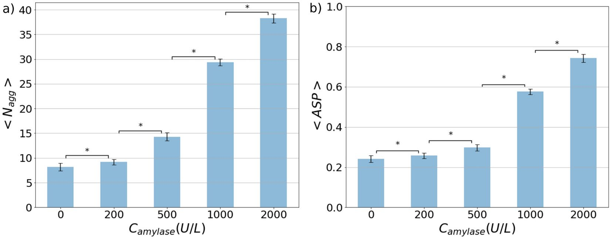

聚集体中红细胞的平均个数在正常生理情况下变化不大，然而到了活跃水平500U/L后，随着淀粉酶浓度增加而明显上升。在低淀粉酶浓度下，聚集体呈现出串钱状（rouleaux）；在高淀粉酶浓度下，更接近圆形。

**在流动中的聚集**

上：淀粉酶浓度为0；下：淀粉酶浓度为2000U/L

$\widetilde{N}$表示聚集体大小出现的百分比，它与聚集体大小大致呈指数衰减的关系，淀粉酶浓度基本只在大聚集体中出现作用。(b)图显示红细胞聚集体的大小大致保持在3个左右，只是随着淀粉酶浓度的增加而略微增加，这与静止流体中的结果不同；但是最大聚集体的大小则是明显上升。

**不同剪应力下红细胞聚集体的演化**

实验中发现最大聚集体的大小随着剪切应力的提升而增大（对于淀粉酶处理的组），这一点是反直觉的——普遍认为更强的剪切作用导致聚集体分裂。但是实验中增大剪切应力伴随着的时红细胞比容的上升，增加了红细胞相互接触吸引的可能性。本文依靠数值模拟来评估红细胞压容如何影响红细胞聚集的大小，期望将密度带来的影响消去，只剩下剪切应力的作用。数值实验中发现，聚集体的平均大小与红细胞容积大致呈线性关系（$H_t\sim5-30\%，流体环境静止$），将数值实验的数据进行拟合，体外实验中测得的最大聚集体大小除以对应红细胞浓度下的平均大小（见b）。首先聚集体的大小随着淀粉酶浓度增加而增加；其次，对于未经淀粉酶处理的红细胞，聚集体大小随着剪切应力增加而减小，这一现象随着淀粉酶浓度的增大而逐渐减小甚至消失。也就是说淀粉酶处理的红细胞聚集体对剪切应力解体的抵抗力增强。

更大的红细胞聚集体ASP指数更小，更表现出串钱状，这一点与淀粉酶无关；对于给定大小的聚集体，未经淀粉酶处理的ASP随着剪切应力的增加而明显下降（更低程度的各向同性聚集），而经2000U/L淀粉酶处理的ASP对于剪切应力的敏感性要小得多。

使用数值仿真模拟了淀粉酶的作用（改变粘附力的大小）：

$\overline{\varepsilon_{adh}}=80$以上为病理情况。

## Erythrocyte-erythrocyte aggregation dynamics under shear flow

-引：在几种血液疾病中，如糖尿病和高胆固醇血症，以及冠心病，有报道称红细胞形成聚集的趋势增强[3-10]

引：Foresto等人[14]使用直接显微镜观察和数值处理比较了糖尿病患者和健康患者红细胞的聚集性。他们发现对于糖尿病患者红细胞聚集被大大增强。糖尿病、新月形红细胞症、怀孕都会导致更高的纤维蛋白

引：已有文献[15,16]表明，在这些患者（糖尿病患者）中，红细胞膜糖蛋白表面的降解（控制红细胞之间的电排斥和空间排斥）有利于聚集。因此，纤维蛋白原水平的增加和红细胞表面特性的改变（例如在糖尿病患者中）都可能导致粘附增强。

引：在太空任务期间的微重力环境下，有报道称，对宇航员血液的分析[18]显示淀粉酶活性增加。众所周知，这种酶可以部分消化细胞表面的糖萼，如红细胞和内皮细胞。这种降解促进了RBC-RBC聚集[19]及其与巨噬细胞的粘附。这突显了长期太空任务对心血管功能的潜在影响

-引：理论上已经有两种模型来描述红细胞之间的粘附机制。第一种是长期流行的桥接模型（bridging model），已被用于解释纤维蛋白原和中性葡聚糖大分子诱导的红细胞聚集[20]。该模型假设蛋白质吸附在红细胞膜上，并与附近红细胞形成交联[21]。第二种模型是耗竭模型（depletion model），指出悬浮分子（如纤维蛋白原）的构型熵在靠近红细胞表面时降低，导致耗竭层，因此当两个红细胞之间的间隙达到耗竭层的数量级时，纤维蛋白原分子在该间隙中的填充量比在其他地方少，这导致红细胞之间存在渗透吸引。

-将膜上的能量分为三类：弯曲能，膜不可拉伸部分以及吸附能。前两项在之前的文献摘要中有详细描述，第三项使用Lennard-Jones potential：
$$E_{i,j}^{adh}=\epsilon\oint_{m_i}ds\mathbf{(X_i)}\oint_{m_j}ds\mathbf{(X_j)}\phi (|\mathbf{X_i-X_j}|)\\
\phi=-2(\frac{h}{r_{ij}})^6+(\frac{h}{r_{ij}})^{12}$$
表示长程的吸引力和短程的排斥力，h是平衡距离，$\epsilon$是该距离下的最小能量

上表引用Brust2014，无量纲宏观黏附能

$$\overline\epsilon_{adh}=\frac{\epsilon_{adh}R_0^2}{\kappa}$$

取常见值$\kappa=4\times10^{19}J$，$R_0=3\mu m$。它满足$\varepsilon_{adh}\simeq1.6862h\varepsilon$

-**使用BIM**

-$\tau=0.65$

-该工作首先在通道中间制备两个囊泡，相隔一小段距离，使它们能够在没有施加流动的情况下相互粘附。一旦它们相互粘附并达到取决于粘附强度的稳态配置，就会施加剪切流。

-固定$Cn=0.4, \tau=0.65$，在该情况下，$1<\lambda<12$的范围内单个细胞都是tank-treading

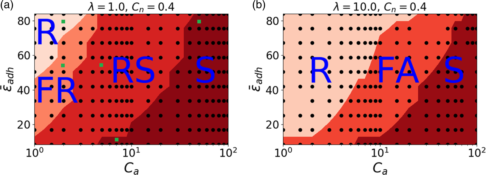

- **R: rolling，两个囊泡之间接触长度保持不变，并且出现类似于tumbling的旋转运动**

- **FR: flexible rolling，接触面从sigmoid转变到平直，循环往复**

- **RS: rolling and sliding，旋转过程中，接触长度发生明显变化**

- **S: separation**

- **FA: flow alligned**

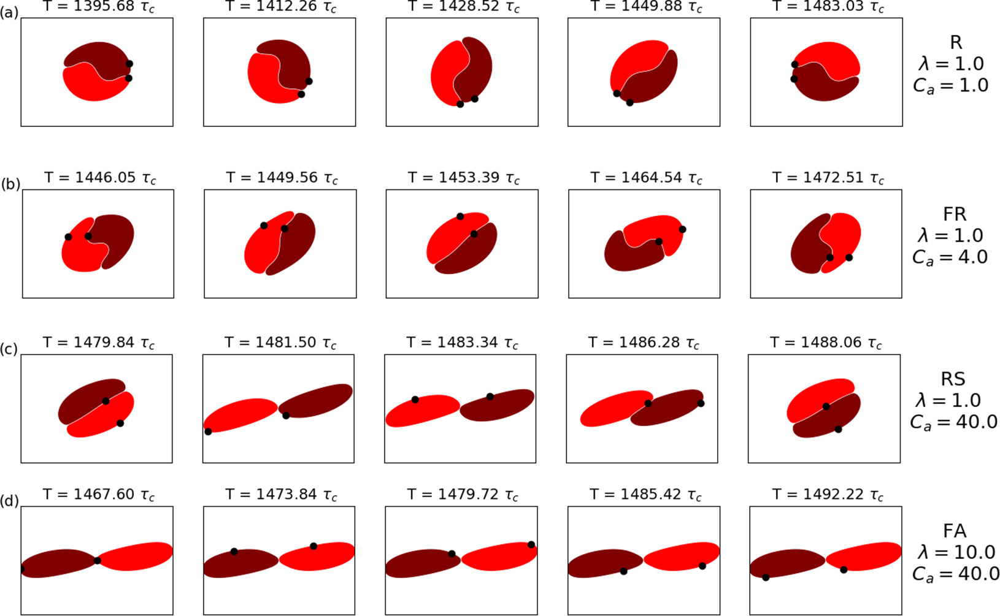

$\overline{\epsilon}_{adh}=84, C_n=0.4$

方点是3D仿真结果，域剪切弹性相关的毛细管数$C_s=\eta_0\dot\gamma R_0/\mu$，其中$\mu$是细胞骨架剪切模量，$\mu\simeq4\mu N/m$，它与弯曲相关的毛细管数之比$\mu R_0^2/\kappa\simeq100$

-引：我们在[26]中看到，在小粘附力下的平衡（无流动）下，细胞-细胞界面是平的，而在足够大的粘附能下，界面变形。从扁平到变形形态是一个超临界分叉。细胞间界面的形状由细胞间接触区变形幅度$A_s$的值表征（当$A_s=0$时，接触面时平的）。$A_s$的幅值其实就是衡量doublet**手型**的指标，doublet从低吸附力下的平接触面到高吸附力下的S形接触面，即是非手性向手性的转变。同样的，剪切流也是手性的：将一个剪切流表示为$(\dot\gamma y,0)$，它可以分解成一个拉伸流动$(\dot\gamma y/2,\dot\gamma x/2)$和一个有旋流动$(\dot\gamma y/2,-\dot\gamma x/2)$，前者时非手性的，后者是手性的。因为剪切流是手性的，所以无论粘附能如何，受此流影响的doublet都是手性的。事实上，如果剪切流下的doublet形状是非手性的，那么膜和粘附力也会是非手性，而施加在非手性形状上的手性流的粘性力是手性。因此，两者不可能相互平衡。

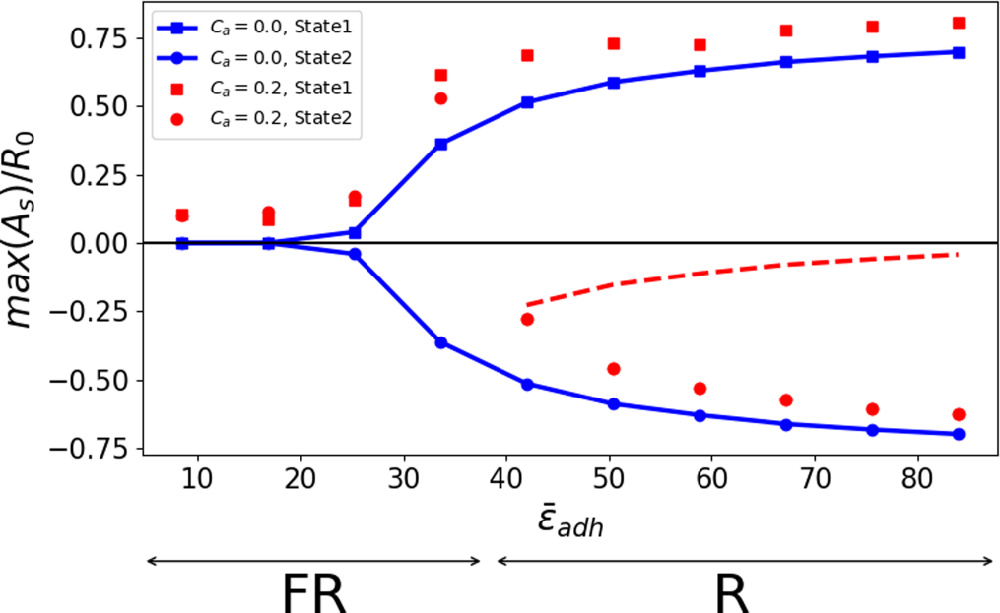

蓝线：没有外加流场的分叉图，红点：施加剪切流后的。虚线表示不稳定的分支。state1, state2分别表示互为手性的一对状态。剪切流下的分叉是不完美的，当黏附能较小时，无论初始状态是1还是2，最终都会到上分支

**相图的理论基础**

根据[Scientific Report](#The-buckling-instability-of-aggregating-red-blood-cells)的那篇文章的最小能量理论部分，可以将与接触面变形有关的能量写为$a(\beta-\beta_c)A_s^2+bA_s^4$的形式，其中$\beta\sim\epsilon_{adh}/\kappa$，$\beta_c$是分叉的临界值，$a,b$都是正常数。加入流动后由于界面变形所做的功与$CaA_s$成正比。于是总能量

$$E=CaA_s+a(\beta-\beta_c)A_s^2+bA_s^4$$

当$Ca=0$时，在$\beta<\beta_c$时，能量最小对应$A_s=0$，而$\beta>\beta_c$时对应$A_s\not = 0$；当考虑流场加入的能量时，出现了不完美的分叉。令$\partial E/\partial A_s=0$，要么只有一个非零实根（$\beta<\beta_c$），要么有3个实根（$\beta>\beta_c$），与上图外加流场的分叉图对应。

**粘度比的影响**

-相比于小$\lambda$，在大$\lambda$情况下，R区域扩大，RS区域消失转变为FA。事实上，当$\lambda$增大时，囊泡长轴偏离管道中心线角度减小，**flow aligned的情况下，doublet具有较小的拉伸张力，这不能有效地使两个囊泡相对于彼此滑动**

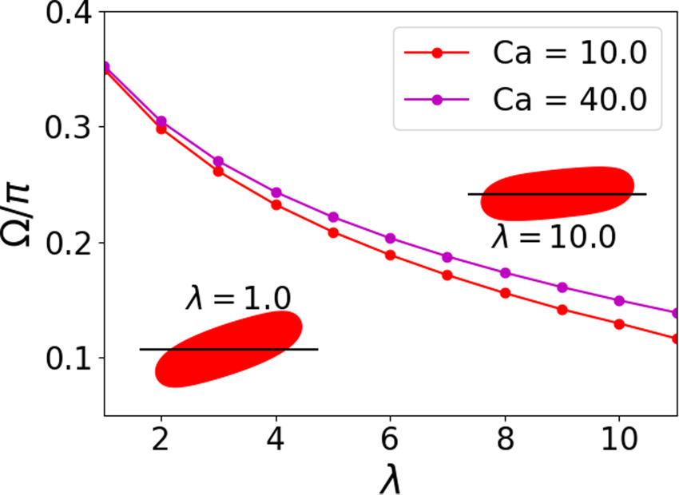

**doublet分离的机制**

-引：有人通过实验得出囊泡是通过旋转（而不是滑移，类似于tank treading）分离的。而且结合本文以上内容，S相的发生都要经过RS或FA（膜都做tank-treading的运动）。本文通过设置较小的限制（$C_n=0.2$，这种情况下$\lambda\simeq7$时就能发生tank treading 向tumbling的转变，$Cn=0.4$时需要到12）来减少膜上的tank treading

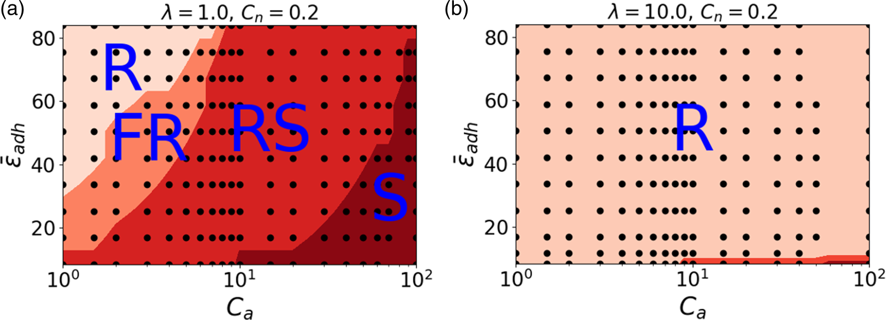

在单个细胞tumbling的参数条件下，即使是在大$Ca$情况下，doublet都十分稳定。doublet的精确形状是粘附力和弯曲能量之间竞争决定的（分别用$\overline{\epsilon}_{adh}$和$Ca$来表征），粘附力倾向于增加囊泡-囊泡交界面积（如S形），弯曲能量倾向于最小化变形，有利于更平坦的界面。不过试图通过绘制$Ca/\overline{\epsilon}_{adh}$和$\overline{\epsilon}_{adh}$的相图来解释，其实就是想说明单细胞更趋向于tumbling时，doublet会通过形态调整来提高抗解离能力。

-引：对于一个单一的红细胞，细胞膜的tank-treading可能性取决于毛细管数$C_s=\eta_0\dot\gamma R_0/\mu$（$\mu$为细胞骨架剪切模量），低$C_s$下容易发生tumbling，tank-treading指挥发生在高$C_s$情况下。取$\eta$为水的粘度，$R_0\sim3\mu m$，可以得到$C_s\sim10^{-3}\dot\gamma$，对于健康的红细胞从tumbling到tank-treading的转变大致发生在$C_s\sim0.1$。在人体的血管网络中，通常认为tank-treading只发生在小动脉中（只有这里剪切率可以达到$10^3 s^{-1}$的量级。在某些红细胞疾病中，如地中海贫血[44]、镰状细胞病[45]和疟疾[46]，膜剪切模量和细胞质粘度可能明显高于健康人。**对于病理细胞，膜tank-tread所需达到的剪切速率可能会显著增加[41]，因此其在体内发生的可能性不大。我们可以推测，在这种情况下，红细胞doublet和较大的聚集物变得不可逆，从而损害了组织和器官的血液灌注。**

**粘附能对瞬时归一化粘度的影响**

-有效粘度可以写为如下形式（十分稀疏的情况下）：
$$\eta=\eta_0(1+[\eta])$$
有效粘度是应力张量的xy分量与施加剪切速率的比值：
$$\eta=\frac{<\sigma_{xy}>}{\dot\gamma}$$
<...>表示面平均

根据Batchelor，无量纲粘度由下给出：
$$[\eta]=\frac{\eta-\eta_0}{\eta_0\phi}=\frac{1}{\eta_0A\dot\gamma}\sum_i[\int_{m_i}yf_xds+\eta_0(\lambda-1)\int_{m_i}(n_xv_y+n_yv_xds)]$$
第一项是由于膜力引起的动力学贡献，第二项是膜速度的运动学贡献

-引：已知单个囊泡同时表现出tank-treading（低比粘度）和tumbling（高比粘度）。根据粘度比，囊泡悬浮液既表现出剪切变稀，也表现出剪切增稠。但是对于目前所研究的参数，本文发现doublet的容易总是表现出剪切变稀的现象。在低$Ca$的请况下，doublet发生像刚体一样的rolling；增大$Ca$导致FR，这种情况下doublet随着时间变得扁平；类似的，RS下doublet在于流动对齐上花费一些时间，FA下粘度随着剪切率变化保持一个常数，这是因为构型的稳定。

$\lambda=10$中的高$Ca$区出现反直觉的现象：低的吸附能反而造成高粘度，这是因为此时从囊泡伸出多余的尾部，导致横截面积增加

## The buckling instability of aggregating red blood cells

-纤维蛋白原等血浆蛋白诱导红细胞（RBC）聚集成红细胞簇，红细胞簇负责血液的明显剪切稀化行为，控制红细胞沉降率（ESR）——一种常见的血液指标。

引：仅在弹性胶囊的情况下，由于弯曲和拉伸能量之间的相互作用，可能会出现屈曲不稳定性。在独立式胶囊中，由于渗透压或外部流动的剪切力，以及在囊泡中，由于非对称剪切分布或外部流动产生的剪切力，也观察到了屈曲现象。而对细胞之间作用力的影响讨论较少。

引：基于最小化膜自由能的两个红细胞之间聚集的理论研究表明，当改变相互作用能时，细胞之间接触区的几何形状会发生显著变化。其中一些形状已经在实验中观察到，但尚未作为葡聚糖（dextran）或纤维蛋白（fibrinogen）浓度的函数进行量化。

**doublet**

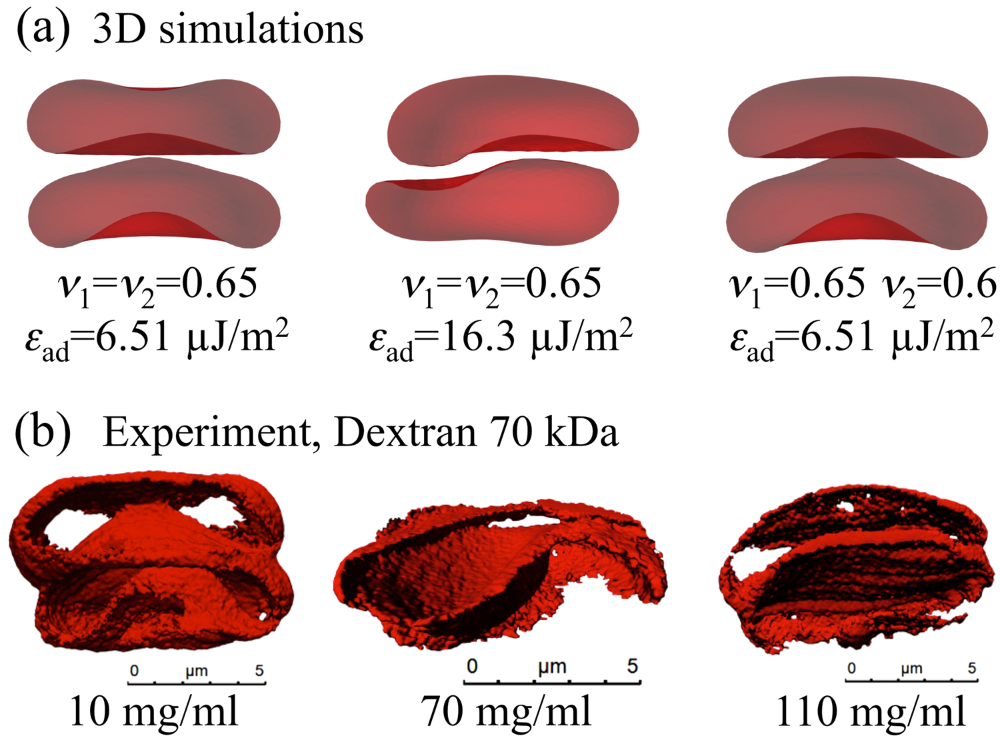

从左到右：male-female(convex-concave，凹凸) shapes，sigmoid shapes，male-female shapes 

引：已知聚团的数量和大小在生理范围内随着纤维蛋白浓度的增加而增加（从健康成年人的约3mg/ml到急性炎症期的10mg/ml）。聚团越多、越大，红细胞的沉淀就越快：通过简单地目视测量标准化玻璃毛细管中的沉淀，可以获得关于患者炎症状态的可靠、快速的信息。当然，红细胞形成聚集物的趋势也可能增加血栓形成和心血管疾病的风险，特别是在合并狭窄的情况下。

引：大分子诱导红细胞聚集的分子机制一直是有争议的研究主题。已经提出了两种模型：一种基于耗尽的物理效应，另一种基于物理吸附或桥接。它也可以由其他大分子诱导，如右旋糖酐（葡聚糖，dextran），这是一种在实验室实验中广泛使用的分子，也可以作为血浆膨胀剂和兽药。基于AFM的单细胞力谱、RBCs的流变学和沉降以及理论模型表明，葡聚糖浓度的增加首先导致RBC之间的相互作用强度增加，直至达到特定的大分子浓度。超过该最大值后，相互作用强度再次降低，细胞间聚集消失。这导致了特征性的钟形粘附能与浓度曲线。对于纤维蛋白原的情况，发现相互作用能随着浓度的增加而增加，但文献中的数据通常仅限于比葡聚糖低的浓度。

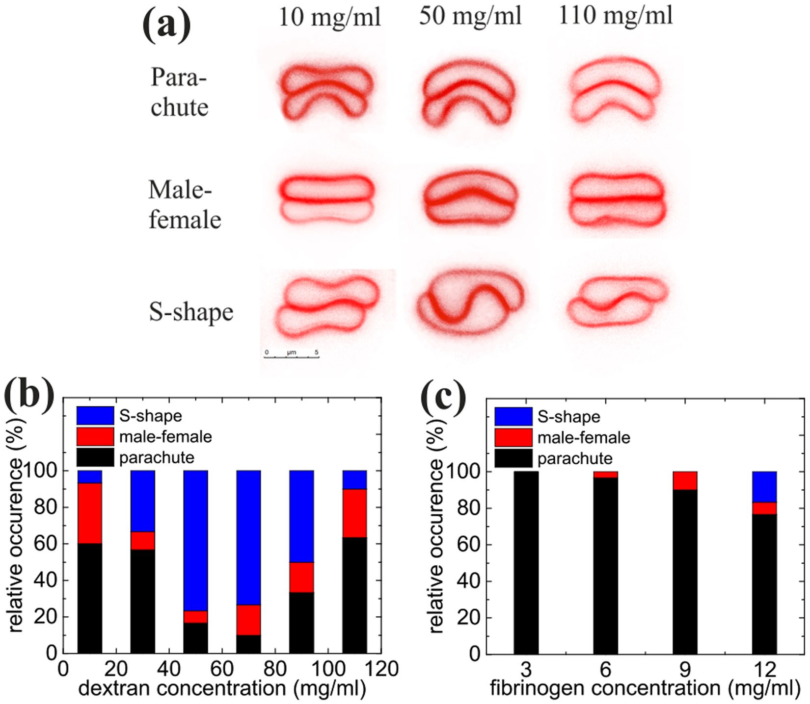

a图为葡聚糖溶液中的doublet，低浓度和高浓度下界面变形小，中等浓度下变形大。在葡聚糖溶液中，sipmoid shape在中等浓度下出现概率最大，说明更大的作用力导致更大的接触面积。

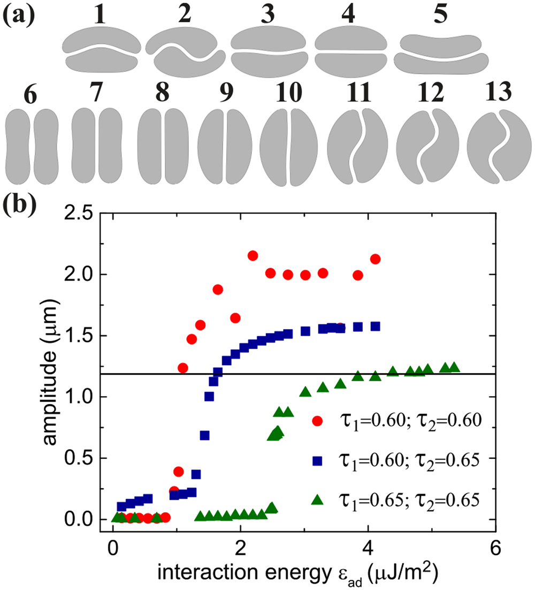

2D vesicles simulations

(1-5)：相同的作用能$\epsilon_{ad}=1.16\mu J/m^2$下不同reduced area。(1)$\tau_1=0.5,\tau_2=0.65$，(2)$\tau_1=0.60,\tau_2=0.60$，(3)$\tau_1=0.60,\tau_2=0.65$，(5)$\tau_1=0.65,\tau_2=0.65$，(5)$\tau_1=0.55,\tau_2=0.40,\kappa_{B1}=\kappa_{B2}=\kappa_{B}/4, \epsilon_{ad}=0.025\mu J/m^2$；

(6-13)：黏附能增大，固定reduced area为$\tau_1=\tau_2=0.65$。接触面的变形程度随着黏附能的变化如b所示（这个amplitude随着浓度变化的图片文中还有实验结果）。三维模拟中也给出了类似的结果（文章里有图片）：随着黏附能的增加，接触面逐渐从平坦变为S形。以上内容对应着动力学上的**超临界分叉**，以下提出了**最小化系统能量**的一个模型，从二维出发。

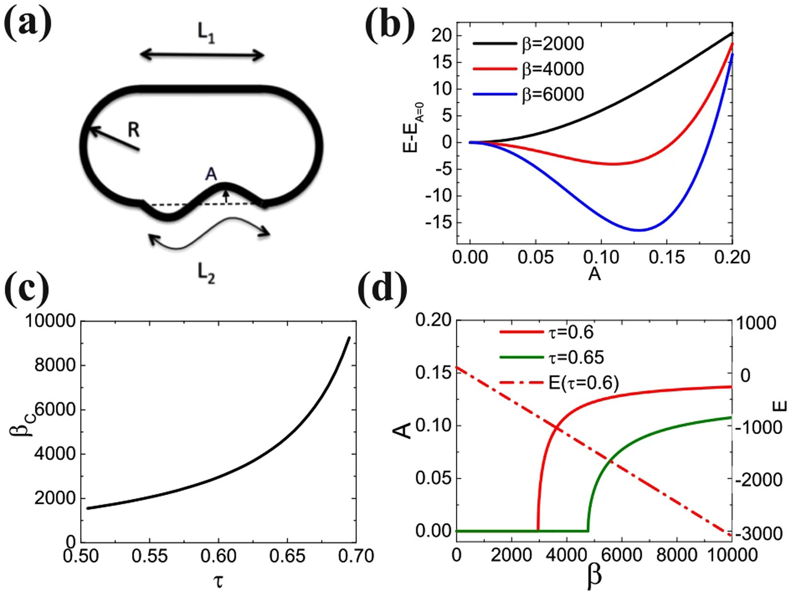

- interacting energy: 

$E_i=-\varepsilon_{ad}L_2$

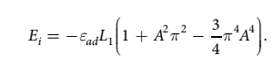

- curvature energy:

$E_b=\kappa\int c^2ds$，c为平面曲线的曲率，ds是弧长元
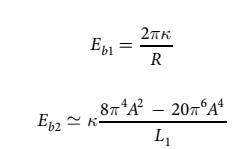

总能量$E=E_i+E_{b1}+E_{b2}$取决于$A,R,L$，同时保证面积$S$和周长$L$一致。

**归一化处理**：
- 无量纲总能量$E^*=EL/\kappa$
- 相互作用能$\beta=\varepsilon_{ad}L^2/\kappa$
- 所有长度使用L缩放
- reduced area$\tau=4\pi S/L^2$

L用于做放缩，将总能量用$E=E(\tau,\beta)$的形式表示，令E取最小值，对应了一个critical value$\beta_c$。上图b在$\tau=0.6$设置下、不同$\beta$下，由接触面变形造成的能量变化。

**larger RBC clusters**

用至少7个细胞的聚集体对较大的簇进行了表征。聚集体的快速沉降和任意取向只允许我们在将其放置在（BSA处理的）盖玻片上时对其进行成像。这里只关注右旋糖酐溶液中线性结构的红细胞叠连。

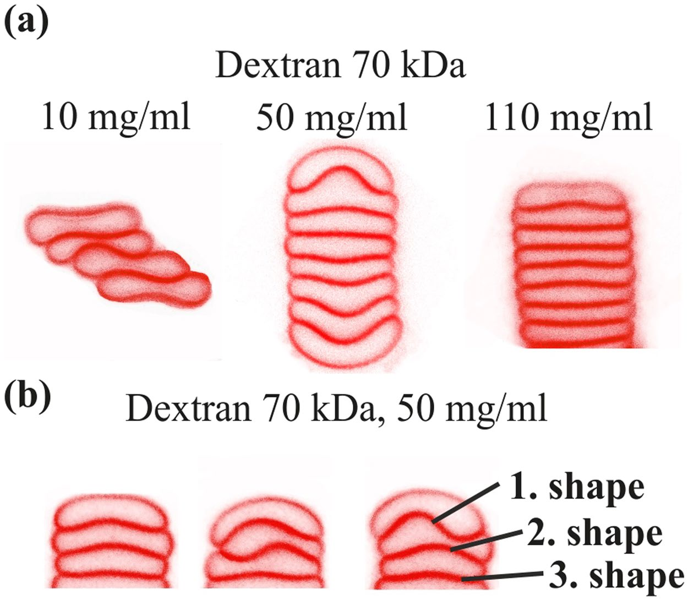

10mg/ml下，细胞串横向位移，并未聚集；更高葡聚糖浓度下发现了较大细胞聚集体，只有前三个细胞的接触面产生了较大变形，其他的通常是male-female形式。

