# 文献摘要

## Distribution Networks Achieve Uniform Perfusion through Geometric Self-Organization

在没有流量波动和其他缓解因素的情况下，大多数网络架构，无论是异构还是统一的，都不会平均分配营养物质：一般来说，上游的组织会比下游的组织吸收更多的营养。（见下图）

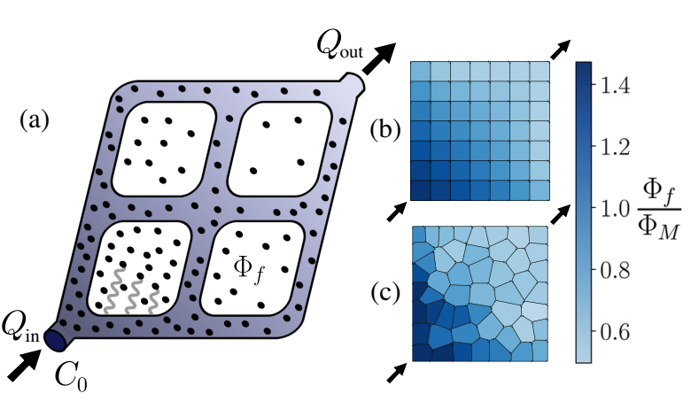

拓扑均匀的网络中，随着营养密度的衰减，营养面吸收密度出现梯度。$\Phi_f$：营养吸收密度。

在这里，我们证明了**任意初始网络**可以使用**基于局部信息的简单几何和生物学上合理的适应规则**进行**自组织**，以实现**均匀的营养灌注**。我们将边**半径限制为相等**，但允许**边长和网络连接的自由度**。

考虑半径为$r$的毛细血管，长度为$L$，界面平均流速为$u$。营养被对流输运，同时以扩散常数$k$扩散。记$\nu$为毛细血管膜的代谢吸收率。营养浓度在毛细管中的衰减以形式

---
**由于原文中描述比较简略，不利于理解，以下为具体推导：**

管内沿 $z$ 方向的营养物通量为

$$
J(z)=QC(z)=\pi r^2uC(z)
$$

现在取一小段长度 $dz$。这一小段管壁面积为

$$
dA=2\pi rdz
$$

假设单位面积管壁吸收通量与局部浓度成正比，即

$$
j_{abs}=\nu C(z)
$$

那么这一小段内被组织吸收掉的营养物量为

$$
dJ_{abs}=j_{abs}dA=2\pi r\nu C(z)dz
$$

于是有

$$
dJ/dz=-dJ_{abs}/dz=\pi r^2u\frac{dC}{dz}=-2\pi r\nu C
$$

即

$$
\frac{dC}{dz}=-\frac{2\nu}{ru}C
$$

其解为

$$
C(z)=C(0)e^{-\frac{2\nu}{ru}z}
$$

以上表达式写为文章中的形式，对应$\beta=\frac{2\nu L}{ru}=2S$。与文章中给出的形式不同，因为其还考虑了扩散效应：

$$
u_z(\rho)\frac{\partial c}{\partial z}=k[\frac{1}{\rho}\frac{\partial}{\partial\rho}(\rho\frac{\partial c}{\partial\rho})+\frac{\partial^2c}{\partial z^2}]
$$

且壁面处的吸收边界条件：

$$
-k\frac{\partial c}{\partial\rho}\vert_{\rho=r}=\nu c(r,z)
$$

---

$$
C(z)=C(0)e^{-\beta z/L}
$$

其中衰减因子$\beta$：

$$
\beta
=
\frac{24\,\mathrm{Pe}}{48+\alpha^2/S^2}
\left[
\sqrt{
1+\frac{8S}{\mathrm{Pe}}
+\frac{\alpha^2}{6\mathrm{Pe}S}
}
-1
\right].
$$

其中Peclet数$Pe=uL/k$，$S=\nu L/ru$表示吸收率与对流率的比值，$\alpha=\nu L/k$。边营养吸收率为

$$
\phi
=
\pi r^2 u C(0)
\left[\frac{
\frac{\alpha^2}{12S\mathrm{Pe}}
+
\frac{2S}{\beta}}
{
1+\frac{\alpha^2}{4S\mathrm{Pe}}
}
\right]
\left(
1-e^{-\beta}
\right).
$$

该模型的假设是扩散时间尺度远小于对流时间尺度：$ur^2/kL\ll1$，毛细管细长：$r/L\ll1$，吸收长度尺寸远大于毛细管半径：$\nu r/k\ll1$。在$\beta\ll1$的极限下，该表达式可以简化为$\phi\approx2\pi rL\nu C(0)$。使用上式计算各边的$\phi_{ij}$。首先使用节点处的流量守恒定律以及欧姆定律：壁面给的阻力写为哈根-泊肃叶定律：$R_{ij}=8\mu L_{ij}/\pi r^4$。此处考虑的网络分别只有一个源和汇。每个节点处，同时还要满足营养通量的守恒：$\sum_{k,Q_{ki}>0}C_{ki}(L_{ki})Q_{ki}=\sum_{j,Q_{ij}>0}C_{ij}(L_{ij})Q_{ij}$，$Q_{ij}>0$表示流动方向为从i到j。

使用每个面$f$的营养吸收率$\Phi_f$表示均匀性。假设营养物质在组织内自由扩散，则其定义为从相邻边缘接收的营养物质，按面部体积缩放：

$$
\Phi_f=\frac{1}{4rA_f}\sum_{(ij)\in f}\phi_{ij}
$$

每个面的厚度为$2r$，同时还需要考虑一条边供给着两个面。记$\Phi_M$为组织代谢需求，是由细胞活性水平决定的常数。

采用了一种类似于vertex模型的面均衡算法，该算法在网络顶点上施加力，允许它们的位置移动（这种vertex模型似乎在细胞力学研究里被广泛使用）。顶点（vertex）受到来自具有高营养密度的相邻面的推力和来自低密度面的吸引力。允许边界上的顶点移动，但运动仅限于纯粹的水平或垂直方向，以保持方形网络边界。当所有相邻的面都达到相同的营养吸收密度时，顶点力变为零。通过这种方式，高营养密度面生长，低密度面收缩，直到整个网络的灌注均衡。

以下展示一个 50 Voronoi网络（50个面）的例子，网络边界长$10cm$，毛细管半径$r=0.5mm$，入流量$Q_{in}=100\mu L/min$，考虑氧气的运输：$k=3\times10^{-9}m^2/s$，其在水中的溶解率给出了初始浓度$C_0=7\times10^{-3}kg\cdot m^{-3}$。氧气吸收率由毛细血管膜决定，$\nu=4\times10^{-4}m^{-1}$。组织的代谢需求$\Phi_M=8\times10^{-16}kg m^{-3}s^{-1}$。这种平衡方程的形式类似于生长产生的压力。

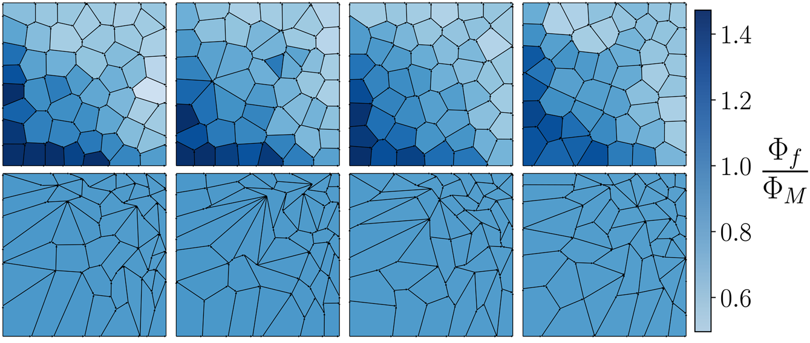

平衡后的网络中，离源越近的面越大（见下图ab）。定义$p_0=周长/\sqrt{面积}$，称为face shape parameter，用于表征面的拉长程度。（对于固定边数的多边形，正多边形最小）。靠近源的面往往更加紧凑，而靠近汇的拉长更多（见下图cd）。由于远离源头的面部每条边缘的营养吸收较少，因此它们通过增加每单位面积的面部总周长来补偿相同的营养吸收密度。

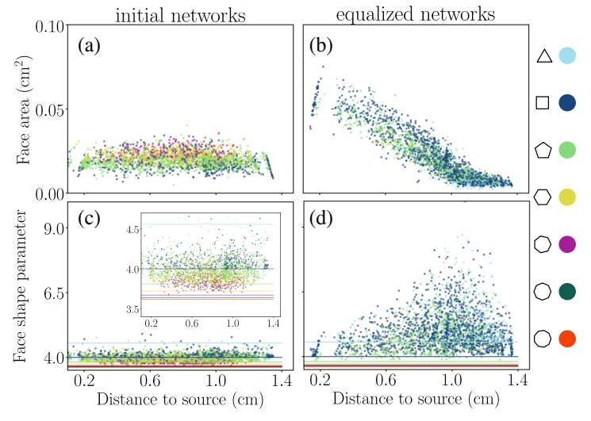

(c)(d)中各色直线表示正多边形的face shape parameter。

将平衡后的$<\Phi_f>/\Phi_M$视为网络的效率：如果效率大于1，则均衡网络满足组织的代谢需求。为了评估均衡网络，提出了一种网络不对称性的度量方法，定义为靠近出口的面数与靠近入口的面数之比。（对于初始网络不对称性约为1，对于平衡后的网络更大）高度不对称性表明在均衡过程中发生了大量的拓扑变换，这意味着初始网络不适合参数的选择。

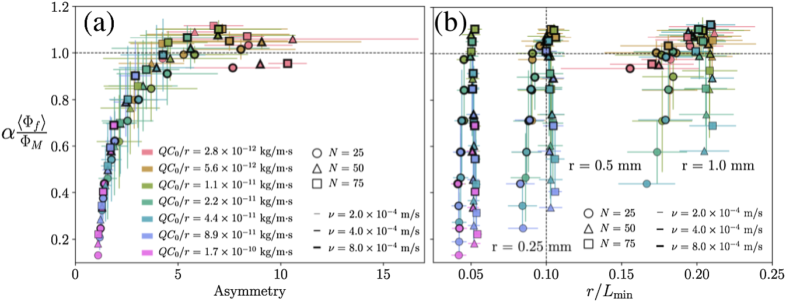

(a)中网络的效率随着不对称性的变化其实对应着平衡过程的几何变化。

需要注意的是，由于最终网络的不对称性没有上限，靠近汇会产生很小的面，对应着很短的边，此时$r/L\ll1$的假设失效。由此需要设置一个$L_{min}$。

引：细管网络可以感知通过壁剪切应力和内部一氧化氮的流速，这是对低氧水平的反应，并调节血管直径以确保维持足够的操作水平。

## Physical and geometric determinants of transport in fetoplacental microvascular networks

人类胎盘特别是介导了重要溶质的交换，包括呼吸气体和营养物质。

三维成像给出了胎盘结构的细节：

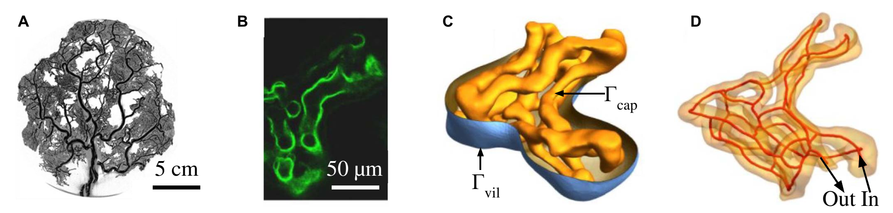

(a)微x射线断层扫描成像（引） (b) 共聚焦显微镜成像 (c)末端绒毛的分割共聚焦图像显示了胎儿**毛细血管的表面**$\Gamma_{cap}$（黄色）和与母体血液接触的**周围合体滋养层细胞**（蓝色；$\Gamma_{vil}$）(d)中红线表示毛细血管的中心线。胎儿血液占据$\Gamma_{cap}$内的体积$\Omega_b$；绒毛组织占据$\Gamma_{cap}$和$\Gamma_{vil}$之间的空间。

先前的研究已经证明，在扩散距离较小的毛细血管中，高扩散溶质的运输是受流量限制的（由胎儿母体血液的流速决定），而在绒毛膜较厚的毛细血管中缓慢扩散溶质的输送是受扩散限制的。最新的成像数据可以更全面地描述控制胎盘微血管溶质转运的主要几何特征和物理过程。

### 结论

#### 胎盘网络中溶质传输的理论

胎儿血液流动使用 Stokes 方程，溶质浓度$c$遵循线性的对流扩散方程：

$$
B\bm{u}\cdot\nabla c=D_p\nabla^2c
$$

其中$D_p$是血浆中的溶质扩散系数，对于大多数溶质，$B=1$，但是对于可以被红细胞促进的运输，例如氧气：$B=1+c_{max}Kk_{hn}/\rho_{b1}\approx 141$。$c_{max}$是胎儿血液在完全饱和时的氧含量，$K$是线性化胎儿氧合血红蛋白解离曲线的梯度，$k_{hn}$是亨利定律系数，$\rho_{bl}$是血液密度。绒毛组织中溶质的运输遵循扩散方程$D_t\nabla^2c=0$，边界条件如下：

对于氧气，假设$c_{mat}\approx0.07mol/m^3$

定义网络的净溶质传输$N$为穿过$\Gamma_{vil}$（或等价的$\Gamma_{cap}$）的扩散童通量，由于$\Gamma_{in}$处的扩散通量可以忽略不计，于是有：

$$
N=\iint_{\Gamma_{out}}Bc\bm{n}\cdot\bm{u}dA
$$

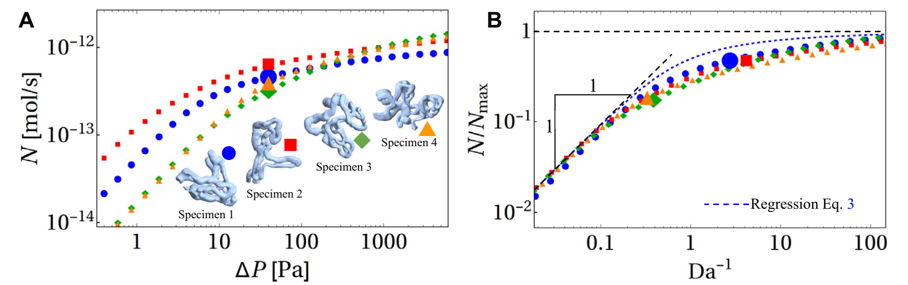

(a) 对于考虑的四种绒毛内的微血管网络，扩散净通量都随着压降的增大单调上升（对于氧气）。希望理解不同的网络结构如何影响$N$与$\Delta P$的关系，可以通过与结构运输有关的无量纲量及变量进行。当$\Delta P$很小时，溶质在离开血管网络时就已经达到了饱和，此时$N$由流量$\Delta P/\mathcal{R}$决定：$N=\Delta cB\Delta P/\mathcal{R}$；当传输受到扩散制约是，$N$产生上限：$N=N_{max}\equiv D_t\Delta c\mathcal{L}$，其中$D_t$是组织见扩散系数，$\mathcal{L}$是绒毛的特征长度尺寸。（事实上，$N_{max}$由积分$N_{max}=-\iint_{\Gamma_{cap}}D_t\bm{n}\cdot\nabla cdA$在以下边界条件下得到）

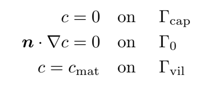

可以使用无量纲参数将绒毛组织中每单位浓度的扩散能力$D_t\mathcal{L}$与沿血管的扩散能力的尺寸等效度量进行比较：

$$
\mu=\frac{D_t\mathcal{L}}{D_pL_c}
$$

其中$D_p$是血浆中的溶质扩散系数，$L_c$是绒毛内血管长度的度量（取为中心线的总长度）。扩散和流动受限状态下的通量比定义了一个无量纲的达姆克勒数：

$$
Da=\frac{D_t\mathcal{LR}}{B\Delta P}
$$

其也被解释为血管网络内平流的时间尺度与通过组织的扩散时间尺度的比率

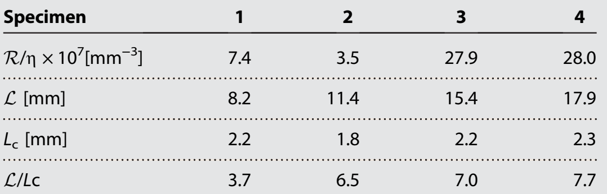

这里血液的粘度统一：$\eta=2\times10^{-3}Pa\cdot s$。(b) 尽管网络结构存在显著差异，但这些数据在经过无量纲化后明显归并到同一条趋势曲线附近，**随着 $\mathrm{Da}^{-1}$ 增大，传输过程会从流量受限状态平滑过渡到扩散受限状态**（同$\Delta P$增大的作用）。打标号对应$\Delta P=40Pa$，不同网络具有不同的流动阻力，从而导致不同的$Da^{-1}$。得到回归公式关系（有之前工作的基础）：

$$
N=\frac{N_{max}}{Da(1-e^{-Da})^{-1}+Da_F^{1/3}}
$$

其中$Da_F^{1/3}=\mu^2Da/\alpha_c^3$解释毛细管内浓度边界层的传输，$\alpha_c\approx5.5$。它给出了流动限制传输（$N\approx N_{max}/Da, Da\ll1$）与扩散限制传输（$N\approx N_{max}, Da^{-1}\gg1$）之间的光滑过渡。这种转变可见以下相图的纵坐标变化。上式中，如果$\mu$很大（快速透壁扩散），可能会产生边界层效应，为Da的中间值引入中间弱流限制状态。对于本仿真研究的四个氧气传输的样品，$Da$的变化能大于一个量级（对应结构导致的阻力变化），而$\mu$的变化约为2倍。

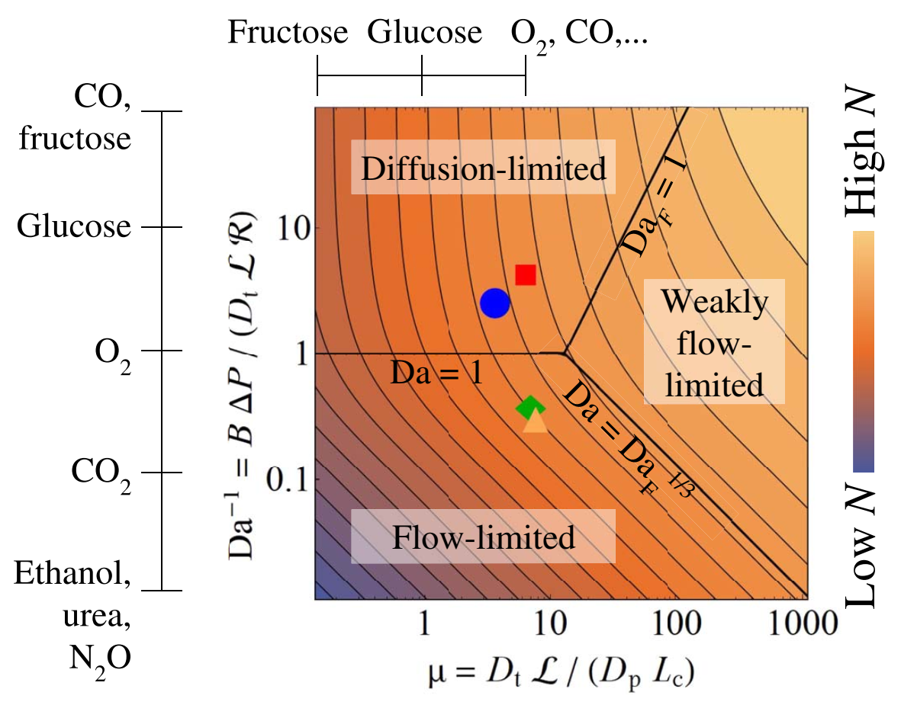

还可以将此分析拓展到其他溶质，比如甘露醇、果糖或一氧化碳就是强扩散制约的；麻醉气体（如一氧化二氮）、尿素和乙醇是强流动制约的。

#### 网络异质性

为了了解毛细管网络内溶质转移的空间变化，现在专注于单个毛细管水平的溶质交换。对于试样1的九个最长毛细管（下图A中突出，记为j），评估了缩放的净吸收$N_j=N_j/N_{max}$，随着整个网络压降$\Delta P$的变化（见下图B中的对数线性图）。缩放后的净吸收在血管样本中表现出异质性，在某些情况下包括非单调性（当然除了作为供体的被截断的那几支毛细血管，随$Da^{-1}$的变化还是与整体网络一致的，见小图）。特别的是，在$\Delta P$中间值，蓝色毛细血管的吸收超过了$N_{max}$；相反地，其临近的洋红色和绿色毛细血管运输量变号，从低压降下的氧气贡献者，转变为高压降下的氧气接受者。

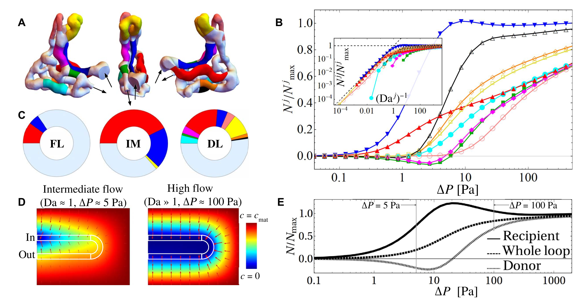

 flow-limited (FL) in the intermediate (IM) diffusion-limited (DL) 

为了更好地理解这种**donor-recipient机制**，考虑了如上图D中的简化模型。毛细血管环嵌入绒毛组织中，将溶质从入口（顶部）运送到出口（底部）。在中等的压降下，逆流效应将溶质从出口（donor）转运到入口（recipient）。顶部与底部毛细血管的净通量随压降的变化与B中的类似。

以上结论是在牛顿流体（均匀红细胞容积）的假设下得出的。为了评估血细胞比容对溶质运移的非牛顿效应，开发了一个离散网络模型，该模型依赖于完善的半经验Pries-Secomb模型（见下图）。

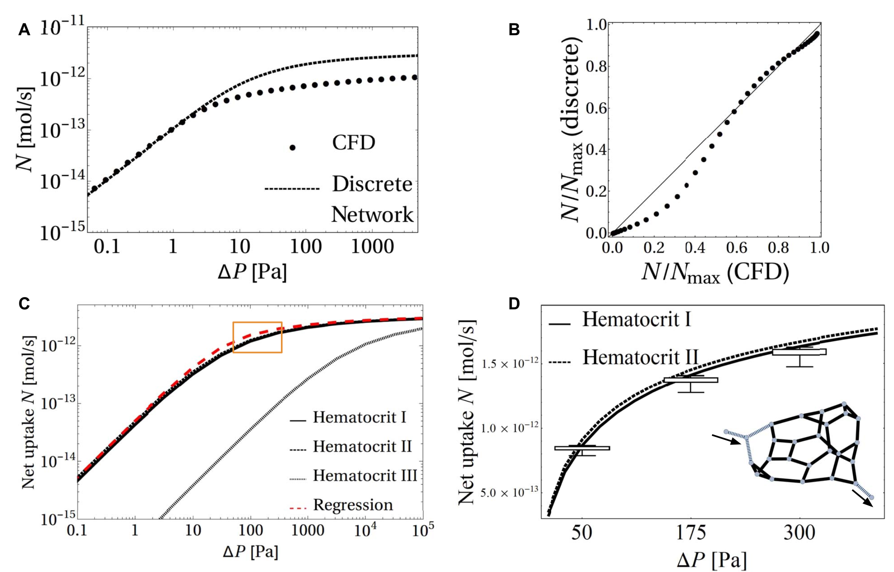

C中 Hematocrit1：均匀容积，B=141，2：不均匀容积，3：均匀容积，B=1。D中为C中框选部分的复制，在三个位置分别移除了33个图中标注的黑色毛细血管段，并计算N的值。即使有一段血管堵住，网络还是稳定的。

### 讨论

**模型缺点：**

1. 没有考虑绒毛组织本身对溶质的消耗
2. 母体血流被大幅简化（这里假定母体侧供给是稳定的）
3. 入口和出口血管的选择有不确定性
4. 无法处理膜蛋白转运的介质以及主动输运
5. 氧气-血红蛋白结合被简化，事实上氧气和血红蛋白之间的结合有各种非线性效应
6. 把血液连续化，弱化了红细胞颗粒性的影响（这个我们能做）
7. 离散网络模型会丢失三维空间相互作用