# 文献摘要

分类：群体智能与运动

## Novel Type of Phase Transition in a System of Self-Driven Particles

多粒子体系最重要的现象之一，就是在相变附近会出现复杂的协同行为；而过去几十年里，平衡态系统已经发展出一整套很成熟的理论语言，比如 scaling、universality、renormalization，用来理解这些集体现象。像聚集、黏性流动、生物图样形成这类 **nonequilibrium** 过程，同样也会表现出标度行为，而且在一些生长过程里，人们也已经看到了类似“相变”的行为。本文研究了一种很简单的、自驱粒子系统，其中每个粒子都以恒定速度运动，并在每一步把自己的方向调整为“**邻域内粒子平均运动方向 + 一个随机扰动**”。作者强调，规则虽然极简，但希望它足以产生聚集、输运和相变这三类非平衡集体现象。换句话说，这篇文章的出发点不是“尽可能真实地模拟某种具体生物”，而是要找一个最小模型，看仅靠“局域对齐 + 噪声 + 自驱动”是否就能自发产生宏观有序运动（鸟群，兽群，鱼群，细菌菌落等）。

>它为后来的 active matter（活性物质） 提供了一个几乎“标准教科书级”的基准模型。2025 年的 Rev. Mod. Phys. 直接说，活性物质这个领域“实际上是随着 Vicsek 模型的提出而诞生”的；而近年的综述也把 Vicsek 模型和 Toner–Tu 模型并列视为 flocking/极性活性物质最典型的粒子模型与连续模型。

实际模拟是在具有周期性边界条件的尺寸为$L$的正方形计算域中进行的。粒子由在平面上连续移动（脱离晶格）的点表示。使用相互作用半径$r$作为测量距离的单位（$r=1$），而时间单位$\Delta t=1$是方向和位置两次更新之间的时间间隔。在大多数模拟中，我们使用了最简单的初始条件：（i）在时间$t=0$时，N个粒子在计算与中随机分布，（ii）具有相同的绝对速度$v$，（iii）随机分布的方向为$\theta$。在每个时间步长同时确定粒子的速度$\{\mathbf{v_i}\}$，并根据以下公式更新第$i$个粒子的位置：

$$\mathbf{x_i}(t+1)=\mathbf{x_i}(t)+\mathbf{v_i}(t)\Delta t$$

t+1时刻的速度角度

$$\theta(t+1)=<\theta(t)>_r+\Delta\theta$$

$<\theta(t)>_r$表示给定粒子周围半径为r的圆内粒子（包括粒子i）速度的平均方向。上式$\Delta \theta$是一个随机数，在区间$[-\eta/2，\eta/2]$内等概率抽取，它就表示噪声。定义颗粒密度：$\rho=N/L^2$，固定$v=0.3$（当$v\rightarrow0$时，就是我们所熟知的XYmodel，当然我不了解）。当$v\rightarrow\infty$，粒子在两次更新之间完全混合，这一极限对应于铁磁体的所谓平均场行为。这里使用$v=0.03$，保证粒子总是与它们的实际邻居相互作用，并且在方向更新几次后移动得足够快以改变配置。事实上，$v$可以取0.003-0.3.

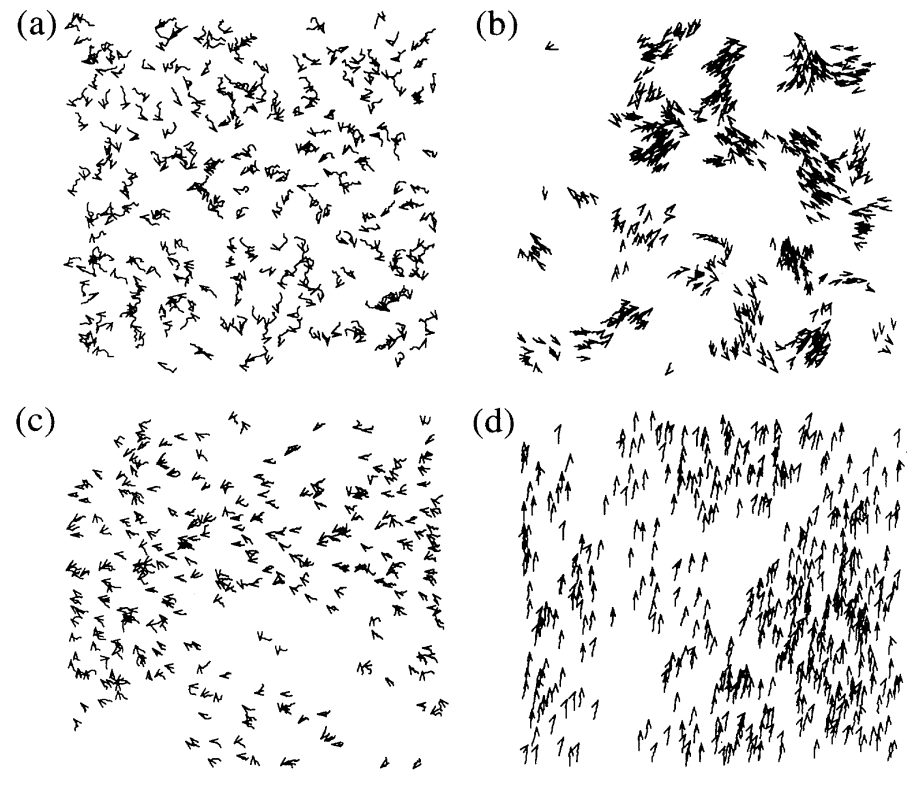

用小箭头代表颗粒的速度，将20个时间步的快照连起来，形成较短的运动轨迹。(a)$t=0, L=7, \eta=2.0$ ；(c)是(a)运动了一段时间后，颗粒以某种相关性随机移动；(b)$L=25, \eta=0.1$，小密度，小扰动，粒子倾向于形成在随机方向上连贯移动的群体；(d)$L=5,\eta=0.1$，大密度，小扰动，运动在宏观尺度上变得有序，所有粒子都倾向于沿相同的自发选择方向移动。

这种动力学相变是由于粒子以恒定的绝对速度被驱动，相互作用粒子的净动量在碰撞过程中并不守恒。我们通过确定平均归一化速度的绝对值，详细研究了这种转变的性质：

$$v_a=\frac{1}{Nv}|\sum_{i=1}^N\mathbf{v_i}|$$

当单个颗粒的运动方向是随机的，$v_a=0$；当整体一起运动时$v_a\simeq1$。将其作为一个序参量。

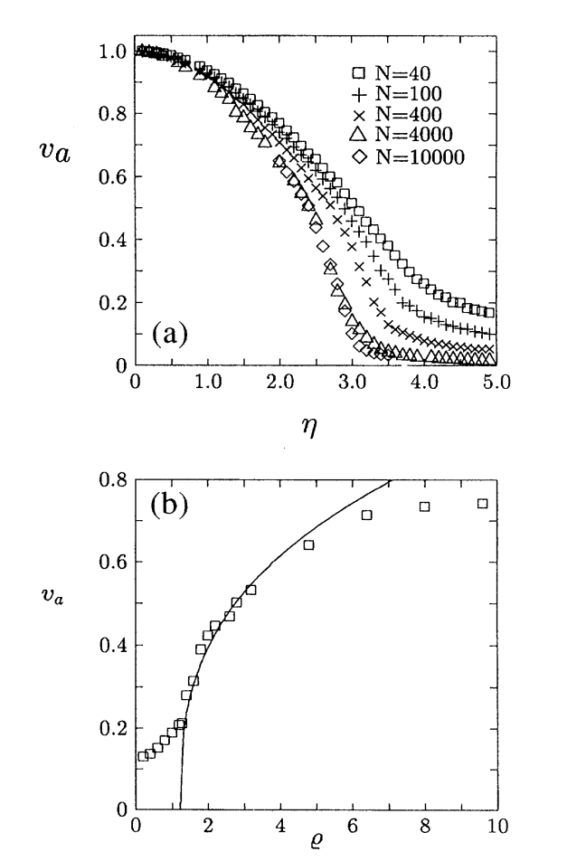

(a)保持密度不变（但是改变计算域大小），减小$\eta$发现从无需运动状态向共同运动状态的转变；(b)展示了当噪声保持一致时，$v_a$随着密度的变化。这里看到的不是一个有限尺寸造成的假临界现象，**因为随着系统尺寸增大，序参量的幂律标度区反而越来越宽**（见下图），这更像真正相变在热力学极限下逐渐显现出来。虽然粒子只和局域邻居对齐，但由于粒子不断运动和换邻居，取向信息会被持续带到更远处，因此系统具有一种由 mixing 产生的“有效长程耦合”。我们可以假设，在热力学极限下，我们的模型表现出类似于**平衡系统中连续相变的动力学相变**：

$$v_a\sim[\eta_c(\rho)-\eta]^{\beta},~~v_a\sim[\rho-\rho_c(\eta)]^{\delta}$$

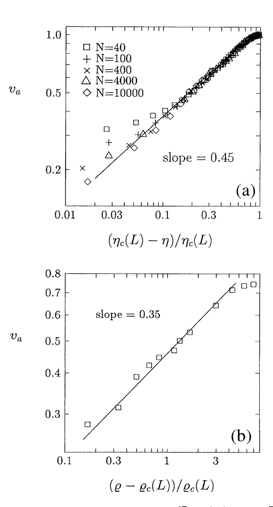

上图为$\ln v_a$与$\ln([\eta_c(L)-\eta]/\eta_c(L))$以及$\ln([\rho-\rho(L)]/\rho_c(L))$的变化关系（固定$\rho, \eta$下）。$\eta_c(L), \rho_c(L)$的选取满足以上关系为线性。当系统足够大时，有$\eta_c(\infty)=2.9\pm0.05$（$\rho=0.4$），$\eta_c$是依赖于$\rho$的，将整个系统看成无序铁磁体，$\eta$代表温度，$\rho$代表自旋密度，此时$\beta=\delta$。但在本文中有限尺寸下没有出现，因为有较强的crossover效应。

## omment on “Novel type of phase transition in a system of self-driven particles”

该评论讨论了了vicsek model在进行角度平均时可能出现的direction annihilation（方向湮灭）现象。即所有粒子的效果在半径为r的范围内完全抵消。根据定义$<\theta(t)>_r=arctan[<\sin\theta(t)>_r/<\cos\theta(t)>_r]$，即$<\sin\theta(t)>_r=<\cos\theta(t)>_r=0$的情况。

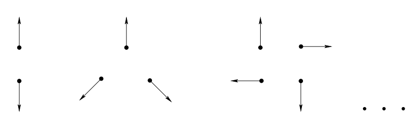

而且这种角度湮灭频率会随着扰动的增加、密度的减小而增加：

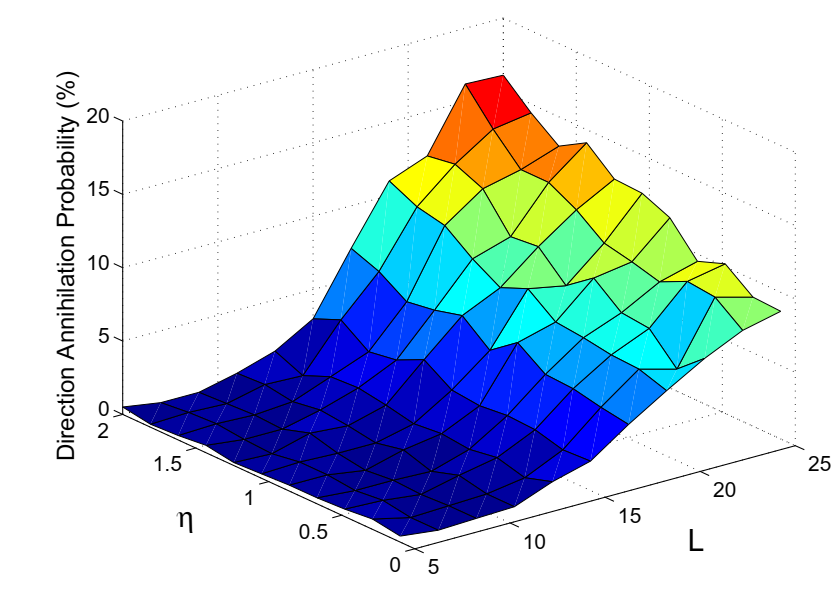

对此这篇comment给出了三种应对策略：保持原始方向，在半径r外增加一个最邻近的粒子，或在半径内移除一个最远的粒子。后两者分别相当于略微增大和减小半径。

## Long-Range Order in a Two-Dimensional Dynamical XY Model: How Birds Fly Together

[vicsek model](#novel-type-of-phase-transition-in-a-system-of-self-driven-particles)其实与2D的XY model 很像，因为其中颗粒的速度就行XY model的自旋一样，如果令更新的速度幅值趋近于0这时vicsek model就退化为2D xy model的monte carlo动力学。

简单介绍一下XY model：每个格点i上有一个二维向量：

$$\mathbf{s_i}=(\cos\theta_i,\sin\theta_i)$$

它与ising model的不同之处在于ising model每个点只有两个状态，即$\pm 1$；XY model的旋转是连续的。将能量写为：

$$H=-J\sum_{<i,j>}\cos(\theta_i-\theta_j)$$

这里$<i,j>$表示相邻格点，当$J>0$时，系统偏向于相邻自旋运动。XY model研究的是局域对齐倾向”和“热噪声”竞争之后，整个系统会不会出现宏观有序：一方面相互作用想让方向对齐，另一方面温度引入扰动。但是二维平衡 XY model 在有限温度下一般没有真正的长程序，正是因为vicsek是非平衡体系，粒子运动本身改变了涨落传播方式。

本文提出了一个连续的运动方程（EOM）：

$$\partial_t\mathbf{v}+(\mathbf{v}\cdot\nabla)\mathbf{v}=\alpha\mathbf{v}-\beta|v|^2\mathbf{v}-\nabla P+D_L\nabla(\nabla\cdot\mathbf{v})+D_1\nabla^2\mathbf{v}+D_2(\mathbf{v}\cdot\nabla)\mathbf{v}+\mathbf{f}
\\
\frac{\partial\rho}{\partial t}+\nabla\cdot(\mathbf{v}\rho)=0$$

注意动量方程中的对流项，它会将别处的速度结构输运，这也正是vicsek model 比XY model多的东西。式中$\beta, D_L,D_1,D_2$都是正数。右端项前两项为标准的landau型局域项，起作用是令系统自发选择一个非零的速度复制：$\alpha<0$，无序相，$\alpha>0$有序相2，有稳定非零速度$v_0=\sqrt{\alpha/\beta}$。压力项$$

**have not finished yet.**

## Particle robotics based on statistical mechanics of loosely coupled components

引：目前大多数机器人系统要么采用整体式机构，要么采用具有协调运动的模块化单元。这类机器人需要明确控制各个组件以执行特定功能，而一个组件的故障通常会使整个机器人无法运行。

这项工作的动机源于对模块化机器人更高可扩展性的需求，当机器人系统仅由这种**松散耦合**且**无个体特性**的粒子组成时，即可实现这种可扩展性。此外，还设想在几个（甚至许多）粒子发生故障或失效的情况下，这种设计将更具鲁棒性。

这种假设的可扩展性归因于几个因素，第一个因素与以下事实有关：单个粒子无需像大多数群体机器人系统中的每个模块那样具备更复杂的自由度，从而具有独立的运动能力。简单的粒子更容易大量制造和维护。这种设计的简洁性在微观尺度上尤其有价值，因为在微观尺度上，单个粒子的运动难以创建和控制。其次，通过消除单个粒子的身份和可寻址性，可以消除通常与非常大的群体相关的通信挑战。随机组织还消除了确定性模块化与大量单一机器中通常存在的单点故障。单点故障需要专门的修复和恢复程序。第三，这些粒子之间耦合松散，这使得它们在陌生环境中能够表现出更复杂的行为，如物体运输或避障。此外，只需倒入更多能够耦合在一起的粒子，粒子机器人就能生成、自我修复或增大尺寸和容量。

本文设计的机器人如下，由许多盘型的颗粒组成

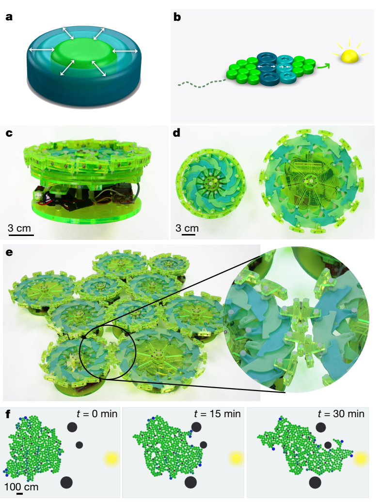

每一个颗粒只有一个自由度，只会做沿着半径的膨胀与收缩。这些粒子能够主动响应其局部环境，并通过非特定通信（仅广播）相互通信。此外，每个粒子都具有“粘性”，以确保其以大于静摩擦力的吸引力附着在相邻的粒子上（见上图e），同时保持足够的松散性，以便被动连接可以自发地断开和重新建立。由于每个颗粒只能简单膨胀与收缩，所以单个颗粒是无法运动的，即使是一对连接的颗粒也只能做简单振动，一堆颗粒也只能简单行走。

然而，当粒子被编程为以系统模式行动时，会出现有趣的行为。例如，当粒子响应于某种环境信号梯度而偏移其振荡相位时，个体的随机性会被引导为朝向信号源的系统性和稳健的集体运动（见上图b）

协调运动是通过调整每个粒子相对于其相对位置的膨胀-收缩周期的相位来实现的，上图b就是通过粒子与光源的距离调制振动相位。

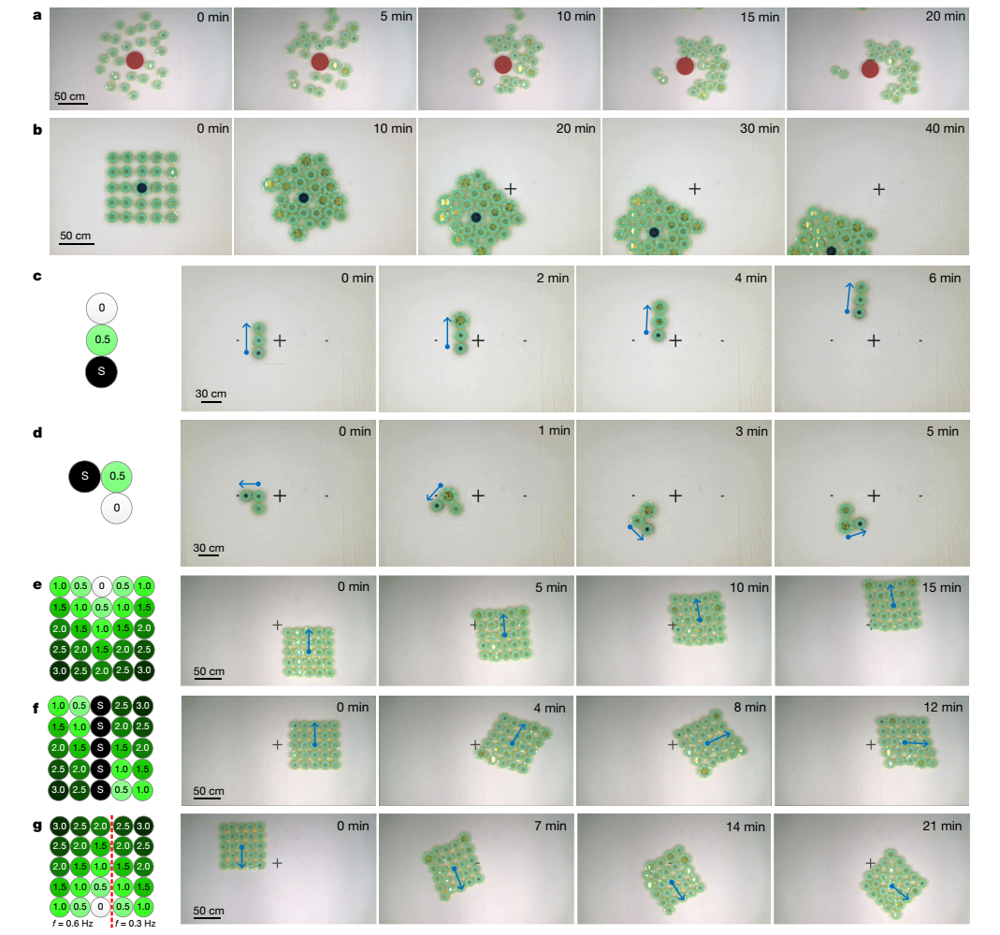

(a) 各个颗粒围绕障碍初始离散分布，随后慢慢聚集

(b) 随机分配的相位偏移导致不可预测的运动

(c) 连续三个具有按顺序分配的相位偏移的粒子表现出向前运动

(d) 将三个粒子重新定向为非对称配置会产生具有一致曲率半径的转弯

(e) 当相对于它们与顶部中心粒子的各自距离分配相位偏移时，一组粒子表现出向前运动

(f) 在中间包含一列非活动粒子，并指定镜像相位偏移模式，旋转。

(g) 具有非对称振动频率的粒子网格产生平移和旋转

以上颗粒中的数字表示相位偏移，单位为$\pi$，"S"表示非活动颗粒

为了实现由外部刺激引导的自主运动，本文开发了一种受生物学中集体细胞迁移现象启发的简单分布式算法。该算法规定，每个粒子的相位偏移与其感测到的信号强度成正比。

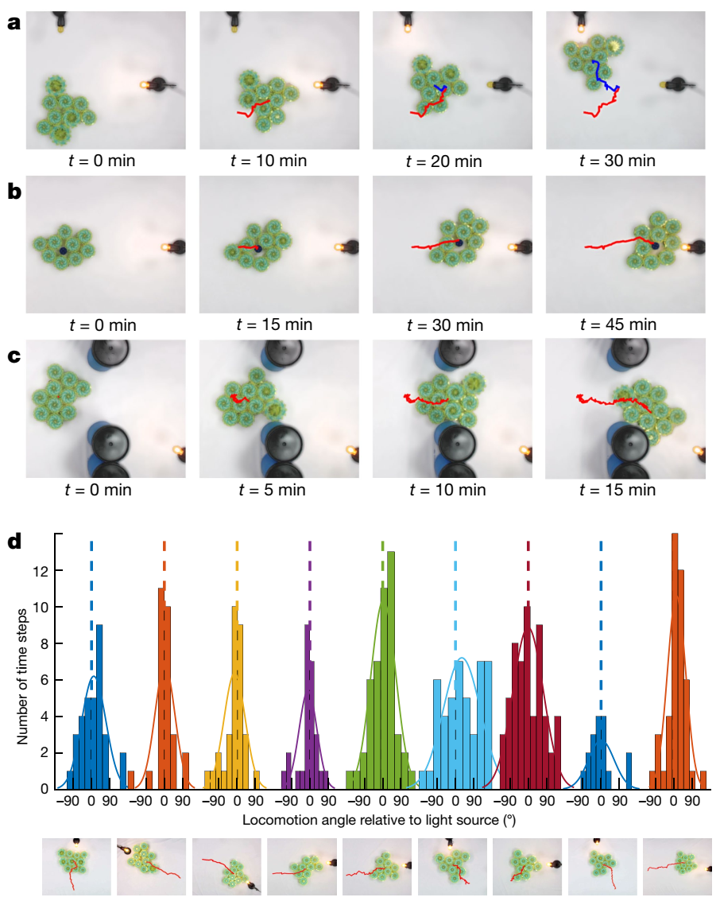

(a) 趋光性 (b) 运输物品 (c) 躲避障碍物

为了验证趋光性行为，测试了由九个或十个粒子组成的粒子机器人的九种任意配置（上图d），同时改变光源位置以消除实验装置的任何潜在方向偏差（例如，由于可能的方向摩擦或倾斜）

基于以上的物理特性，还进行了仿真实验：

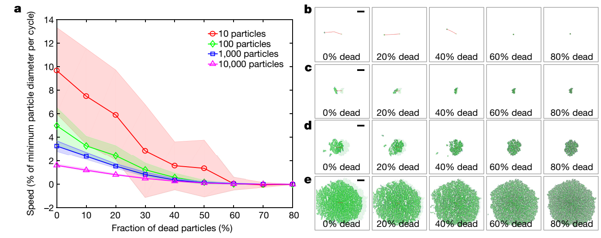

(a) 不同“死亡颗粒”比例下的运动速度。随着非活动颗粒的比例上升，运动速度单调下降，但是在$20\%$比例下，仍可以保持较大的运动速度，说明粒子机器人框架对单个组件故障的鲁棒性。粒子机器人的速度还取决于相位偏移响应的有效波长，定义为相位偏移开始重复的长度。随着粒子机器人尺寸的增加，可以在整个系统中观察到多波振荡，从而平均速度成比例降低。此外，随着系统中粒子数量的增加，方差显著减小，机器人的速度变得可以预测。

随着颗粒数量的增加，运动速度似乎会下降，这只是目前大颗粒版本仿真给出的结果。事实上这种机器人的最佳实现方式是微米尺度的小颗粒，此时颗粒之间不需要靠这种机械式的柔性连接，这里设想可以使用表面张力、电荷作用、化学键合等来作为颗粒之间的连接机制；同时颗粒的缩放可以由电、磁、光场这类高频振荡的外场来调控

## Collective phase transitions in confined fish schools

引：鱼群是一种广泛存在于物种和海洋栖息地的现象，具有生态和行为学相关性，在没有明显领导者的情况下，它是研究社会动物自组织和集体智能的模型系统。鱼群所表现出的空间模式的多样性被认为赋予了该群体迁徙、觅食和应对威胁的能力的功能优势，并可能塑造了生活在群体中的个体所经历的选择压力。

引：尽管野外和实验室环境中的鱼群与边界相互作用，但大多数模型都忽略了**边界效应**。自推进粒子的现象学模型遵循无边界域中的回避、对齐和吸引的简单规则，能够再现鱼群中观察到的许多集体模式，包括无序群集、成群旋转和群体极化。早期模型因其简单性、普遍性和适用于连续体公式而对活性物质物理学领域至关重要，但缺乏与生物观测的定量联系。后来的模型直接从浅水鱼缸中鱼类的经验数据推断出个体行为。然而，尽管基于在限制下收集的数据，但这些模型中出现的集体行为是在无界域中分析的。

### 数学模型

将单个的鱼建模为以恒定的相对于流体的速度$U$在平面圆形受限域运动的自驱动颗粒。颗粒之间的相互作用由之前文献中圆形水缸中的经验得到，包括

（难度有点大，先放一下）

## Model of Collective Fish Behavior with Hydrodynamic Interactions

schooling指的就是鱼的协调运动。

引：schooling对于鱼群的生存意义重大，可以更好地觅食零散的资源，逃避捕食者。当在结构化流中游泳时，鱼类可以利用其他鱼类产生的近场涡流来降低运动的能量成本。鱼使用它们的侧线（一种机械感觉系统），来感知周围的水流，这也被证明对集体行为至关重要。然而，现有的鱼类游动行为模型没有考虑流体力学作用。本文将实验数据驱动的吸引-对准模型与远场流体动力学相互作用相结合。

鱼被建模为在二维无界域中运动的自驱动颗粒。它们以常速度$v$相对于流体运动，惯性可以忽略（速度方向的改变可以瞬间完成）。物理上受外界影响有吸引、对齐（眼睛）、噪声、流体作用（侧线）—— 实验中得出经验模型：每个个体受到voronoi neighbors的强度为$k_p$（$m^{-1}s^{-1}$）的吸引，向它们的强度为$k_v$（$m^{-1}$） 对齐，以及旋转角度上有着标准差$\sigma$（$s^{-1/2}$）的噪声。所受流体作用力用基本偶极子（强度为$Sv$，其中面积$S=\pi r_0^2$，$r_0$为特征长度），除了考虑流体作用时有特征长度$r_0$，鱼被视为点颗粒。使用$v$与$k_p$无量纲化：长度尺度$\sqrt{v/k_p}$，时间尺度$1/\sqrt{vk_p}$。定义$I_{\parallel}=K_v\sqrt{v/k_p}, I_{n}=\sigma(vk_p)^{-1/4}, I_f=Sk_p/v$，它们分别表示对齐、噪声以及偶极子强度。无量纲方程如下：

$$
\mathbf{\dot{r_i}}=\mathbf{e_i^{\parallel}}+\mathbf{U_i}\\
\dot\theta_i=<\rho_{ij}\sin(\theta_{ij})+I_{\parallel}\sin(\phi_{ij})>+I_{n}\eta+\Omega_i
$$

速度方程表示坐标为$\mathbf{r_i}$的个体，以单位速度沿着它的方向$\mathbf{e_i^{\parallel}}$，漂移项$\mathbf{U_i}$由流体作用引起，使用远场近似。这里忽略了鱼尾部脱落的涡来保证模型足够简单易用。在这种势流假设下，每条鱼产生一个偶极子流场，可以运用叠加原理计算每条鱼受到的速度扰动$\mathbf{U_i}$:

$$
\mathbf{U_i}=\sum_{j\ne i}\mathbf{u_{ji}},\\
\mathbf{u_{ji}}=\frac{I_f}{\pi}\frac{\mathbf{e_j^{\theta}}\sin\theta_{ji}+\mathbf{e_j^{\rho}}\cos\theta_{ji}}{\rho_{ji}^2}
$$

其中$\mathbf{u_{ji}}$是j号泳者对位置$\mathbf{{r_i}}$处产生的速度扰动，$(\mathbf{e_j^{\rho}},\mathbf{e_j^{\theta}})$是随着j号泳者的极坐标。角速度的计算包含了吸引项、对齐项、随机扰动项以及水动作用力项。前两项对于Voronoi neighbors（记为$\mathcal{V}_i$）做平均。并且乘上权重$(1+\cos\theta_{ij})$，表示视野的作用：

$$
<\circ>=\sum_{j\in\mathcal{V}_i}\circ(1+\cos\theta_{ij})/\sum_{j\in\mathcal{V}_i}(1+\cos\theta_{ij})
$$

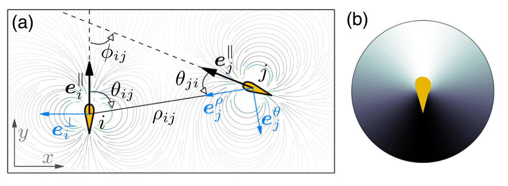

(b)中阴影表示$(1+\cos\theta_{ij})$造成的视野区域

由流动作用引起的旋转不是由涡量造成的，而是因为鱼体建模为一个有长度的颗粒，由法向速度梯度造成旋转：

$$
\Omega_i=\sum_{j\ne i}\mathbf{e_i^{\parallel}}\cdot\mathbf{\nabla u_{ji}}\cdot\mathbf{e_i^{\perp}}
$$

这里考虑$20\times20$box中$N=100$个初始朝向、位置随机的颗粒，时间步长$\delta t=10^{-2}$。出现了4种运动：

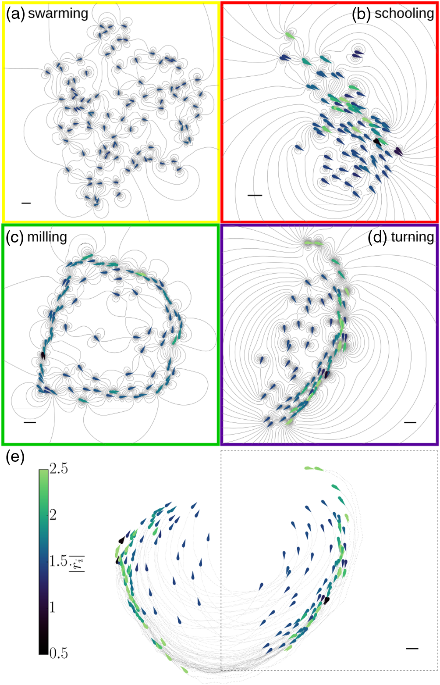

固定偶极子强度$I_f=10^{-2}$，scalebar为$10r_0$，颜色表示瞬时速度幅值。(a) $I_n=0.8, I_{\parallel}=0.5$，无序蜂拥（**disordered swarming**），此时噪声强度与对齐强度相当，甚至更大，颗粒组成一个没有优先方向的稀疏群体；(b) $I_n=0.5, I_{\parallel}=9$，**schooling**，此时对齐强度更大，群体更密集，个体倾向于朝同一方向游泳；(c) $I_n=0.3, I_{\parallel}=1.5$，**milling**，此时对齐强度与吸引强度相当，噪声较小或适中。以上三种现象可以在没有水动作用力下被发现。由水动作用力导致的一种特殊的现象称为**turning**：(d) $I_n=0.2, I_{\parallel}=4$，在这个新阶段，游泳者倾向于沿着一个优先的方向排列，同时，群体遵循一个大规模的准圆形轨迹（见e）。

定义以下全局序参量以及平均速度：

$$
P=|\mathbf{\overline{e_i^{\parallel}}}|, M=\frac{|\overline{\mathbf{e_i^{r}}\times\mathbf{\dot r_i}}|}{|\overline{\mathbf{e_i^{r}}}|\overline{\mathbf{\dot r_i}}|}, V=\overline{|\mathbf{\dot r_i}|}
$$

其中$\mathbf{e_i^{r}}=(\mathbf{r_i}-\overline{\mathbf{r_i}})/(|\mathbf{r_i}-\overline{\mathbf{r_i}}|)$为从群体质心到第i个个体的单位向量。上划线表示对于所有颗粒做平均。参数$P$表示极性，$M$表示milling，也是无量纲角动量（直线运动的群体对应0，完美的milling对应1）。

为了说明水动作用力的重要性，对于三种情况进行了系统的参数扫描：无流体作用力（$\mathbf{{U_i}}=0,\Omega_i=0$），只有水动力漂移而无旋转（$\mathbf{{U_i}}\ne0,\Omega_i=0$）以及完整的水动作用力（$\mathbf{{U_i}}\ne0,\Omega_i\ne0$）。对于以上参数扫描，$P, M, Y$都是在$\Delta t=100$后计算，并且每组算100次取平均。

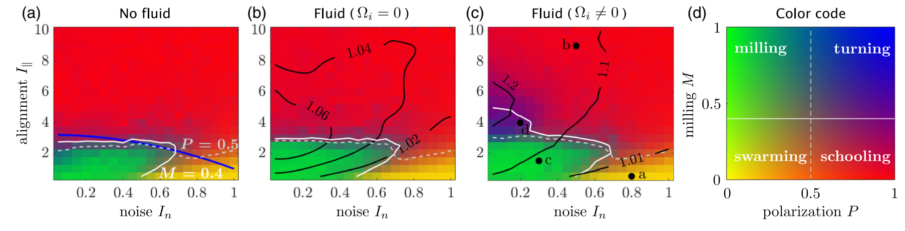

以上固定偶极子强度$I_f=10^{-2}$对于没有水动作用力的情况，另一篇文章的内容得到复现；当加入水动作用力但是忽略旋转作用时，相图没有什么变化，只是平均速度更大了点；当考虑完整的流体作用力时，出现了新的相：turning，V增大。

为了理解为什么当考虑到水动力相互作用时，个体的平均游泳速度总是更快，计算了随体坐标下其他游泳者存在的概率：

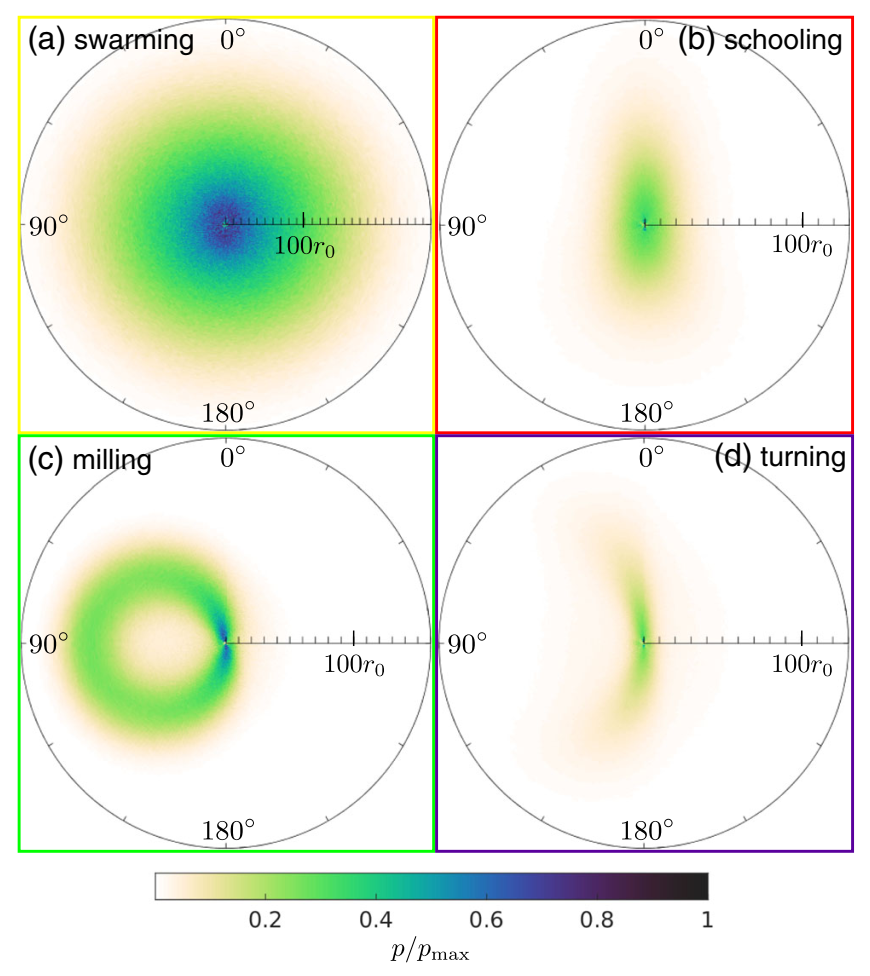

再与图2相同的参数设置下，收集了$\Delta t=900$时间段内颗粒的位置与朝向。对于swarming，各方向颗粒存在概率是各向同性的，于是平均下来水动作用力不会产生额外的速度；但是对于schooling，个体倾向于排队而不是并排有游动，导致密度分布沿垂直方向两极分化，造成游向速度增加；对于milling与turning同理。事实上，在水动作用力下，并排地运动变得不稳定（见附录里两体的例子）。

流体的作用不仅是增加速度，还有引入了不稳定源。以下固定噪声强度$I_n=0$，改变偶极子强度$I_f$：

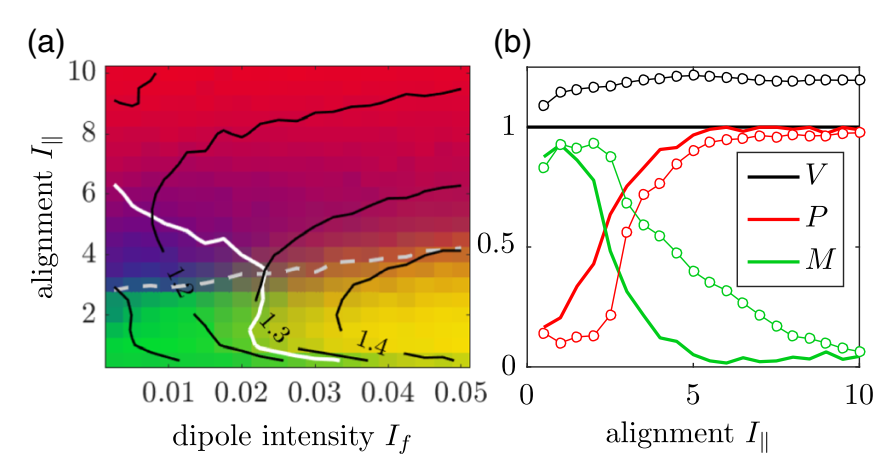

给出的相图与改变$I_n$时的很相似，当然也有些不同之处：首先平均速度随着偶极子强度增加而变大（之前是随着噪声强度增大而减小）；其次在大$I_f$，小$I_\parallel$下即使$P, M$都很小，也没有产生swarming相，由非常密集的准静态泳者组成。(b)图种实心标记$I_f=0, I_n=0.05$，空心标记$I_f=10^{-2}, I_n=0$。

引：尽管milling与turining是相似的，它们的起因并不同。milling相只有在泳者拥有各向异性的视觉时才稳定，然而turning即使是在视觉是各向同性时也还是稳定的，只是需要完整的水动作用力。尽管实验数据太少，无法支持真实鱼群中turning阶段的存在，但我们可以推测，出于能量考虑或面临危险时，在这个阶段实现的速度提升可能对群体有利。需要注意的是，当泳者数量较多时，milling和turning阶段可能会分成几个较小的group，从而影响序参数P和M的值。