# 文献摘要

## Non-reciprocal phase transitions

考虑**多组分矢量序参量的Landau型动力学方程**，其中矢量序参量$\bm v_a(t,\bm x)$可以表示群体a中flocking的平均速度，同步振子中的平均相位矢量，或者pattern形成中的振幅：

$$
\partial _t \bm v_a=\mathbb{A_{ab}}\bm v_b+\mathbb{B_{ancd}}(\bm v_b\cdot\bm v_c)\bm v_d+\mathcal{O}(\nabla)
$$

暂时省略了空间导数项，先主要讨论平均场意义下的相变。右端第一项为线性项，非互易性可以来源于$\mathbb{A_{ab}}\neq\mathbb{A_{ba}}$；第二项为三阶非线性项，为了保持旋转不变性（可以借鉴单个矢量序参量的landau动力学方程）。

由上式描述的动力系统以各种形式的非互易物质出现。例如，考虑**Kuramoto同步模型**：

$$
\partial_t\theta_m=\omega_m+\sum_nJ_{mn}\sin(\theta_n-\theta_m)+\eta(t)
$$

它描述了具有相位$\theta_m(t)$互相耦合的振子，频率$\omega_m$以及耦合强度$J_{mn}$，其中$\eta(t)$是随机噪声。如果将$\omega_m$设为0，将振子换为速度为$v_0$，方向为$\theta_m$的自驱动粒子，就是**vicsek模型**。在这两个模型中，当$J_{mn}>0$时智能体$m$试图与$n$对齐（$J_{mn}<0$时反对齐），在临界耦合之上，两个模型都表现出从非相干运动（非相干振荡）到群集（同步）的转变。现在考虑两个具有非互易作用的群体$J_{mn}\neq J_{nm}$（对于互异的相互作用，对得到静态构型，包括对齐相以及反对齐相，或者是无序相），会产生**手性相**，$\bm v_a(t), \bm v_b(t)$保持一个固定的相对夹角整体一起旋转。稳定的手性相位取决于噪声和多体效应之间的微妙相互作用，如果将Kuramoto模型中的噪声设为0，令每个个体的频率一致，系统最后都会对齐（或者反对齐），除非$-J_{BA}=J_{AB}$。

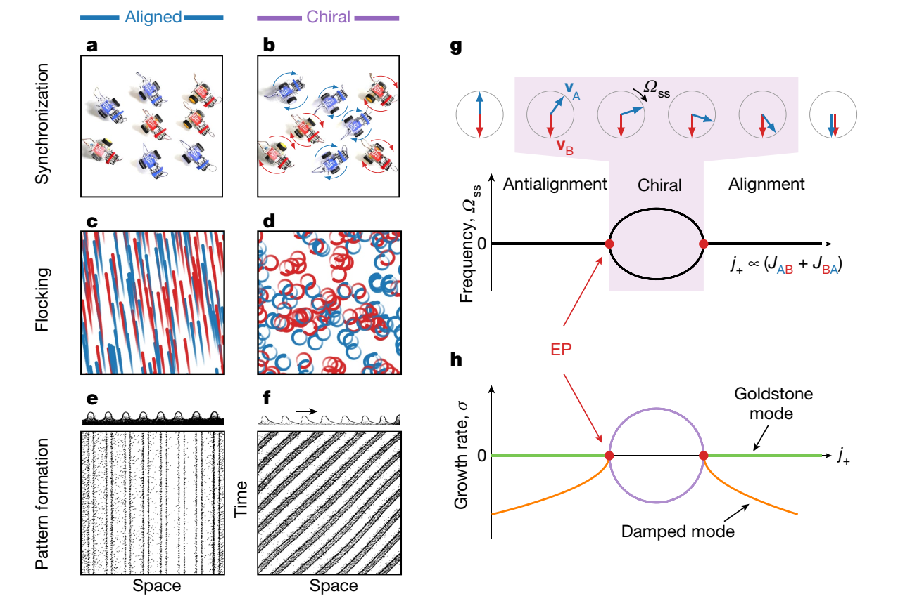

## Conformists and contrarians in a Kuramoto model with identical natural frequencies

本研究推广了kuramoto模型，振子同时具有正负耦合。其中正耦合类似于铁磁作用，倾向于令振子相位对齐；负耦合类似于反铁磁作用，令振子之间产生$\pi$的相位差。本模型的控制方程：

$$
\dot\phi_j^{(s)}=\omega+\frac{K_s}{N}\sum_{k=1}^N\sin(\phi_k-\phi_j^{(s)}).
\tag{1}
$$

上标$(s)$表示亚群（其中亚群1对应正耦合$K_1>0$，亚群2对应负耦合$K_2<0$）。这个模型对应的作用也不一定是互异的，一对耦合作用可能正好是相反的。

这个模型可以与政治观点形成很好地联系起来。现在，考虑一个没有固有的政治偏好的群体。对他们来说，重要的是别人怎么想。这样的人会根据他或她与主流情绪的关系，不断更新他或她的政治态度。有些人——顺从者——希望与传统智慧保持一致，无论它发生了什么，而相反的人本能地反对它。而问题就在于：取决于顺从者与反对者的比例，以及它们对主流观点的反应程度，从长远来看，这些人会做什么？分成两个阵营？未能达成任何共识？或者定期循环所有态度？正如我们将看到的，所有这些都是可能的长期结果，具体取决于模型参数的选择。

记$p$为正耦合振子的比例，于是系统$N$包含$pN$个顺从者以及$qN$个叛逆者，其中$q=1-p$。

### 降维

将模型重写为：

$$
\dot\phi_j^{(s)}=f+K_sg\cos\phi_j^{(s)}+K_sh\sin\phi_j^{(s)}.
\tag{2}
$$

其中$f=\omega, g=(1/N)\sum_{k=1}^N\sin\phi_k, h=-(1/N)\sum_{k=1}^N\cos\phi_k$。不失一般性，可以假设$\omega=0$。根据Watanabe–Strogatz变换，引入$u_j=\phi_j^{(s)}-\Theta_s, v_j=\psi_j^{(s)}-\Psi_s$（**WS 理论**说明，每个子群内$N_s$个相位变量可以由3个公共变量$\gamma(t), \Psi_s(t), \Theta_s(t)$加上一组常数$\psi_j^{(s)}$表示，这里将一个N维系统降维为6个维度），并且二者满足半角正切变换：$\tan(u_j/2)=\sqrt{(1+\gamma_s)/(1-\gamma_s)}\tan(v_j/2)$

$$
\tan\left[
\frac{\phi_j^{(s)}(t)-\Theta_s(t)}{2}
\right]
=
\sqrt{
\frac{1+\gamma_s(t)}
{1-\gamma_s(t)}
}
\tan\left[
\frac{\psi_j^{(s)}-\Psi_s(t)}{2}
\right].
\tag{3}
$$

其中$\psi_j^{(s)}$是常数，$\gamma(t), \Psi_s(t), \Theta_s(t)$可以由以下常微分方程求得：

$$
\begin{aligned}
\dot{\gamma}_s
&=
-\left(1-\gamma_s^2\right)K_s
\left(g\sin\Theta_s-h\cos\Theta_s\right),
\\
\dot{\Psi}_s
&=
-\frac{\sqrt{1-\gamma_s^2}}{\gamma_s}K_s
\left(g\cos\Theta_s+h\sin\Theta_s\right),
\\
\dot{\Theta}_s
&=
-\frac{K_s}{\gamma_s}
\left(g\cos\Theta_s+h\sin\Theta_s\right).
\end{aligned}
\tag{4}
$$

在连续极限$N\rightarrow\infin$下可以进一步简化，此时相$\phi_j$均匀地分配于圆上，于是变换(3)将均匀分配的$\psi_j$映射到了Poisson核分配的$\phi_j$上，这意味着每个子群体像泊松核一样分布的状态集是动态不变的。自此，我们将把这个独特的不变量流形称为**泊松子流形（Poisson submanifold）**。在泊松子流形上，（4）中的两个方程与其他四个方程解耦。因此，正如我们在下面详细看到的，那里的动态实际上变成了四维的。由于额外的旋转对称性（源于方程（1）右侧仅涉及相位差，而非绝对相位），流形可以进一步简化为三维系统。

### 降维模型的仿真

定义$C=K_1/(K_1-K_2)$，用于表示顺从者耦合的相对强度。初始条件令$\gamma(t), \Psi_s(t), \Theta_s(t)$分别在$[0,1), [-\pi,\pi), [-\pi,\pi)$上随机均匀分布。另外设置N个常数$\psi_j$，使得每个子群体在$a\leq1$的区间$[-a\pi,a\pi)$上均匀分布。例如，$pN$个顺从者被率先索引，$qN$个叛逆者随后，可以将$\psi_j$设置为：

$$
\psi_j=
\begin{cases}
\dfrac{2a\pi\left(j-\dfrac{pN}{2}\right)}{pN},
& j=1,\ldots,pN,
\\[8pt]
\dfrac{2a\pi\left(j-pN-\dfrac{qN}{2}\right)}{qN},
& j=pN+1,\ldots,N.
\end{cases}
\tag{5}
$$

正如上一节中所指出的，选择$a=1$将轨迹限制在相空间的一个可分辨的子流形上，其中每个子群的新相位$\phi_j$像泊松核一样分布。选择$a<1$可以跳出这个特殊流形的初始条件，允许系统探索相空间的其他部分。定义最终的相密度$P(\phi)$以及序参量$Z$：

$$
Z \equiv R e^{i\theta}
=
\frac{1}{N}
\sum_{j=1}^{N}
e^{i\phi_j}.
\tag{6}
$$

还有每个子种群最后的序参量：

$$
Z_s \equiv r_s e^{i\theta_s}
=
\frac{1}{N_s}
\sum_{j\in J_s}
e^{i\phi_j}.
\tag{7}
$$

其中$J_1=\{1,...,pN\}, J_2=\{pN+1,...,N\}$，$r_s$表示子群$s$的同步程度，$\theta_s$是平均相位。使用Henu方法进行时间步为0.01的积分。在总共的$10^5$时间步中，前$7\times10^4$个时间步是瞬态的，不予考虑，对剩余的时间步进行平均，系统最终会处于四种状态之一：

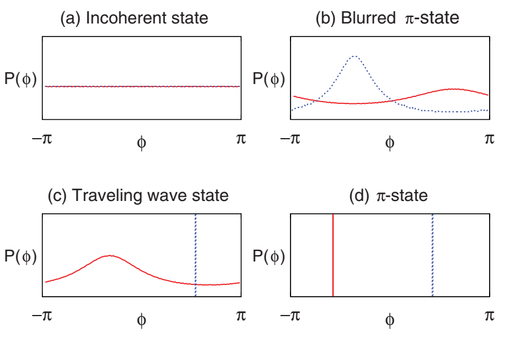

蓝色虚线为顺从者，红色实线为叛逆者。

(a) **非相干状态**，顺从者与叛逆者均匀地分布在复平面的单位圆上，也就是$r_1=r_2=0$。从之前政策的类比上来看，这意味着人群中没有出现主导的观念，所有政治观点均匀分配。

(b) **模糊$\pi$态的单参数族**，对应非均匀分配。相位分配的峰值是模糊的，并且以$\pi$的角度彼此分开。政治上的解释是两个主要派别出现，彼此截然相反。它们可能出现在政治光谱的任何位置，但只要出现，叛逆者就会反对顺从者的意见。同时这里的分布不是严谨的$\delta$函数，尖峰两侧还存在一些边缘观点。

(c) **行波状态**，顺从者和逆反者分别表现出完全和部分相位同步，其相位分布的峰值偏移了小于$\pi$的角度。

(d) **$\pi$态**，顺从者和叛逆者完全同步为两个反相的$\delta$函数（$r_1=r_2=1, |\theta_1-\theta_2=\pi|$）,这种简单的状态代表了两个统一不变的派系之间不可调和的两极分化。

对于上述偏差小于$\pi$的行波，当在Poisson流形上时（$a=1$），$Z$在复平面上呈现出圆形的轨迹（下图(a)）；而离开Poisson流形后（$a<1$），系统的长期动力学会显著复杂化（下图(b)(c)(d)）。

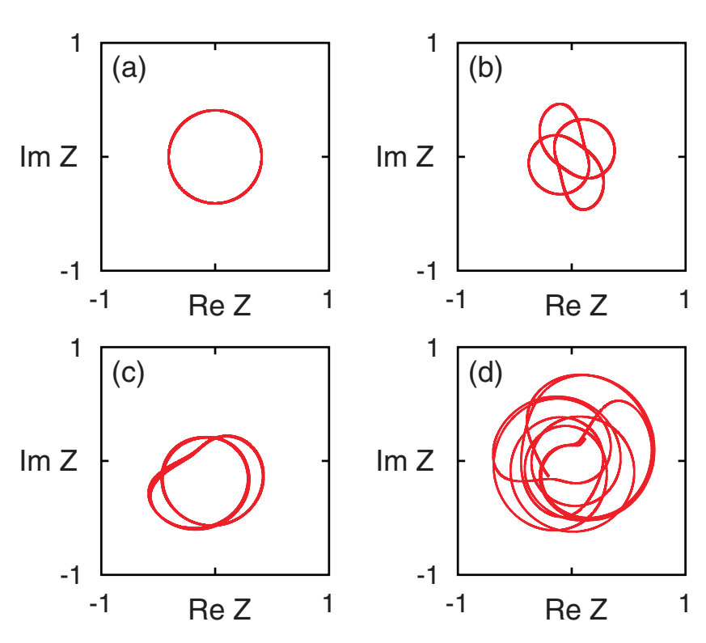

### 降维模型的分析

考虑到$g=Im(Z), h=-Re(Z)$以及变换关系$\gamma_s=-2r_s/(1+r_s^2)$：

$$
\begin{aligned}
\dot{r}_s
&=
\frac{1-r_s^2}{2}K_s
\operatorname{Re}\left(Ze^{-i\Theta_s}\right),
\\
\dot{\Psi}_s
&=
\frac{1-r_s^2}{2r_s}K_s
\operatorname{Im}\left(Ze^{-i\Theta_s}\right),
\\
\dot{\Theta}_s
&=
\frac{1+r_s^2}{2r_s}K_s
\operatorname{Im}\left(Ze^{-i\Theta_s}\right).
\end{aligned}
\tag{8}
$$

需要注意的是只有在Poisson子群中$\gamma_s$与$r_s$的关系才成立（同时Poisson 子流形上$\Theta_s=\theta_s$）。考虑到$Z=pZ_1+qZ_2, \delta=\theta_2-\theta_1$，可以将式8进一步变为：

$$
\begin{aligned}
\dot{r}_1
&=
C\left(1-r_1^2\right)
\left(
p r_1+q r_2\cos\delta
\right),
\\
\dot{r}_2
&=
-(1-C)\left(1-r_2^2\right)
\left(
p r_1\cos\delta+q r_2
\right),
\\
\dot{\delta}
&=
\sin\delta
\left[
p(1-C)
\left(
\frac{r_1}{r_2}+r_1r_2
\right)
-
qC
\left(
\frac{r_2}{r_1}+r_1r_2
\right)
\right].
\end{aligned}
\tag{9}
$$

通过对式9的固定点分析，可以得知通过仿真得到的四种状态事实上是限制在Poisson子群降维系统的唯一一般平衡态。以下总结了一些有趣的点，并计算了它们各自的序参量$R$。

**A. 非相干状态**

$R=0$，通过线性稳定性分析，该状态在$p<1-C$时稳定，于是得到了第一个分叉值$p_b=1-C$。

**B. 模糊$\pi$态的单参数族**

由式9的以下不动点给出：$\delta=\pi, pr_1=qr_2$，此时根据以上$Z$的定义，$R=0$。线性稳定性分析表明，模糊$\pi$态离非相干态最远的状态在$p_a=(1-\sqrt{2C-1})/2$时开始失去稳定性，而当$p$接近$p_b=1-C$时，整个模糊$\pi$态集的稳定性都会丧失。因此在非相干态稳定的同一区域上存在稳定的模糊$\pi$态。

**C. 行波状态**

此时顺从者完全同步$r_1=1$，可以得到

$$
\begin{aligned}
\dot{r}_2
&=
-(1-C)\left(1-r_2^2\right)
\left(
p\cos\delta+q r_2
\right),
\\
\dot{\delta}
&=
\sin\delta
\left[
p(1-C)
\left(
\frac{1}{r_2}+r_2
\right)
-
2qCr_2
\right],
\end{aligned}
\tag{10}
$$

这个解只在$0<r_2^2<1$时存在，也就是说行波状态只有在$p$大于$p_a=(1-\sqrt{2C-1})/2$，小于$p_c=C$时才存在。另外还可以得到

$$R=\sqrt{p^2-\frac{p(1-p^2)(1-C)}{2C-p(1+C)}}$$

**D. $\pi$状态**

$r_1=r_2=1, \delta=\pi$。此时可以得到$R=2p-1$，它只有在$p>1/2$的时候是正的，另外进一步系统的稳定性分析说明当$p>\max\{C,1/2\}$时是稳定的。有趣的是，其中一个值正好与$p_c$对应（超过其行波状态不再存在），但是$p_c$并不是一个分叉点，因为对于$\pi$状态$\delta$一直是$\pi$，而当$p\rightarrow p_c$时，行波的相位差并不接近$\pi$。

上述分析表明，降维系统的稳定状态在**三个过渡点**达到其稳定边界（有时也是存在边界）：$p_a=(1-\sqrt{2C-1})/2, p_b=1-C, p_c=\max\{C,1/2\}$。可以通过绘制数值结果给出的R验证该结论：

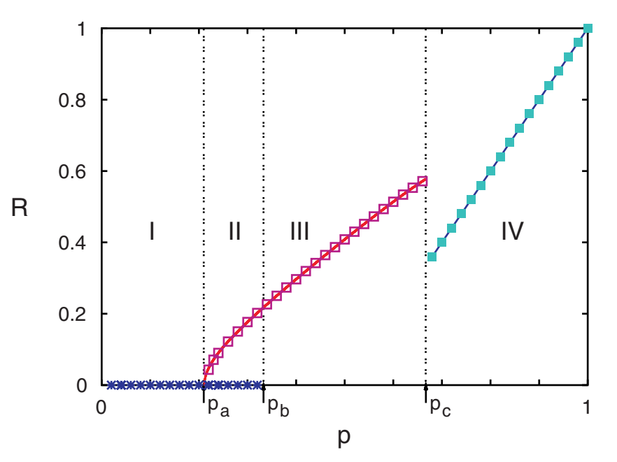

需要注意的是，上面使用的稳定性概念是Poisson子流形内的稳定性，而不是全相空间内的稳定性。

## Synchronization of dissipatively coupled oscillators

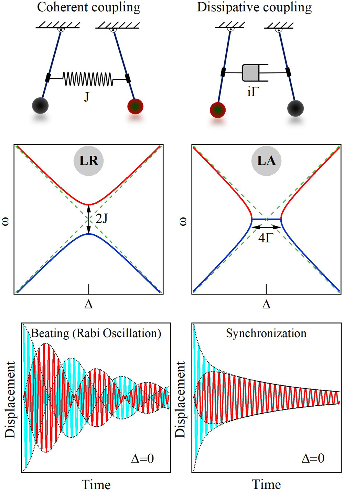

Coherent coupling: 耦合力来自于位移差。频域上，打破原模态的简并，表现为**level repulsion**（产生频率分裂）；时间域上，两个混合模态的衰减率相近，所以会看到拍频（beating / **Rabi oscillation**）

Dissipative coupling: 耦合离来自于速度差。频域上，向于建立模态简并，表现为 **level attraction**，即两个混合模态的频率互相吸引、趋于合并；时间域上，反相类模态耗散很强，会很快衰减，剩下弱耗散的同相类模态，因此最后表现为两个振子以相近频率、近似同相地同步振荡。

### 耗散耦合驱动同步的数学表达

以下以两个耦合的谐振子为例，同时为了避免深入复杂的非线性数学，这里只关注线性耦合系统的特性（即使在没有任何非线性成分的情况下，例如非线性阻尼和增益之间的相互作用导致自持振荡，这两个振荡器也可以通过耗散耦合实现同步）：

$$
\ddot{x}_1+2\gamma_1\dot{x}_1+\omega_1^2x_1
=
f_1(x_1,\dot{x}_1)
+2J_1\omega_1(x_2-x_1)
+2\Gamma_1(\dot{x}_2-\dot{x}_1)
\tag{2a}
$$

$$
\ddot{x}_2+2\gamma_2\dot{x}_2+\omega_2^2x_2
=
f_2(x_2,\dot{x}_2)
+2J_2\omega_2(x_1-x_2)
+2\Gamma_2(\dot{x}_1-\dot{x}_2)
\tag{2b}
$$
方程左边包含了频率为$\omega_{1,2}$的线性恢复力以及阻尼系数为$\gamma_{1,2}$的线性阻力。$f_{1,2}$项包含由由非等时和自激励振荡效应决定的非线性恢复力和非线性摩擦。目前认为耦合强度$J_1=J_2, \Gamma_1=\Gamma_2$（但现实中耦合强度可能不同）。对于式（2）描述的耦合系统，并不是总有完整的解析解。对于$\gamma_{1,2}\ll J_{1,2},\Gamma_{1,2}\ll \omega_{1,2}$的情况，可以通过适当的近似得到解析表达。将式（2）在旋转参考系中简化，参考频率$\omega_{ref}=(\omega_1+\omega_2)/2$，并使用**缓变的包络函数**$a_{1,2}(t)$：$x_{1,2}=[a_{1,2}(t)e^{i\omega_{ref} t}+a_{1,2}^*(t)e^{-i\omega_{ref} t}]/2$。对于一个线性耗散耦合系统，$f_1=f_2=0, J_1=J_2=0$：

$$
\frac{d}{dt}
\begin{pmatrix}
a_1 \\
a_2
\end{pmatrix}
=
i
\begin{pmatrix}
-\Delta/2+i(\gamma_1+\Gamma_1) & -i\Gamma_1 \\
-i\Gamma_2 & \Delta/2+i(\gamma_2+\Gamma_2)
\end{pmatrix}
\begin{pmatrix}
a_1 \\
a_2
\end{pmatrix}
\tag{3}
$$

混合模式的复特征频率：

$$
\tilde{\omega}_{\pm}-\omega_{\mathrm{ref}}
=
\frac{i(\gamma_1+\Gamma_1+\gamma_2+\Gamma_2)}{2}
\pm
\frac{1}{2}
\sqrt{
\left[
\Delta+i(-\gamma_1-\Gamma_1+\gamma_2+\Gamma_2)
\right]^2
-4\Gamma_1\Gamma_2
}
\tag{4}
$$

$\tilde{\omega_{\pm}}$的实部表示混合模式的真实振荡频率，虚部表示模态的衰减率，也就是linewidth

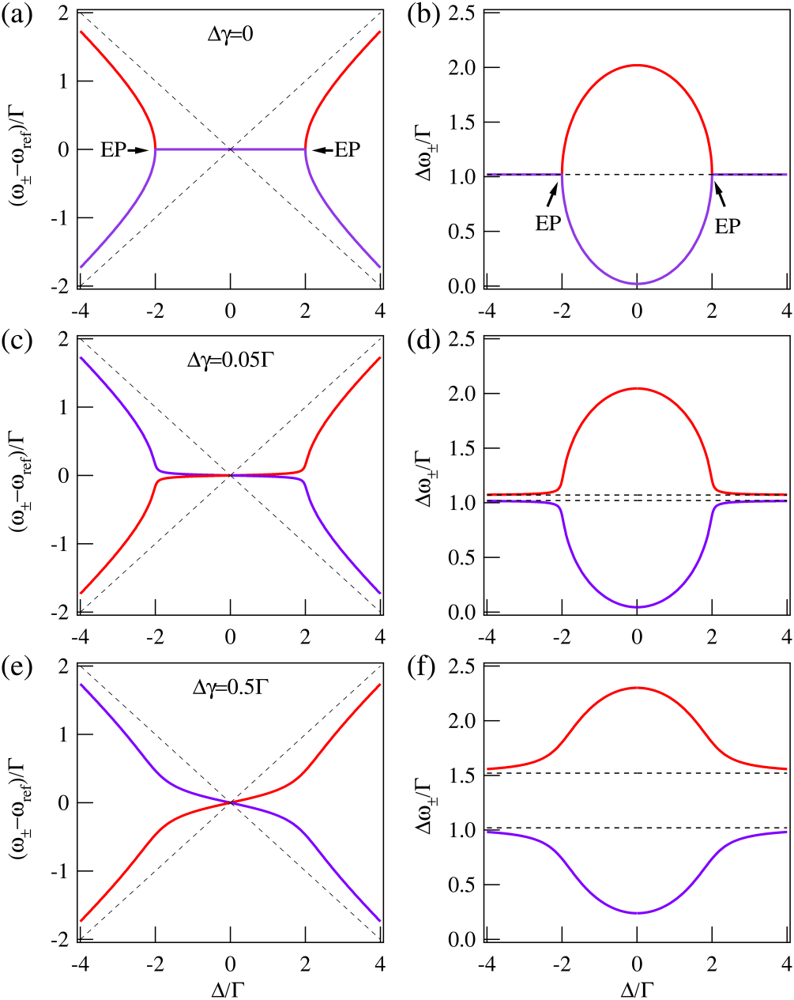

#### A. anti-$\mathcal{PT}$ symmetric system下的动力状态

令$\gamma_1=\gamma_2=\gamma, \Gamma_1=\Gamma_2=\Gamma$，可以得到所谓的anti-$\mathcal{PT}$ symmetric system，此时哈密顿特征量表示为$\tilde{H}=\begin{pmatrix}
-\Delta/2+i(\gamma+\Gamma) & -i\Gamma \\
-i\Gamma & \Delta/2+i(\gamma+\Gamma)
\end{pmatrix}$，此时的复特征频率：

$$
\tilde{\omega}_{\pm}-\omega_{\mathrm{ref}}
=
i(\gamma+\Gamma)
\pm
\sqrt{
\left(\frac{\Delta}{2}\right)^2-\Gamma^2
}
\tag{6}
$$

其对应的特征向量：

$$
\begin{pmatrix}
1 \\
i\left[
\frac{\Delta}{2\Gamma}
\pm
\sqrt{
\left(\frac{\Delta}{2\Gamma}\right)^2-1
}
\right]
\end{pmatrix}
\tag{7}
$$

当$\Delta=0$时，$\omega_{+}$模式的特征向量为$\begin{pmatrix}1\\-1\end{pmatrix}$，对应反相；$\omega_{-}$模式的特征向量为$\begin{pmatrix}1\\1\end{pmatrix}$，对应同相。如上图(a)(b)以及式(6)所示，$|\Delta|<2\Gamma$时，$\mathcal{Re}(\tilde{\omega_{+}})=\mathcal{Re}(\tilde{\omega_{-}}), \mathcal{Im}(\tilde{\omega_{+}})\neq \mathcal{Im}(\tilde{\omega_{+}})$，level attraction, linewidth repulsion；$|\Delta|>2\Gamma$时相反；之间有两个特殊点（exceptional points, EP）。

因为在 $|\Delta|<2\Gamma$ 的区域里，两个模态虽然有相同频率，但衰减率不同。一个模态是（$\omega_+$） heavily damped branch，很快衰减；另一个是 lightly damped branch（$\omega_-$），衰减较慢。经过短时间以后，系统动力学主要由 $\omega_-$ 态主导；这就是为什么时间域里最后看起来像两个振子同步了。

#### B. anti-$\mathcal{PT}$ symmetric system的时间发展

接下来关注耗散耦合下两个振子的锁相。为了探究稳态，将动力系统重新表述为$x_{1,2}=A_{1,2}(t)\cos[\omega_{ref}t+\theta_{1,2}(t)]$，其中包含了时间尺度的分离：缓变$A_{1,2}(t)$，快变$\cos(\omega_{ref}t)$，以及相位因素$\theta_{1,2}(t)$。使用通常的平均处理方法，消除快速振荡，观察$A_{1,2}, \theta_{1,2}$的定性行为，得到相位差的方程：

将式（2）写为 $\ddot x_{1,2}​+\omega_{ref}^2x^2_{1,2}​+h_{1,2}​=0$，其中$h_{1,2}=2\gamma_{1,2}\dot x_{1,2}+(\omega_{1,2}^2-\omega_{ref}^2)x_{1,2}-2\Gamma_{1,2}(\dot x_{2,1}-\dot x_{1,2})$，$A_{1,2}, \theta_{1,2}$由以下关系确定：

$$
\frac{dA_{1,2}}{dt}=\frac{1}{\omega_{ref}}\langle h_{1,2}\sin\tau\rangle\\
A_{1,2}\frac{d\theta_{1,2}}{dt}=\frac{1}{\omega_{ref}}\langle h_{1,2}\cos\tau\rangle
$$

于是可以分别得到振幅与相位方程：

$$
\frac{dA_1}{dt}
=
-(\gamma_1+\Gamma_1)A_1
+
\Gamma_1 A_2\cos(\theta_2-\theta_1)
\tag{A3a}
$$

$$
\frac{dA_2}{dt}
=
-(\gamma_2+\Gamma_2)A_2
+
\Gamma_2 A_1\cos(\theta_2-\theta_1)
\tag{A3b}
$$

$$
\frac{d(\theta_2-\theta_1)}{dt}
=
\Delta
-
\left(
\frac{A_1\Gamma_2}{A_2}
+
\frac{A_2\Gamma_1}{A_1}
\right)
\sin(\theta_2-\theta_1)
\tag{A3c}
$$

$$
\frac{d(\theta_2-\theta_1)}{dt}
=
\Delta
-
\left(
\frac{A_1}{A_2}
+
\frac{A_2}{A_1}
\right)
\Gamma
\sin(\theta_2-\theta_1)
\tag{8}
$$

这个方程看起来很像Kuramoto模型的最简形式，它们都显示了**频率失谐**和**耦合项**（纯正弦波）之间的竞争机制，以实现同步。

求解振幅与相位方程（3A）（初始条件$x_1(0)=x_0, x_2(0)=0$，并记$\Theta=\theta_2-\theta_1$）：

$$
x_1
=
\frac{x_0}{2}
e^{-(\gamma+\Gamma)t}
\left(
e^{\Gamma t\cos\Theta}
+
e^{-\Gamma t\cos\Theta}
\right)
\cos(\omega_{\mathrm{ref}}t)
\tag{9a}
$$

$$
x_2
=
\frac{x_0}{2}
e^{-(\gamma+\Gamma)t}
\left(
e^{\Gamma t\cos\Theta}
-
e^{-\Gamma t\cos\Theta}
\right)
\cos(\omega_{\mathrm{ref}}t+\Theta)
\tag{9b}
$$

耗散耦合的影响是双重的：一方面，除了固有阻尼外，它还充当了一个额外的耗散途径，表示为$e^{-\Gamma t}$；另一方面，它可以引入一个具有有效增益的运动分量（$\Gamma\cosΘ$）和另一个具有实际损耗的运动分量（$-\Gamma\cosΘ$）。很明显的是，在较短的一段时间后，第二部分的贡献变得可以忽略不计，此时两个振子以相同的速率衰减，并以相同的频率振荡，存在固定的相位差。

## Synchronization modes in bipartite oscillator networks

引：神经回路中兴奋性（excitatory, E）和抑制性（inhibitory, I）神经元相互作用产生振荡。相互作用的E和I尖峰神经元模型通常表现出强烈同步（S）的状态，在这种状态下，两个群体在全局振荡的每个周期都会放电。这能被Kuramoto模型很好地描述，但是实验里还发现了局部同步（PS）的现象，其中E细胞跳过全局节律的周期，而I神经元更有规律地放电。

分析了经典Kuramoto-Sakaguchi(KS)模型的拓展形式，其中群体$\sigma$中的振子只与相反群体$\sigma'$中的振子相互作用：

$$
\dot{\theta}_i^{\sigma}
=
\omega_{\sigma}
-
\frac{K_{\sigma'}}{N}
\sum_{j=1}^{N}
\sin\left(
\theta_i^{\sigma}
-
\theta_j^{\sigma'}
-
\alpha_{\sigma}
\right),
\qquad
i=1,\ldots,N.
\tag{1}
$$

其中${\theta}_i^{\sigma}$是群体$\sigma\in\{A,B\}$中第$i$个振子的相位。$\omega_{\sigma}, K_{\sigma}, \alpha_{\sigma}$分别是自然频率，耦合强度以及相位滞后参数。以下设置$\alpha_A=\alpha_B=\alpha\in[0,2\pi], K_A=K_B=K, \Delta=\omega_A-\omega_B>0$。

下图用于介绍S状态以及PS状态。初始相位是从$(0,2\pi]$的均匀分布中随机抽取的，每次打点描述振子相位达到了$2\pi$的整数倍数。

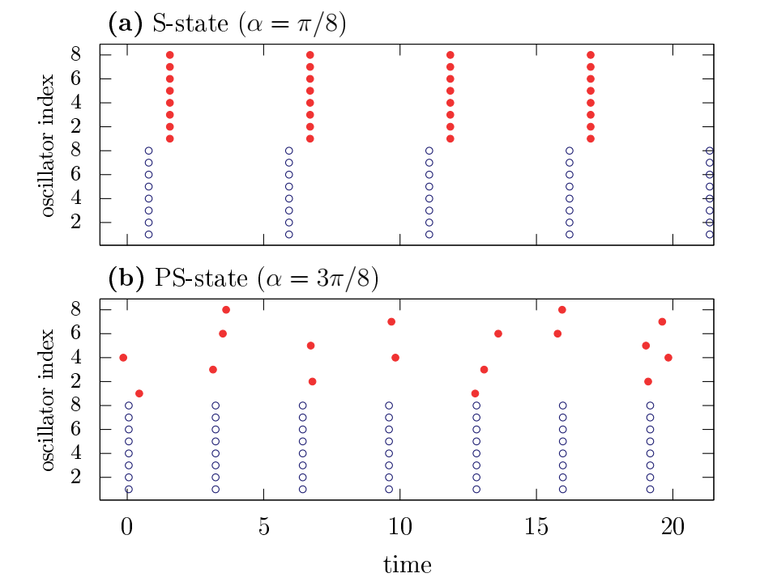

以上蓝色开放圆表示群体A，红色实心圆群体B。S状态中，两个群体被锁在了一个共同的频率$\Omega$上，此时这个网络中的动力学降维为两个相互耦合的振子，拥有固定的相位差；而在PS状态中，A群体相位同步，而B群体不同步。

### S态

首先考虑两个固有频率不同相互耦合的振子。此时存在两种情况：同步以及准周期振荡。它们的相位差$\phi=\theta_1^A-\theta_1^B$遵循Adler方程：$\dot\phi=\Delta-2K\cos\alpha\sin\phi$，在以下情况时它有一个鞍点分叉：

$$
\alpha_s=\arccos(\frac{\Delta}{2K})
\tag{2}
$$

如果$\frac{\Delta}{2K}\in(0,1)$，对于$\alpha\in[0,\alpha_s)$，存在稳定态

$$
\phi^*=\arcsin(\frac{\Delta}{2K\cos\alpha})
\tag{3}
$$

频率为

$$
\Omega
=
\bar{\omega}
+
\frac{K}{2}
\tan\alpha
\sqrt{
(2\cos\alpha)^2
-
(\Delta/K)^2
}.
\tag{4}
$$

其中$\bar\omega=(\omega_A+\omega_B)/2$。S态的同步频率并不是简单的平均频率$\bar\omega$，相位滞后$\alpha$会改变共同频率。方程$\Omega(\alpha)$在$\alpha_M=\arccos\sqrt\frac{\Delta}{2K}$处存在一个最大值$\Omega_M=\omega_B+K$。

### S态的稳定性

**对 N=1 来说，只要两个振子能锁相，S-state 就稳定。但对 N>1，问题变复杂了。因为每个群体内部有很多振子，即使两个群体的平均相位能锁定，也要检查群体内部同步团簇是否稳定。**

假设A群体已经同步，可以把它看成一个周期驱动力，频率为$\Omega$，定义$\varphi=\psi_A-\theta_i^B+\alpha$，那么B群体中的振子满足

$$
\dot\varphi_i=\Omega-\omega_B-K\sin\varphi_i
\tag{6}
$$

它能锁相的前提条件是$|\Omega-\omega_B|\leq K$，考虑到$\Omega>\omega_B$，于是有$\Omega\leq\omega_B+K$。根据线性稳定性分析，**$\alpha>\alpha_M$时，S态对B群体内部扰动失稳**。

### Ott-Antonsen (OA)约化

当$N\rightarrow\infin$时，用每个群体的相位分布函数$f_\sigma(\theta^\sigma,t)$描述系统。定义Kuramoto序参量：

$$
z_\sigma=r_\sigma e^{i\psi_\sigma}=\int_0^{2\pi}e^{i\theta^\sigma}f_\sigma(\theta^\sigma,t)d\theta^\sigma
\tag{7}
$$

**Ott–Antonsen 约化的作用是：把无限维的相位分布演化问题，约化成少数几个序参量的常微分方程。** OA ansatz 给出分布函数的 Fourier 展开形式。代入连续性方程后，得到序参量方程

$$
\dot{z}_{\sigma}
=
i\omega_{\sigma}z_{\sigma}
+
\frac{K}{2}
\left[
e^{i\alpha}z_{\sigma'}
-
e^{-i\alpha}\bar{z}_{\sigma'}z_{\sigma}^{2}
\right].
\tag{9}
$$

在极坐标下，约化为三位系统：

$$
\dot{r}_A
=
\frac{K}{2}
r_B
\left(1-r_A^2\right)
\cos(\phi-\alpha),
$$

$$
\dot{r}_B
=
\frac{K}{2}
r_A
\left(1-r_B^2\right)
\cos(\phi+\alpha),
$$

$$
\dot{\phi}
=
\Delta
-
K r_A
\frac{1+r_B^2}{2r_B}
\sin(\phi+\alpha)
-
K r_B
\frac{1+r_A^2}{2r_A}
\sin(\phi-\alpha).
$$

其中$\phi=\psi_A-\psi_B$。这些方程存在不动点$r_A=r_B=1, \phi=\phi^*$，对应之前说的同步S态；它还有另外一种不动点，$r_A=1, \dot{r}_B=0$，存在相位差$\phi^*=\pi/2-\alpha$，再令$\dot\phi=0$，可以得到序参量的两个根：

$$
r_B
=
\left(
\Delta/K
\pm
\sqrt{
(\Delta/K)^2
-
4\cos^2\alpha
+
1
}
\right)^{-1}.
$$

$\alpha=\alpha_M$时，存在一个分支使得$r_B=1$，此时是S态与PS态的跨临界分叉（TC）；令两个固定点合并，有SN分叉：

$$
\alpha_{PS}
=
\arccos\left(
\frac{1}{2}
\sqrt{
1+\left(\Delta/K\right)^2
}
\right).
\tag{15}
$$

且需要保证$\Delta/K\in(1,\sqrt{3})$，详见以下相图：

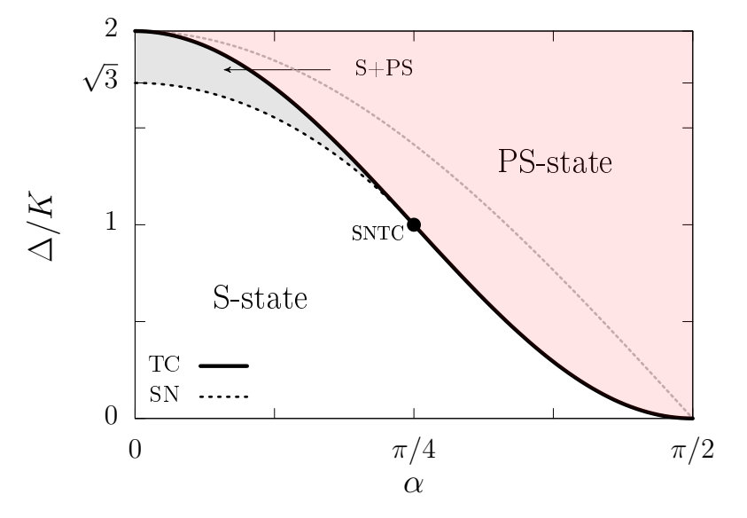

### K-S网络中的自组织准周期性（SOQ）

假设对于所有$i$都有$\theta_i^A=\psi_A$，可以得到B振子关于它们平均场$\psi_B$的演化方程：

$$
\dot{\theta}_i^{B}
=
\omega_B
-
K\sin\left(
\theta_i^{B}
-
\psi_B
-
\beta(\phi)
\right).
\tag{16}
$$

其中$\beta(\phi)=\phi+\alpha$，相同步状态稳定性由$d\dot\theta_i^B/d\theta_i^B=-K\cos\beta(\phi)$决定。需要注意的是，根据式（13），$d\dot\theta_i^B/d\theta_i^B=0$，于是振子既不被它们的平均场吸引也不被排斥。

由式（9），可以得到平均场的频率：

$$
\Omega_{PS}
=
\omega_B
+
\frac{K(1+r_B^2)}{2r_B}.
\tag{17}
$$

当$r_B=1$时，与$\Omega_M$一致，并随着$r_B\rightarrow0$变大，因此$\Omega_{PS}\geq\Omega_M$。B振子的平均频率：

$$
\left\langle
\dot{\theta}^{B}
\right\rangle
=
\Omega_{PS}
-
\sqrt{
\left(
\Omega_{PS}-\omega_B
\right)^2
-
K^2
}.
\tag{18}
$$

上式通过积分式（6）得到。当$r_B=1$时，$\left\langle\dot{\theta}^{B}\right\rangle=\Omega_{PS}$，且$\left\langle\dot{\theta}^{B}\right\rangle$随着$r_B\rightarrow0$减小，逐渐逼近$\omega_B$。**因此，与神经科学中的实验和计算研究一致，平均场频率可能与B振荡器的场频率存在显著差异。**

## Stability of a chain of phase oscillators

引：Cohen等人研究了Kuramoto振子链，解释了在原始脊椎动物七鳃鳗的中央模式发生器（CPG）中观察到的虚拟游泳。他们的目的是解释沿分段振荡器的**均匀相位滞后**。后来，Kopell和Ermentrout[10]提出了一个更真实的虚拟游泳模型，Williams等人[11]将该模型与实验观察进行了对比。对CPG的研究导致了仿生在机器人技术中的应用，例如，Conradt和Varshavskaya的自主移动机器人蠕虫[12]和Seo等人的海龟式水下航行器[13]。

引：Cohen等人[9]观察到，在振荡器链中，端点处的振荡器起着特殊的作用：调整端点的固有频率可以控制锁相平衡中整个链中相邻振荡器之间的相移。（具有周期性边界条件的一维均匀Kuramoto模型的所有平衡点都在[14]中找到。

### 模型介绍

这里考虑由最邻近耦合相连的$N+1$个相位振子链，这个模型最早由Cohen提出，用于解释七鳃鳗脊髓发现的“虚拟游动”。

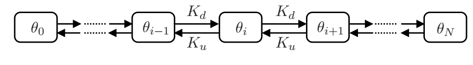

$$
\begin{aligned}
\frac{d}{dt}\theta_0
&= \omega_0 + K_u \Gamma(\theta_1-\theta_0), \\[4pt]
\frac{d}{dt}\theta_j
&= \omega_j + K_d \Gamma(\theta_{j-1}-\theta_j)
+ K_u \Gamma(\theta_{j+1}-\theta_j),
\quad \text{for } j=1,2,\ldots,N-1, \\[4pt]
\frac{d}{dt}\theta_N
&= \omega_N + K_d \Gamma(\theta_{N-1}-\theta_N).
\end{aligned}
\tag{1}
$$

### 锁相与行波

锁相解就是$\theta_i-\theta_j=\text{const}$，此时链上的相位差是一致的，称为均匀行波。相位差

$$
x_j=\theta_{j-1}-\theta_j, ~(j=1,..., N)
\tag{2}
$$

新变量还有放缩后的频率差，耦合强度比以及放缩时间：

$$
\Omega_j=\frac{\omega_{j-1}-\omega_j}{K_u}, k=\frac{K_d}{K_u}, t_{new}=K_ut
\tag{3}
$$

由式（1）产生一个描述用$t_{new}$重写的变量$x_j$动力学的N维方程系统。

$$
\begin{aligned}
\dot{x}_1
&= \Omega_1 - (1+k)\Gamma(x_1) + \Gamma(x_2), \\[4pt]
\dot{x}_i
&= \Omega_i + k\Gamma(x_{i-1}) + \Gamma(x_{i+1})
- (1+k)\Gamma(x_i), \\
&\quad i = 2,3,\ldots,N-1, \\[4pt]
\dot{x}_N
&= \Omega_N + k\Gamma(x_{N-1}) - (1+k)\Gamma(x_N).
\end{aligned}
\tag{3}
$$

其中$x_j(t)$在单位圆$\mathbb{S}^1$上，它的向量形式为：

$$
\dot{\mathbf{x}} = \boldsymbol{\Omega} + C\boldsymbol{\Gamma}(\mathbf{x})
\tag{4}
$$

其中$C$是一个$N\times N$的矩阵：

$$
C =
\begin{bmatrix}
-(1+k) & 1 & \cdots & 0 \\
k & -(1+k) & \ddots & 0 \\
\vdots & \ddots & \ddots & 1 \\
0 & \cdots & k & -(1+k)
\end{bmatrix}
\tag{5}
$$

式（4）的不动点由$\boldsymbol{\Gamma}(\mathbf{x})=-C^{-1}\boldsymbol{\Omega}$给出，满足之前说的锁相解。如果所有$-C^{-1}\boldsymbol{\Omega}$的分量绝对值都小于1，由于对称性$\Gamma(\pi/2-x)=\Gamma(\pi/2+x)$，系统（4）存在$2^N$个平衡位置（一个周期内有两个解）。当且仅当以下条件得到满足时，存在均匀的行波解（相位差一致$x=[\delta,..., \delta]^T$）：

$$
\begin{aligned}
\Omega_1 &= k\Gamma(\delta), \\
\Omega_i &= 0, \qquad i=2,\ldots,N-1, \\
\Omega_N &= \Gamma(\delta).
\end{aligned}
\tag{6}
$$

也就是说（1）式原始系统中的频率$\omega_j$满足以下形式：

$$
\begin{aligned}
\omega_0 &= \omega + K_d\Gamma(\delta), \\
\omega_j &= \omega, \qquad j=1,\ldots,N-1, \\
\omega_N &= \omega - K_u\Gamma(\delta),
\end{aligned}
\tag{7}
$$

换句话说，就是除了边界上的两个振子，其他所有振子的自然频率都一致。且第一个与最后一个振子的所谓的“失谐”（detunings，频率的非均匀分布）通过耦合强度$K_u, K_d$互相关联。

影响动力学的两个首要的参数就是耦合强度比$k$以及$\delta$。不失一般性的，可以将参数约束为下：

- $\delta\in[0,\pi/2]$，对于负的$\delta$可以通过将$x$转变为$-x$实现；
- $k\geq-1$，对于$k<-1$使用转化$[x_1,...,x_N]_{new}=[x_N,...,x_1]_{old}, t_{new}=k_{old}t$。需要注意的是这个转变会导致时间的反转，所以关于稳定性的讨论需要使用不稳定性来替代。

另外式（3）中并没有出现耦合强度，耦合强度大小只对时间尺度有影响。

### 行波的稳定性

式（4）关于平衡位置$x_*$的线性化是$J=C\Gamma'(x_*)$：其中

$$
\Gamma'(x_*)=\rho\cdot \operatorname{diag}(\sigma_1,\ldots,\sigma_n),
\tag{8}
$$

是一个对角矩阵，$\rho=\Gamma'(\delta)>0, \delta_i=\pm1$，取决于$x_*$的第i个分量等于$\delta$还是$\pi-\delta$。矩阵$C$的特征值是

$$
\lambda_j=-(1+k)+2\sqrt{k}\cos\frac{j\pi}{N+1},\quad j=1,\ldots,N,
\tag{9}
$$

但是$C\Gamma'(x_*)$的解析表达得不到。因此，本节的目标是在（4）的平衡$x_*$（及其稳定性）的稳定和不稳定方向的数量与$x_*$等于$\delta, \pi-\delta$的分量数量之间建立一个简单的联系。将四个指标与平衡$x_*$相关联：

$$
\begin{aligned}
\nu_0(x_*) &= \text{number of components of } x_* \text{ equal to } \delta,\\
\nu_\pi(x_*) &= \text{number of components of } x_* \text{ equal to } \pi-\delta,\\
\nu_u(x_*) &= \text{dimension of unstable manifold of } x_*,\\
\nu_s(x_*) &= \text{dimension of stable manifold of } x_*.
\end{aligned}
$$

这些指标的关系如下：

定理1（不变子空间的维度）：令$x_*$为（4）的平衡位置，如果$k\geq-1$那么有：

$$
\nu_0(x_*)=\nu_s(x_*), \text{and} \nu_\pi(x_*)=\nu_u(x_*).
\tag{11}
$$
关系（11）可以通过李雅普诺夫型函数直接得出：

$$
E(x)=\sum_{i=1}^N[\int_0^{x_i}\Gamma(y)dy-\Gamma(\delta)x_i]
\tag{12}
$$

需要注意的是，$\partial E/\partial x_i = \Gamma(x_i)-\Gamma(\delta)$，对于$x_*=\delta, \pi-\delta$，都有$\nabla E(x_*)=0$。

$E$沿着（4）轨迹的时间导数：
$$
\begin{aligned}
\dot{E}
&= \sum_{i=1}^{N}\left[\Gamma(x_i)-\Gamma(\delta)\right]\dot{x}_i \\
&= -\frac{k+1}{2}\left(
\left(\Gamma(x_1)-\Gamma(\delta)\right)^2
+\left(\Gamma(x_N)-\Gamma(\delta)\right)^2
+\sum_{i=1}^{N-1}\left(\Gamma(x_i)-\Gamma(x_{i+1})\right)^2
\right).
\end{aligned}
\tag{13}
$$

如果$k=-1$，那么$E(x(t))$沿着轨迹是常数；而当$k>-1$时，E严格下降（只要至少有一个$x_i$不满足$\Gamma(x_i)=\Gamma(\delta)$）。同时也能证明当$k>-1$时，$J=C\Gamma'(x_*)$不可能有位于虚轴上的特征值。**如果没有虚轴特征值，那么随着参数 k 连续变化，特征值不能从左半平面跑到右半平面。稳定方向数和不稳定方向数就不会变。** （hyperbolic）因此，要数任意 $k>−1$ 时的稳定/不稳定方向，只需要数最简单的$k=0$情况即可。当$k=0$时，矩阵$C$变为上三角矩阵，$J=C\Gamma'(x_*)$仍然时上三角矩阵，其特征值就是对角元，其第$i$个对角元为$J_{ii}=-\rho\sigma_i$：对于$x_*=\delta$，$J_{ii}=-\rho<0$，对应稳定方向；$x_*=\pi-\delta$反之。

### 旋转波和鞍形连接

尽管存在李雅普诺夫泛函，但（4）的动力学不一定是平凡的，因为相空间是一个N维环面。一般情况下，如果满足$\nu_\pi(x)+\nu_0(y)>N$，可以预期平衡位置$x$的不稳定流形与$y$处的稳定流形相交，从而产生异宿鞍连接。从而可以推出$\nu_\pi(y)<\nu_\pi(x)$，也就是说**轨道一般会从不稳定指数较高的平衡点连到不稳定指数较低的平衡点**。(heteroclinic connections )

当两个平衡点的$\nu_\pi$相同时，需要通过调整参数$k,\delta$才能让它们之间的saddle connection出现。这些同指标的 saddle connection，是 rotating wave 周期轨道存在区域的 co-dimension 1 边界。

如下图中$N=2, \Gamma(x)=\sin(x), \delta=1$，(b-d)为(a)中标点对应$k$值下的相图，流动方向向上。sink: $(\delta, \delta)$，无不稳定方向；saddle: $(\delta, \pi-\delta), (\pi-delta,\delta)$，存在一个不稳定方向；source: $(\pi-\delta, \pi-\delta)$，有两个不稳定方向。

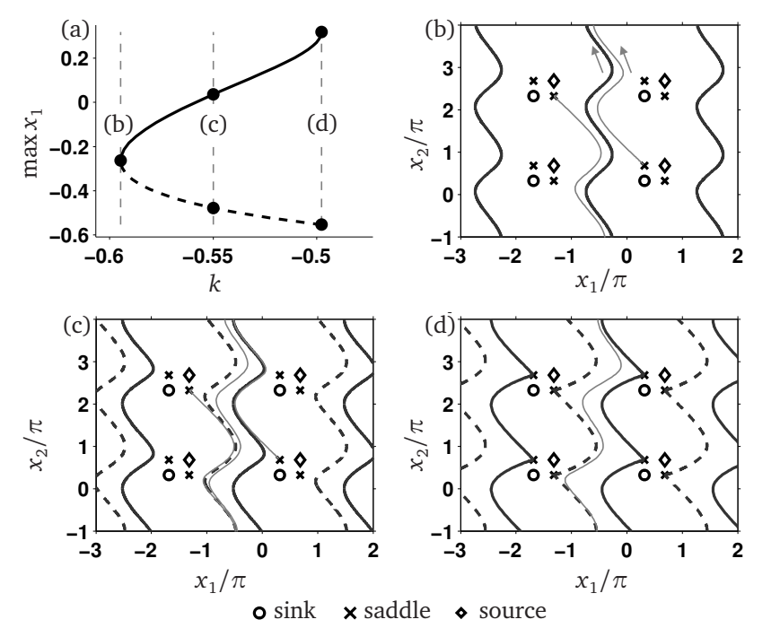

图(a)中(b)左侧为锁相区，(b-d)为锁相+持续滑移（phase-slip）相并存，右侧为saddle connection（如果忽略掉$2\pi$的偏移，这种saddle connection是同宿的）。

$(k,\delta)$平面上的相图如下：

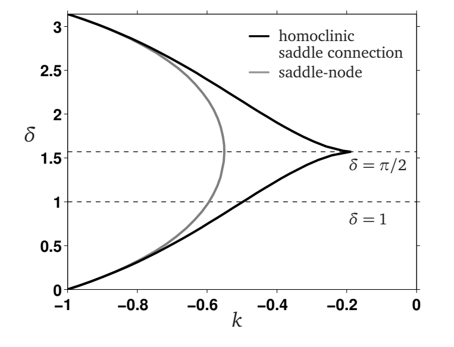

在$N>2$时，动力学会变得更加混沌。比如对于$N=3$的数值结果如下：

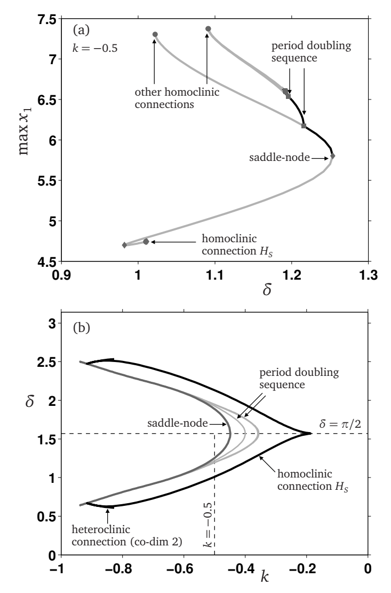

在$H_s$的homoclinic connection的附近，会出现无限多个被周期级联，轨道靠近这个 saddle 后，会在它附近停留很久，这是复杂动力学的来源。period doubling sequence：稳定周期滑相开始倍周期化，周期从 T 变成 2T,4T,8T,…。

随着$N$的增大，周期性旋转的区域不断被压缩，也就是完全同步逐渐占优。