# 文献摘要

分类：颗粒-网络

## Anomalous Diffusion of Deformable Particles in a Honeycomb Network

（原根目录摘要中暂未记录正文）

## Red blood cell dynamics in extravascular biological tissues modelled as canonical disordered porous media

### 介绍

引：血液和溶质在其他（如血管外）具有重要功能的生物介质中的流动和运输仍然知之甚少，例如**人类胎盘的绒毛间间隙**（intervillous space, IVS），其特征是**高度无序的孔隙网络**和**大小与RBC相当的流道**。

引：多孔介质中流动和输运的综合理论已经建立，揭示了孔隙尺度结构非均质性和宏观流动特性之间的微妙关系。然而，现有的多孔介质流动模型通常假设流体是均匀的，无法准确推断活体生物介质中复杂的血液流变学。

引：此外，细胞模拟可以帮助设计和优化用作人工肺辅助装置的微流体氧合器

### 方法

三维的仿真以及实验基于两种典型的平面无序多孔介质(disordered porous media, DPM)：

1、局部扰动介质(locally perturbed media, LPM)，弱无序系统，

2、全局随机介质(globally random media, GRM)，强无序系统。

它们都使用同一大小的圆柱（直径$D_c$，取决于孔隙率$\phi$以及计算域大小）实现。

为了得到**LPM**，首先建立一个再长L宽W方格上的有序多孔介质（ordered porous medium, OPM）。考虑了三个孔隙率值$\phi=0.57、0.62、0.67$，它们分别对应于基准OPM几何形状中$\chi=1.2, 1.0, 0.9$的限制比（定义为$\chi=D_{RBC}/W_{throat}$）。通过保持圆柱位置不变，改变圆柱直径$D_c$改变孔隙率。LPM结构上的无序通过引入标准差$\sigma=0.1, 0.3, 0.5, 0.7$圆柱位置(x,y)的随机扰动建立（二次正态分布）。

**GRM**是通过在指定孔隙率（$\phi=0.66$）的给定大小的域中放置均匀随机的圆柱体空间分布来构建的，并且保持相邻圆柱之间有$4D_{RBC}$的最小距离。GRM中喉道宽度的分布近似呈指数分布，本研究中使用了三种GRM实现（不一样的拓扑，孔隙率一致，喉道宽度分布相近）。

入口处给feeding discharge haematocrit$H_F=0.1, 0.2, 0.3$

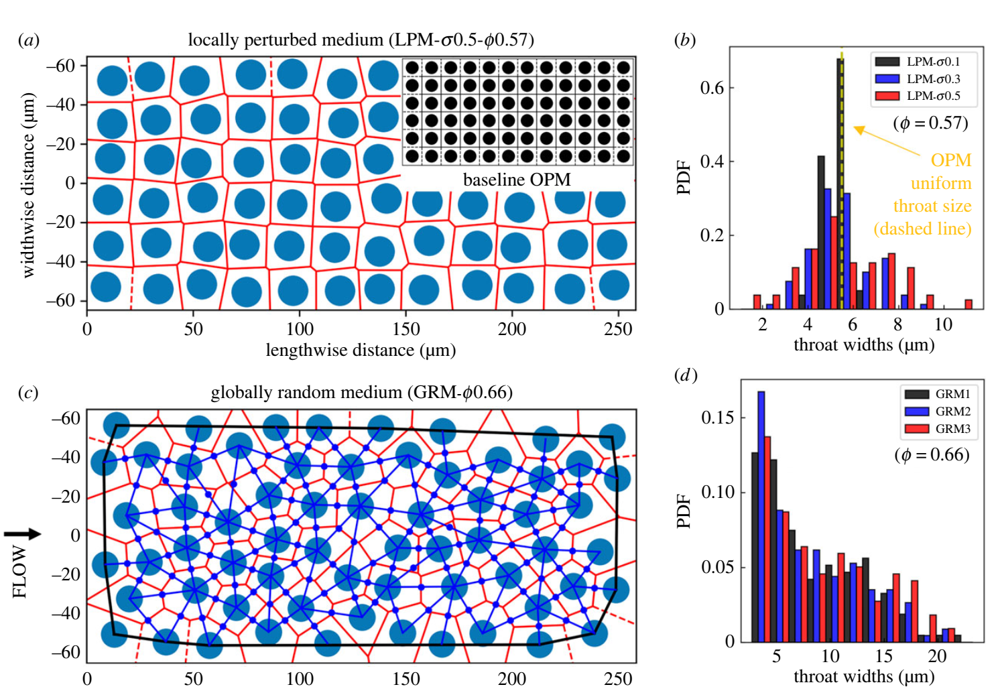

蓝点表示孔隙开口的中点，用于评估局部流量和细胞通量

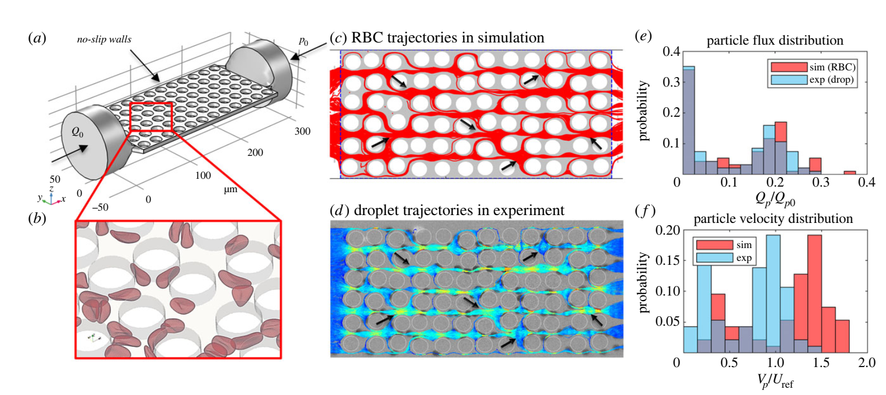

### 结论与讨论

#### 仿真与实验的交叉验证

见上图(c)(d)，仿真是红细胞模拟，实验是液滴。比较结果包括颗粒轨迹，颗粒流量分布以及颗粒速度分布（颗粒通过单个空隙的时均速度）。红细胞和液滴在穿过多孔区域时都表现出明显的**优先路径或区域分流**，具有高通量和低通量喉道的离散簇。同样，单个喉道处的平均颗粒速度具有双峰分布，其中高速和低速种群共存。上图黑色箭头为仿真与实验中轨迹比较相似的局部区域。

#### 多孔结构以及红细胞的存在对于流动阻力和血液黏度的影响

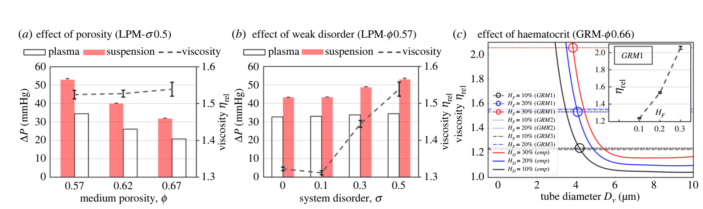

固定$\sigma$下的LPM，血浆和血液的压降都随着孔隙率的升高下降，但是相对表观粘度大致不变。OPM中压降和相对表观粘度关于孔隙率有同样的趋势。

对于固定$\phi$下的LPM，无序度对于血浆阻力改变很小，但是悬液很明显。

(c)中实线为经验公式，圆形标注表示仿真与经验公式有同样的相对表观粘度的特征直径$D_v$

#### RBC流量动态改变孔隙尺度流量分布

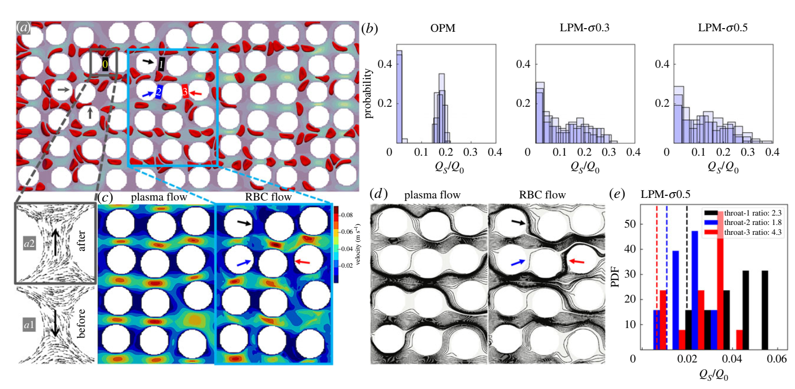

在无RBC和有RBC的情况下，随着介质无序程度的增加，流量分布从离散的**高/低流量簇**演变为连续的**指数状分布**。

rbc的存在导致窄喉道处间歇或永久的堵塞，伴随着这种闭塞事件，附近的喉道偶尔会出现血流逆转（见a1, a2）。与相同流入条件下的纯血浆流（c，左图）相比，这些闭塞反过来可能有助于将血流转移到输注不良的区域（例如横向取向的喉部），并导致系统中更均匀分布的悬液流（见c，右图与左图相比增强的横向流）。(d)中的流线图也能说明血浆场景中被忽略的灌注喉道在悬液场景中得到更好的灌注。(e)为关注的喉道处流量记录（随时间，超过15个计数点），相较于只有血浆的情况，要高2-4倍。尽管空隙尺度上的红细胞流量与波动是动态的，整体的压降是大致稳定的。

#### 对称性破坏促进更均匀的红细胞运输和红细胞压积分布

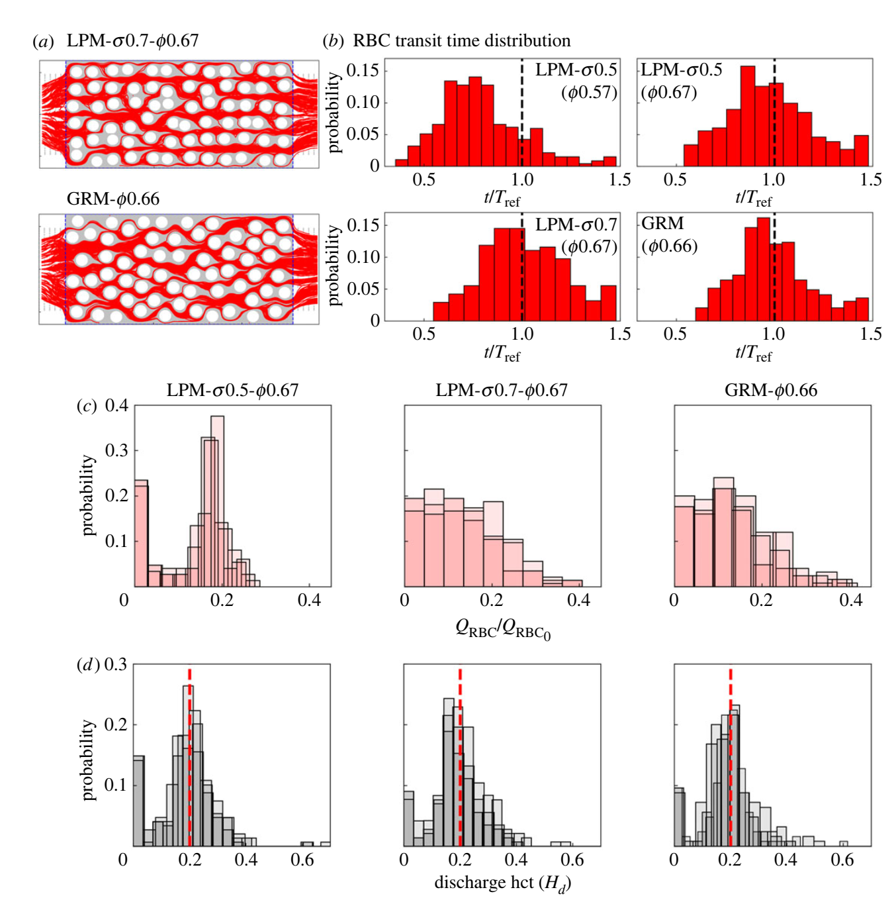

在本研究的孔隙度范围内，**rbc转运时间分布对介质无序度不敏感**。这种不敏感性可能是由结构紊乱对红细胞运动的**两种相反影响**引起的：增加现有通路的**曲折性会减缓单个细胞**的转运，但通过**打破空间对称性和局部引入横向压力梯度**，可以实现更多的流动通路。

另一方面，保持无序度不变，增加孔隙率会导致介质运输时间的增加。

从(c)也可以看出，$sigm=0.5$时存在许多喉道没有rbc的经过，而$\sigma=0.7$已经能够与GRM相比。从(d)中可以看出，结构无序程度比较大时（$\sigma\ge0.5$）单个喉道中的discharge haematocrict$H_d$倾向于与$H_F$相近

## Traffic Jams and Intermittent Flows in Microfluidic Networks

颗粒尺寸与通道尺寸相近，这样即使在稀释极限下，颗粒也会局部降低网络传导率，从而引发大规模流体流动的动态再分配，使得即使在简单的几何下描述颗粒流量也成为一件困难的事。

这篇文章提供了大型流体网络中输运动力学的通用描述。更确切地说，关注一类广泛的原型微流体网络，其中单个颗粒将遵循一条独特的确定性轨迹，从单个入口到单个出口（如下图(a)所示）。增加颗粒注入速率$j$至某个临界值$j^*$上时，入口处产生堵塞（traffic jam）。密度的这种局部增加导致粒子的喷射（ejection），然后粒子侵入网络的更大一部分并探索替代的出口路径（见(b)(c)(d)）。令人惊讶的是，这种侵入转变发生在**非常低的表观体积分数下，颗粒不会发生任何碰撞**。同时也发现在高流量下，颗粒的这种集体从原有路径偏移产生间歇的流动。

实验中使用的是水滴（防止微珠可能产生的堵塞），携带其的流体为16烷。圆柱直径$150\mu m$，期间间隙$150\mu m$，颗粒的直径保持在$89\pm4\mu m$。确保$Re\sim10^{-3}, Ca\sim10^{-4}$

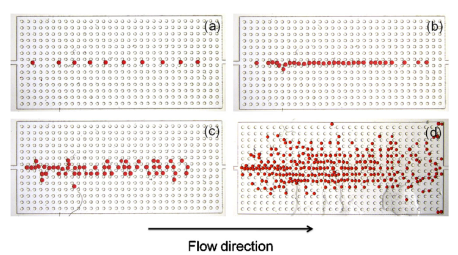

(a) j=0.4HZ；(b) j=0.7HZ，堵塞开始产生；(c) j=2HZ；(d)在非常高的流量下，液滴入侵整个网络。

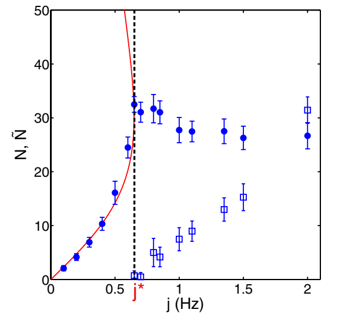

N为中心线上的颗粒数量，用实心圆表示；$\tilde{N}$为中心线外的颗粒数量，用空心矩形表示。红线为对于N的理论预测。

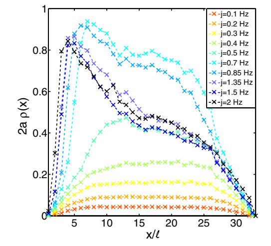

使用最大密堆值$1/2a$无量纲化的中心线密度场。

在非常小的流量下，$j\lesssim0.3HZ$，$N(j)$随着$j$单调增加，此时颗粒保持沿中心线运动，就像单个颗粒那样。局部密度$\rho(x)$简单地反映出无颗粒网络连续场中速度场$v_F^0(x)$的$x$方向分量。存在关系$j\propto\rho(x)v_F^0(x)$。在出入口附近$\rho$的变化是由于净流场在入口压缩，出口拉伸。在接下来的所有内容中，忽略这种线性的流体效果，仅关注密度场的主体属性。

在$0.3\lesssim j\lesssim0.6HZ$时，液滴还是沿着中心线走，$\rho(x)$保持同样的平坦profile。但是$N(j)$明显偏离线性关系，且当接近临界值$j^*=0.6HZ$开始发散。事实上这种非线性的变化反映出随着线密度的上升，液滴速度下降。**以下揭示本研究中最重要的一个结论：$j^*$是网络中可以维持的最大颗粒流量**。其实当$j$接近$j^*$时，原本均匀、静态的颗粒分布变得不稳定，在网络的入口产生堵塞，液滴逃离中心线入侵网络。惊讶的是，该不稳定性发生在液滴密度远小于密堆密度，$\rho(x)<0.7/(2a)$，此时没有碰撞发生。**因此可以推测出是长程的流体作用力塑造了这种非线性的行为，并导致了不稳定性**。以下介绍描述这种有效流体作用的理论模型。

由于这里研究的是极稀的系统，使用连续描述以简化代数。首先，我们通过一个完全由局部**水动力传导率G**表征的相同通道网格来模拟障碍物网络，障碍物形状的所有细节都隐藏在这个参数中，该参数将局部压力梯度与局部流体速度联系起来：$\bm{v_F(r)}\equiv -G(\bm{r})\nabla P(\bm{r})$，其中$\bm{r}$是考虑的2D网络中的单位管道位置。由不可压$\nabla\cdot\bm{v_F}=0$，得到压力场的方程（类似于达西定理）：

$$
\nabla\cdot[G(\bm{r})\nabla P(\bm{r})]=0
$$

边界条件$\nabla P=-(\bm{v_F}/G)\hat{\bm{x}}$，其中$\bm{v_F}$是远离颗粒的常值流场速度。对于一个规则的障碍物网络，$G$是一个常数。之后，将被输运的液滴描述为对于局部传导率的恒定的逐点扰动。更准确地来说，对于位置在$\bm{r}_i(t)=(x_i,0)$的$N$个颗粒：

$$
G(\mathbf{r}) =
G\left[
1 - b^2 \sum_{i=1}^{N}
\delta\left(\mathbf{r}-\mathbf{r}_i(t)\right)
\right]
$$

这里，长度$b$表征一个液滴如何在局部阻碍流动。再其次,该模型的最后一个组成部分是液滴平流规律。假设在$\bm{r_i}(t)$位置的液滴以速度$\dot{\bm{r_i}}=\mu\bm{v_F}(\bm{r_i})$运动，其中$\mu$是一个常值的流动系数。由于流动是有势的，可以将其类比于静电场。在远场近似下，单个液滴可以视为x方向的源偶极子（$v_{dip}\sim\frac{1}{r^2}$）。可以通过微扰求解式1得到对应的流场扰动幅值$\bm{v}_{dip}$，给出中心线x方向上的扰动：$v_{dip}​\propto\dot x_1​b^2(1−\mu)\partial_x​\frac{1}{|x−x_1​|}​$。这个扰动与主流方向是相反的，会导致其他液滴的减速。当多个液滴排成一列时，这些扰动可以线性叠加，于是得到运动方程：$\dot x_i​=v_D^0​+\mu\sum_{j\neq i}​v_{dip}​(x_j​−x_i​,\dot x_j​)$，其中$v_d^0$是单个液滴在中心lane中的速度，第二项为扰动。

接下来考虑一个最简单的稳态：所有$N$个液滴都在中心lane中，等间距排列，并且以同一个速度$v_D$运动，系统长度$L$。线密度$\rho=N/L$，液滴间距$\Delta x=1/\rho$，由于偶极子相互作用衰减形式为$1/r^2$，所以每一个液滴受到所有其他液滴的总减速大致是$\sum_{n=1}^\infty\frac{1}{(n\Delta x)^2}​\sim\rho^2\sum_{n=1}^\infty​\frac{1}{n^2}​$，结合偶极扰动前面的系数，最后得到液滴速度：

$$
v_D​=\frac{v_D^0}{1+6π​(1−\mu)b^2\rho^2}​​.
$$

液滴通量$j=\rho v_D^0$。该式通过确定拟合参数$(1-\mu)b^2$可以得到与实验相近的结果，另一方面能预测一个极大值$j=j^*=0.65HZ$。

当$j^*<j\lesssim1HZ$，在入口处产生了堵塞：密度场变得不对称，其最大值持续增长，直至液滴互相接触；之后液滴被挤入中心线的上下侧，开始侵入网络，于是中心线的密度又下降。但它并没有达到一个稳定的值，因为堵塞会缓慢地重新形成，并迅速地再次中断：**运输流变得间歇性**。中心线上液滴的数量$N(t)$变化见下图。存在两个时间尺度：慢者对应堵塞的形成，$N(t)$上升；快者对应液滴从初始路径的协同喷射，$N(t)$下降。还绘制了在$j=0.85HZ$时中心线外颗粒数量的概率分布$P(\tilde{N})$，这种分布显然是非高斯的，这是间歇动力学和相关液滴喷射的另一个特征。

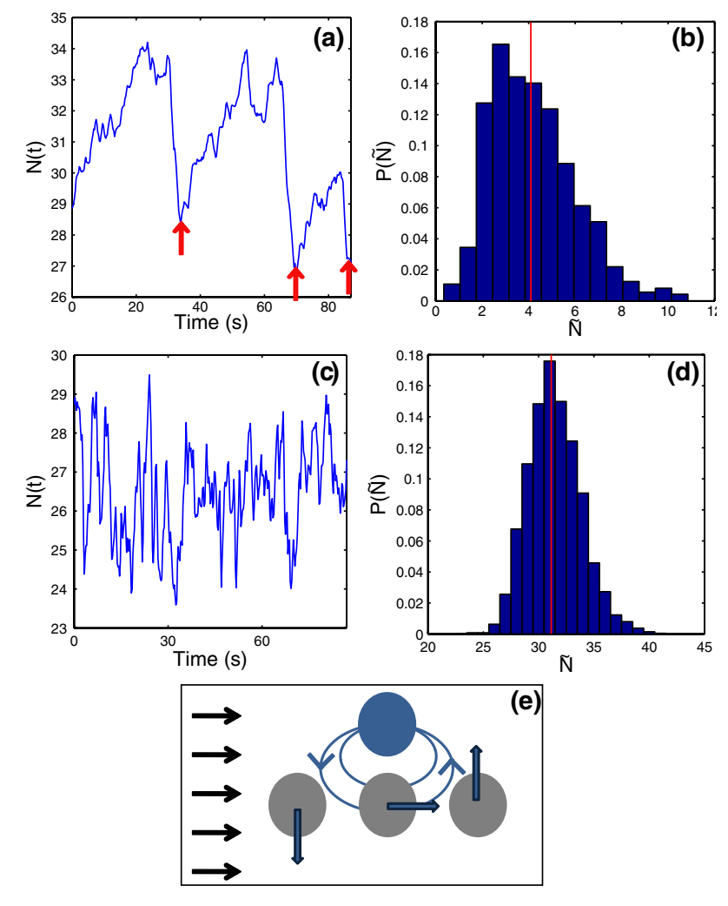

(a) $j=0.85HZ$, (b) $j=2HZ$

这种液滴的协同喷射可以通过观察偶极子流场理解。

最后简单介绍一下高流量的情况（$j>1HZ$），此时运输流仍然是不稳定的，但此时堵塞的形成和破坏是连续的，并没有明显的分界。这就造成了$\tilde{N}$的分布是更加均匀的，并且在大$j$的极限下像高斯行为收敛。另外还发现当$j>j^*$时，系统自组织，中心线上的密度场收敛，变得与$j$的取值无关。

## Continuous Particle Separation Through Deterministic Lateral Displacement

这里展示了一个分离过程，该过程为混合物中的每个粒子创建了**等效的迁移路径**，从而消除了多路径导致区域加宽。每一列与前一列相比都横向移动了$\Delta\lambda$的距离，其中$\lambda$是障碍物中心之间的距离。记通过间隙的总流量为$\Phi$，流向左侧的为$\delta\Phi$。如果流体被限制为直线下降通过阵列，有$\delta=\Delta\lambda/\lambda$。现在考虑通过间隙的流体有三种，如下图B所示，它们各自有$\Phi/3$的流量。

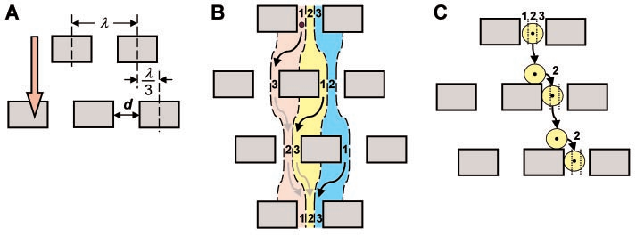

小于流道宽度的颗粒跟着流线运动，1，2，3流道的颗粒最终整体都会回到初始流道分配，造成净迁移方向为平均的流动方向，将这种运动称为**zigzag 模式**。

当颗粒半径大于流道宽度时，情况变得不一样。可以想象颗粒中心无法进入流道1，当这样一个流道2中的颗粒移动到下个间隙中，原本期待其进入流道1，但是容纳不下，发生碰撞，从而进入流道2。如此行为重复，将这种运输形式称为**位移模式**。

为了验证这些想法，在硅上微加工了上述障碍物阵列。$\lambda=8\mu m$，每一行障碍物之间的距离为$8\mu m$，间隙宽度$d=1/6\mu m$。每一行都平移$\Delta\lambda=0.1\lambda$。如此制作10行。颗粒从基质顶部10毫米宽的通道注入，并通过流体流动穿过阵列。

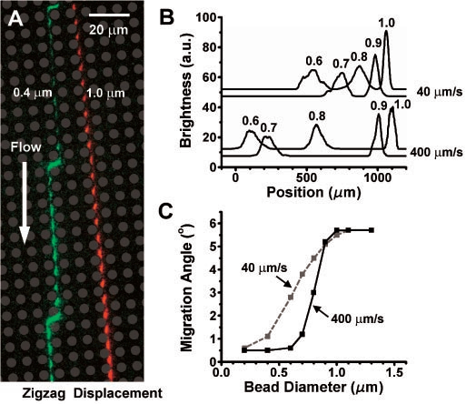

A（驱动流速$\sim400\mu m/s$）沿每个轨迹的不同亮度反映了阵列中颗粒的不同流速：由于流速较高且停留时间较短，窄间隙中的轨迹显得较暗。颗粒直径取为0.40到1.03$\mu m$。绿线为$0.40\mu m$颗粒，做zigzag 模式的运动，大约每10行穿越一次障碍物；红线为$1.03\mu m$颗粒，在每一行都被障碍物位移（位移模式）。

B 使用不同直径颗粒的混合液，两种流体速度，展示距离入口处$11\mu m$的荧光轮廓。C 为迁移角度。在$40\mu m/s$下，从zigzag到displacement模式的转变是逐渐的（这可能是颗粒在不同流道之间的布朗运动）。在该流速下，$0.6\mu m$的颗粒有$\sim 0.54\mu m$的扩散长度（从一个间隙到下一个的$8\mu m$距离花费的$0.2s$下）。这个值是平均流道宽度（$0.16\mu m$，$1.6\mu m$的狭缝间有10条流道）的3倍。为了减小这种扩散的效应，增加流速至$400\mu m/s$，此时转变大约发生在$\sim0.8\mu m$的颗粒直径。对于间隙中的poisuille流，靠近壁面的那条lane携带10%的流量，需要占据大约20%的宽度，给出一个直径的估计$\sim2\times20\%\times d=0.64\mu m$。

可以通过试设置不同宽度的间隙解析粒径谱，下图为对应装置

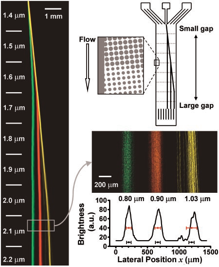

不同粒径的峰值分别有变化系数（CVs）1.1，1.2以及1.9%（见红色bar）。

本研究还制造了用于分离细菌人工染色体的设备，由电场驱动。 

## Hydrodynamic metamaterials: Microfabricated arrays to steer, refract, and focus streams of biomaterials

 这是[Huang2004](#continuous-particle-separation-through-deterministic-lateral-displacement)的续作。装置示意见下图：

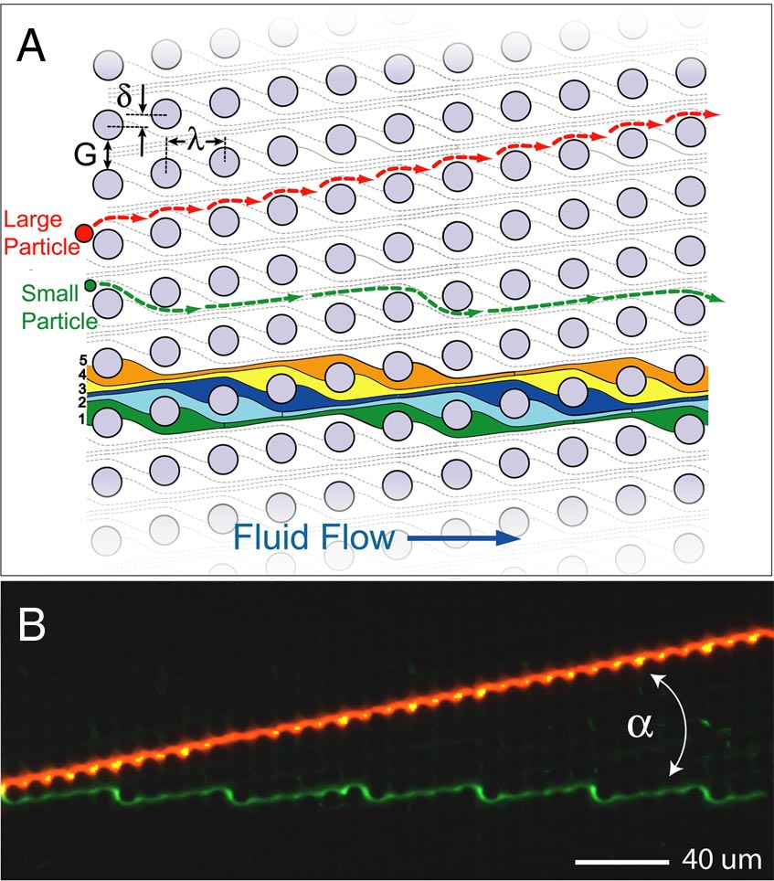

这里称超过临界大小颗粒在每一行进行的横向位移运动为 **bumping mode**；小于特征长度的颗粒为 **zigzag mode**。这两种运动模式合起来可以类比光的双折射，见下图A（不偏折的称为ordinary ray，偏折的为extraordinary ray）：

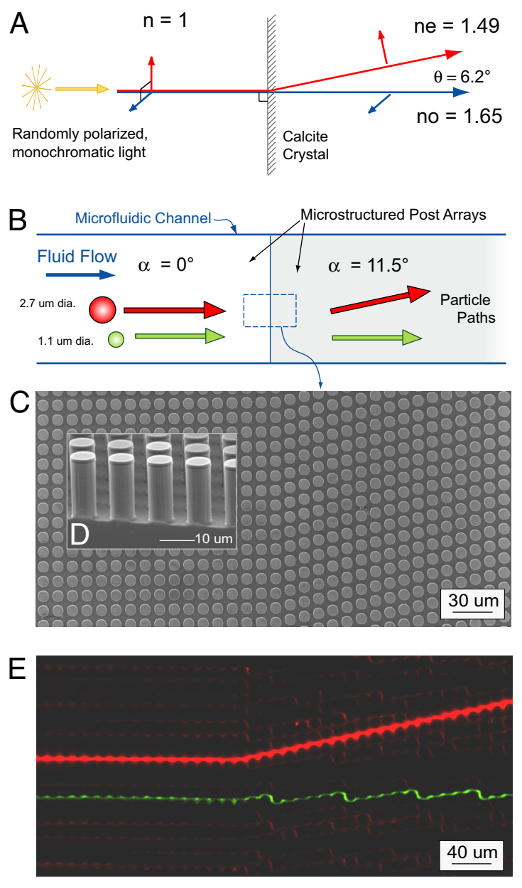

使用双折射元件作为构建块，可以构建更复杂的微流体超材料，具有**折射、聚焦和分散粒子流**的特定功能。

一般来说，术语**超材料**描述了结构化的周期性特征，旨在实现超越传统材料的性能。虽然通常在电磁学中定义，但我们将更广泛的定义应用于微流体，并设计了一种微结构介质，使粒子能够在非混合流线上沿着与整体流体流动不同的轨迹运动。例如，两个双折射元件可以串联连接，以改变粒子通过超介质的轨迹角度。如下图所示（负折射）

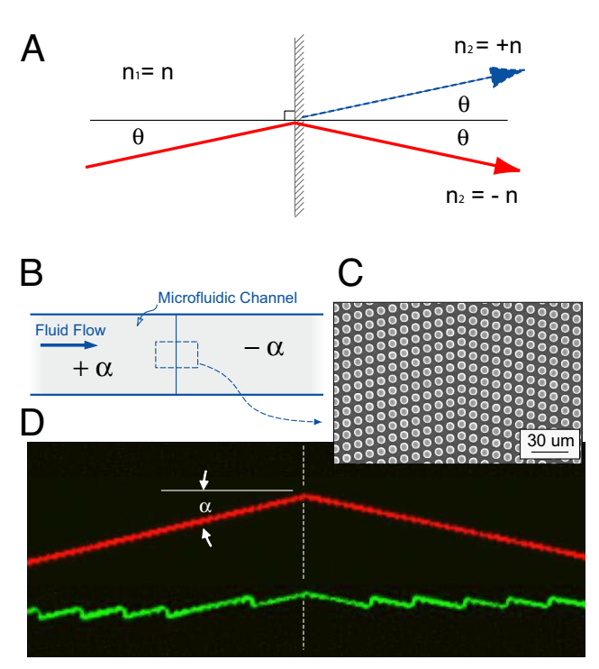

如此连接不同阵列角的元件，可以产生各种各样的界面。如下图所示的三种可能的微流控超材料

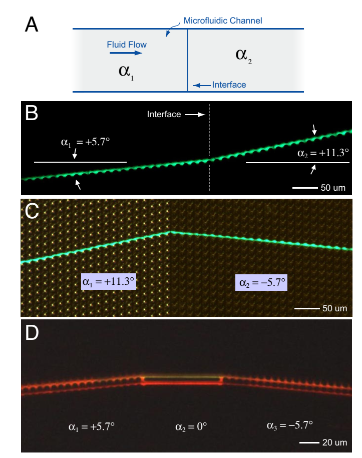

也可以将$\pm\alpha$的元件堆叠在一起，从而制造出颗粒聚焦元件（$+F$）。不同于透镜将光线聚焦于一点，它是将颗粒聚焦于一条线。$+F$元件能够实现沿中心线的局部颗粒浓度的快速增加。该元件可完全去除剩余流中的所有 bumping mode 的颗粒。

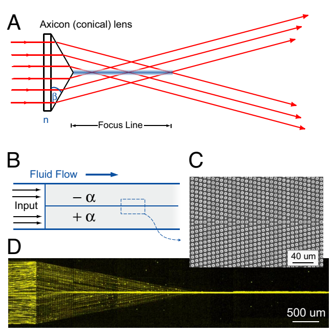

当然如果$+F$元件反转过来，还能制造$=F$元件。该元件将超临界粒子分散成三股不同的流，两股沿着阵列角$\pm\alpha$，一股沿着界面继续，流体动力学地被困在两个双折射元件之间，也就是说，它们不会在原始流的宽度上重新分散。从这个意义上讲，与光学系统不同，聚焦元件对粒子轨迹的影响是不可逆的。

可以制造重复操作的复杂的微流控超材料：

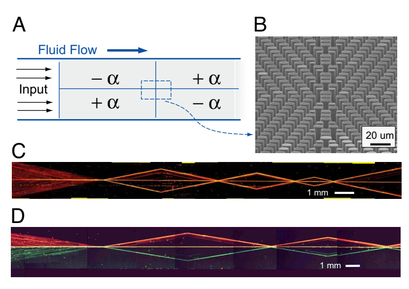

## Red blood cell (RBC) suspensions in confined microflows: Pressure-flow relationship

引：Dex-40溶液有助于防止rbc聚集，同时血浆粘度约为正常血浆的4倍，rbc沉降慢。PBS：磷酸盐缓冲盐水（粘度略低于正常血浆），rbc沉降快于dex-40（实验中需要搅拌）。

使用了以下两种管道

(c)为直管道中（$\Delta P=0.2kPa$）中流动的用Dex-40处理（Hct=23%）的RBC悬浮液的瞬时快照；

## Geometry-mediated particle accumulation driven by nonhydrodynamic viscosity effect with flow control implications in porous media

引：颗粒堵塞已被广泛用于抑制优先流动，因为残留的颗粒可以部分堵塞主流通道，并将流体转移到低渗透区域。然而，无法控制的颗粒滞留和渗透率降低伴随的严重堵塞，会阻碍流体的可持续流动。

引：在没有堵塞的情况下，颗粒滞后和积聚通常与惯性效应有关。流体的惯性使用雷诺数衡量$Re_f=\rho_fUL/\mu_f$，颗粒的惯性使用stokes数衡量$StK=t_0U_f/L$，其中$t_0$是颗粒的弛豫时间。对于stokes流动，$t_0=\rho_pd_p^2/(18\mu_f)$。其中$\rho_p$是颗粒的密度，$d_p$是颗粒的直径。在密度匹配的情况下，$StK=\frac{1}{18}(\frac{d_p}{L})^2Re_f$，当$Re_f\ll1$时颗粒在多孔介质中运输的惯性效应可以被忽略，当$d_p<L$时也就是$StK\ll1$。

Stokes数用于描述流体阻力在改变颗粒轨迹中的作用。但是颗粒之间的相互作用会引入额外的阻力，造成浓度决定的粘度，并没有写入stokes数的定义里。

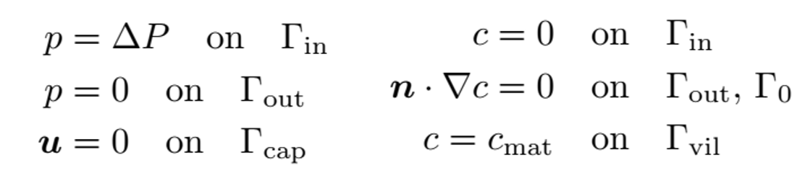

引：在稀溶液的情况下，对于理想的硬球系统，颗粒间的相互作用微不足道，根据Krieger与Dougherty的模型，有：

$$
\frac{\mu_s}{\mu_f}=(1-\phi_p/\phi_{lim})^{-2.5\phi_{lim}}
$$

其中$\mu_s$是悬液粘度，$\phi_p$是颗粒体积分数，$\phi_{lim}\approx0.64$。

引：像红细胞、凝胶颗粒悬液这样的复杂系统，即使在稀溶液情况下，悬液的粘度也会对颗粒的浓度表现出很高的敏感度。这种粘性效应反应的是非水动作用力的颗粒间相互作用。基于在不同剪切速率和微凝胶浓度下的系统实验特征，非流体动力学效应引起的浓度依赖性非牛顿流变学已被纳入拟合表达式中：

$$
\frac{\mu_s}{\mu_f}
=
\begin{cases}
\left(142\phi_p^2 - 0.2\phi_p\right)\dot{\gamma}^{-0.786}\times 10^3 + 1,
& \dot{\gamma} < 10\ \mathrm{s}^{-1}, \\[6pt]
163\left(142\phi_p^2 - 0.2\phi_p\right) + 1,
& \dot{\gamma} \ge 10\ \mathrm{s}^{-1}.
\end{cases}
$$

对于拥有如此浓度敏感粘度的微凝胶颗粒悬液，表示颗粒间相互作用的阻力$F_r$足够与流体阻力$F_d$相比，阻碍颗粒移动，从而造成颗粒与流体相之间的速度差。

引：之前的一些pore-scale微流体实验和core-scale驱油实验报告称，在应用微凝胶颗粒的稀释悬浮液（注射浓度≤3 vol%）时，尽管颗粒与喉部的尺寸比很小，吸附效应可以忽略不计，但多孔介质中的颗粒会大量积聚。这种现象被认为是异常的，不能简单地用记忆行为或流变学变化来解释。基于平流扩散方程的模拟将悬浮液视为具有非牛顿流变性的聚合物溶液，未能捕捉到积聚和相应的多相位移模式。多孔介质中的积聚机制及其对流动控制的影响仍然知之甚少。因此，应进一步分析颗粒滞后行为和悬浮性能变化的耦合效应。

### 两相模型的控制方程

利用**颗粒两相流的体积平均方程**定量表征**颗粒的输运和积聚行为**：

$$
\begin{aligned}
\frac{\partial\left(\phi_p \rho_p\right)}{\partial t}
+ \nabla \cdot \left(\phi_p \rho_p \mathbf{u}_p\right)
&= 0, \\[6pt]
%
\frac{\partial\left(\phi_p \rho_p \mathbf{u}_p\right)}{\partial t}
+ \nabla \cdot \left(\phi_p \rho_p \mathbf{u}_p \mathbf{u}_p\right)
&= -\phi_p \nabla P
+ \nabla \cdot \left(\phi_p \boldsymbol{\Gamma}_p\right)
+ \beta \left(\mathbf{u}_f-\mathbf{u}_p\right)
+ \mathbf{F}_{\mathrm{ext},p}, \\[6pt]
%
\frac{\partial\left(\phi_f \rho_f\right)}{\partial t}
+ \nabla \cdot \left(\phi_f \rho_f \mathbf{u}_f\right)
&= 0, \\[6pt]
%
\frac{\partial\left(\phi_f \rho_f \mathbf{u}_f\right)}{\partial t}
+ \nabla \cdot \left(\phi_f \rho_f \mathbf{u}_f \mathbf{u}_f\right)
&= -\phi_f \nabla P
+ \nabla \cdot \left(\phi_f \boldsymbol{\Gamma}_f\right)
- \beta \left(\mathbf{u}_f-\mathbf{u}_p\right)
+ \mathbf{F}_{\mathrm{ext},f}, \\[6pt]
%
\frac{\partial \rho_s}{\partial t}
+ \nabla \cdot \left(\rho_s \mathbf{u}_s\right)
&= 0, \\[6pt]
%
\frac{\partial\left(\rho_s \mathbf{u}_s\right)}{\partial t}
+ \nabla \cdot \left(\rho_s \mathbf{u}_s \mathbf{u}_s\right)
&= -\nabla P
+ \nabla \cdot \boldsymbol{\Gamma}_s
+ \mathbf{F}_{\mathrm{ext}} .
\end{aligned}
$$

其中p,f以及s分别表示颗粒、液体、混合液三相。$\phi, \rho, P, \beta, \bm{u}, \bm{F}_{ext}$分别表示体积分数，相密度，压强，阻力系数，速度以及外力。$\bm{\Gamma}_i=\mu_i[\nabla\bm{u}_i+(\nabla\bm{u}_i)^T]$是粘性应力张量。有恒等关系：$\phi_f+\phi_p=1, \rho_s\bm{u}_s=\rho_f\phi_f\bm{u}_f+\rho_p\phi_p\bm{u}_p$。需要注意颗粒相动量方程中的粘度$\mu_p$并不是液相中那样的粘度，它用于表征**颗粒相中的内应力传递和动量扩散效应**。对于稀疏的硬颗粒悬液，颗粒间的多体水动作用力或者碰撞相互作用可以被忽略，这个粘度很小。但对于微凝胶颗粒，由于非水动相互作用力（聚合物性质造成），它变得很显著，与悬液的表观流变属性联系起来。

考虑稳态、无外力以及密度匹配条件（$\rho_s=\rho_s=\rho_p=\rho$）。同时进行无量纲处理：$\bm{x}^*=\bm{x}/L, \bm{u}_i^*=\bm{u}_i/U, P^*=P/P_0$：

$$
\begin{aligned}
\nabla^* \cdot \left( \phi_p \mathbf{u}_p^* \right)
&= 0, \\[6pt]
%
\frac{\rho U L}{\mu_f}
\nabla^* \cdot \left( \phi_p \mathbf{u}_p^* \mathbf{u}_p^* \right)
&=
-\frac{P_0 L}{U\mu_f}\phi_p \nabla^* P^*
+ \nabla^* \cdot
\left[
\phi_p \frac{\mu_p}{\mu_f}
\left(
\nabla^* \mathbf{u}_p^*
+
\left(\nabla^* \mathbf{u}_p^*\right)^{\mathrm{T}}
\right)
\right]
+ \frac{\beta L^2}{\mu_f}
\left(
\mathbf{u}_f^*-\mathbf{u}_p^*
\right), \\[8pt]
%
\nabla^* \cdot \left( \phi_f \mathbf{u}_f^* \right)
&= 0, \\[6pt]
%
\frac{\rho U L}{\mu_f}
\nabla^* \cdot \left( \phi_f \mathbf{u}_f^* \mathbf{u}_f^* \right)
&=
-\frac{P_0 L}{U\mu_f}\phi_f \nabla^* P^*
+ \nabla^* \cdot
\left[
\phi_f
\left(
\nabla^* \mathbf{u}_f^*
+
\left(\nabla^* \mathbf{u}_f^*\right)^{\mathrm{T}}
\right)
\right]
- \frac{\beta L^2}{\mu_f}
\left(
\mathbf{u}_f^*-\mathbf{u}_p^*
\right), \\[8pt]
%
\nabla^* \cdot \mathbf{u}_s^*
&= 0, \\[6pt]
%
\frac{\rho U L}{\mu_f}
\nabla^* \cdot \left( \mathbf{u}_s^* \mathbf{u}_s^* \right)
&=
-\frac{P_0 L}{U\mu_f}\nabla^* P^*
+ \nabla^* \cdot
\left[
\frac{\mu_s}{\mu_f}
\left(
\nabla^* \mathbf{u}_s^*
+
\left(\nabla^* \mathbf{u}_s^*\right)^{\mathrm{T}}
\right)
\right].
\end{aligned}
$$

由于$\mu_f$是个常数，所有项都用其归一化。而且$\phi_p,\phi_f,\mu_p,\mu_s$都会随着颗粒浓度分配而变化，因此需要放在空间导数内。由以上可以得到几个无量纲数：$Re_f=\rho UL/\mu_f$（流体雷诺数）；以及表征所施加压力梯度与相间阻力相对流体相粘性强度$P_0L/U\mu_f, \beta L^2/\mu_f$；另外还有粘度比$\mu_p/\mu_f, \mu_s/\mu_f$。

在数值中，求解三相中的任意两相即可。本研究选取了流体相与悬液相，可以通过质量与动量守恒求得颗粒相的信息。$\mu_s$是通过以上经验公式计算得到的。在下面的理论部分，采用$\mu_p\approx(\mu_s-\phi_f\mu_f)/\phi_p$估计颗粒相粘度。对于阻力系数采用经典的Wen-Yu模型（低雷诺数下阻力系数$\beta$与速度无关）。

### 数值模型

使用TFM，其中关键的一步是计算颗粒相中粘性相的应力张量（具体实施没有提，或者在附录里）。颗粒-喉部比例很小$\leq1/80$（可以忽略由尺寸导致的直接堵塞，同时流速较小，可以忽略颗粒的变形），孔喉比$\leq1/10$。对于具有颗粒壁静电排斥的微米级颗粒，沉积诱导的聚集也是微不足道的。故此处的堵塞效应以及不均匀浓度分布来源于聚集机制。

### 理论分析

这里展示颗粒聚集中关键力竞争的尺度分析（**scaling analysis**），并对稀悬浮流中明显的**非流体动力学粘度效应如何触发几何介导的积聚**提供了一种机理解释。

先从颗粒相的无量纲动量方程出发，同时$Re_f\ll1$：

$$
-\frac{P_0 L}{U\mu_f}\phi_p \nabla^* P^*
+ \nabla^* \cdot
\left[
\phi_p \frac{\mu_p}{\mu_f}
\left(
\nabla^* \mathbf{u}_p^*
+
\left(\nabla^* \mathbf{u}_p^*\right)^{\mathrm{T}}
\right)
\right]
+ \frac{\beta L^2}{\mu_f}
\left(
\mathbf{u}_f^*-\mathbf{u}_p^*
\right)=0.
$$

左侧的压力梯度项可以由悬液相的动量方程决定：

$$
\frac{P_0 L}{U\mu_f}\nabla^* P^*
= \nabla^* \cdot
\left[
\frac{\mu_s}{\mu_f}
\left(
\nabla^* \mathbf{u}_s^*
+
\left(\nabla^* \mathbf{u}_s^*\right)^{\mathrm{T}}
\right)
\right].
$$

结合以上两式：

$$
-\phi_p\nabla^* \cdot
\left[
\frac{\mu_s}{\mu_f}
\left(
\nabla^* \mathbf{u}_s^*
+
\left(\nabla^* \mathbf{u}_s^*\right)^{\mathrm{T}}
\right)
\right]
+ \nabla^* \cdot
\left[
\phi_p \frac{\mu_p}{\mu_f}
\left(
\nabla^* \mathbf{u}_p^*
+
\left(\nabla^* \mathbf{u}_p^*\right)^{\mathrm{T}}
\right)
\right]
+ \frac{\beta L^2}{\mu_f}
\left(
\mathbf{u}_f^*-\mathbf{u}_p^*
\right)=0.
$$

对于拥有显著非流体作用粘性效应的悬液，悬液的粘度对于颗粒浓度敏感，即使是在稀疏状况下。此时有$\mu_s\gg\mu_l, \phi_p\ll\phi_f$，从而导致$\mu_p\gg\mu_s$。于是上式左侧的第一项可以忽略掉，得到以下的形式：

$$
\nabla^* \cdot
\left[
\phi_p \frac{\mu_p}{\mu_f}
\left(
\nabla^* \mathbf{u}_p^*
+
\left(\nabla^* \mathbf{u}_p^*\right)^{\mathrm{T}}
\right)
\right]
+ \frac{\beta L^2}{\mu_f}
\left(
\mathbf{u}_f^*-\mathbf{u}_p^*
\right)=0.
$$

即使整个悬液是被压力梯度与粘性阻力之间的平衡控制，颗粒聚集是被颗粒相中的曳力项$\bm F_d$与粘性阻力项$\bm F_r$竞争主导着的，**反映了颗粒-流体相互作用与颗粒间相互作用的竞争**。无量纲参数$\frac{\beta L^2}{\mu_f}$并不能准确地表达颗粒的粘性效应（其被包含在$\mu_p/\mu_f$内）。为了得到直接表征聚集效应的无量纲数，考虑聚集发生前的触发条件（颗粒浓度$\phi_p$均匀分布）。对于硬颗粒，$\mu_s, \mu_p$只取决于$\phi_p$，但对于微凝胶颗粒，$\mu_s=\mu_s(\phi_p, \dot\gamma)$，在本理论分析中，将$U/L$视为特征剪切率，于是得到更简形式：

$$

\nabla^{*2} \mathbf{u}_p^*
+ \frac{\beta L^2}{\phi_p\mu_p}
\left(
\mathbf{u}_f^*-\mathbf{u}_p^*
\right)=0.
$$

当颗粒相粘度$\mu_p$很小时（对应弱的颗粒对悬液作用），曳力可以轻松克服粘性阻力，即使在很小的相间速度差下。但是当颗粒相粘度变得显著时，平衡需要大得多的速度差。在经历多孔介质中pore-to-throat流体的加速（颗粒并没有显著加速），管道尺寸的突然减小使力的平衡被破坏，造成$(u_s^*-u_p^*)/u_p^*$的增加，根据动量守恒$u_s^*=\phi_pu_p^*+(1-\phi_p)u_f^*$，颗粒浓度$\phi_p$会上升，造成局部的滞后和聚集。这里使用无量纲的变量，导致速度的幅值并没有什么影响。另外由于悬液粘度对于浓度敏感，局部$\phi_p$的升高进一步令$\mu_p$增大，从而造成更大的速度差，进一步增强滞后和聚集效应。（这里说法不是很严谨）

基于以上分析，将本工作讨论的聚集效应定义为“几何介导”、“由非水动粘性效应驱动”的。定义一个无量纲参数$A_g=F_r/F_d\sim\phi_p\mu_p/\beta L^2$（角标g表示几何效应），这个值越大，聚集效应越强。考虑到Poisuille流并且将Wen-Yu曳力稀疏带入，特征速度取为$U_{in}/\chi$，可以得到

$$
A_g =
\frac{16\mu_p d_p}
{C_d \rho_f \left(1-\phi_p\right)^{-1.65} U_{\mathrm{in}} W_{\mathrm{pore}}^2 \chi}
$$

### 数值结果与讨论

#### A. pore-throat几何下的聚集状态

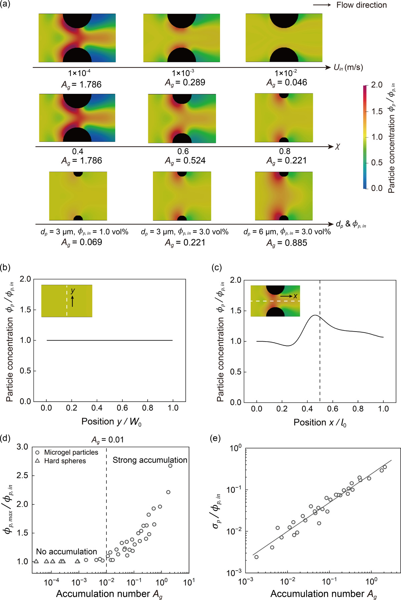

(a) 微凝胶颗粒悬液的聚集主要发生在进入喉道的地方，Ag的增大正好对应着更强的聚集效应。这种几何介导的聚集与剪切诱导迁移无关（见(b)直管道，(c)喉道处）。见(d)，对于微凝胶悬液，最大浓度会突然增大（临界大致为0.01）。通过引入无量纲的标准差$\sigma_p/\phi_{p,in}$定量描述聚集强度（见(e)，$\sigma_p/\phi_{p,in}\sim A_g^{0.7}$）。

#### B. 分级多孔介质中的聚集形式与流动控制

具有代表性优先流动特征的双渗多孔介质，具有相同孔隙率（$45\%$）的高渗层（HPL）+低渗层（LPL），其特征尺寸比为2:1。最小的喉道尺寸仍能比颗粒尺寸大10倍以上。平行层内，$U\propto K\propto W_{pore}^2, \dot\gamma\sim U/W_{pore}\propto W_{pore}$，其中$K$是本征渗透率。由此LPL具有更小的特征尺寸、更大的特征粘度（剪切率更小），造成更高的$A_g$，更容易发生聚集。

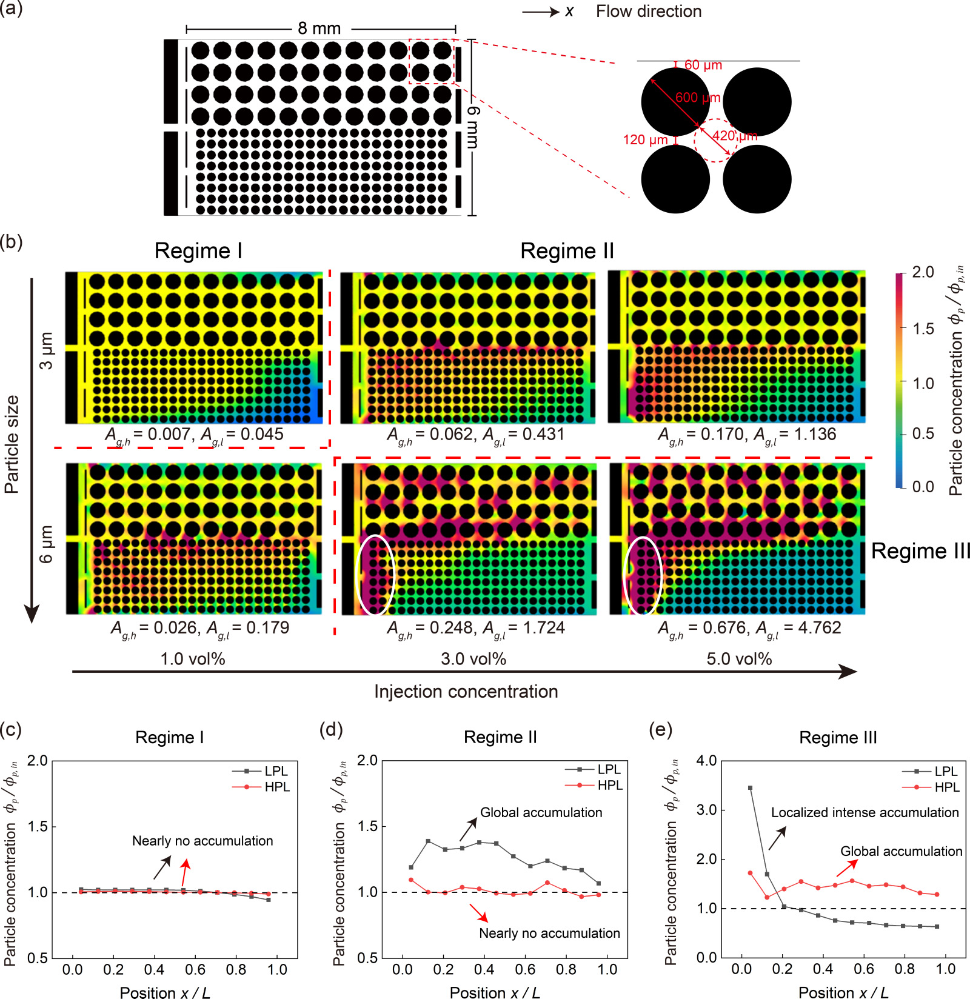

使用平均流量分数$\alpha$定量表征LPL中的优势流，对比输入的液体，表现出了不同的尺寸效应（见下图(a)）。$d_p=3\mu m$时，优势流随着浓度提升加剧（LPL中的流体相比于入口处更少）；而$d_p=6\mu m$时LPL中获得更大比例的流量。

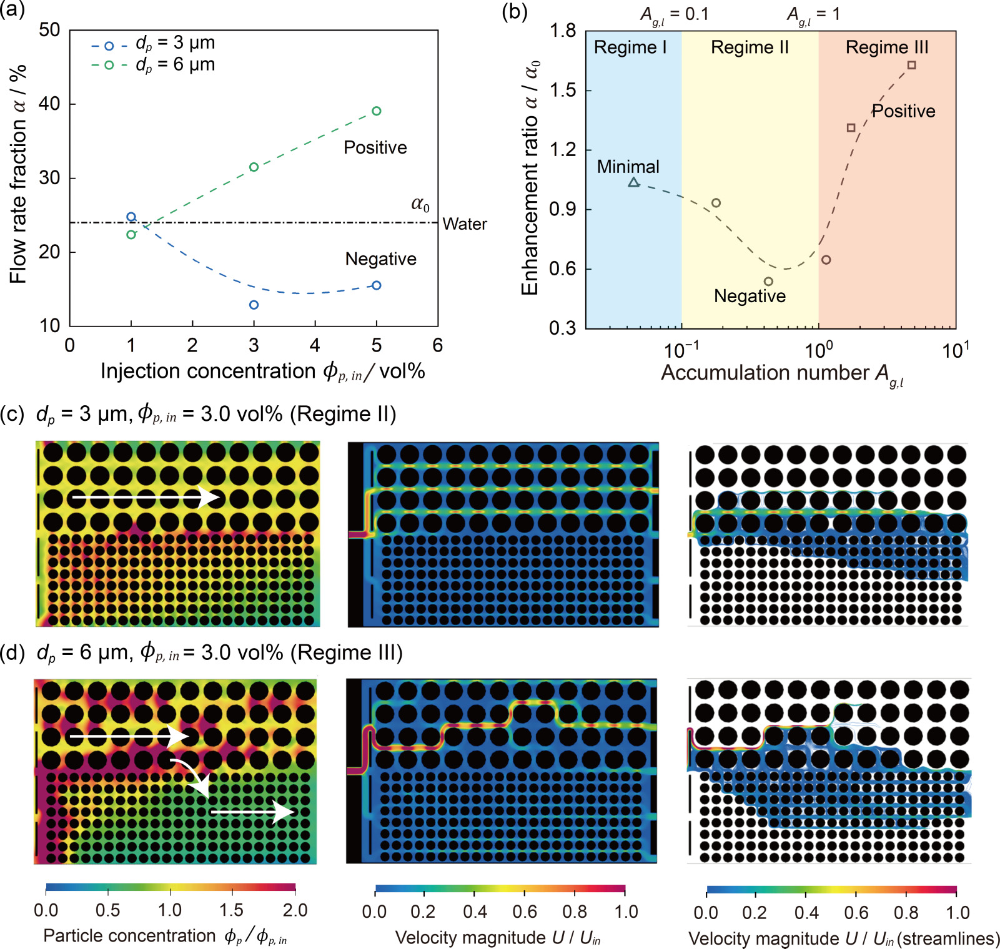
